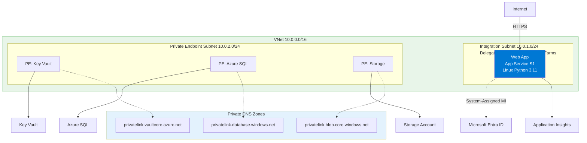
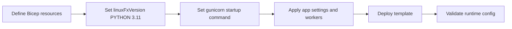

---
hide:
  - toc
content_sources:
  diagrams:
    - id: 05-infrastructure-as-code-for-python-app-service
      type: flowchart
      source: mslearn-adapted
      mslearn_url: https://learn.microsoft.com/en-us/azure/app-service/
    - id: diagram-2
      type: flowchart
      source: mslearn-adapted
      mslearn_url: https://learn.microsoft.com/en-us/azure/app-service/
---

# 05 - Infrastructure as Code for Python App Service

This tutorial provisions Flask hosting infrastructure with Bicep for repeatable environments. It defines Python runtime settings, startup command, and worker-related app settings as code.

!!! info "Infrastructure Context"
    **Service**: App Service (Linux, Standard S1) | **Network**: VNet integrated | **VNet**: ✅

    This tutorial assumes a production-ready App Service deployment with VNet integration, private endpoints for backend services, and managed identity for authentication.

<!-- diagram-id: 05-infrastructure-as-code-for-python-app-service -->


<!-- diagram-id: diagram-2 -->


## Prerequisites

- Completed [04 - Logging and Monitoring](./04-logging-monitoring.md)
- Azure CLI and Bicep available locally

## Main Content

### Define App Service runtime in Bicep

```bicep
resource webApp 'Microsoft.Web/sites@2023-12-01' = {
  name: appName
  location: location
  kind: 'app,linux'
  properties: {
    serverFarmId: appServicePlan.id
    siteConfig: {
      linuxFxVersion: 'PYTHON|3.11'
      appCommandLine: 'gunicorn --bind=0.0.0.0:$PORT src.app:app'
      alwaysOn: true
    }
    httpsOnly: true
  }
}
```

| Code | Purpose |
|------|---------|
| `resource webApp 'Microsoft.Web/sites@2023-12-01' = { ... }` | Declares the App Service web app resource in Bicep. |
| `name: appName` | Uses the `appName` parameter or variable as the site name. |
| `location: location` | Deploys the site to the selected Azure region. |
| `kind: 'app,linux'` | Marks the site as a Linux App Service app. |
| `serverFarmId: appServicePlan.id` | Attaches the web app to the App Service plan resource. |
| `linuxFxVersion: 'PYTHON|3.11'` | Configures the Python 3.11 runtime stack. |
| `appCommandLine: 'gunicorn --bind=0.0.0.0:$PORT src.app:app'` | Sets Gunicorn as the startup command for the Flask app. |
| `alwaysOn: true` | Keeps the app warm to avoid cold starts on supported tiers. |
| `httpsOnly: true` | Forces HTTPS for incoming traffic. |

### Configure worker and timeout related settings

```bicep
resource webAppSettings 'Microsoft.Web/sites/config@2023-12-01' = {
  name: '${appName}/appsettings'
  properties: {
    SCM_DO_BUILD_DURING_DEPLOYMENT: 'true'
    PYTHON_ENABLE_GUNICORN_MULTIWORKERS: 'true'
    GUNICORN_CMD_ARGS: '--workers 2 --timeout 120'
    APP_ENV: 'production'
  }
}
```

| Code | Purpose |
|------|---------|
| `resource webAppSettings 'Microsoft.Web/sites/config@2023-12-01' = { ... }` | Declares the App Service app settings resource in Bicep. |
| `name: '${appName}/appsettings'` | Targets the `appsettings` child resource for the web app. |
| `SCM_DO_BUILD_DURING_DEPLOYMENT: 'true'` | Enables Oryx build automation during deployment. |
| `PYTHON_ENABLE_GUNICORN_MULTIWORKERS: 'true'` | Turns on Gunicorn multi-worker support in App Service. |
| `GUNICORN_CMD_ARGS: '--workers 2 --timeout 120'` | Passes worker count and timeout options to Gunicorn. |
| `APP_ENV: 'production'` | Sets the application environment to production. |

### Deploy Bicep template

```bash
az deployment group create \
  --resource-group $RG \
  --template-file ./infra/main.bicep \
  --parameters appName=$APP_NAME location=$LOCATION planName=$PLAN_NAME
```

| Command | Purpose |
|---------|---------|
| `az deployment group create` | Starts a resource group-scoped ARM/Bicep deployment. |
| `--resource-group $RG` | Deploys the template into the specified resource group. |
| `--template-file ./infra/main.bicep` | Uses the Bicep file at `./infra/main.bicep` as the deployment template. |
| `--parameters appName=$APP_NAME location=$LOCATION planName=$PLAN_NAME` | Supplies runtime parameter values for the template deployment. |

### Validate applied runtime settings

```bash
az webapp config show --resource-group $RG --name $APP_NAME
az webapp config appsettings list --resource-group $RG --name $APP_NAME
```

| Command | Purpose |
|---------|---------|
| `az webapp config show --resource-group $RG --name $APP_NAME` | Retrieves the current runtime configuration for the web app. |
| `az webapp config appsettings list --resource-group $RG --name $APP_NAME` | Lists the app settings currently applied to the web app. |
| `--resource-group $RG` | Targets the tutorial resource group. |
| `--name $APP_NAME` | Targets the selected App Service app. |

Masked output excerpt:

```json
{
  "linuxFxVersion": "PYTHON|3.11",
  "appCommandLine": "gunicorn --bind=0.0.0.0:$PORT src.app:app",
  "id": "/subscriptions/<subscription-id>/resourceGroups/rg-flask-tutorial/providers/Microsoft.Web/sites/app-flask-tutorial-abc123/config/web"
}
```

## Advanced Topics

Modularize Bicep by separating compute, monitoring, and networking modules, and use parameter files per environment for deterministic promotion.

## CLI Alternative (No Bicep)

Use these commands when you need an imperative deployment path without changing the existing Bicep workflow.

### Step 1: Set variables

```bash
RG="rg-flask-tutorial"
LOCATION="koreacentral"
PLAN_NAME="plan-flask-tutorial-s1"
APP_NAME="app-flask-tutorial-abc123"
VNET_NAME="vnet-flask-tutorial"
INTEGRATION_SUBNET_NAME="snet-appsvc-integration"
```

| Command | Purpose |
|---------|---------|
| `RG="rg-flask-tutorial"` | Defines the resource group name for the imperative deployment path. |
| `LOCATION="koreacentral"` | Sets the Azure region used by the CLI commands. |
| `PLAN_NAME="plan-flask-tutorial-s1"` | Stores the App Service plan name. |
| `APP_NAME="app-flask-tutorial-abc123"` | Stores the globally unique App Service app name. |
| `VNET_NAME="vnet-flask-tutorial"` | Stores the virtual network name. |
| `INTEGRATION_SUBNET_NAME="snet-appsvc-integration"` | Stores the delegated subnet name used for VNet integration. |

### Step 2: Create resource group, plan, and app

```bash
az group create --name $RG --location $LOCATION
az appservice plan create --resource-group $RG --name $PLAN_NAME --is-linux --sku S1
az webapp create --resource-group $RG --plan $PLAN_NAME --name $APP_NAME --runtime "PYTHON|3.11"
```

| Command | Purpose |
|---------|---------|
| `az group create --name $RG --location $LOCATION` | Creates the resource group for the App Service resources. |
| `az appservice plan create --resource-group $RG --name $PLAN_NAME --is-linux --sku S1` | Creates the Linux App Service plan. |
| `--is-linux` | Chooses Linux workers for the hosting plan. |
| `--sku S1` | Selects the Standard S1 pricing tier. |
| `az webapp create --resource-group $RG --plan $PLAN_NAME --name $APP_NAME --runtime "PYTHON|3.11"` | Creates the Python web app in the plan. |
| `--plan $PLAN_NAME` | Attaches the app to the chosen App Service plan. |
| `--runtime "PYTHON|3.11"` | Selects Python 3.11 as the runtime stack. |

???+ example "Expected output"
    ```json
    {
      "defaultHostName": "app-flask-tutorial-abc123.azurewebsites.net",
      "state": "Running"
    }
    ```

### Step 3: Configure app settings and startup command

```bash
az webapp config appsettings set --resource-group $RG --name $APP_NAME --settings SCM_DO_BUILD_DURING_DEPLOYMENT=true PYTHON_ENABLE_GUNICORN_MULTIWORKERS=true GUNICORN_CMD_ARGS="--workers 2 --timeout 120" APP_ENV=production
az webapp config set --resource-group $RG --name $APP_NAME --startup-file "gunicorn --bind=0.0.0.0:$PORT src.app:app"
```

| Command | Purpose |
|---------|---------|
| `az webapp config appsettings set --resource-group $RG --name $APP_NAME --settings ...` | Applies deployment, worker, timeout, and environment settings to the web app. |
| `--settings SCM_DO_BUILD_DURING_DEPLOYMENT=true ... APP_ENV=production` | Sets Oryx build, multi-worker Gunicorn, timeout arguments, and production environment values. |
| `az webapp config set --resource-group $RG --name $APP_NAME --startup-file "gunicorn --bind=0.0.0.0:$PORT src.app:app"` | Configures the startup command that launches the Flask app with Gunicorn. |
| `--startup-file "gunicorn --bind=0.0.0.0:$PORT src.app:app"` | Defines the exact process App Service should start. |

???+ example "Expected output"
    ```json
    [
      {
        "name": "SCM_DO_BUILD_DURING_DEPLOYMENT",
        "value": "true"
      },
      {
        "name": "APP_ENV",
        "value": "production"
      }
    ]
    ```

### Step 4 (Optional): Add VNet integration

```bash
az network vnet create --resource-group $RG --name $VNET_NAME --location $LOCATION --address-prefixes 10.0.0.0/16
az network vnet subnet create --resource-group $RG --vnet-name $VNET_NAME --name $INTEGRATION_SUBNET_NAME --address-prefixes 10.0.1.0/24 --delegations Microsoft.Web/serverFarms
az webapp vnet-integration add --resource-group $RG --name $APP_NAME --vnet $VNET_NAME --subnet $INTEGRATION_SUBNET_NAME
```

| Command | Purpose |
|---------|---------|
| `az network vnet create --resource-group $RG --name $VNET_NAME --location $LOCATION --address-prefixes 10.0.0.0/16` | Creates the virtual network used for App Service integration. |
| `--address-prefixes 10.0.0.0/16` | Defines the VNet address space. |
| `az network vnet subnet create --resource-group $RG --vnet-name $VNET_NAME --name $INTEGRATION_SUBNET_NAME --address-prefixes 10.0.1.0/24 --delegations Microsoft.Web/serverFarms` | Creates and delegates the integration subnet to App Service. |
| `--delegations Microsoft.Web/serverFarms` | Allows App Service plans to use the subnet. |
| `az webapp vnet-integration add --resource-group $RG --name $APP_NAME --vnet $VNET_NAME --subnet $INTEGRATION_SUBNET_NAME` | Connects the web app to the delegated subnet for outbound VNet access. |
| `--subnet $INTEGRATION_SUBNET_NAME` | Chooses the subnet used for integration. |

???+ example "Expected output"
    ```json
    {
      "isSwift": true,
      "subnetResourceId": "/subscriptions/<subscription-id>/resourceGroups/rg-flask-tutorial/providers/Microsoft.Network/virtualNetworks/vnet-flask-tutorial/subnets/snet-appsvc-integration"
    }
    ```

### Step 5: Validate effective configuration

```bash
az webapp config show --resource-group $RG --name $APP_NAME --query "{linuxFxVersion:linuxFxVersion, appCommandLine:appCommandLine}" --output json
az webapp config appsettings list --resource-group $RG --name $APP_NAME --query "[?name=='APP_ENV' || name=='SCM_DO_BUILD_DURING_DEPLOYMENT']" --output json
```

| Command | Purpose |
|---------|---------|
| `az webapp config show --resource-group $RG --name $APP_NAME --query "{linuxFxVersion:linuxFxVersion, appCommandLine:appCommandLine}" --output json` | Displays only the runtime stack and startup command from the web app configuration. |
| `--query "{linuxFxVersion:linuxFxVersion, appCommandLine:appCommandLine}"` | Filters the response to the two runtime properties you want to validate. |
| `az webapp config appsettings list --resource-group $RG --name $APP_NAME --query "[?name=='APP_ENV' || name=='SCM_DO_BUILD_DURING_DEPLOYMENT']" --output json` | Lists only the selected app settings needed for verification. |
| `--query "[?name=='APP_ENV' || name=='SCM_DO_BUILD_DURING_DEPLOYMENT']"` | Filters the settings list to the named entries. |
| `--output json` | Returns the validation result in JSON format. |

???+ example "Expected output"
    ```json
    {
      "linuxFxVersion": "PYTHON|3.11",
      "appCommandLine": "gunicorn --bind=0.0.0.0:$PORT src.app:app"
    }
    ```

## See Also
- [06 - CI/CD](./06-ci-cd.md)
- [Provision Infrastructure (Existing Guide)](./02-first-deploy.md)

## Sources
- [Bicep documentation (Microsoft Learn)](https://learn.microsoft.com/en-us/azure/azure-resource-manager/bicep/)
- [Quickstart: Create an App Service app using Bicep (Microsoft Learn)](https://learn.microsoft.com/en-us/azure/app-service/quickstart-arm-template)
