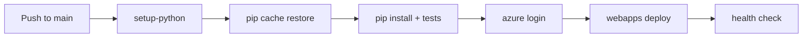

# 06 - CI/CD with GitHub Actions for Flask App Service

This tutorial automates build and deployment for Flask using GitHub Actions. It uses `actions/setup-python`, pip dependency caching, and Azure Web App deployment.

## Prerequisites

- Completed [05 - Infrastructure as Code](./05-infrastructure-as-code.md)
- GitHub repository connected to Azure credentials (OIDC or service principal)

## Main Content

### Create workflow for build and deploy

Create `.github/workflows/deploy.yml`:

```yaml
name: deploy-flask-appservice

on:
  push:
    branches: [ main ]

jobs:
  build-and-deploy:
    runs-on: ubuntu-latest
    steps:
      - name: Checkout
        uses: actions/checkout@v4

      - name: Setup Python
        uses: actions/setup-python@v5
        with:
          python-version: '3.11'
          cache: 'pip'
          cache-dependency-path: app/requirements.txt

      - name: Install dependencies
        run: |
          python -m pip install --upgrade pip
          pip install -r app/requirements.txt

      - name: Run tests
        run: pytest

      - name: Azure login
        uses: azure/login@v2
        with:
          client-id: ${{ secrets.AZURE_CLIENT_ID }}
          tenant-id: ${{ secrets.AZURE_TENANT_ID }}
          subscription-id: ${{ secrets.AZURE_SUBSCRIPTION_ID }}

      - name: Deploy to App Service
        uses: azure/webapps-deploy@v3
        with:
          app-name: app-flask-tutorial-abc123
          package: app
```

### Configure startup command and app settings once

```bash
az webapp config set --resource-group $RG --name $APP_NAME --startup-file "gunicorn --bind=0.0.0.0:$PORT src.app:app"
az webapp config appsettings set --resource-group $RG --name $APP_NAME --settings SCM_DO_BUILD_DURING_DEPLOYMENT=true
```

### Verify deployment from workflow run

```bash
curl https://$APP_NAME.azurewebsites.net/health
```



## Advanced Topics

Split CI and CD jobs, gate deployment with required approvals, and add slot-based blue/green rollout with automatic rollback checks.

## See Also
- [07 - Custom Domain and SSL](./07-custom-domain-ssl.md)
- [GitHub Actions (Existing Guide)](./06-ci-cd.md)

## References
- [Deploy to App Service using GitHub Actions (Microsoft Learn)](https://learn.microsoft.com/en-us/azure/app-service/deploy-github-actions)
- [Continuous deployment to App Service (Microsoft Learn)](https://learn.microsoft.com/en-us/azure/app-service/deploy-continuous-deployment)
