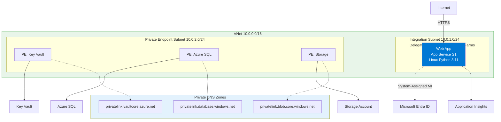
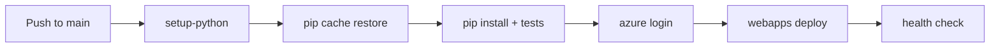

---
hide:
  - toc
content_sources:
  diagrams:
    - id: 06-ci-cd-with-github-actions-for-flask-app-service
      type: flowchart
      source: mslearn-adapted
      mslearn_url: https://learn.microsoft.com/en-us/azure/app-service/deploy-continuous-deployment
    - id: verify-deployment-from-workflow-run
      type: flowchart
      source: mslearn-adapted
      mslearn_url: https://learn.microsoft.com/en-us/azure/app-service/deploy-continuous-deployment
---

# 06 - CI/CD with GitHub Actions for Flask App Service

This tutorial automates build and deployment for Flask using GitHub Actions. It uses `actions/setup-python`, pip dependency caching, and Azure Web App deployment.

!!! info "Infrastructure Context"
    **Service**: App Service (Linux, Standard S1) | **Network**: VNet integrated | **VNet**: ✅

    This tutorial assumes a production-ready App Service deployment with VNet integration, private endpoints for backend services, and managed identity for authentication.

<!-- diagram-id: 06-ci-cd-with-github-actions-for-flask-app-service -->


## Prerequisites

- Completed [05 - Infrastructure as Code](./05-infrastructure-as-code.md)
- GitHub repository connected to Azure credentials (OIDC or service principal)

## Main Content

### Create workflow for build and deploy

Create `.github/workflows/deploy.yml`:

```yaml
name: deploy-flask-appservice

on:
  push:
    branches: [ main ]

jobs:
  build-and-deploy:
    runs-on: ubuntu-latest
    steps:
      - name: Checkout
        uses: actions/checkout@v4

      - name: Setup Python
        uses: actions/setup-python@v5
        with:
          python-version: '3.11'
          cache: 'pip'
          cache-dependency-path: app/requirements.txt

      - name: Install dependencies
        run: |
          python -m pip install --upgrade pip
          pip install -r app/requirements.txt

      - name: Run tests
        run: pytest

      - name: Azure login
        uses: azure/login@v2
        with:
          client-id: ${{ secrets.AZURE_CLIENT_ID }}
          tenant-id: ${{ secrets.AZURE_TENANT_ID }}
          subscription-id: ${{ secrets.AZURE_SUBSCRIPTION_ID }}

      - name: Deploy to App Service
        uses: azure/webapps-deploy@v3
        with:
          app-name: app-flask-tutorial-abc123
          package: app
```

| YAML | Purpose |
|------|---------|
| `name: deploy-flask-appservice` | Names the GitHub Actions workflow. |
| `on: push: branches: [ main ]` | Triggers the workflow whenever code is pushed to the `main` branch. |
| `jobs: build-and-deploy` | Defines the CI/CD job that will build and deploy the app. |
| `runs-on: ubuntu-latest` | Uses the latest Ubuntu GitHub-hosted runner. |
| `uses: actions/checkout@v4` | Checks out the repository contents into the runner. |
| `uses: actions/setup-python@v5` | Installs and configures Python on the runner. |
| `python-version: '3.11'` | Pins the workflow to Python 3.11. |
| `cache: 'pip'` | Enables dependency caching for `pip` packages. |
| `cache-dependency-path: app/requirements.txt` | Uses the Python requirements file to calculate the cache key. |
| `python -m pip install --upgrade pip` | Upgrades `pip` before installing dependencies. |
| `pip install -r app/requirements.txt` | Installs the Flask app dependencies in the workflow. |
| `run: pytest` | Runs the test suite before deployment. |
| `uses: azure/login@v2` | Authenticates the workflow to Azure. |
| `client-id`, `tenant-id`, `subscription-id` | Reads Azure identity values from GitHub secrets. |
| `uses: azure/webapps-deploy@v3` | Deploys the application package to Azure App Service. |
| `app-name: app-flask-tutorial-abc123` | Identifies the target App Service app. |
| `package: app` | Deploys the contents of the `app` directory. |

### Configure startup command and app settings once

```bash
az webapp config set --resource-group $RG --name $APP_NAME --startup-file "gunicorn --bind=0.0.0.0:$PORT src.app:app"
az webapp config appsettings set --resource-group $RG --name $APP_NAME --settings SCM_DO_BUILD_DURING_DEPLOYMENT=true
```

| Command | Purpose |
|---------|---------|
| `az webapp config set --resource-group $RG --name $APP_NAME --startup-file "gunicorn --bind=0.0.0.0:$PORT src.app:app"` | Sets the startup command App Service should use after each deployment. |
| `--startup-file "gunicorn --bind=0.0.0.0:$PORT src.app:app"` | Runs the Flask app with Gunicorn on the App Service-assigned port. |
| `az webapp config appsettings set --resource-group $RG --name $APP_NAME --settings SCM_DO_BUILD_DURING_DEPLOYMENT=true` | Enables Oryx build automation for source-based deployments. |
| `--settings SCM_DO_BUILD_DURING_DEPLOYMENT=true` | Tells App Service to install dependencies during deployment. |

### Verify deployment from workflow run

```bash
curl https://$APP_NAME.azurewebsites.net/health
```

| Command | Purpose |
|---------|---------|
| `curl https://$APP_NAME.azurewebsites.net/health` | Calls the deployed health endpoint to confirm the workflow deployment succeeded. |

<!-- diagram-id: verify-deployment-from-workflow-run -->


## Advanced Topics

Split CI and CD jobs, gate deployment with required approvals, and add slot-based blue/green rollout with automatic rollback checks.

## See Also
- [07 - Custom Domain and SSL](./07-custom-domain-ssl.md)
- [GitHub Actions (Existing Guide)](./06-ci-cd.md)

## Sources
- [Deploy to App Service using GitHub Actions (Microsoft Learn)](https://learn.microsoft.com/en-us/azure/app-service/deploy-github-actions)
- [Continuous deployment to App Service (Microsoft Learn)](https://learn.microsoft.com/en-us/azure/app-service/deploy-continuous-deployment)
