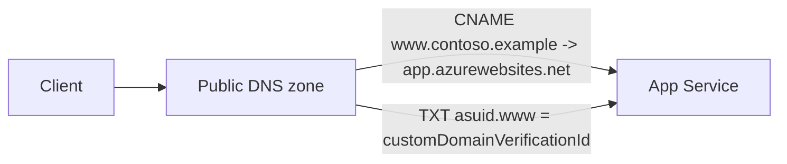
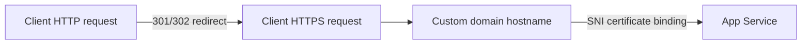

---
hide:
  - toc
---

# 07 - Custom Domain and SSL on App Service

This final tutorial binds your Flask app to a custom domain and enables HTTPS certificates. It covers DNS validation, hostname binding, and certificate verification.

## How Custom Domains Work



App Service validates domain ownership with the `asuid` TXT record before hostname binding is finalized.

## How HTTPS Binding Works



After certificate binding, App Service serves TLS for the custom hostname and redirects HTTP traffic to HTTPS when HTTPS-only is enabled.

## Prerequisites

- Completed [06 - CI/CD](./06-ci-cd.md)
- A domain name you can manage in DNS
- Web app deployed and reachable via `*.azurewebsites.net`
- **App Service Plan**: Custom domains require a paid App Service plan (not the Free F1 tier). App Service Managed Certificates require Basic tier or higher.

## Main Content

### Add DNS records for domain ownership

Use your DNS provider to add records for verification and routing:

- TXT record for `asuid` validation
- CNAME record for subdomain mapping (for example `www`)

Get verification ID:

```bash
az webapp show --resource-group $RG --name $APP_NAME --query customDomainVerificationId --output tsv
```

### Bind custom hostname

```bash
CUSTOM_HOSTNAME="www.contoso.example"
az webapp config hostname add --resource-group $RG --webapp-name $APP_NAME --hostname $CUSTOM_HOSTNAME
```

### Create managed certificate and bind SSL

```bash
az webapp config ssl create --resource-group $RG --name $APP_NAME --hostname $CUSTOM_HOSTNAME

THUMBPRINT=$(az webapp config ssl list --resource-group $RG --query "[?hostNames && contains(join(',', hostNames), '$CUSTOM_HOSTNAME')].thumbprint | [0]" --output tsv)

az webapp config ssl bind --resource-group $RG --name $APP_NAME --certificate-thumbprint $THUMBPRINT --ssl-type SNI
```

### Enforce HTTPS-only traffic

```bash
az webapp update --resource-group $RG --name $APP_NAME --https-only true
```

### Validate certificate and endpoint health

```bash
curl -I https://$CUSTOM_HOSTNAME/health
```

Masked certificate inventory example:

```json
[
  {
    "hostNames": [
      "www.contoso.example"
    ],
    "thumbprint": "xxxxxxxx-xxxx-xxxx-xxxx-xxxxxxxxxxxx",
    "resourceGroup": "rg-flask-tutorial"
  }
]
```

## Advanced Topics

Use Azure DNS and Traffic Manager for multi-region failover, and automate certificate lifecycle monitoring with alerts for expiration windows.

## See Also
- [Tutorial Overview](./index.md)
- [Deployment Slots](../../operations/deployment-slots.md)

## Sources
- [Map an existing custom DNS name to App Service (Microsoft Learn)](https://learn.microsoft.com/en-us/azure/app-service/app-service-web-tutorial-custom-domain)
- [Add and manage TLS/SSL certificates (Microsoft Learn)](https://learn.microsoft.com/en-us/azure/app-service/configure-ssl-certificate)
