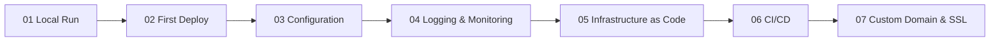

# Python Guide

This guide walks from local Flask development to production-ready deployment and operations on Azure App Service.

## Main Content

1. [01 - Local Run](./01-local-run.md)
2. [02 - First Deploy](./02-first-deploy.md)
3. [03 - Configuration](./03-configuration.md)
4. [04 - Logging and Monitoring](./04-logging-monitoring.md)
5. [05 - Infrastructure as Code](./05-infrastructure-as-code.md)
6. [06 - CI/CD](./06-ci-cd.md)
7. [07 - Custom Domain and SSL](./07-custom-domain-ssl.md)

## Advanced Topics

Use the Python-specific recipes for service integrations and production patterns.

- [Python Recipes](./recipes/index.md)
- [Managed Identity Recipe](./recipes/managed-identity.md)

## See Also

- [Language Guides](../index.md)
- [Platform](../../platform/index.md)
- [Operations](../../operations/index.md)
- [Reference](../../reference/index.md)

## Sources

- [Quickstart: Deploy a Python web app](https://learn.microsoft.com/azure/app-service/quickstart-python)
