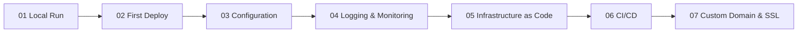
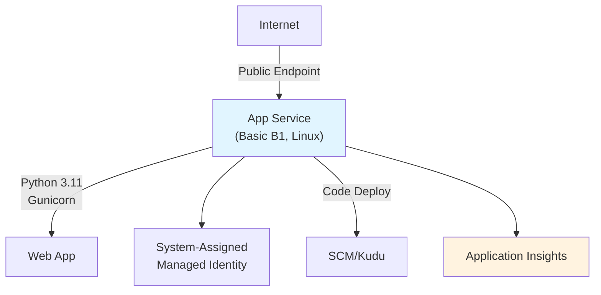
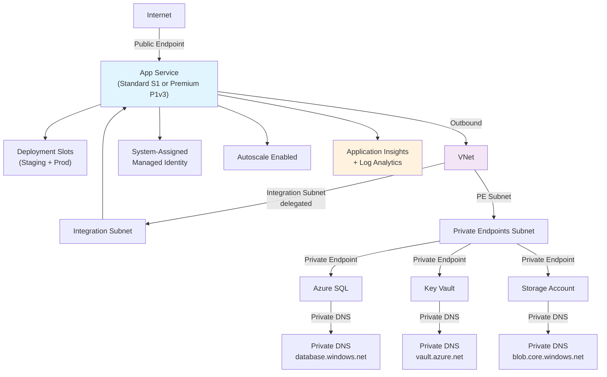
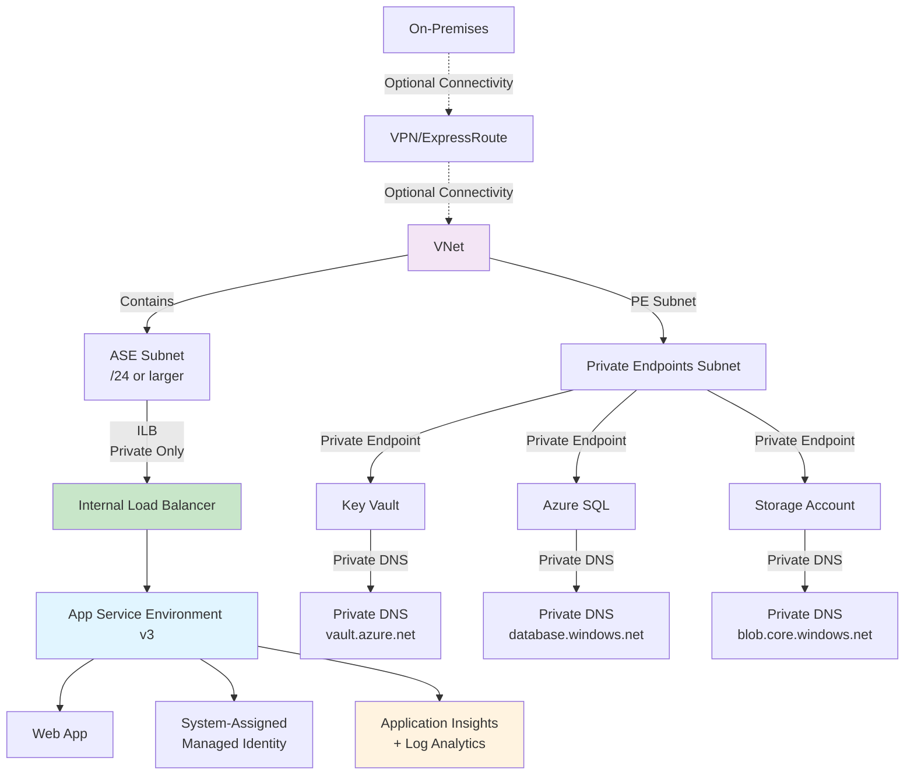

---
hide:
  - toc
content_sources:
  diagrams:
    - id: main-content
      type: flowchart
      source: mslearn-adapted
      mslearn_url: https://learn.microsoft.com/en-us/azure/app-service/
    - id: basic-tier-b1-simple-public-endpoint
      type: flowchart
      source: mslearn-adapted
      mslearn_url: https://learn.microsoft.com/en-us/azure/app-service/
    - id: standard-premium-tier-s1-p1v3-vnet-integrated
      type: flowchart
      source: mslearn-adapted
      mslearn_url: https://learn.microsoft.com/en-us/azure/app-service/
    - id: isolated-tier-ase-v3-full-network-isolation
      type: flowchart
      source: mslearn-adapted
      mslearn_url: https://learn.microsoft.com/en-us/azure/app-service/
---

# Python Guide

This guide walks from local Flask development to production-ready deployment and operations on Azure App Service.

## Main Content

<!-- diagram-id: main-content -->

1. [01 - Local Run](./tutorial/01-local-run.md)
2. [02 - First Deploy](./tutorial/02-first-deploy.md)
3. [03 - Configuration](./tutorial/03-configuration.md)
4. [04 - Logging and Monitoring](./tutorial/04-logging-monitoring.md)
5. [05 - Infrastructure as Code](./tutorial/05-infrastructure-as-code.md)
6. [06 - CI/CD](./tutorial/06-ci-cd.md)
7. [07 - Custom Domain and SSL](./tutorial/07-custom-domain-ssl.md)

## Network Architecture by Tier

Azure App Service offers three main hosting tiers, each with distinct networking capabilities. Choose your tier based on isolation, integration, and compliance requirements.

### Basic Tier (B1) — Simple Public Endpoint

<!-- diagram-id: basic-tier-b1-simple-public-endpoint -->

- Single public endpoint (no VNet integration)
- No private endpoints
- Best for: Development, non-production workloads

### Standard/Premium Tier (S1/P1v3) — VNet Integrated

<!-- diagram-id: standard-premium-tier-s1-p1v3-vnet-integrated -->

- VNet integration for outbound connections to private endpoints
- Deployment slots for safe testing and rollback
- Private DNS zones for dependent services
- Autoscale to handle traffic spikes
- Best for: Production workloads requiring VNet isolation

### Isolated Tier (ASE v3) — Full Network Isolation

<!-- diagram-id: isolated-tier-ase-v3-full-network-isolation -->

- Dedicated, isolated environment inside a VNet
- Internal Load Balancer (ILB) — no public internet access by default
- All services on private endpoints within the same VNet
- Optional ExpressRoute or VPN for on-premises connectivity
- Best for: Regulatory/compliance requirements, full network isolation

!!! tip "Which tier to choose?"
    Start with **Basic (B1)** for development. Use **Standard (S1)** or **Premium (P1v3)** for production workloads needing VNet integration, deployment slots, and autoscale. Choose **Isolated (ASE v3)** only when regulatory or compliance requirements mandate full network isolation.

## Advanced Topics

Use the Python-specific recipes for service integrations and production patterns.

- [Python Recipes](./recipes/index.md)
- [Managed Identity Recipe](./recipes/managed-identity.md)

## See Also

- [Language Guides](../index.md)
- [Platform](../../platform/index.md)
- [Operations](../../operations/index.md)
- [Reference](../../reference/index.md)

## Sources

- [Quickstart: Deploy a Python web app](https://learn.microsoft.com/azure/app-service/quickstart-python)
