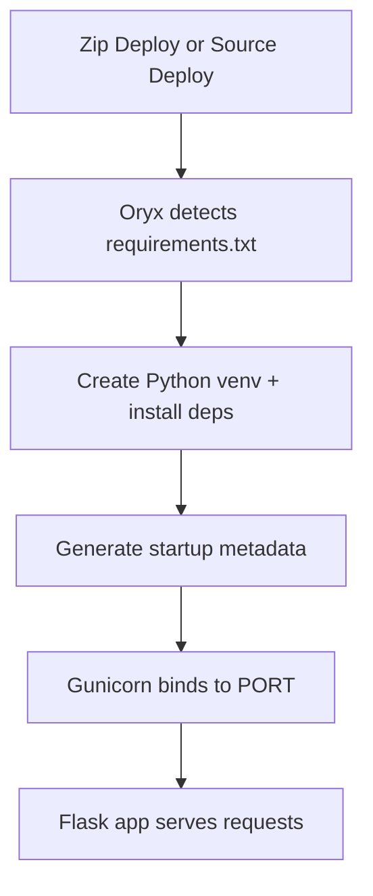

---
hide:
  - toc
content_sources:
  diagrams:
    - id: python-runtime
      type: flowchart
      source: mslearn-adapted
      mslearn_url: https://learn.microsoft.com/en-us/azure/app-service/
---

# Python Runtime

Quick lookup reference.

<!-- diagram-id: python-runtime -->


## Supported Runtime Versions

### App Service Python Versions (Linux)

Use one of the currently supported major/minor versions for production deployments:

- Python 3.9
- Python 3.10
- Python 3.11
- Python 3.12

Set runtime version:

```bash
az webapp config set \
  --resource-group $RG \
  --name $APP_NAME \
  --linux-fx-version "PYTHON|3.12"
```

Verify runtime:

```bash
az webapp config show \
  --resource-group $RG \
  --name $APP_NAME \
  --query "linuxFxVersion" \
  --output tsv
```

## Oryx Build Process

### What Oryx Does for Python Apps

On Zip Deploy and source-based deployments, App Service uses Oryx to detect Python and build dependencies.

Typical behavior:

1. Detects Python app based on files (for example `requirements.txt`).
2. Creates a virtual environment during build.
3. Installs dependencies from `requirements.txt`.
4. Generates startup script and launch metadata.

Recommended dependency flow:

```bash
pip freeze > requirements.txt
```

Build controls (common app settings):

```bash
az webapp config appsettings set \
  --resource-group $RG \
  --name $APP_NAME \
  --settings SCM_DO_BUILD_DURING_DEPLOYMENT=true
```

Use Oryx build logs in deployment center/Kudu to validate install failures.

## Startup Command Patterns

### Default Gunicorn Entrypoint

Use explicit host and port binding:

```bash
gunicorn --bind=0.0.0.0:$PORT src.app:app
```

If your Flask object is in `app/app.py` with `app = Flask(__name__)`, a common command is:

```bash
gunicorn --bind=0.0.0.0:$PORT app:app
```

Set startup command:

```bash
az webapp config set \
  --resource-group $RG \
  --name $APP_NAME \
  --startup-file "gunicorn --bind=0.0.0.0:$PORT src.app:app"
```

### Using gunicorn.conf.py

Alternative startup command:

```bash
gunicorn --config gunicorn.conf.py src.app:app
```

Example `gunicorn.conf.py`:

```python
import os

bind = f"0.0.0.0:{os.getenv('PORT', '8000')}"
workers = int(os.getenv("WEB_CONCURRENCY", "2"))
worker_class = "sync"
timeout = int(os.getenv("GUNICORN_TIMEOUT", "120"))
graceful_timeout = int(os.getenv("GUNICORN_GRACEFUL_TIMEOUT", "30"))
```

## Gunicorn Configuration

### Worker and Timeout Tuning

Core settings:

- `workers`: Number of worker processes.
- `worker_class`: Usually `sync` for standard Flask workloads.
- `timeout`: Hard worker timeout for hung requests.
- `graceful_timeout`: Drain period before forced stop.

Useful environment settings:

- `WEB_CONCURRENCY`: Overrides worker count.
- `PYTHON_ENABLE_GUNICORN_MULTIWORKERS`: Enables App Service multiworker handling for Gunicorn (`true`/`false`).

Example:

```bash
az webapp config appsettings set \
  --resource-group $RG \
  --name $APP_NAME \
  --settings \
    WEB_CONCURRENCY=3 \
    PYTHON_ENABLE_GUNICORN_MULTIWORKERS=true
```

Practical tuning guidance:

- Start with `workers=2` for small plans.
- Increase only after checking memory headroom.
- Raise `timeout` for slow external dependencies, but fix root cause where possible.

## Port Binding and Networking

### Always Bind to Platform Port

App Service injects `PORT` at runtime for Linux containers.

Rules:

- Prefer `--bind=0.0.0.0:$PORT` in Gunicorn command.
- For local fallback, use `8000`.
- Never hardcode random ports in production startup command.

Flask development pattern:

```python
import os

port = int(os.getenv("PORT", "8000"))
app.run(host="0.0.0.0", port=port)
```

## File System and Persistence

### /home Is Persistent, App Root Is Not

On Linux App Service:

- `/home` persists across restarts and deployments.
- App content under runtime extraction path can be replaced on redeploy.
- Local temporary paths are ephemeral.

Use `/home` for:

- Uploaded files that must survive restarts.
- Cached artifacts safe to retain.
- Diagnostic dumps/log snapshots.

Avoid storing durable application state on non-persistent paths.

## Common Import and Startup Errors

### Module and Path Failures

1. **`ModuleNotFoundError` after deploy**
    - Cause: Missing package in `requirements.txt` or build skipped.    - Fix: Add package, redeploy with `SCM_DO_BUILD_DURING_DEPLOYMENT=true`.
2. **`Failed to find attribute 'app'` / WSGI import errors**
    - Cause: Incorrect module path in startup command.    - Fix: Match `module:callable` exactly (`src.app:app`, `app:app`, etc.).
3. **`No module named src`**
    - Cause: Wrong working directory assumptions.    - Fix: Adjust startup path to deployed folder layout.
4. **App starts locally but fails in App Service**
    - Cause: OS-level native dependencies missing or case-sensitive import mismatch.    - Fix: Pin compatible wheels and validate Linux import casing.
### Fast Validation Commands

```bash
az webapp log tail --resource-group $RG --name $APP_NAME
```

```bash
az webapp ssh --resource-group $RG --name $APP_NAME
```

Check installed packages and startup process from SSH/Kudu when diagnosing import issues.

## See Also
- [CLI Cheatsheet](../../reference/cli-cheatsheet.md)
- [Troubleshooting](../../reference/troubleshooting.md)

## Sources
- [Configure a Linux Python app (Microsoft Learn)](https://learn.microsoft.com/en-us/azure/app-service/configure-language-python)
- [Python version support in App Service (Microsoft Learn)](https://learn.microsoft.com/en-us/azure/app-service/configure-language-python#supported-python-versions)
