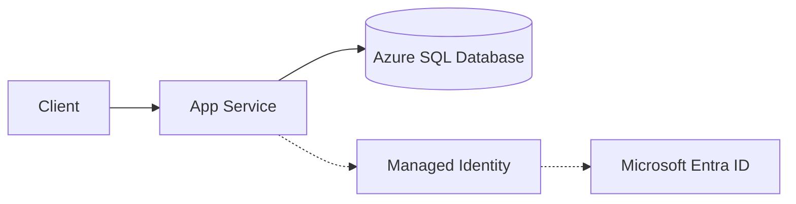

---
hide:
  - toc
content_sources:
  diagrams:
    - id: architecture
      type: flowchart
      source: mslearn-adapted
      mslearn_url: https://learn.microsoft.com/en-us/azure/azure-sql/database/connect-query-python
---

# Azure SQL with Managed Identity

Connect Flask to Azure SQL Database using `pyodbc` and Microsoft Entra authentication via Managed Identity.

## Architecture

<!-- diagram-id: architecture -->


Solid arrows show runtime data flow. Dashed arrows show identity and authentication.

## Prerequisites

- App Service with system-assigned managed identity enabled
- Azure SQL server and database
- Python dependency: `pyodbc`
- Network access from App Service to Azure SQL (public firewall or private endpoint)

## Step-by-Step Guide

### Step 1: Grant database access to the app identity

Assign a Microsoft Entra admin to SQL Server, then create a contained user for your app identity.

```sql
-- Run in the target database as Entra admin
CREATE USER [<app-managed-identity-name>] FROM EXTERNAL PROVIDER;
ALTER ROLE db_datareader ADD MEMBER [<app-managed-identity-name>];
ALTER ROLE db_datawriter ADD MEMBER [<app-managed-identity-name>];
```

### Step 2: Configure app settings and connect from Flask

```bash
az webapp config appsettings set \
  --resource-group "$RG" \
  --name "$APP_NAME" \
  --settings \
    SQL_SERVER="<server-name>.database.windows.net" \
    SQL_DATABASE="<database-name>" \
    SQL_DRIVER="ODBC Driver 18 for SQL Server"
```

```python
import os
import pyodbc
from flask import Flask, jsonify
from azure.identity import DefaultAzureCredential

app = Flask(__name__)


def get_sql_connection():
    server = os.environ["SQL_SERVER"]
    database = os.environ["SQL_DATABASE"]
    driver = os.environ.get("SQL_DRIVER", "ODBC Driver 18 for SQL Server")

    credential = DefaultAzureCredential()
    token = credential.get_token("https://database.windows.net/.default").token
    token_bytes = token.encode("utf-16-le")

    # SQL_COPT_SS_ACCESS_TOKEN = 1256
    attrs_before = {1256: token_bytes}

    conn_str = (
        f"Driver={{{driver}}};"
        f"Server=tcp:{server},1433;"
        f"Database={database};"
        "Encrypt=yes;TrustServerCertificate=no;"
    )

    return pyodbc.connect(conn_str, attrs_before=attrs_before, autocommit=False)


@app.get("/api/sql/ping")
def sql_ping():
    with get_sql_connection() as conn:
        with conn.cursor() as cursor:
            cursor.execute("SELECT TOP 1 name FROM sys.tables ORDER BY name")
            row = cursor.fetchone()
    return jsonify({"status": "ok", "sample_table": row[0] if row else None})
```

## Complete Example

`requirements.txt`:

```text
Flask==3.0.3
azure-identity==1.17.1
pyodbc==5.1.0
```

`startup command` (App Service):

```bash
gunicorn --bind 0.0.0.0:${PORT:-8000} app:app --workers 2 --timeout 120
```

## Troubleshooting

- `Login failed for user '<token-identified principal>'`:
    - Ensure `CREATE USER ... FROM EXTERNAL PROVIDER` ran in the correct database.    - Confirm role membership (`db_datareader`, `db_datawriter`, or custom role).- `ODBC Driver 18 not found`:
    - Use a custom container and install `msodbcsql18`, or verify platform image support.- Connection timeout:
    - Validate SQL firewall rules, VNet integration, DNS, and private endpoint routing.
## Advanced Topics

- Use retry logic (`tenacity`) for transient errors (error codes 40613, 40197, 40501).
- Use short-lived per-request connections (or a bounded pool) to avoid stale tokens.
- For high throughput, evaluate SQLAlchemy with an access-token event hook.

## See Also
- [Managed Identity](./managed-identity.md)
- [Native Dependencies](./native-dependencies.md)
- [Configure App Settings](../03-configuration.md)

## Sources
- [Tutorial: Connect to SQL Database from App Service using managed identity (Microsoft Learn)](https://learn.microsoft.com/en-us/azure/app-service/tutorial-connect-msi-sql-database)
- [Azure SQL documentation (Microsoft Learn)](https://learn.microsoft.com/en-us/azure/azure-sql/)
