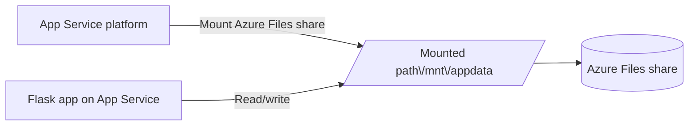

# Bring Your Own Storage (BYOS)

Mount Azure Blob Storage or Azure Files to your App Service instance as a custom storage path. BYOS lets you serve large files — assets, ML models, shared configs — directly from the filesystem without changing your application code.

## Architecture



Solid arrows show runtime data flow. Dashed arrows show identity and authentication.

!!! note "Blob mounts are read-only"
    **Azure Blob mounts are read-only.** Use them for reading large files (models, static assets). For shared write access across instances, use **Azure Files** BYOS or write directly to Blob Storage via the SDK.

## Overview

By default, App Service Linux apps have two filesystem areas:

| Path | Type | Behavior |
|------|------|----------|
| `/home` | Network-attached (Azure Files) | Persistent across restarts, shared across all scaled-out instances, slow I/O |
| All other paths (e.g. `/tmp`) | Ephemeral local disk | Fast I/O, wiped on restart, not shared between instances |
| `D:\home\site\wwwroot` | Windows App Service equivalent of `/home/site/wwwroot` | App code lives here on Windows |

BYOS lets you add a **third category**: your own Azure Blob container or Azure Files share, mounted at any path you choose.

### When to use BYOS

| Scenario | Recommended approach |
|----------|---------------------|
| User file uploads | Azure Files BYOS (write) or direct SDK upload |
| Shared static assets across instances | Blob Storage BYOS (read-only) |
| ML model files (large, infrequently updated) | Blob Storage BYOS (read-only) |
| Shared configuration files across instances | Azure Files BYOS |
| Log file aggregation | Azure Files BYOS |
| High-frequency writes (> 100/sec) | Use SDK directly — BYOS adds latency |

## Prerequisites

- App Service Plan: **Basic tier (B1) or higher**
- An Azure Storage account (Blob or Azure Files)
- Mount path must not be `/`, `/home`, `/tmp`, or conflict with the app's working directory
- Place your storage account in the **same region** as your App Service to minimize latency
- **Maximum 5 mounts per app** (across all BYOS storage accounts combined)
- **Azure Blob mounts are Linux-only** — Windows App Service supports Azure Files BYOS only

## Mount Types

Azure App Service supports two storage mount types:

| Type | Backend | Access | Best for |
|------|---------|--------|----------|
| `AzureBlob` | Blob container | **Read-only** | Large files, static assets, ML models |
| `AzureFiles` | Azure Files share | Read/write | Shared writes across instances, configs |

## Step 1 — Create a Storage Account and Container/Share

### Azure Blob

```bash
# Storage account
az storage account create \
  --name "${BASE_NAME}storage" \
  --resource-group "$RG" \
  --sku Standard_LRS \
  --kind StorageV2

# Blob container
az storage container create \
  --name uploads \
  --account-name "${BASE_NAME}storage"
```

### Azure Files

```bash
# Azure Files share
az storage share create \
  --name appdata \
  --account-name "${BASE_NAME}storage" \
  --quota 100
```

## Step 2 — Get the Storage Access Key

```bash
STORAGE_KEY=$(az storage account keys list \
  --resource-group "$RG" \
  --account-name "${BASE_NAME}storage" \
  --query "[0].value" -o tsv)
```

## Step 3 — Mount the Storage

### Using Azure CLI

```bash
# Mount Azure Blob container at /mnt/assets (read-only)
az webapp config storage-account add \
  --name "$APP_NAME" \
  --resource-group "$RG" \
  --custom-id uploads-mount \
  --storage-type AzureBlob \
  --account-name "${BASE_NAME}storage" \
  --access-key "$STORAGE_KEY" \
  --share-name uploads \
  --mount-path /mnt/assets

# Mount Azure Files share at /mnt/appdata
az webapp config storage-account add \
  --name "$APP_NAME" \
  --resource-group "$RG" \
  --custom-id appdata-mount \
  --storage-type AzureFiles \
  --account-name "${BASE_NAME}storage" \
  --access-key "$STORAGE_KEY" \
  --share-name appdata \
  --mount-path /mnt/appdata
```

### Using Bicep

```bicep
resource webApp 'Microsoft.Web/sites@2023-01-01' = {
  name: appName
  location: location
  properties: {
    siteConfig: {
      azureStorageAccounts: {
        'uploads-mount': {
          type: 'AzureBlob'
          accountName: storageAccountName
          shareName: 'uploads'
          mountPath: '/mnt/uploads'
          accessKey: storageAccountKey
        }
        'appdata-mount': {
          type: 'AzureFiles'
          accountName: storageAccountName
          shareName: 'appdata'
          mountPath: '/mnt/appdata'
          accessKey: storageAccountKey
        }
      }
    }
  }
}
```

!!! tip "Use Key Vault for the storage key"
    Avoid hardcoding the storage access key in Bicep. Store it in Key Vault and reference it via a Key Vault Reference app setting. See [Key Vault References](./key-vault-reference.md).

## Step 4 — Use the Mount in Flask

Azure Blob mounts are **read-only** — use them to read assets, models, or static files. Azure Files mounts support both reads and writes.

```python
import os
from pathlib import Path
from flask import Flask, request, jsonify, send_file

app = Flask(__name__)

# BLOB MOUNT (/mnt/assets) — read-only
ASSETS_DIR = Path(os.environ.get("ASSETS_PATH", "/mnt/assets"))

# AZURE FILES MOUNT (/mnt/appdata) — read/write
DATA_DIR = Path(os.environ.get("DATA_PATH", "/mnt/appdata"))


@app.get("/api/assets/<filename>")
def get_asset(filename: str):
    """Read from Blob mount (read-only)."""
    dest = ASSETS_DIR / filename
    if not dest.exists():
        return jsonify({"error": "Asset not found"}), 404
    return send_file(dest)


@app.post("/api/data/upload")
def upload_file():
    """Write to Azure Files mount (read/write)."""
    filename = request.json.get("filename")
    content = request.json.get("content", "")
    dest = DATA_DIR / filename
    dest.write_text(content)
    return jsonify({"saved": str(dest)})


@app.get("/api/data")
def list_files():
    files = [f.name for f in DATA_DIR.iterdir() if f.is_file()]
    return jsonify({"files": files})
```

Set the mount paths as App Settings so you can override them locally:

```bash
az webapp config appsettings set \
  --name "$APP_NAME" \
  --resource-group "$RG" \
  --settings ASSETS_PATH=/mnt/assets DATA_PATH=/mnt/appdata
```

## Step 5 — Verify the Mount

```bash
# List current mounts
az webapp config storage-account list \
  --name "$APP_NAME" \
  --resource-group "$RG" \
  --output table

# SSH into the app and verify the path exists
az webapp ssh --name "$APP_NAME" --resource-group "$RG"
# Inside the SSH session:
ls /mnt/assets
```

In the **Azure Portal**: navigate to your App Service → **Settings → Configuration → Path mappings** to see all active mounts and their status.

## Understanding `/home` and `wwwroot`

App Service Linux containers expose these paths by default — before any BYOS mounts:

| Path | Description |
|------|-------------|
| `/home/site/wwwroot` | Your deployed application code lands here |
| `/home/LogFiles` | Platform and application logs |
| `/home/data` | General-purpose persistent storage (already backed by Azure Files) |

On **Windows App Service**, the equivalent is:
- `D:\home\site\wwwroot` — app code
- `D:\home\LogFiles` — logs

The built-in `/home` mount is shared across all instances of your app. This means:
- Files written to `/home` by one instance are visible to all other instances
- `/home` uses Azure Files under the hood — I/O is slower than local disk
- For high-throughput writes, use a **BYOS Azure Files** mount or write directly to Blob Storage via SDK

## I/O Performance Considerations

| Storage | Latency (approx.) | Throughput | Notes |
|---------|-------------------|------------|-------|
| Ephemeral local disk (`/tmp`) | ~1ms | High | Not shared, wiped on restart |
| `/home` (built-in Azure Files) | ~10-50ms | Medium | Shared, persistent |
| BYOS Azure Files | ~10-50ms | Medium | Shared, persistent, configurable quota |
| BYOS Azure Blob | ~5-20ms | High | **Read-only**, Linux only |

!!! warning "Avoid `/home` for high-frequency writes"
    The built-in `/home` Azure Files mount is designed for deployment artifacts and logs. Using it for application-level writes (e.g., a write per HTTP request) causes I/O contention and slow response times. Use a BYOS **Azure Files** mount, or write to Blob Storage via SDK instead.

## Disabling the Built-in `/home` Persistence

!!! note "Custom containers only"
    `WEBSITES_ENABLE_APP_SERVICE_STORAGE` is supported for **custom Docker container** deployments. It is **not** a supported toggle for built-in Python (code-based) App Service apps. For code apps, the `/home` mount is always active and cannot be disabled via this setting.

If you are deploying a **custom container** and want to opt out of the built-in `/home` mount:

```bash
az webapp config appsettings set \
  --name "$APP_NAME" \
  --resource-group "$RG" \
  --settings WEBSITES_ENABLE_APP_SERVICE_STORAGE=false
```

!!! warning
    With `WEBSITES_ENABLE_APP_SERVICE_STORAGE=false`, logs and any files written to `/home` will not persist across restarts. Only set this if your container manages its own storage externally.

## Troubleshooting

| Symptom | Cause | Fix |
|---------|-------|-----|
| Mount path not visible in SSH | Incorrect storage key or account name | Re-run `storage-account add` with correct values; restart app |
| `PermissionError` writing to Blob mount | Blob mounts are read-only | Switch to Azure Files BYOS or use the Blob SDK for writes |
| Slow file reads from `/mnt` | Network latency from Azure Files | Cache files locally in `/tmp` after first read |
| Mount missing after scale-out | BYOS config propagation delay | Wait ~5 minutes after adding mount before scaling |
| `FileNotFoundError` on new instance | File written to ephemeral disk on another instance | Ensure writes go to `/home` or BYOS Azure Files mount, not local disk |

!!! warning "Limitations to be aware of"
    - **BYOS mounts are not included in App Service backups.** Back up your storage account separately.
    - **Avoid SQLite or file-lock-heavy workloads** on BYOS mounts — file locking over network mounts is unreliable.
    - **Blob mounts do not support writes** — attempting to write raises a `PermissionError`.
    - **Azure Blob mounts are Linux-only** — Windows App Service supports Azure Files mounts only.
    - **BYOS mounts authenticate via storage account keys** — Entra ID / managed identity authentication is not supported for mounts.

## Advanced: Accessing Blob Storage via SDK (Managed Identity)

BYOS mounts use a storage access key. For a keyless, more secure approach, skip mounting entirely and access Blob Storage directly via the SDK with a Managed Identity:

```bash
# Enable system-assigned identity
az webapp identity assign --name "$APP_NAME" --resource-group "$RG"

# Grant Storage Blob Data Contributor role
az role assignment create \
  --assignee "$(az webapp identity show --name $APP_NAME --resource-group $RG --query principalId --output tsv)" \
  --role "Storage Blob Data Contributor" \
  --scope "$(az storage account show --name ${BASE_NAME}storage --resource-group $RG --query id --output tsv)"
```

```python
from azure.identity import DefaultAzureCredential
from azure.storage.blob import BlobServiceClient
import os

credential = DefaultAzureCredential()
blob_client = BlobServiceClient(
    account_url=os.environ["STORAGE_ACCOUNT_URL"],
    credential=credential,
)
```

This approach works on all tiers (no mount required) and gives full read/write access. See [Managed Identity](./managed-identity.md) for the full setup.

## See Also
- [Managed Identity](./managed-identity.md)
- [Key Vault References](./key-vault-reference.md)

## References
- [Mount Azure Storage as a local share (Microsoft Learn)](https://learn.microsoft.com/azure/app-service/configure-connect-to-azure-storage)
- [App Service filesystem behavior (Microsoft Learn)](https://learn.microsoft.com/azure/app-service/operating-system-functionality)
- [Azure Storage performance tiers (Microsoft Learn)](https://learn.microsoft.com/azure/storage/common/storage-account-overview)
