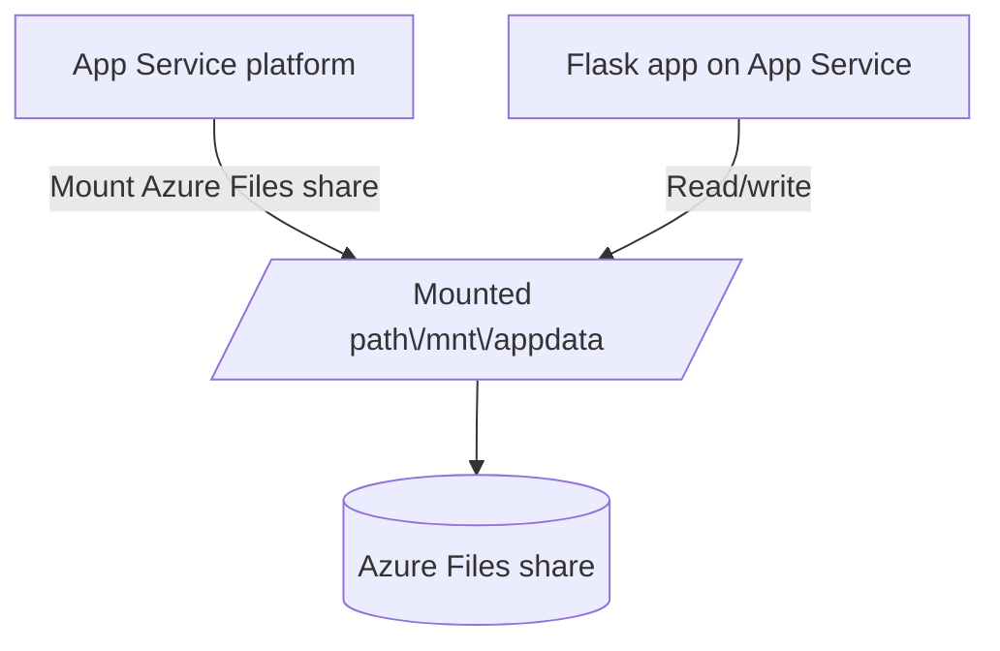

---
content_sources:
  diagrams:
    - id: architecture
      type: flowchart
      source: mslearn-adapted
      mslearn_url: https://learn.microsoft.com/en-us/azure/storage/blobs/storage-quickstart-blobs-python
---
# Bring Your Own Storage (BYOS)

Mount Azure Blob Storage or Azure Files to your App Service instance as a custom storage path. BYOS lets you serve large files — assets, ML models, shared configs — directly from the filesystem without changing your application code.

## Architecture

<!-- diagram-id: architecture -->

```mermaid
flowchart TD
    Platform[App Service platform] -->|Mount Azure Files share| Mount[/Mounted path\/mnt\/appdata/]
    App[Flask app on App Service] -->|Read/write| Mount
    Mount --> Files[(Azure Files share)]
```

Solid arrows show runtime data flow. Dashed arrows show identity and authentication.

!!! note "Blob mounts are read-only"
    **Azure Blob mounts are read-only.** Use them for reading large files (models, static assets). For shared write access across instances, use **Azure Files** BYOS or write directly to Blob Storage via the SDK.

## Overview

By default, App Service Linux apps have two filesystem areas:

| Path | Type | Behavior |
|------|------|----------|
| `/home` | Network-attached (Azure Files) | Persistent across restarts, shared across all scaled-out instances, slow I/O |
| All other paths (e.g. `/tmp`) | Ephemeral local disk | Fast I/O, wiped on restart, not shared between instances |
| `D:\home\site\wwwroot` | Windows App Service equivalent of `/home/site/wwwroot` | App code lives here on Windows |

BYOS lets you add a **third category**: your own Azure Blob container or Azure Files share, mounted at any path you choose.

### When to use BYOS

| Scenario | Recommended approach |
|----------|---------------------|
| User file uploads | Azure Files BYOS (write) or direct SDK upload |
| Shared static assets across instances | Blob Storage BYOS (read-only) |
| ML model files (large, infrequently updated) | Blob Storage BYOS (read-only) |
| Shared configuration files across instances | Azure Files BYOS |
| Log file aggregation | Azure Files BYOS |
| High-frequency writes (> 100/sec) | Use SDK directly — BYOS adds latency |

## Prerequisites

- App Service Plan: **Basic tier (B1) or higher**
- An Azure Storage account (Blob or Azure Files)
- Mount path must not be `/`, `/home`, `/tmp`, or conflict with the app's working directory
- Place your storage account in the **same region** as your App Service to minimize latency
- **Maximum 5 mounts per app** (across all BYOS storage accounts combined)
- **Azure Blob mounts are Linux-only** — Windows App Service supports Azure Files BYOS only

## Mount Types

Azure App Service supports two storage mount types:

| Type | Backend | Access | Best for |
|------|---------|--------|----------|
| `AzureBlob` | Blob container | **Read-only** | Large files, static assets, ML models |
| `AzureFiles` | Azure Files share | Read/write | Shared writes across instances, configs |

## Step 1 — Create a Storage Account and Container/Share

### Azure Blob

```bash
# Storage account
az storage account create \
  --name "${BASE_NAME}storage" \
  --resource-group "$RG" \
  --sku Standard_LRS \
  --kind StorageV2

# Blob container
az storage container create \
  --name uploads \
  --account-name "${BASE_NAME}storage"
```

| Command | Description |
|---|---|
| `az storage account create --name "${BASE_NAME}storage" --resource-group "$RG" --sku Standard_LRS --kind StorageV2` | Creates the storage account that will host the Blob container or Azure Files share used for the mount. |
| `az storage container create --name uploads --account-name "${BASE_NAME}storage"` | Creates the Blob container named `uploads` inside that storage account for the read-only Blob mount. |

### Azure Files

```bash
# Azure Files share
az storage share create \
  --name appdata \
  --account-name "${BASE_NAME}storage" \
  --quota 100
```

| Flag | Description |
|---|---|
| `--name appdata` | Names the Azure Files share that App Service will mount. |
| `--account-name "${BASE_NAME}storage"` | Chooses the storage account that owns the Azure Files share. |
| `--quota 100` | Sets the Azure Files share quota to 100 GiB. |

## Step 2 — Get the Storage Access Key

```bash
STORAGE_KEY=$(az storage account keys list \
  --resource-group "$RG" \
  --account-name "${BASE_NAME}storage" \
  --query "[0].value" --output tsv)
```

| Flag | Description |
|---|---|
| `--resource-group "$RG"` | Looks up keys on the storage account in the specified resource group. |
| `--account-name "${BASE_NAME}storage"` | Selects the storage account whose access keys will be returned. |
| `--query "[0].value"` | Extracts the value of the first key in the returned key list. |
| `--output tsv` | Returns the key as plain text so the shell can store it in `STORAGE_KEY`. |

## Step 3 — Mount the Storage

### Using Azure CLI

```bash
# Mount Azure Blob container at /mnt/assets (read-only)
az webapp config storage-account add \
  --name "$APP_NAME" \
  --resource-group "$RG" \
  --custom-id uploads-mount \
  --storage-type AzureBlob \
  --account-name "${BASE_NAME}storage" \
  --access-key "$STORAGE_KEY" \
  --share-name uploads \
  --mount-path /mnt/assets

# Mount Azure Files share at /mnt/appdata
az webapp config storage-account add \
  --name "$APP_NAME" \
  --resource-group "$RG" \
  --custom-id appdata-mount \
  --storage-type AzureFiles \
  --account-name "${BASE_NAME}storage" \
  --access-key "$STORAGE_KEY" \
  --share-name appdata \
  --mount-path /mnt/appdata
```

| Command | Description |
|---|---|
| `az webapp config storage-account add --name "$APP_NAME" --resource-group "$RG" --custom-id uploads-mount --storage-type AzureBlob --account-name "${BASE_NAME}storage" --access-key "$STORAGE_KEY" --share-name uploads --mount-path /mnt/assets` | Adds a Blob-backed mount named `uploads-mount` so the app can read the `uploads` container at `/mnt/assets`. |
| `az webapp config storage-account add --name "$APP_NAME" --resource-group "$RG" --custom-id appdata-mount --storage-type AzureFiles --account-name "${BASE_NAME}storage" --access-key "$STORAGE_KEY" --share-name appdata --mount-path /mnt/appdata` | Adds an Azure Files-backed mount named `appdata-mount` so the app can read and write the `appdata` share at `/mnt/appdata`. |

### Using Bicep

```bicep
resource webApp 'Microsoft.Web/sites@2023-01-01' = {
  name: appName
  location: location
  properties: {
    siteConfig: {
      azureStorageAccounts: {
        'uploads-mount': {
          type: 'AzureBlob'
          accountName: storageAccountName
          shareName: 'uploads'
          mountPath: '/mnt/uploads'
          accessKey: storageAccountKey
        }
        'appdata-mount': {
          type: 'AzureFiles'
          accountName: storageAccountName
          shareName: 'appdata'
          mountPath: '/mnt/appdata'
          accessKey: storageAccountKey
        }
      }
    }
  }
}
```

!!! tip "Use Key Vault for the storage key"
    Avoid hardcoding the storage access key in Bicep. Store it in Key Vault and reference it via a Key Vault Reference app setting. See [Key Vault References](./key-vault-reference.md).

## Step 4 — Use the Mount in Flask

Azure Blob mounts are **read-only** — use them to read assets, models, or static files. Azure Files mounts support both reads and writes.

```python
import os
from pathlib import Path
from flask import Flask, request, jsonify, send_file

app = Flask(__name__)

# BLOB MOUNT (/mnt/assets) — read-only
ASSETS_DIR = Path(os.environ.get("ASSETS_PATH", "/mnt/assets"))

# AZURE FILES MOUNT (/mnt/appdata) — read/write
DATA_DIR = Path(os.environ.get("DATA_PATH", "/mnt/appdata"))


@app.get("/api/assets/<filename>")
def get_asset(filename: str):
    """Read from Blob mount (read-only)."""
    dest = ASSETS_DIR / filename
    if not dest.exists():
        return jsonify({"error": "Asset not found"}), 404
    return send_file(dest)


@app.post("/api/data/upload")
def upload_file():
    """Write to Azure Files mount (read/write)."""
    filename = request.json.get("filename")
    content = request.json.get("content", "")
    dest = DATA_DIR / filename
    dest.write_text(content)
    return jsonify({"saved": str(dest)})


@app.get("/api/data")
def list_files():
    files = [f.name for f in DATA_DIR.iterdir() if f.is_file()]
    return jsonify({"files": files})
```

Set the mount paths as App Settings so you can override them locally:

```bash
az webapp config appsettings set \
  --name "$APP_NAME" \
  --resource-group "$RG" \
  --settings ASSETS_PATH=/mnt/assets DATA_PATH=/mnt/appdata
```

| Flag | Description |
|---|---|
| `--name "$APP_NAME"` | Targets the App Service app that should receive the mount-path settings. |
| `--resource-group "$RG"` | Identifies the resource group that contains the app. |
| `--settings ASSETS_PATH=/mnt/assets DATA_PATH=/mnt/appdata` | Writes app settings that point the Flask code to the Blob and Azure Files mount paths. |

## Step 5 — Verify the Mount

```bash
# List current mounts
az webapp config storage-account list \
  --name "$APP_NAME" \
  --resource-group "$RG" \
  --output table

# SSH into the app and verify the path exists
az webapp ssh --name "$APP_NAME" --resource-group "$RG"
# Inside the SSH session:
ls /mnt/assets
```

| Command | Description |
|---|---|
| `az webapp config storage-account list --name "$APP_NAME" --resource-group "$RG" --output table` | Lists the current BYOS mount definitions configured on the web app. |
| `az webapp ssh --name "$APP_NAME" --resource-group "$RG"` | Opens an interactive SSH session into the running app container. |
| `ls /mnt/assets` | Verifies inside the container that the Blob mount path exists and exposes files. |

In the **Azure Portal**: navigate to your App Service → **Settings → Configuration → Path mappings** to see all active mounts and their status.

## Understanding `/home` and `wwwroot`

App Service Linux containers expose these paths by default — before any BYOS mounts:

| Path | Description |
|------|-------------|
| `/home/site/wwwroot` | Your deployed application code lands here |
| `/home/LogFiles` | Platform and application logs |
| `/home/data` | General-purpose persistent storage (already backed by Azure Files) |

On **Windows App Service**, the equivalent is:
- `D:\home\site\wwwroot` — app code
- `D:\home\LogFiles` — logs

The built-in `/home` mount is shared across all instances of your app. This means:
- Files written to `/home` by one instance are visible to all other instances
- `/home` uses Azure Files under the hood — I/O is slower than local disk
- For high-throughput writes, use a **BYOS Azure Files** mount or write directly to Blob Storage via SDK

## I/O Performance Considerations

| Storage | Latency (approx.) | Throughput | Notes |
|---------|-------------------|------------|-------|
| Ephemeral local disk (`/tmp`) | ~1ms | High | Not shared, wiped on restart |
| `/home` (built-in Azure Files) | ~10-50ms | Medium | Shared, persistent |
| BYOS Azure Files | ~10-50ms | Medium | Shared, persistent, configurable quota |
| BYOS Azure Blob | ~5-20ms | High | **Read-only**, Linux only |

!!! warning "Avoid `/home` for high-frequency writes"
    The built-in `/home` Azure Files mount is designed for deployment artifacts and logs. Using it for application-level writes (e.g., a write per HTTP request) causes I/O contention and slow response times. Use a BYOS **Azure Files** mount, or write to Blob Storage via SDK instead.

## Storage Network Configuration

A BYOS mount reaches the storage account over the network like any other client, so the storage account's firewall applies to the mount just as it applies to SDK calls. If you lock the storage account down, the mount can fail unless you also open a supported network path.

!!! warning "Storage firewall works only through service endpoints or private endpoints"
    When the storage account's public network access is restricted, App Service can reach a BYOS mount **only** through [service endpoints](https://learn.microsoft.com/en-us/azure/storage/common/storage-network-security#grant-access-from-a-virtual-network) or [private endpoints](https://learn.microsoft.com/en-us/azure/storage/common/storage-private-endpoints), and only when the app has [virtual network integration](https://learn.microsoft.com/en-us/azure/app-service/overview-vnet-integration) enabled. A plain IP allowlist on the storage firewall is not a supported path for mounts.

| Storage firewall state | BYOS mount works? | Required configuration |
|------------------------|-------------------|------------------------|
| Public access enabled (default) | Yes | None — mount reaches the account over the public endpoint |
| Firewall with IP allowlist | Not reliable | App Service outbound IPs are shared and, in the same region, **not honored** by the storage firewall (see note below) |
| Firewall + service endpoint | Yes | VNet integration + `Microsoft.Storage` service endpoint on the integration subnet |
| Public access disabled + private endpoint | Yes | VNet integration + private endpoint + `privatelink.file.core.windows.net` (or `.blob.`) private DNS |

!!! note "Same-region IP allowlists are ignored"
    If you add App Service outbound IP addresses to the storage firewall while the app and storage account are in the **same region**, those IP restrictions are **not honored**. Use a service endpoint or private endpoint instead of an IP allowlist for same-region access. See [Mount Azure Storage as a local share](https://learn.microsoft.com/en-us/azure/app-service/configure-connect-to-azure-storage).

!!! tip "Azure Files over VNet integration needs port 445 and `WEBSITE_CONTENTOVERVNET`"
    When mounting Azure Files through virtual network integration, ensure outbound TCP **port 445** is open on the integration subnet's route, and set the app setting `WEBSITE_CONTENTOVERVNET=1`. Blob mounts do not use SMB and are unaffected by the port 445 requirement, but they remain **read-only**.

For the full four-layer model (DNS resolution, routing, storage firewall, and data-plane authorization) that governs every App Service to Storage connection — including BYOS mounts and SDK calls — see [App Service to Azure Storage connectivity](../../../platform/storage-connectivity.md).

## Disabling the Built-in `/home` Persistence

!!! note "Custom containers only"
    `WEBSITES_ENABLE_APP_SERVICE_STORAGE` is supported for **custom Docker container** deployments. It is **not** a supported toggle for built-in Python (code-based) App Service apps. For code apps, the `/home` mount is always active and cannot be disabled via this setting.

If you are deploying a **custom container** and want to opt out of the built-in `/home` mount:

```bash
az webapp config appsettings set \
  --name "$APP_NAME" \
  --resource-group "$RG" \
  --settings WEBSITES_ENABLE_APP_SERVICE_STORAGE=false
```

| Flag | Description |
|---|---|
| `--name "$APP_NAME"` | Targets the custom-container web app whose built-in `/home` mount behavior you want to change. |
| `--resource-group "$RG"` | Identifies the resource group that contains the app. |
| `--settings WEBSITES_ENABLE_APP_SERVICE_STORAGE=false` | Disables the built-in App Service `/home` storage mount for supported custom-container apps. |

!!! warning
    With `WEBSITES_ENABLE_APP_SERVICE_STORAGE=false`, logs and any files written to `/home` will not persist across restarts. Only set this if your container manages its own storage externally.

## Troubleshooting

| Symptom | Cause | Fix |
|---------|-------|-----|
| Mount path not visible in SSH | Incorrect storage key or account name | Re-run `storage-account add` with correct values; restart app |
| `PermissionError` writing to Blob mount | Blob mounts are read-only | Switch to Azure Files BYOS or use the Blob SDK for writes |
| Slow file reads from `/mnt` | Network latency from Azure Files | Cache files locally in `/tmp` after first read |
| Mount missing after scale-out | BYOS config propagation delay | Wait ~5 minutes after adding mount before scaling |
| `FileNotFoundError` on new instance | File written to ephemeral disk on another instance | Ensure writes go to `/home` or BYOS Azure Files mount, not local disk |

!!! warning "Limitations to be aware of"
    - **BYOS mounts are not included in App Service backups.** Back up your storage account separately.
    - **Avoid SQLite or file-lock-heavy workloads** on BYOS mounts — file locking over network mounts is unreliable.
    - **Blob mounts do not support writes** — attempting to write raises a `PermissionError`.
    - **Azure Blob mounts are Linux-only** — Windows App Service supports Azure Files mounts only.
    - **BYOS mounts authenticate via storage account keys** — Entra ID / managed identity authentication is not supported for mounts.

## Advanced: Accessing Blob Storage via SDK (Managed Identity)

BYOS mounts use a storage access key. For a keyless, more secure approach, skip mounting entirely and access Blob Storage directly via the SDK with a Managed Identity:

```bash
# Enable system-assigned identity
az webapp identity assign --name "$APP_NAME" --resource-group "$RG"

# Grant Storage Blob Data Contributor role
az role assignment create \
  --assignee "$(az webapp identity show --name $APP_NAME --resource-group $RG --query principalId --output tsv)" \
  --role "Storage Blob Data Contributor" \
  --scope "$(az storage account show --name ${BASE_NAME}storage --resource-group $RG --query id --output tsv)"
```

| Command | Description |
|---|---|
| `az webapp identity assign --name "$APP_NAME" --resource-group "$RG"` | Enables a system-assigned managed identity on the web app for keyless SDK access to storage. |
| `az role assignment create --assignee "$(az webapp identity show --name $APP_NAME --resource-group $RG --query principalId --output tsv)" --role "Storage Blob Data Contributor" --scope "$(az storage account show --name ${BASE_NAME}storage --resource-group $RG --query id --output tsv)"` | Grants that web app identity Blob data-plane read/write permission on the storage account. |

```python
from azure.identity import DefaultAzureCredential
from azure.storage.blob import BlobServiceClient
import os

credential = DefaultAzureCredential()
blob_client = BlobServiceClient(
    account_url=os.environ["STORAGE_ACCOUNT_URL"],
    credential=credential,
)
```

This approach works on all tiers (no mount required) and gives full read/write access. See [Managed Identity](./managed-identity.md) for the full setup.

## Run It in the Portal

#### Portal view: Environment variables blade (recipe app settings for mount paths)

![Azure Portal Environment variables blade for app-test-20251107 Web App with the App settings tab selected (Connection strings tab adjacent). The toolbar shows a search box plus the actions plus Add, Refresh, Show values, Advanced edit, and Pull reference values. The settings table has columns Name, Value, Deployment slot setting, Source, and Delete and lists five App Service-sourced rows: APPLICATIONINSIGHTS_CONNECTION_STRING, APPLICATIONINSIGHTSAGENT_EXTENSION_ENABLED, ApplicationInsightsAgent_EXTENSION_VERSION, SCM_DO_BUILD_DURING_DEPLOYMENT, and WEBSITE_HTTPLOGGING_RETENTION_DAYS, each with a Show value link and Source App Service. The left navigation expands Settings with Environment variables highlighted, alongside Configuration, Instances, Authentication, Identity, Backups, Custom domains, Certificates, Networking, and WebJobs; Apply and Discard buttons are disabled at the bottom.](../../../assets/operations/deployment/zip-deploy/01-app-settings-run-from-package.png)

The `Environment variables` blade with the `App settings` tab selected is the Portal surface where the recipe's companion path settings appear if you add `ASSETS_PATH` and `DATA_PATH` as shown earlier on this page. Those rows would sit in the same `Name`/`Value` table shown here, and the visible `Show value` and `Refresh` actions are the controls you use to confirm the CLI-written app settings landed. Use this blade for the app-setting layer of the recipe; use `az webapp config storage-account list` for the actual BYOS mount inventory.

## See Also
- [Managed Identity](./managed-identity.md)
- [Key Vault References](./key-vault-reference.md)
- [App Service to Azure Storage connectivity](../../../platform/storage-connectivity.md)

## Sources
- [Mount Azure Storage as a local share (Microsoft Learn)](https://learn.microsoft.com/en-us/azure/app-service/configure-connect-to-azure-storage)
- [App Service filesystem behavior (Microsoft Learn)](https://learn.microsoft.com/en-us/azure/app-service/operating-system-functionality)
- [Azure Storage performance tiers (Microsoft Learn)](https://learn.microsoft.com/en-us/azure/storage/common/storage-account-overview)
