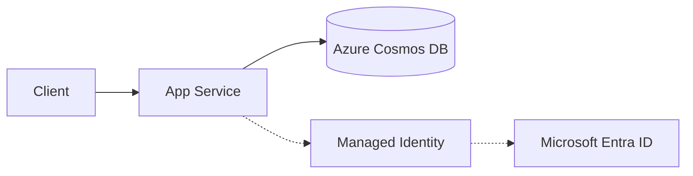

# Cosmos DB with azure-cosmos SDK

Integrate Flask with Azure Cosmos DB (NoSQL API) using passwordless authentication through Managed Identity.

## Architecture



Solid arrows show runtime data flow. Dashed arrows show identity and authentication.

## Prerequisites

- Azure Cosmos DB account (NoSQL API), database, and container
- App Service managed identity enabled
- RBAC role assignment on Cosmos DB data plane (for example, `Cosmos DB Built-in Data Contributor`)
- Python dependency: `azure-cosmos`

## Step-by-Step Guide

### Step 1: Configure Cosmos DB and app settings

```bash
az webapp config appsettings set \
  --resource-group "$RG" \
  --name "$APP_NAME" \
  --settings \
    COSMOS_ENDPOINT="https://$COSMOS_ACCOUNT.documents.azure.com:443/" \
    COSMOS_DATABASE="appdb" \
    COSMOS_CONTAINER="items"
```

### Step 2: Use `DefaultAzureCredential` in Flask

```python
import os
from flask import Flask, jsonify, request
from azure.identity import DefaultAzureCredential
from azure.cosmos import CosmosClient, PartitionKey

app = Flask(__name__)

credential = DefaultAzureCredential()
client = CosmosClient(os.environ["COSMOS_ENDPOINT"], credential=credential)
database = client.get_database_client(os.environ["COSMOS_DATABASE"])
container = database.get_container_client(os.environ["COSMOS_CONTAINER"])


@app.post("/api/cosmos/items")
def create_item():
    payload = request.get_json(force=True)
    item = {
        "id": payload["id"],
        "pk": payload.get("pk", payload["id"]),
        "name": payload.get("name", "unnamed")
    }
    created = container.upsert_item(item)
    return jsonify(created), 201


@app.get("/api/cosmos/items/<item_id>")
def read_item(item_id: str):
    item = container.read_item(item=item_id, partition_key=item_id)
    return jsonify(item)
```

## Complete Example

```text
# requirements.txt
Flask==3.0.3
azure-identity==1.17.1
azure-cosmos==4.7.0
```

```python
# Optional bootstrap for local development if container does not exist yet
from azure.cosmos.exceptions import CosmosResourceNotFoundError

def ensure_container():
    db_name = os.environ["COSMOS_DATABASE"]
    container_name = os.environ["COSMOS_CONTAINER"]
    try:
        client.create_database_if_not_exists(id=db_name)
        db = client.get_database_client(db_name)
        db.create_container_if_not_exists(
            id=container_name,
            partition_key=PartitionKey(path="/pk")
        )
    except CosmosResourceNotFoundError:
        pass
```

## Troubleshooting

- `403 Forbidden` on data operations:
  - Verify Cosmos DB **data-plane** role assignment (control-plane RBAC is not enough).
- `401 Unauthorized`:
  - Confirm managed identity is enabled and token audience is correct for Cosmos SDK.
- High latency/timeouts:
  - Place App Service and Cosmos DB in the same region and review indexing/pagination.

## Advanced Topics

- Use `preferred_locations` in `CosmosClient` for multi-region read optimization.
- Use optimistic concurrency with ETag (`if_match`) for safe updates.
- Tune query RU cost and add composite indexes for heavy query workloads.

## See Also
- [Managed Identity](./managed-identity.md)
- [Key Vault References](./key-vault-reference.md)
- [Troubleshoot](../../../reference/troubleshooting.md)

## References
- [Azure Cosmos DB documentation (Microsoft Learn)](https://learn.microsoft.com/en-us/azure/cosmos-db/)
- [Use managed identity to connect Cosmos DB from App Service (Microsoft Learn)](https://learn.microsoft.com/en-us/azure/app-service/tutorial-connect-msi-azure-service)
