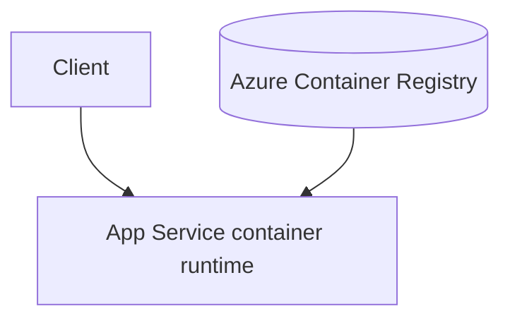

---
content_sources:
  diagrams:
    - id: architecture
      type: flowchart
      source: mslearn-adapted
      mslearn_url: https://learn.microsoft.com/en-us/azure/app-service/configure-custom-container
---

# Custom Container (Docker + Gunicorn + SSH)

Run Flask on App Service with a custom Linux container when you need full OS/package control.

## Architecture

<!-- diagram-id: architecture -->


Solid arrows show runtime data flow. Dashed arrows show identity and authentication.

## Prerequisites

- Azure Container Registry (ACR) or other supported container registry
- App Service for Containers
- Flask app with `gunicorn` entry point

## Step-by-Step Guide

### Step 1: Build a container image for App Service

```dockerfile
FROM python:3.11-slim

ENV PYTHONDONTWRITEBYTECODE=1 \
    PYTHONUNBUFFERED=1

RUN apt-get update \
    && apt-get install --yes --no-install-recommends openssh-server \
    && rm -rf /var/lib/apt/lists/*

WORKDIR /app
COPY app/requirements.txt /app/requirements.txt
RUN pip install --no-cache-dir -r /app/requirements.txt

COPY app /app

# SSH for Azure App Service container diagnostics
RUN mkdir -p /var/run/sshd
COPY sshd_config /etc/ssh/sshd_config
RUN echo "root:Docker!" | chpasswd

COPY entrypoint.sh /entrypoint.sh
RUN chmod +x /entrypoint.sh

EXPOSE 2222 8000
CMD ["/entrypoint.sh"]
```

`entrypoint.sh`:

```bash
#!/usr/bin/env bash
set -euo pipefail

service ssh start
exec gunicorn --bind 0.0.0.0:${PORT:-8000} app:app --workers 2 --timeout 120
```

### Step 2: Push image and configure App Service

```bash
az acr build \
  --registry "$ACR_NAME" \
  --image flask-ref:latest \
  --file Dockerfile .

az webapp config container set \
  --resource-group "$RG" \
  --name "$APP_NAME" \
  --container-image-name "$ACR_NAME.azurecr.io/flask-ref:latest" \
  --container-registry-url "https://$ACR_NAME.azurecr.io"
```

## Complete Example

`sshd_config`:

```text
Port 2222
ListenAddress 0.0.0.0
LoginGraceTime 180
X11Forwarding no
Ciphers aes128-ctr,aes192-ctr,aes256-ctr
MACs hmac-sha2-256,hmac-sha2-512
StrictModes yes
SyslogFacility DAEMON
PasswordAuthentication yes
PermitEmptyPasswords no
PermitRootLogin yes
Subsystem sftp internal-sftp
```

## Troubleshooting

- Container exits immediately:
    - Confirm `CMD` points to executable script and script starts Gunicorn in foreground.- App responds `502` after deploy:
    - Ensure Gunicorn binds `0.0.0.0:${PORT}` and `PORT` is not hard-coded.- Cannot SSH:
    - Check port `2222` exposure and App Service SSH console compatibility.
## Advanced Topics

- Use multi-stage builds and wheelhouse caching to reduce image size.
- Add health checks and a non-root runtime user where compatible.
- Pin base image digest to control supply chain changes.

## See Also
- [Native Dependencies](./native-dependencies.md)
- [Deploy Application](../tutorial/02-first-deploy.md)
- [Troubleshoot](../../../reference/troubleshooting.md)

## Sources
- [Run a custom container in App Service (Microsoft Learn)](https://learn.microsoft.com/en-us/azure/app-service/tutorial-custom-container)
- [Configure a custom container (Microsoft Learn)](https://learn.microsoft.com/en-us/azure/app-service/configure-custom-container)
