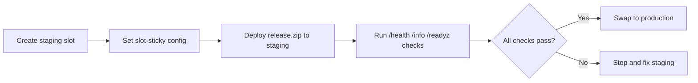

---
hide:
  - toc
content_sources:
  diagrams:
    - id: deployment-slots-validation
      type: flowchart
      source: mslearn-adapted
      mslearn_url: https://learn.microsoft.com/en-us/azure/app-service/quickstart-python
---

# Deployment Slots Validation

Use staging slots to validate deployments before production swap, with health checks and automated safeguards in GitHub Actions.

<!-- diagram-id: deployment-slots-validation -->


## Prerequisites

- App Service plan supports deployment slots (Standard, Premium, or Isolated)
- Production app already running on Linux App Service
- GitHub Actions workflow configured for the repository

## Main content

### 1) Create staging slot

Create a new deployment slot named `staging` for your application:

```bash
az webapp deployment slot create \
    --resource-group "$RG" \
    --name "$APP_NAME" \
    --slot "staging" \
    --output json
```

### 2) Configure slot-sticky settings

Mark environment-specific values as slot settings so they do not swap with the code:

```bash
az webapp config appsettings set \
    --resource-group "$RG" \
    --name "$APP_NAME" \
    --slot "staging" \
    --slot-settings APP_ENV=staging FEATURE_BETA_ENABLED=true \
    --output json
```

### 3) Deploy artifact to staging slot

Deploy your Python application package directly to the staging slot:

```bash
az webapp deploy \
    --resource-group "$RG" \
    --name "$APP_NAME" \
    --slot "staging" \
    --src-path "release.zip" \
    --type zip \
    --output json
```

### 4) Add explicit health endpoint checks

Verify the staging slot is responding correctly before proceeding with the swap:

```bash
curl --fail --silent "https://$APP_NAME-staging.azurewebsites.net/health"
curl --fail --silent "https://$APP_NAME-staging.azurewebsites.net/info"
```

### 5) Add version-aware validation endpoint

Implement a `/readyz` route in your Flask application to provide environment and version context:

```python
import os
from flask import Flask, jsonify

app = Flask(__name__)

@app.route("/readyz")
def readyz():
    return jsonify({
        "status": "ready",
        "environment": os.environ.get("APP_ENV", "production"),
        "buildVersion": os.environ.get("BUILD_VERSION", "unknown"),
    })
```

### 6) Swap staging to production

Perform the swap to promote the validated staging code to the production slot:

```bash
az webapp deployment slot swap \
    --resource-group "$RG" \
    --name "$APP_NAME" \
    --slot "staging" \
    --target-slot "production" \
    --output json
```

### 7) Optional auto-swap configuration

Enable auto-swap to automatically promote successful deployments to production:

```bash
az webapp deployment slot auto-swap \
    --resource-group "$RG" \
    --name "$APP_NAME" \
    --slot "staging" \
    --auto-swap-slot "production" \
    --output json
```

### 8) GitHub Actions staged deployment example

Automate the deployment, validation, and swap process using GitHub Actions:

```yaml
jobs:
  deploy-staging:
    runs-on: ubuntu-latest
    steps:
      - name: Deploy to Staging Slot
        uses: azure/webapps-deploy@v3
        with:
          app-name: ${{ env.APP_NAME }}
          slot-name: 'staging'
          package: .

  validate:
    needs: deploy-staging
    runs-on: ubuntu-latest
    steps:
      - name: Health Check
        run: |
          curl --fail --retry 5 --retry-delay 5 \
          "https://${{ env.APP_NAME }}-staging.azurewebsites.net/readyz"

  swap:
    needs: validate
    runs-on: ubuntu-latest
    steps:
      - name: Swap to Production
        run: |
          az webapp deployment slot swap \
            --resource-group ${{ env.RG }} \
            --name ${{ env.APP_NAME }} \
            --slot staging \
            --target-slot production
```

!!! warning "Validate before swap, always"
    A successful deployment is not the same as a healthy runtime.
    Require endpoint validation and telemetry checks before production swap.

## Verification

- Staging slot serves the expected build version via `/readyz`.
- Production remains stable and unaffected during staging validation.
- Swap completes without environment configuration leakage.
- Post-swap production `/health` endpoint returns a success status.

```bash
curl --include "https://$APP_NAME.azurewebsites.net/health"
```

## Troubleshooting

### Staging healthy, production fails after swap

- Check that slot-sticky configurations (like `APP_ENV`) are correctly marked.
- Verify that database connection strings or external API keys are valid for production.
- Confirm the production App Service plan has sufficient resources for the new build.

### Swap operation blocked

Ensure no other management operations are running on the App Service. Check the Azure Activity Log for specific conflict errors or pending restarts.

### Auto-swap caused unexpected release

Disable auto-swap and revert to manual swap or a controlled GitHub Actions workflow. Ensure that the staging slot is fully warmed up before auto-swap triggers.

## See Also

- [Tutorial: 06. CI/CD](../06-ci-cd.md)
- [Tutorial: 03. Configuration](../03-configuration.md)
- For platform details, see [Azure App Service Guide](https://yeongseon.github.io/azure-app-service-practical-guide/)
