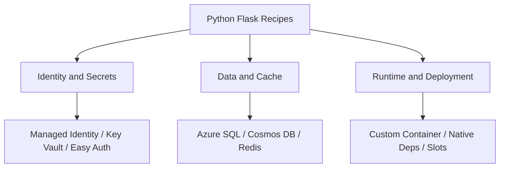

---
hide:
  - toc
---

# Recipes

Practical patterns for common Azure App Service scenarios in Python and Flask.



## Prerequisites

- A deployed App Service web app running Python 3.11+
- Azure CLI logged in (`az login`)
- Access to the resource group that contains your app

## Step-by-Step Guide

### Step 1: Choose the scenario

Pick the recipe that matches your immediate requirement:

- [Azure SQL with Managed Identity](./azure-sql.md)
- [Cosmos DB with `azure-cosmos`](./cosmosdb.md)
- [Redis cache with `redis-py`](./redis.md)
- [Custom container with Gunicorn + SSH](./custom-container.md)
- [Native dependencies on Linux App Service](./native-dependencies.md)
- [Easy Auth](./easy-auth.md)
- [Managed Identity](./managed-identity.md)
- [Key Vault References](./key-vault-reference.md)
- [Bring Your Own Storage](./bring-your-own-storage.md)

### Step 2: Apply in a safe order

Use this rollout order for production apps:

1. Enable Managed Identity and least-privilege RBAC.
2. Move secrets to Key Vault or Key Vault References.
3. Add data/cache integrations (SQL, Cosmos DB, Redis).
4. Move to custom container or native dependency optimization only when needed.

## Complete Example

```bash
# Recommended baseline settings
az webapp identity assign --resource-group "$RG" --name "$APP_NAME"

az webapp config appsettings set \
  --resource-group "$RG" \
  --name "$APP_NAME" \
  --settings \
    APP_ENV=production \
    LOG_LEVEL=INFO
```

## Troubleshooting

- If identity-based connections fail, verify role assignments and wait a few minutes for token/RBAC propagation.
- If configuration changes are not reflected, restart the app:

```bash
az webapp restart --resource-group "$RG" --name "$APP_NAME"
```

## Advanced Topics

- Use deployment slots to validate recipe changes before production swap.
- Combine Easy Auth + app-level authorization (role checks) for defense in depth.
- Use managed identities for all supported Azure SDK connections to remove static credentials.

## See Also
- [Easy Auth](./easy-auth.md)
- [Managed Identity](./managed-identity.md)
- [Key Vault References](./key-vault-reference.md)
- [Troubleshoot](../../../reference/troubleshooting.md)

## Sources
- [App Service documentation (Microsoft Learn)](https://learn.microsoft.com/en-us/azure/app-service/)
- [Use managed identities for App Service (Microsoft Learn)](https://learn.microsoft.com/en-us/azure/app-service/overview-managed-identity)
