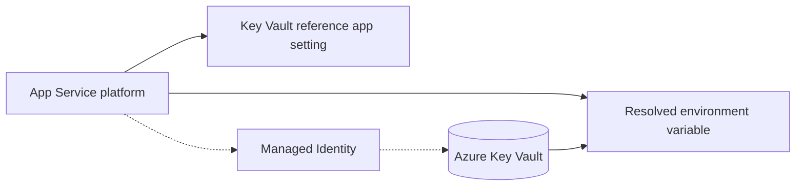

---
content_sources:
  diagrams:
    - id: architecture
      type: flowchart
      source: mslearn-adapted
      mslearn_url: https://learn.microsoft.com/en-us/azure/app-service/app-service-key-vault-references
---

# Key Vault References

Inject secrets directly into App Service environment variables using Key Vault References, while keeping Flask code simple.

## Architecture

<!-- diagram-id: architecture -->


Solid arrows show runtime data flow. Dashed arrows show identity and authentication.

## Prerequisites

- Managed identity enabled on App Service
- Key Vault with required secrets
- Key Vault RBAC role: `Key Vault Secrets User` for the app identity

## Step-by-Step Guide

### Step 1: Configure Key Vault reference app settings

Reference syntax:

- `@Microsoft.KeyVault(SecretUri=https://<vault-name>.vault.azure.net/secrets/<secret-name>)`
- `@Microsoft.KeyVault(VaultName=<vault-name>;SecretName=<secret-name>)`

```bash
az webapp config appsettings set \
  --resource-group "$RG" \
  --name "$APP_NAME" \
  --settings \
    DB_PASSWORD="@Microsoft.KeyVault(VaultName=<vault-name>;SecretName=db-password)" \
    REDIS_ACCESS_KEY="@Microsoft.KeyVault(SecretUri=https://<vault-name>.vault.azure.net/secrets/redis-access-key)"
```

### Step 2: Read secrets from `os.environ` in Python

```python
import os
from flask import Flask, jsonify

app = Flask(__name__)


@app.get("/api/config/check")
def config_check():
    db_password = os.environ.get("DB_PASSWORD")
    redis_key = os.environ.get("REDIS_ACCESS_KEY")

    return jsonify({
        "db_password_loaded": bool(db_password),
        "redis_key_loaded": bool(redis_key)
    })
```

## Complete Example

```python
import os
import pyodbc


def build_connection_string() -> str:
    return (
        f"Driver={{{os.environ.get('SQL_DRIVER', 'ODBC Driver 18 for SQL Server')}}};"
        f"Server=tcp:{os.environ['SQL_SERVER']},1433;"
        f"Database={os.environ['SQL_DATABASE']};"
        f"Uid={os.environ['SQL_USER']};"
        f"Pwd={os.environ['DB_PASSWORD']};"
        "Encrypt=yes;TrustServerCertificate=no;"
    )


def connect_with_secret():
    return pyodbc.connect(build_connection_string())
```

## Troubleshooting

- Environment variable contains literal `@Microsoft.KeyVault(...)`:
    - Reference resolution failed; verify identity and Key Vault permissions.- `Secret not found` or stale value:
    - Check secret name/version and remember updates may take time to refresh.- Works in one slot, fails in another:
    - Confirm slot-specific app settings and identity assignments.
## Advanced Topics

- Combine with slot settings to isolate staging vs production secrets.
- Prefer Key Vault References for non-SDK consumers; use SDK + managed identity for dynamic secret operations.
- Rotate secrets in Key Vault without code changes or repo updates.

## See Also
- [Managed Identity](./managed-identity.md)
- [Redis Cache with redis-py](./redis.md)
- [Configure App Settings](../tutorial/03-configuration.md)

## Sources
- [Use Key Vault references as app settings (Microsoft Learn)](https://learn.microsoft.com/en-us/azure/app-service/app-service-key-vault-references)
- [Azure Key Vault overview (Microsoft Learn)](https://learn.microsoft.com/en-us/azure/key-vault/general/overview)
