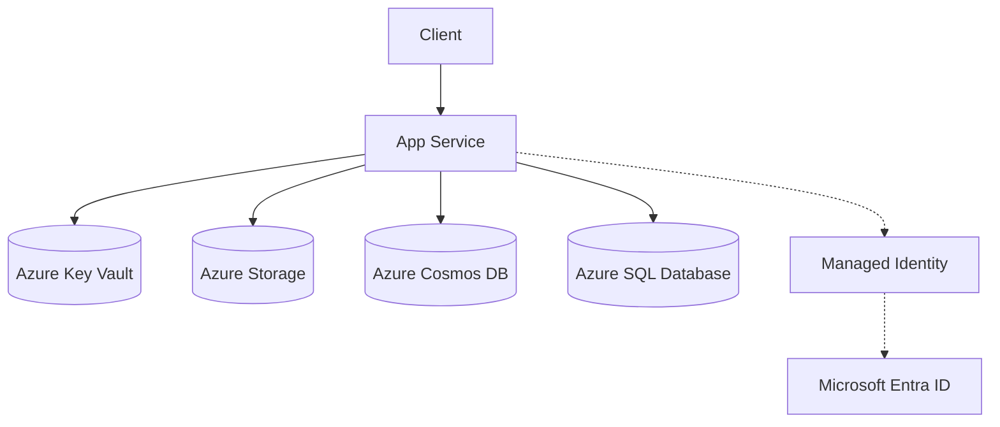
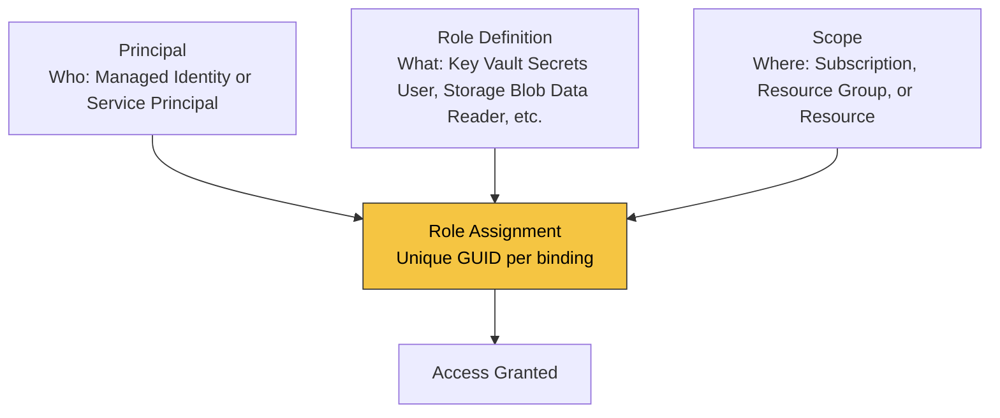

---
content_sources:
  diagrams:
    - id: architecture
      type: flowchart
      source: mslearn-adapted
      mslearn_url: https://learn.microsoft.com/en-us/azure/app-service/overview-managed-identity
---

# Managed Identity

Use managed identity to access Azure resources from Flask without storing passwords, client secrets, or connection strings.

## Architecture

<!-- diagram-id: architecture -->


Solid arrows show runtime data flow. Dashed arrows show identity and authentication.

## How RBAC Connects Identity to Resources

A managed identity alone does not grant access. Azure RBAC binds three elements into a **role assignment**:

<!-- diagram-id: rbac-structure -->


| Element | Question it answers | Example |
|---|---|---|
| **Principal** | Who needs access? | App Service's managed identity |
| **Role Definition** | What permission? | `Key Vault Secrets User`, `Storage Blob Data Reader` |
| **Scope** | On which resource? | A specific Key Vault, Storage account, or resource group |
| **Role Assignment** | The binding itself | Unique GUID — one per (principal + role + scope) combination |

Azure RBAC enforces a uniqueness constraint: only one role assignment can exist for the same `(principal, role definition, scope)` triple. Attempting to create a duplicate with a different assignment GUID results in a `RoleAssignmentExists` conflict.

## Prerequisites

- App Service web app (Linux) with Python runtime
- `azure-identity` package
- Target resource role assignments (Key Vault, Storage, Cosmos DB, SQL, etc.)

## Step-by-Step Guide

### Step 1: Enable identity and assign minimum roles

```bash
az webapp identity assign --resource-group "$RG" --name "$APP_NAME"

az role assignment create \
  --assignee-object-id "<principal-object-id>" \
  --assignee-principal-type ServicePrincipal \
  --role "Key Vault Secrets User" \
  --scope "/subscriptions/<subscription-id>/resourceGroups/$RG/providers/Microsoft.KeyVault/vaults/<vault-name>"
```

Use least privilege and scope assignments to the smallest required resource.

### Step 2: Use `DefaultAzureCredential` in Flask

```python
import os
from flask import Flask, jsonify
from azure.identity import DefaultAzureCredential
from azure.keyvault.secrets import SecretClient
from azure.storage.blob import BlobServiceClient

app = Flask(__name__)
credential = DefaultAzureCredential()


@app.get("/api/identity/keyvault")
def read_secret():
    vault_url = os.environ["KEYVAULT_URL"]
    client = SecretClient(vault_url=vault_url, credential=credential)
    secret = client.get_secret("app-config")
    return jsonify({"secret_name": secret.name, "retrieved": True})


@app.get("/api/identity/storage")
def list_containers():
    account_url = os.environ["STORAGE_ACCOUNT_URL"]
    blob_client = BlobServiceClient(account_url=account_url, credential=credential)
    names = [c["name"] for c in blob_client.list_containers(results_per_page=5)]
    return jsonify({"containers": names})
```

## Complete Example

```text
# requirements.txt
Flask==3.0.3
azure-identity==1.17.1
azure-keyvault-secrets==4.8.0
azure-storage-blob==12.22.0
```

```bash
az webapp config appsettings set \
  --resource-group "$RG" \
  --name "$APP_NAME" \
  --settings \
    KEYVAULT_URL="https://<vault-name>.vault.azure.net/" \
    STORAGE_ACCOUNT_URL="https://<storage-account>.blob.core.windows.net/"
```

## Troubleshooting

- `ManagedIdentityCredential authentication unavailable`:
    - Identity may be disabled or app not restarted after enablement.- `403 Forbidden` from Azure SDK:
    - Role assignment missing or not propagated yet.- Works locally but fails in Azure:
    - Validate `DefaultAzureCredential` chain differences and required environment settings.
## Advanced Topics

- Use user-assigned managed identity for shared identity across multiple apps.
- Set explicit client ID for user-assigned identity:

```python
credential = DefaultAzureCredential(managed_identity_client_id=os.environ["AZURE_CLIENT_ID"])
```

- Add SDK retries and timeout configuration for production resiliency.

## See Also
- [Azure SQL with Managed Identity](./azure-sql.md)
- [Cosmos DB with azure-cosmos](./cosmosdb.md)
- [Key Vault References](./key-vault-reference.md)

## Sources
- [Use managed identities for App Service (Microsoft Learn)](https://learn.microsoft.com/en-us/azure/app-service/overview-managed-identity)
- [DefaultAzureCredential overview (Microsoft Learn)](https://learn.microsoft.com/en-us/azure/developer/python/sdk/authentication/credential-chains)
