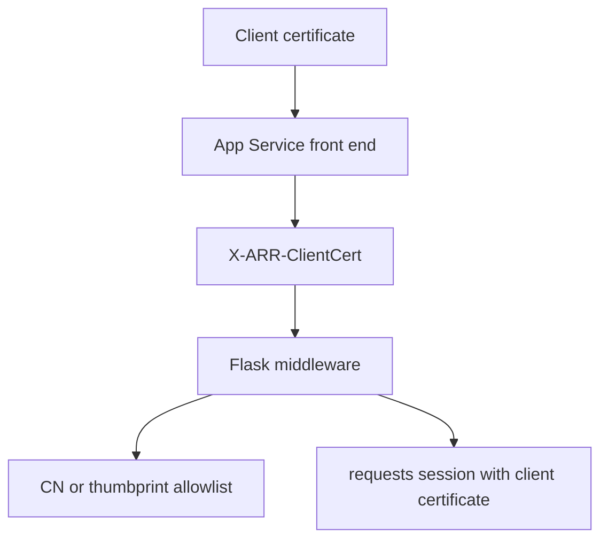

---
content_sources:
  diagrams:
    - id: python-mtls-client-certificate-flow
      type: flowchart
      source: mslearn-adapted
      mslearn_url: https://learn.microsoft.com/en-us/azure/app-service/app-service-web-configure-tls-mutual-auth
      based_on:
        - https://learn.microsoft.com/en-us/azure/app-service/configure-ssl-certificate-in-code
---

# mTLS Client Certificates

Use Flask middleware to parse `X-ARR-ClientCert`, validate the forwarded client certificate, and attach a private certificate to outbound HTTPS calls when the remote service requires mutual TLS.

<!-- diagram-id: python-mtls-client-certificate-flow -->


## Prerequisites

- Flask app running on Azure App Service
- `clientCertEnabled=true` with an appropriate `clientCertMode`
- Python 3.11 or later
- Private certificate loaded for outbound calls when required

`requirements.txt` additions:

```text
Flask==3.0.3
cryptography==44.0.2
httpx==0.28.1
requests==2.32.3
```

## What You'll Build

- A Flask `before_request` hook that parses `X-ARR-ClientCert`
- Allowlist validation by thumbprint or common name
- An outbound helper that loads a `.p12` certificate and writes temporary PEM files for `requests`

## Steps

### 1. Add the Flask middleware and routes

```python
import hashlib
import os
import tempfile
from contextlib import contextmanager
from datetime import datetime, timezone
from typing import Iterator

import requests
from cryptography import x509
from cryptography.hazmat.primitives import serialization
from cryptography.hazmat.primitives.serialization import pkcs12
from flask import Flask, abort, g, jsonify, request

app = Flask(__name__)

ALLOWED_COMMON_NAMES = {
    value.strip()
    for value in os.getenv("ALLOWED_CLIENT_CERT_COMMON_NAMES", "api-client.contoso.com").split(",")
    if value.strip()
}
ALLOWED_THUMBPRINTS = {
    value.strip().upper()
    for value in os.getenv("ALLOWED_CLIENT_CERT_THUMBPRINTS", "").split(",")
    if value.strip()
}
OUTBOUND_CERT_PATH = os.getenv("OUTBOUND_CLIENT_CERT_PATH", "/var/ssl/private/<thumbprint>.p12")
OUTBOUND_CERT_PASSWORD = os.getenv("OUTBOUND_CLIENT_CERT_PASSWORD", "")
REMOTE_API_URL = os.getenv("REMOTE_API_URL", "https://api.contoso.com/health")


def load_forwarded_certificate() -> x509.Certificate:
    header_value = request.headers.get("X-ARR-ClientCert")
    if not header_value:
        abort(403, description="client certificate header missing")

    pem_bytes = (
        "-----BEGIN CERTIFICATE-----\n"
        f"{header_value}\n"
        "-----END CERTIFICATE-----\n"
    ).encode("utf-8")

    try:
        return x509.load_pem_x509_certificate(pem_bytes)
    except ValueError as exc:
        abort(403, description=f"invalid client certificate header: {exc}")


def certificate_thumbprint(certificate: x509.Certificate) -> str:
    return hashlib.sha1(certificate.public_bytes(serialization.Encoding.DER)).hexdigest().upper()


def certificate_common_name(certificate: x509.Certificate) -> str | None:
    try:
        return certificate.subject.get_attributes_for_oid(x509.NameOID.COMMON_NAME)[0].value
    except IndexError:
        return None


def validate_certificate(certificate: x509.Certificate) -> dict:
    now = datetime.now(timezone.utc)
    not_before = certificate.not_valid_before_utc
    not_after = certificate.not_valid_after_utc

    if now < not_before or now > not_after:
        abort(403, description="client certificate is expired or not yet valid")

    thumbprint = certificate_thumbprint(certificate)
    common_name = certificate_common_name(certificate)

    if ALLOWED_THUMBPRINTS and thumbprint in ALLOWED_THUMBPRINTS:
        return {"thumbprint": thumbprint, "commonName": common_name}

    if common_name and common_name in ALLOWED_COMMON_NAMES:
        return {"thumbprint": thumbprint, "commonName": common_name}

    abort(403, description="client certificate is not allowlisted")


@app.before_request
def require_known_client_certificate() -> None:
    if request.path == "/health":
        return

    certificate = load_forwarded_certificate()
    g.client_certificate = validate_certificate(certificate)


@contextmanager
def export_p12_to_temp_pem_files(p12_path: str, password: str) -> Iterator[tuple[str, str]]:
    with open(p12_path, "rb") as handle:
        private_key, certificate, _additional = pkcs12.load_key_and_certificates(
            handle.read(),
            password.encode("utf-8") if password else None,
        )

    if private_key is None or certificate is None:
        raise RuntimeError("PKCS12 archive did not contain both a private key and certificate")

    cert_file = tempfile.NamedTemporaryFile("wb", delete=False)
    key_file = tempfile.NamedTemporaryFile("wb", delete=False)

    try:
        cert_file.write(certificate.public_bytes(serialization.Encoding.PEM))
        key_file.write(
            private_key.private_bytes(
                encoding=serialization.Encoding.PEM,
                format=serialization.PrivateFormat.TraditionalOpenSSL,
                encryption_algorithm=serialization.NoEncryption(),
            )
        )
        cert_file.close()
        key_file.close()
        yield cert_file.name, key_file.name
    finally:
        for path in (cert_file.name, key_file.name):
            try:
                os.remove(path)
            except FileNotFoundError:
                pass


@app.get("/cert-info")
def cert_info():
    return jsonify(g.client_certificate)


@app.get("/outbound-mtls")
def outbound_mtls():
    with export_p12_to_temp_pem_files(OUTBOUND_CERT_PATH, OUTBOUND_CERT_PASSWORD) as cert_pair:
        response = requests.get(
            REMOTE_API_URL,
            cert=cert_pair,
            timeout=10,
        )
        response.raise_for_status()

    return jsonify({"upstreamStatus": response.status_code, "clientCertificatePath": OUTBOUND_CERT_PATH})


@app.get("/health")
def health():
    return jsonify({"status": "ok"})


if __name__ == "__main__":
    app.run(host="0.0.0.0", port=8000, debug=True)
```

### 2. Configure environment variables

```bash
az webapp config appsettings set \
  --resource-group $RG \
  --name $APP_NAME \
  --settings \
    ALLOWED_CLIENT_CERT_COMMON_NAMES="api-client.contoso.com,partner-gateway.contoso.com" \
    ALLOWED_CLIENT_CERT_THUMBPRINTS="" \
    OUTBOUND_CLIENT_CERT_PATH="/var/ssl/private/<thumbprint>.p12" \
    OUTBOUND_CLIENT_CERT_PASSWORD="<certificate-password>" \
    REMOTE_API_URL="https://api.contoso.com/health" \
  --output json
```

### 3. Test the inbound certificate path

```bash
curl --include \
  --cert ./client.pem \
  --key ./client.key \
  "https://$APP_NAME.azurewebsites.net/cert-info"
```

## Verification

- An allowlisted client certificate returns `200 OK` from `/cert-info`
- A non-allowlisted certificate returns `403`
- `/health` works without certificate validation if that path is excluded in the platform configuration
- `/outbound-mtls` succeeds only when the outbound PKCS#12 file exists and the remote service trusts it

## Next Steps / Clean Up

- Replace CN-only validation with issuer, SAN, and chain validation for production
- Move outbound certificate passwords or related configuration into your approved secret-management workflow
- Delete temporary diagnostics routes after validation if they expose more certificate metadata than your policy allows

## See Also

- [Incoming Client Certificates](../../../operations/incoming-client-certificates.md)
- [Outbound Client Certificates](../../../operations/outbound-client-certificates.md)
- [Easy Auth](./easy-auth.md)

## Sources

- [Set up TLS mutual authentication for Azure App Service (Microsoft Learn)](https://learn.microsoft.com/en-us/azure/app-service/app-service-web-configure-tls-mutual-auth)
- [Use TLS/SSL certificates in your application code in Azure App Service (Microsoft Learn)](https://learn.microsoft.com/en-us/azure/app-service/configure-ssl-certificate-in-code)
