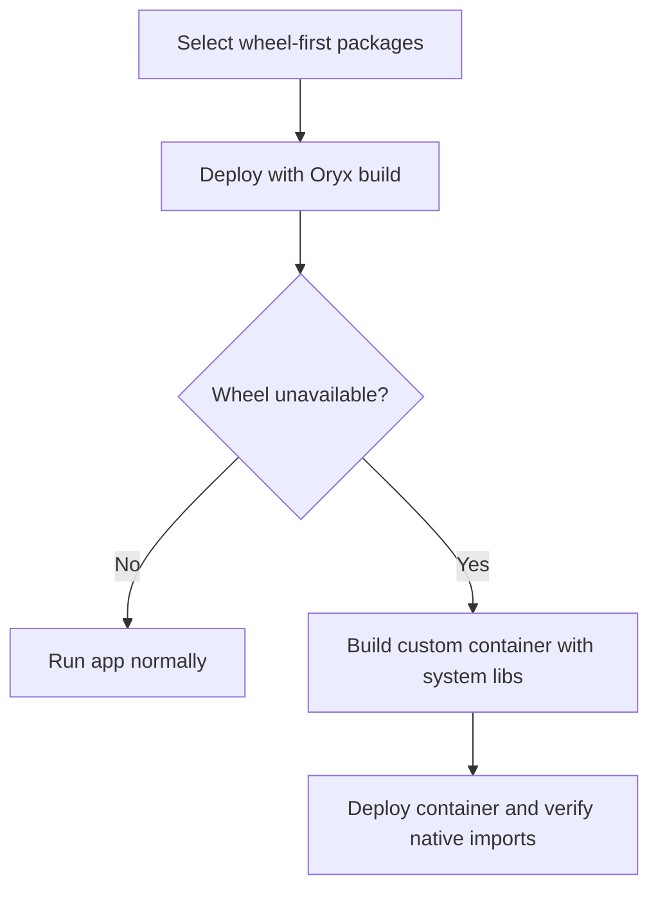

---
content_sources:
  diagrams:
    - id: native-dependencies-on-app-service-linux
      type: flowchart
      source: mslearn-adapted
      mslearn_url: https://learn.microsoft.com/en-us/azure/app-service/
---
# Native Dependencies on App Service Linux

Handle Python packages with C/C++ extensions reliably on Azure App Service Linux.

<!-- diagram-id: native-dependencies-on-app-service-linux -->


## Prerequisites

- Python 3.11 runtime on App Service Linux
- `pip` and `requirements.txt` under source control
- Optional custom container path if platform packages are insufficient

## Step-by-Step Guide

### Step 1: Choose wheel-first dependency strategy

Prefer prebuilt wheels when possible to avoid build failures during deployment.

```text
# requirements.txt examples
psycopg2-binary==2.9.9
Pillow==10.4.0
lxml==5.2.2
cryptography==43.0.0
pandas==2.2.2
numpy==2.0.1
```

Guidance:

- `psycopg2-binary` is usually simplest for App Service deployments.
- Use `psycopg2` only if you need source build/custom OpenSSL/libpq linkage.
- Pin versions to known-good wheel availability for your Python version.

### Step 2: Add fallback build plan when wheels are unavailable

If deployment logs show source compilation failures, switch to a custom container with OS build dependencies.

```dockerfile
FROM python:3.11-slim

RUN apt-get update && apt-get install --yes --no-install-recommends \
    build-essential \
    gcc g++ \
    libpq-dev \
    libjpeg62-turbo-dev zlib1g-dev \
    libxml2-dev libxslt1-dev \
    libssl-dev libffi-dev \
    && rm -rf /var/lib/apt/lists/*

WORKDIR /app
COPY apps/python-flask/requirements.txt ./requirements.txt
RUN pip install --upgrade pip setuptools wheel \
    && pip install --no-cache-dir -r requirements.txt
```

This example assumes the Docker build context is the repository root. If you build from `apps/python-flask/` instead, use `COPY requirements.txt ./requirements.txt`.

## Complete Example

```python
# Optional startup check for native modules
from flask import Flask, jsonify

app = Flask(__name__)


@app.get("/health/native")
def health_native():
    import PIL
    import lxml
    import cryptography
    import pandas
    return jsonify({
        "pillow": PIL.__version__,
        "lxml": lxml.__version__,
        "cryptography": cryptography.__version__,
        "pandas": pandas.__version__
    })
```

## Troubleshooting

- `error: subprocess-exited-with-error` during `pip install`:
    - Missing compiler or system headers; move to custom container build dependencies.
- `ImportError: libpq.so.*` for PostgreSQL:
    - Install `libpq` runtime libraries or use `psycopg2-binary`.
- `Pillow` image codec missing:
    - Add required OS libs (`libjpeg`, `zlib`, optional `libwebp`).
- `numpy/pandas` build timeout:
    - Pin to wheels and avoid source builds on platform runtime.

## Advanced Topics

- Prebuild wheels in CI (`pip wheel`) and publish to an internal package index.
- Use constraints files (`-c constraints.txt`) for deterministic dependency resolution.
- Track ABI compatibility when upgrading Python minor versions.

## Run It in the Portal

#### Portal view: Log stream blade (verifying native dependencies loaded at runtime)

![Log stream blade for a Web App showing the live runtime log feed. The top filter bar has "Log Level" dropdown, "Stop" / "Copy" / "Clear" buttons, a "Logs" radio set with "Runtime" selected (Platform unselected), an Instances selector with a worker instance ID, and a Lookback period of "Last 30 minutes". The main panel renders a dark console with time-stamped log lines emitted by an azure.core.pipeline.policies.http_logging_policy showing Request URL, Request method (POST), Request headers (Content-Type, Content-Length, Accept, x-ms-client-request-id, User-Agent), Response status 200, and "Transmission succeeded: Item received: 3. Items accepted: 3" entries from the Azure Monitor OpenTelemetry exporter. The left navigation shows Log stream selected under the Monitoring group.](../../../assets/platform/request-lifecycle/01-log-stream.png)

The Log stream blade is the Portal surface for confirming that native Python dependencies installed by this recipe — `Pillow` system libs, `pyodbc` ODBC drivers, or `lxml` headers — loaded correctly during App Service startup. With `Runtime` selected and lookback set to `Last 30 minutes`, the live console here shows the same output you would otherwise tail with `az webapp log tail`, including the import-time errors that surface when a wheel cannot find its system library at runtime. The example feed visible here shows successful OpenTelemetry exporter activity (`Transmission succeeded: Item received: 3. Items accepted: 3`), which is the kind of healthy-startup signal indicating the Python interpreter loaded and reached the request-handling code without `ImportError`. Use this blade after the recipe's dependency or custom-container change to verify no native-library failure is logged during the first request after restart.

## See Also
- [Custom Container](./custom-container.md)
- [Deploy Application](../tutorial/02-first-deploy.md)
- [Troubleshoot](../../../reference/troubleshooting.md)

## Sources
- [Configure a Linux Python app (Microsoft Learn)](https://learn.microsoft.com/en-us/azure/app-service/configure-language-python)
- [Run a custom container in App Service (Microsoft Learn)](https://learn.microsoft.com/en-us/azure/app-service/tutorial-custom-container)
