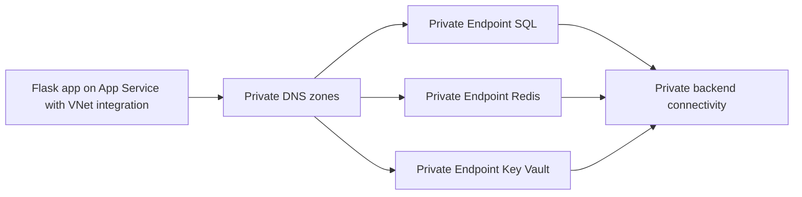

---
hide:
  - toc
content_sources:
  diagrams:
    - id: private-endpoints
      type: flowchart
      source: mslearn-adapted
      mslearn_url: https://learn.microsoft.com/en-us/azure/app-service/networking/private-endpoint
---

# Private Endpoints

Connect a Flask app on App Service to Azure SQL, Azure Cache for Redis, and Key Vault through private endpoints while keeping standard service hostnames.

<!-- diagram-id: private-endpoints -->


## Prerequisites

- App Service Plan tier that supports VNet integration
- Virtual network with integration subnet and private endpoint subnet
- Azure SQL, Redis, and Key Vault resources where private endpoint is allowed

## Main Content

### 1) Prepare subnet layout for app and private endpoints

Use separate subnets:

- `snet-appservice-integration` for App Service VNet integration
- `snet-private-endpoints` for private endpoint NICs

### 2) Enable VNet integration for the Flask app

```bash
az webapp vnet-integration add \
  --resource-group "$RG" \
  --name "$APP_NAME" \
  --vnet "$VNET_NAME" \
  --subnet "snet-appservice-integration" \
  --output json
```

### 3) Create private endpoint for Azure SQL

```bash
az network private-endpoint create \
  --resource-group "$RG" \
  --name "pe-sql-python" \
  --vnet-name "$VNET_NAME" \
  --subnet "snet-private-endpoints" \
  --private-connection-resource-id "/subscriptions/<subscription-id>/resourceGroups/<sql-rg>/providers/Microsoft.Sql/servers/<sql-server>" \
  --group-id sqlServer \
  --connection-name "pe-sql-python-conn" \
  --output json
```

### 4) Create private endpoint for Redis and Key Vault

```bash
az network private-endpoint create \
  --resource-group "$RG" \
  --name "pe-redis-python" \
  --vnet-name "$VNET_NAME" \
  --subnet "snet-private-endpoints" \
  --private-connection-resource-id "/subscriptions/<subscription-id>/resourceGroups/<redis-rg>/providers/Microsoft.Cache/Redis/<redis-name>" \
  --group-id redisCache \
  --connection-name "pe-redis-python-conn" \
  --output json

az network private-endpoint create \
  --resource-group "$RG" \
  --name "pe-kv-python" \
  --vnet-name "$VNET_NAME" \
  --subnet "snet-private-endpoints" \
  --private-connection-resource-id "/subscriptions/<subscription-id>/resourceGroups/<kv-rg>/providers/Microsoft.KeyVault/vaults/<kv-name>" \
  --group-id vault \
  --connection-name "pe-kv-python-conn" \
  --output json
```

### 5) Configure app settings as Flask environment variables

```bash
az webapp config appsettings set \
  --resource-group "$RG" \
  --name "$APP_NAME" \
  --settings \
    SQL_SERVER_FQDN="<sql-server>.database.windows.net" \
    SQL_DATABASE_NAME="<db-name>" \
    REDIS_HOST="<redis-name>.redis.cache.windows.net" \
    REDIS_PORT="6380" \
    KEY_VAULT_URI="https://<kv-name>.vault.azure.net/" \
  --output json
```

### 6) Use managed identity and `DefaultAzureCredential` in Flask code

```python
import os
import pyodbc
import redis
from azure.identity import DefaultAzureCredential

credential = DefaultAzureCredential()

sql_token = credential.get_token("https://database.windows.net/.default").token
token_bytes = sql_token.encode("utf-16-le")

conn_string = (
    "Driver={ODBC Driver 18 for SQL Server};"
    f"Server=tcp:{os.environ['SQL_SERVER_FQDN']},1433;"
    f"Database={os.environ['SQL_DATABASE_NAME']};"
    "Encrypt=yes;TrustServerCertificate=no;"
)

sql_conn = pyodbc.connect(conn_string, attrs_before={1256: token_bytes})

redis_client = redis.Redis(
    host=os.environ["REDIS_HOST"],
    port=int(os.environ["REDIS_PORT"]),
    ssl=True,
)
```

### 7) Validate private DNS zone links

Confirm the VNet is linked to these private DNS zones:

- `privatelink.database.windows.net`
- `privatelink.redis.cache.windows.net`
- `privatelink.vaultcore.azure.net`

### 8) Add CI validation for private endpoint readiness

```yaml
- name: Validate private endpoint status
  run: |
    az network private-endpoint list \
      --resource-group "$RG" \
      --output table
```

!!! warning "Private endpoint without DNS is incomplete"
    Most connectivity failures come from DNS mismatch, not Flask application code.
    Validate private zone links and effective DNS resolution from app runtime.

## Verification

1. Confirm VNet integration is listed for the app.
2. Confirm private endpoints are approved.
3. Confirm backend hostnames resolve to private IP addresses from app runtime.

```bash
az webapp vnet-integration list \
  --resource-group "$RG" \
  --name "$APP_NAME" \
  --output table
```

## Troubleshooting

### SQL or Redis connection timeout

- Review NSG rules and user-defined routes on integration subnet.
- Confirm private endpoint status is `Approved`.
- Confirm backend firewall allows private endpoint traffic.

### Hostname resolves to public IP

- Check private DNS zone links to the integration VNet.
- Verify no custom DNS server is overriding private zone resolution.

### Managed identity auth failure

- Verify system-assigned identity is enabled on the web app.
- Confirm SQL permissions for managed identity principal and Key Vault access policy or RBAC.

## See Also

- [Azure SQL](azure-sql.md)
- [Redis Cache](redis.md)
- [VNet Integration](vnet-integration.md)
- [Platform: Networking](../../../platform/networking.md)

## Sources

- [Use private endpoints for Azure App Service apps](https://learn.microsoft.com/en-us/azure/app-service/networking/private-endpoint)
- [Integrate your app with an Azure virtual network](https://learn.microsoft.com/en-us/azure/app-service/configure-vnet-integration-enable)
- [Tutorial: Connect to Azure SQL Database from Python on App Service without secrets using a managed identity](https://learn.microsoft.com/en-us/azure/app-service/tutorial-connect-msi-azure-database)
