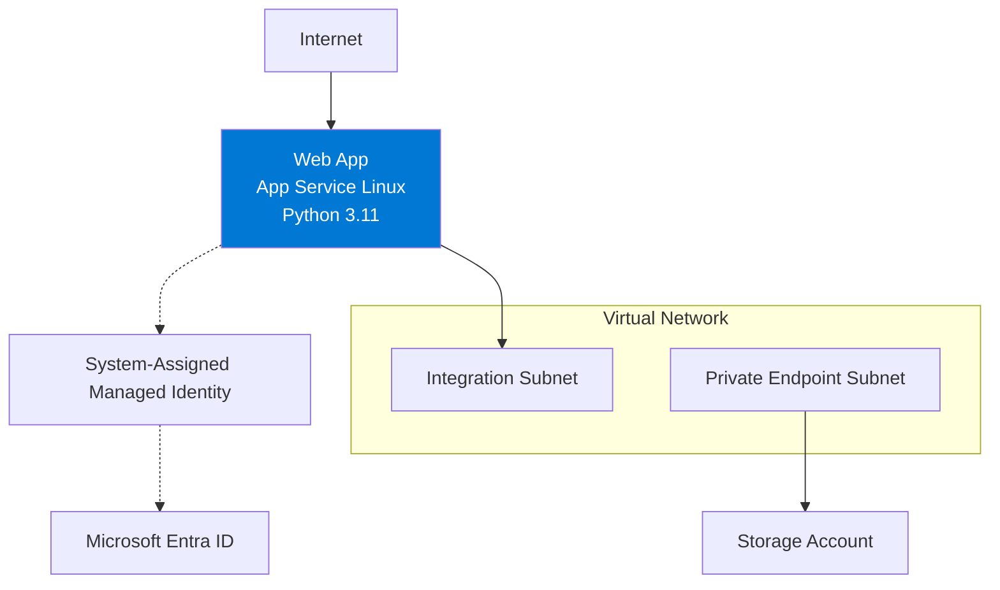

---
content_sources:
  diagrams:
    - id: private-network-deploy
      type: flowchart
      source: self-generated
      justification: "Synthesizes the original first-deploy advanced flow using Microsoft Learn guidance for App Service VNet integration, private endpoints, and managed identity."
      based_on:
        - https://learn.microsoft.com/en-us/azure/app-service/configure-vnet-integration-enable
        - https://learn.microsoft.com/en-us/azure/app-service/networking/private-endpoint
        - https://learn.microsoft.com/en-us/azure/app-service/overview-managed-identity
        - https://learn.microsoft.com/en-us/azure/app-service/quickstart-python
---

# Private Network Deployment

Use this recipe when the simple public `az webapp up` flow is no longer enough and your Flask app needs outbound private connectivity plus identity-based access to Azure services.

<!-- diagram-id: private-network-deploy -->


## Prerequisites

- Completed [01 - Local Run](../tutorial/01-local-run.md)
- Existing Azure subscription and Azure CLI authentication
- App Service app already created or ready to create in a supported tier for VNet integration
- Permissions to create VNets, subnets, private endpoints, storage accounts, and managed identity assignments

## Main Content

### Step 1: Prepare deployment variables

```bash
RG="rg-flask-tutorial"
LOCATION="koreacentral"
APP_NAME="app-flask-tutorial-abc123"
VNET_NAME="vnet-flask-tutorial"
INTEGRATION_SUBNET_NAME="snet-appsvc-integration"
PE_SUBNET_NAME="snet-private-endpoints"
STORAGE_NAME="stflasktutorialabc123"
```

| Command/Parameter | Purpose |
|-------------------|---------|
| `RG="rg-flask-tutorial"` | Defines the resource group that holds the App Service and networking resources. |
| `LOCATION="koreacentral"` | Sets the Azure region for the VNet and storage resources. |
| `APP_NAME="app-flask-tutorial-abc123"` | Identifies the target App Service app. |
| `VNET_NAME="vnet-flask-tutorial"` | Names the virtual network used for private connectivity. |
| `INTEGRATION_SUBNET_NAME="snet-appsvc-integration"` | Names the subnet delegated to App Service VNet integration. |
| `PE_SUBNET_NAME="snet-private-endpoints"` | Names the subnet reserved for private endpoints. |
| `STORAGE_NAME="stflasktutorialabc123"` | Sets a globally unique storage account name for the example backend. |

### Step 2: Create the VNet and delegated integration subnet

```bash
az network vnet create --resource-group $RG --name $VNET_NAME --location $LOCATION --address-prefixes 10.0.0.0/16
az network vnet subnet create --resource-group $RG --vnet-name $VNET_NAME --name $INTEGRATION_SUBNET_NAME --address-prefixes 10.0.1.0/24 --delegations Microsoft.Web/serverFarms
```

| Command/Parameter | Purpose |
|-------------------|---------|
| `az network vnet create` | Creates the virtual network that will host the deployment subnets. |
| `--resource-group $RG` | Places the VNet in the selected resource group. |
| `--name $VNET_NAME` | Sets the VNet name. |
| `--location $LOCATION` | Creates the VNet in the selected Azure region. |
| `--address-prefixes 10.0.0.0/16` | Defines the overall CIDR range for the VNet. |
| `az network vnet subnet create` | Creates a subnet inside the VNet. |
| `--vnet-name $VNET_NAME` | Targets the subnet creation to the named VNet. |
| `--name $INTEGRATION_SUBNET_NAME` | Names the delegated integration subnet. |
| `--address-prefixes 10.0.1.0/24` | Defines the CIDR range for the integration subnet. |
| `--delegations Microsoft.Web/serverFarms` | Delegates the subnet to App Service so VNet integration can use it. |

### Step 3: Create the private endpoint subnet

```bash
az network vnet subnet create --resource-group $RG --vnet-name $VNET_NAME --name $PE_SUBNET_NAME --address-prefixes 10.0.2.0/24 --disable-private-endpoint-network-policies true
```

| Command/Parameter | Purpose |
|-------------------|---------|
| `az network vnet subnet create` | Creates the subnet that will host private endpoints. |
| `--resource-group $RG` | Uses the same resource group as the VNet. |
| `--vnet-name $VNET_NAME` | Creates the subnet inside the named VNet. |
| `--name $PE_SUBNET_NAME` | Names the private endpoint subnet. |
| `--address-prefixes 10.0.2.0/24` | Defines the CIDR range for the private endpoint subnet. |
| `--disable-private-endpoint-network-policies true` | Disables subnet policies that would block private endpoint NICs. |

### Step 4: Integrate the web app with the VNet

```bash
az webapp vnet-integration add --resource-group $RG --name $APP_NAME --vnet $VNET_NAME --subnet $INTEGRATION_SUBNET_NAME
```

| Command/Parameter | Purpose |
|-------------------|---------|
| `az webapp vnet-integration add` | Connects the web app to a delegated subnet for outbound private access. |
| `--resource-group $RG` | Selects the resource group containing the app. |
| `--name $APP_NAME` | Selects the target App Service app. |
| `--vnet $VNET_NAME` | Chooses the virtual network used for integration. |
| `--subnet $INTEGRATION_SUBNET_NAME` | Chooses the delegated integration subnet. |

### Step 5: Assign managed identity to the web app

```bash
az webapp identity assign --resource-group $RG --name $APP_NAME
```

| Command/Parameter | Purpose |
|-------------------|---------|
| `az webapp identity assign` | Enables a system-assigned managed identity on the web app. |
| `--resource-group $RG` | Selects the resource group containing the app. |
| `--name $APP_NAME` | Targets the specific App Service instance. |

### Step 6: Create a private endpoint for Storage

```bash
az storage account create --resource-group $RG --name $STORAGE_NAME --location $LOCATION --sku Standard_LRS --kind StorageV2
STORAGE_ID="$(az storage account show --resource-group $RG --name $STORAGE_NAME --query id --output tsv)"
az network private-endpoint create --resource-group $RG --name pe-storage-blob --vnet-name $VNET_NAME --subnet $PE_SUBNET_NAME --private-connection-resource-id $STORAGE_ID --group-id blob --connection-name pe-storage-blob-connection
```

| Command/Parameter | Purpose |
|-------------------|---------|
| `az storage account create` | Creates the storage account used in the private endpoint example. |
| `--resource-group $RG` | Places the storage account in the selected resource group. |
| `--name $STORAGE_NAME` | Sets the storage account name. |
| `--location $LOCATION` | Creates the storage account in the selected region. |
| `--sku Standard_LRS` | Uses standard locally redundant storage. |
| `--kind StorageV2` | Creates a general-purpose v2 storage account. |
| `STORAGE_ID="$(...)"` | Stores the storage account resource ID in a shell variable. |
| `az storage account show` | Retrieves the existing storage account metadata. |
| `--query id` | Returns only the `id` field from the command output. |
| `--output tsv` | Formats the ID as plain text for shell assignment. |
| `az network private-endpoint create` | Creates a private endpoint for the storage account. |
| `--name pe-storage-blob` | Names the private endpoint resource. |
| `--vnet-name $VNET_NAME` | Places the private endpoint in the selected VNet. |
| `--subnet $PE_SUBNET_NAME` | Uses the subnet reserved for private endpoints. |
| `--private-connection-resource-id $STORAGE_ID` | Points the private endpoint at the storage account resource. |
| `--group-id blob` | Connects the endpoint to the Blob service subresource. |
| `--connection-name pe-storage-blob-connection` | Names the private link connection object. |

## Verification

```bash
az webapp vnet-integration list --resource-group $RG --name $APP_NAME --output table
az webapp identity show --resource-group $RG --name $APP_NAME --output json
az network private-endpoint list --resource-group $RG --output table
```

| Command/Parameter | Purpose |
|-------------------|---------|
| `az webapp vnet-integration list` | Lists the current VNet integration attached to the web app. |
| `--resource-group $RG` | Selects the app resource group. |
| `--name $APP_NAME` | Targets the web app being validated. |
| `--output table` | Formats the VNet integration results for quick inspection. |
| `az webapp identity show` | Displays the managed identity configuration for the app. |
| `--output json` | Returns the identity details as JSON. |
| `az network private-endpoint list` | Lists private endpoints in the resource group. |

## Troubleshooting

- If VNet integration fails, confirm the integration subnet is delegated to `Microsoft.Web/serverFarms`.
- If private endpoint creation fails, confirm the private endpoint subnet has network policies disabled.
- If managed identity authentication fails, confirm the identity is enabled and RBAC or access policies are configured on the target service.

## See Also

- [VNet Integration](./vnet-integration.md)
- [Private Endpoints](./private-endpoints.md)
- [Managed Identity](./managed-identity.md)
- [02 - First Deployment to Azure App Service](../tutorial/02-first-deploy.md)

## Sources

- [Integrate your app with an Azure virtual network (Microsoft Learn)](https://learn.microsoft.com/en-us/azure/app-service/configure-vnet-integration-enable)
- [Use private endpoints for Azure App Service apps (Microsoft Learn)](https://learn.microsoft.com/en-us/azure/app-service/networking/private-endpoint)
- [Use managed identities for App Service (Microsoft Learn)](https://learn.microsoft.com/en-us/azure/app-service/overview-managed-identity)
- [Quickstart: Deploy a Python web app (Microsoft Learn)](https://learn.microsoft.com/en-us/azure/app-service/quickstart-python)
