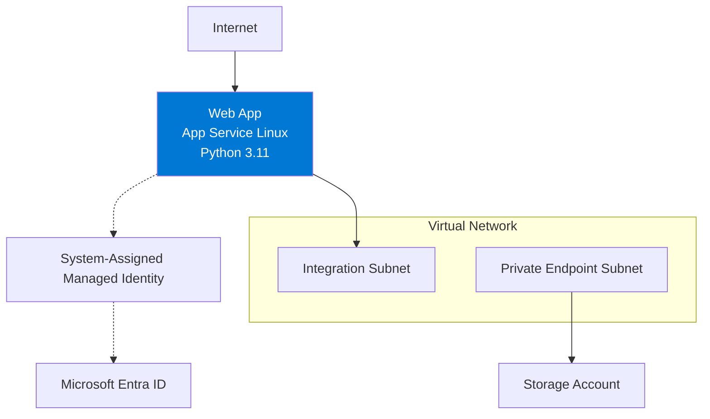

---
hide:
  - toc
content_sources:
  diagrams:
    - id: private-network-deploy
      type: flowchart
      source: self-generated
      justification: "Synthesizes the original first-deploy advanced flow using Microsoft Learn guidance for App Service VNet integration, private endpoints, and managed identity."
      based_on:
        - https://learn.microsoft.com/en-us/azure/app-service/configure-vnet-integration-enable
        - https://learn.microsoft.com/en-us/azure/app-service/networking/private-endpoint
        - https://learn.microsoft.com/en-us/azure/app-service/overview-managed-identity
        - https://learn.microsoft.com/en-us/azure/app-service/quickstart-python
---

# Private Network Deployment

Use this recipe when the simple public `az webapp up` flow is no longer enough and your Flask app needs outbound private connectivity plus identity-based access to Azure services.

<!-- diagram-id: private-network-deploy -->


## Prerequisites

- Completed [01 - Local Run](../01-local-run.md)
- Existing Azure subscription and Azure CLI authentication
- App Service app already created or ready to create in a supported tier for VNet integration
- Permissions to create VNets, subnets, private endpoints, storage accounts, and managed identity assignments

## Main Content

### Step 1: Prepare deployment variables

```bash
RG="rg-flask-tutorial"
LOCATION="koreacentral"
APP_NAME="app-flask-tutorial-abc123"
VNET_NAME="vnet-flask-tutorial"
INTEGRATION_SUBNET_NAME="snet-appsvc-integration"
PE_SUBNET_NAME="snet-private-endpoints"
STORAGE_NAME="stflasktutorialabc123"
```

| Command | Purpose |
|---------|---------|
| `RG="rg-flask-tutorial"` | Defines the resource group name for the advanced deployment. |
| `LOCATION="koreacentral"` | Sets the Azure region for the network resources. |
| `APP_NAME="app-flask-tutorial-abc123"` | Identifies the target web app. |
| `VNET_NAME="vnet-flask-tutorial"` | Names the virtual network used by the app and private endpoints. |
| `INTEGRATION_SUBNET_NAME="snet-appsvc-integration"` | Names the subnet delegated to App Service VNet integration. |
| `PE_SUBNET_NAME="snet-private-endpoints"` | Names the subnet reserved for private endpoints. |
| `STORAGE_NAME="stflasktutorialabc123"` | Sets the storage account name used in the private endpoint example. |

### Step 2: Create the VNet and delegated integration subnet

```bash
az network vnet create --resource-group $RG --name $VNET_NAME --location $LOCATION --address-prefixes 10.0.0.0/16
az network vnet subnet create --resource-group $RG --vnet-name $VNET_NAME --name $INTEGRATION_SUBNET_NAME --address-prefixes 10.0.1.0/24 --delegations Microsoft.Web/serverFarms
```

| Command | Purpose |
|---------|---------|
| `az network vnet create --resource-group $RG --name $VNET_NAME --location $LOCATION --address-prefixes 10.0.0.0/16` | Creates the virtual network used by the app environment. |
| `--address-prefixes 10.0.0.0/16` | Reserves the VNet address space. |
| `az network vnet subnet create --resource-group $RG --vnet-name $VNET_NAME --name $INTEGRATION_SUBNET_NAME --address-prefixes 10.0.1.0/24 --delegations Microsoft.Web/serverFarms` | Creates the delegated subnet required for App Service VNet integration. |
| `--vnet-name $VNET_NAME` | Targets the new subnet at the selected VNet. |
| `--name $INTEGRATION_SUBNET_NAME` | Names the integration subnet. |
| `--delegations Microsoft.Web/serverFarms` | Delegates the subnet to App Service. |

### Step 3: Create the private endpoint subnet

```bash
az network vnet subnet create --resource-group $RG --vnet-name $VNET_NAME --name $PE_SUBNET_NAME --address-prefixes 10.0.2.0/24 --disable-private-endpoint-network-policies true
```

| Command | Purpose |
|---------|---------|
| `az network vnet subnet create --resource-group $RG --vnet-name $VNET_NAME --name $PE_SUBNET_NAME --address-prefixes 10.0.2.0/24 --disable-private-endpoint-network-policies true` | Creates a dedicated subnet for private endpoint NICs. |
| `--name $PE_SUBNET_NAME` | Names the private endpoint subnet. |
| `--address-prefixes 10.0.2.0/24` | Allocates the private endpoint subnet range. |
| `--disable-private-endpoint-network-policies true` | Disables subnet policies that block private endpoint creation. |

### Step 4: Integrate the web app with the VNet

```bash
az webapp vnet-integration add --resource-group $RG --name $APP_NAME --vnet $VNET_NAME --subnet $INTEGRATION_SUBNET_NAME
```

| Command | Purpose |
|---------|---------|
| `az webapp vnet-integration add --resource-group $RG --name $APP_NAME --vnet $VNET_NAME --subnet $INTEGRATION_SUBNET_NAME` | Connects the web app to the delegated subnet for outbound private network access. |
| `--name $APP_NAME` | Selects the target App Service app. |
| `--vnet $VNET_NAME` | Chooses the virtual network for integration. |
| `--subnet $INTEGRATION_SUBNET_NAME` | Chooses the delegated integration subnet. |

### Step 5: Assign managed identity to the web app

```bash
az webapp identity assign --resource-group $RG --name $APP_NAME
```

| Command | Purpose |
|---------|---------|
| `az webapp identity assign --resource-group $RG --name $APP_NAME` | Enables a system-assigned managed identity for the web app. |
| `--name $APP_NAME` | Targets the specific App Service instance. |

### Step 6: Create a private endpoint for Storage

```bash
az storage account create --resource-group $RG --name $STORAGE_NAME --location $LOCATION --sku Standard_LRS --kind StorageV2
STORAGE_ID="$(az storage account show --resource-group $RG --name $STORAGE_NAME --query id --output tsv)"
az network private-endpoint create --resource-group $RG --name pe-storage-blob --vnet-name $VNET_NAME --subnet $PE_SUBNET_NAME --private-connection-resource-id $STORAGE_ID --group-id blob --connection-name pe-storage-blob-connection
```

| Command | Purpose |
|---------|---------|
| `az storage account create --resource-group $RG --name $STORAGE_NAME --location $LOCATION --sku Standard_LRS --kind StorageV2` | Creates the storage account used for the private endpoint example. |
| `--sku Standard_LRS` | Uses standard locally redundant storage. |
| `--kind StorageV2` | Creates a general-purpose v2 storage account. |
| `STORAGE_ID="$(az storage account show --resource-group $RG --name $STORAGE_NAME --query id --output tsv)"` | Captures the storage account resource ID for the private endpoint command. |
| `az storage account show --resource-group $RG --name $STORAGE_NAME --query id --output tsv` | Returns only the storage account resource ID. |
| `az network private-endpoint create --resource-group $RG --name pe-storage-blob --vnet-name $VNET_NAME --subnet $PE_SUBNET_NAME --private-connection-resource-id $STORAGE_ID --group-id blob --connection-name pe-storage-blob-connection` | Creates a private endpoint for the Blob service. |
| `--vnet-name $VNET_NAME` | Places the private endpoint inside the selected VNet. |
| `--subnet $PE_SUBNET_NAME` | Uses the subnet reserved for private endpoints. |
| `--private-connection-resource-id $STORAGE_ID` | Points the private endpoint at the target storage account. |
| `--group-id blob` | Connects to the Blob subresource. |
| `--connection-name pe-storage-blob-connection` | Names the private link connection object. |

## Verification

```bash
az webapp vnet-integration list --resource-group $RG --name $APP_NAME --output table
az webapp identity show --resource-group $RG --name $APP_NAME --output json
az network private-endpoint list --resource-group $RG --output table
```

| Command | Purpose |
|---------|---------|
| `az webapp vnet-integration list --resource-group $RG --name $APP_NAME --output table` | Confirms the web app is integrated with the expected subnet. |
| `az webapp identity show --resource-group $RG --name $APP_NAME --output json` | Confirms the system-assigned managed identity is enabled. |
| `az network private-endpoint list --resource-group $RG --output table` | Lists private endpoints created in the resource group. |

## Troubleshooting

- If VNet integration fails, confirm the integration subnet is delegated to `Microsoft.Web/serverFarms`.
- If private endpoint creation fails, confirm the private endpoint subnet has network policies disabled.
- If managed identity authentication fails, confirm the identity is enabled and RBAC or access policies are configured on the target service.

## See Also

- [VNet Integration](./vnet-integration.md)
- [Private Endpoints](./private-endpoints.md)
- [Managed Identity](./managed-identity.md)
- [02 - First Deployment to Azure App Service](../02-first-deploy.md)

## Sources

- [Integrate your app with an Azure virtual network (Microsoft Learn)](https://learn.microsoft.com/en-us/azure/app-service/configure-vnet-integration-enable)
- [Use private endpoints for Azure App Service apps (Microsoft Learn)](https://learn.microsoft.com/en-us/azure/app-service/networking/private-endpoint)
- [Use managed identities for App Service (Microsoft Learn)](https://learn.microsoft.com/en-us/azure/app-service/overview-managed-identity)
- [Quickstart: Deploy a Python web app (Microsoft Learn)](https://learn.microsoft.com/en-us/azure/app-service/quickstart-python)
