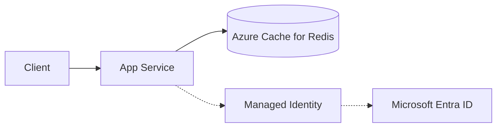

---
hide:
  - toc
content_sources:
  diagrams:
    - id: architecture
      type: flowchart
      source: mslearn-adapted
      mslearn_url: https://learn.microsoft.com/en-us/azure/azure-cache-for-redis/cache-python-get-started
---

# Redis Cache with redis-py

Use Azure Cache for Redis from Flask with secure configuration and optional Microsoft Entra authentication.

## Architecture

<!-- diagram-id: architecture -->


Solid arrows show runtime data flow. Dashed arrows show identity and authentication.

## Prerequisites

- Azure Cache for Redis instance
- App Service application settings for host/port/auth mode
- Python dependency: `redis`

## Step-by-Step Guide

### Step 1: Configure Redis settings in App Service

```bash
az webapp config appsettings set \
  --resource-group "$RG" \
  --name "$APP_NAME" \
  --settings \
    REDIS_HOST="<redis-name>.redis.cache.windows.net" \
    REDIS_PORT="6380" \
    REDIS_SSL="true" \
    REDIS_ACCESS_KEY="@Microsoft.KeyVault(VaultName=<vault-name>;SecretName=redis-access-key)"
```

### Step 2: Add cache helpers in Flask

```python
import json
import os
import redis
from flask import Flask, jsonify

app = Flask(__name__)


def get_redis_client() -> redis.Redis:
    return redis.Redis(
        host=os.environ["REDIS_HOST"],
        port=int(os.environ.get("REDIS_PORT", "6380")),
        password=os.environ.get("REDIS_ACCESS_KEY"),
        ssl=os.environ.get("REDIS_SSL", "true").lower() == "true",
        decode_responses=True,
        socket_timeout=2,
    )


@app.get("/api/cache/demo")
def cache_demo():
    client = get_redis_client()
    key = "demo:counter"
    counter = client.incr(key)
    client.expire(key, 300)
    return jsonify({"key": key, "value": counter, "ttl_seconds": 300})


@app.get("/api/cache/profile/<user_id>")
def read_profile(user_id: str):
    client = get_redis_client()
    cache_key = f"profile:{user_id}"
    cached = client.get(cache_key)
    if cached:
        return jsonify({"source": "cache", "profile": json.loads(cached)})

    # Replace with DB fetch
    profile = {"id": user_id, "name": "sample-user"}
    client.setex(cache_key, 120, json.dumps(profile))
    return jsonify({"source": "origin", "profile": profile})
```

## Complete Example

```text
# requirements.txt
Flask==3.0.3
redis==5.0.7
```

```python
# Health probe endpoint that includes Redis check
@app.get("/health/cache")
def cache_health():
    client = get_redis_client()
    pong = client.ping()
    return jsonify({"redis": "ok" if pong else "down"}), 200 if pong else 503
```

## Troubleshooting

- `Timeout connecting to server`:
    - Verify firewall/network path, VNet integration, and TLS port (`6380`).- `NOAUTH Authentication required`:
    - Check key rotation and App Service setting value source.- Cache misses too high:
    - Review TTL, key design, and serialization consistency.
## Advanced Topics

- Use Redis as session backend for cross-instance session sharing.
- Use cache-aside with per-key jittered TTL to reduce stampede effects.
- Consider premium tier with zone redundancy for higher resilience.

## See Also
- [Key Vault References](./key-vault-reference.md)
- [Managed Identity](./managed-identity.md)
- [Deployment Slots](../../../operations/deployment-slots.md)

## Sources
- [Azure Cache for Redis documentation (Microsoft Learn)](https://learn.microsoft.com/en-us/azure/azure-cache-for-redis/)
- [Quickstart: Use Azure Cache for Redis in Python (Microsoft Learn)](https://learn.microsoft.com/en-us/azure/azure-cache-for-redis/cache-python-get-started)
