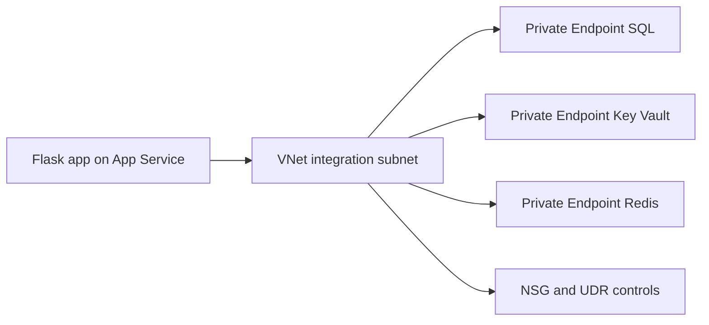

---
hide:
  - toc
content_sources:
  diagrams:
    - id: vnet-integration
      type: flowchart
      source: mslearn-adapted
      mslearn_url: https://learn.microsoft.com/en-us/azure/app-service/overview-vnet-integration
---

# VNet Integration

Enable VNet integration for a Flask app so outbound traffic to SQL, Redis, and Key Vault flows through private network paths.

<!-- diagram-id: vnet-integration -->


## Prerequisites

- App Service Plan tier that supports VNet integration
- Existing virtual network with empty delegated subnet for App Service
- Permissions to configure VNet, subnet, NSG, and private endpoints

## Main Content

### 1) Create delegated subnet for App Service integration

```bash
az network vnet subnet create \
  --resource-group "$RG" \
  --vnet-name "vnet-appservice" \
  --name "snet-appservice-integration" \
  --address-prefixes "10.10.1.0/24" \
  --delegations "Microsoft.Web/serverFarms" \
  --output json
```

### 2) Connect web app to the integration subnet

```bash
az webapp vnet-integration add \
  --resource-group "$RG" \
  --name "$APP_NAME" \
  --vnet "vnet-appservice" \
  --subnet "snet-appservice-integration" \
  --output json
```

### 3) Route all outbound traffic through VNet (optional)

```bash
az webapp config appsettings set \
  --resource-group "$RG" \
  --name "$APP_NAME" \
  --settings WEBSITE_VNET_ROUTE_ALL=1 \
  --output json
```

### 4) Apply NSG baseline for least-privilege egress

Allow required backend ports (for example 1433, 6380, and 443), deny broad outbound, and enable flow logs for troubleshooting.

### 5) Configure private endpoints and private DNS zones

Create private endpoints for SQL, Key Vault, and Redis in a dedicated subnet, then link private DNS zones to the VNet.

Expected zones:

- `privatelink.database.windows.net`
- `privatelink.vaultcore.azure.net`
- `privatelink.redis.cache.windows.net`

### 6) Set Flask environment-based config on App Service

```bash
az webapp config appsettings set \
  --resource-group "$RG" \
  --name "$APP_NAME" \
  --settings \
    SQL_SERVER_FQDN="<sql-private-fqdn>" \
    SQL_DATABASE_NAME="<db-name>" \
    REDIS_HOST="<redis-private-fqdn>" \
    REDIS_PORT="6380" \
    KEY_VAULT_URI="https://<kv-name>.vault.azure.net/" \
  --output json
```

### 7) Use `os.environ` plus managed identity in Flask code

```python
import os
import pyodbc
from azure.identity import DefaultAzureCredential

credential = DefaultAzureCredential()
token = credential.get_token("https://database.windows.net/.default").token
token_bytes = token.encode("utf-16-le")

connection = pyodbc.connect(
    "Driver={ODBC Driver 18 for SQL Server};"
    f"Server=tcp:{os.environ['SQL_SERVER_FQDN']},1433;"
    f"Database={os.environ['SQL_DATABASE_NAME']};"
    "Encrypt=yes;TrustServerCertificate=no;",
    attrs_before={1256: token_bytes},
)
```

### 8) Validate DNS and endpoint state in CI

```yaml
- name: Validate VNet integration and private endpoints
  run: |
    az webapp vnet-integration list \
      --resource-group "$RG" \
      --name "$APP_NAME" \
      --output table
    az network private-endpoint list \
      --resource-group "$RG" \
      --output table
```

!!! note "Inbound versus outbound"
    VNet integration controls outbound from App Service to private dependencies.
    It does not place your app inbound endpoint directly inside the VNet.

## Verification

- `az webapp vnet-integration list` shows expected VNet/subnet mapping.
- SQL, Key Vault, and Redis hostnames resolve to private IP addresses.
- Flask app reaches private backends without public network access.

## Troubleshooting

### App cannot reach private backend

- Validate NSG and route table configuration for integration subnet.
- Confirm private endpoints are approved and healthy.
- Verify backend firewall and private access policy configuration.

### DNS still resolves public addresses

- Check private DNS zone links to VNet.
- Validate custom DNS forwarders if you use enterprise DNS.

### Connectivity broke after route-all

- Verify required Azure destinations remain reachable via your egress path.
- Re-test with route-all disabled to isolate routing policy impact.

## See Also

- [Key Vault References](key-vault-reference.md)
- [Azure SQL](azure-sql.md)
- [Private Endpoints](private-endpoints.md)
- [Operations: Networking](../../../operations/networking.md)

## Sources

- [Integrate your app with an Azure virtual network](https://learn.microsoft.com/en-us/azure/app-service/configure-vnet-integration-enable)
- [Use private endpoints for Azure App Service apps](https://learn.microsoft.com/en-us/azure/app-service/networking/private-endpoint)
- [Tutorial: Connect to Azure SQL Database from Python on App Service without secrets using a managed identity](https://learn.microsoft.com/en-us/azure/app-service/tutorial-connect-msi-azure-database)
