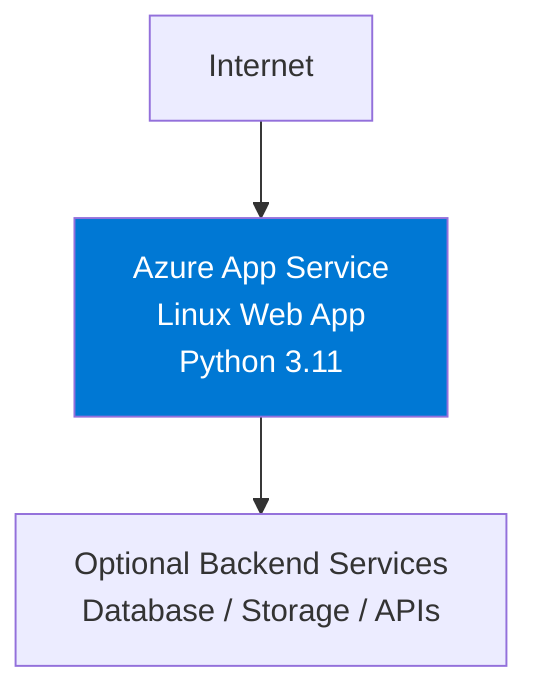

---
content_sources:
  diagrams:
    - id: 02-first-deployment-to-azure-app-service
      type: flowchart
      source: mslearn-adapted
      mslearn_url: https://learn.microsoft.com/en-us/azure/app-service/quickstart-python
---
# 02 - First Deployment to Azure App Service

This chapter deploys the Flask app from [01 - Local Run](./01-local-run.md) to Azure App Service in a few minutes using `az webapp up`. It uses public access and a Basic B1 plan so you can focus on the fastest first deployment path.

!!! info "Deployment Scope"
    **Service**: App Service (Linux, Python 3.11) | **Access**: Public internet | **Tier**: Basic B1

    This walkthrough intentionally skips VNet integration, private endpoints, and managed identity. For that production-style pattern, use [Private Network Deployment Recipe](../recipes/private-network-deploy.md).

<!-- diagram-id: 02-first-deployment-to-azure-app-service -->


## Prerequisites

- Completed [01 - Local Run](./01-local-run.md)
- Azure CLI authenticated with `az login`
- Flask app source available in your current working directory

## Main Content

### Step 1: Set deployment variables

```bash
RG="rg-flask-tutorial"
APP_NAME="app-flask-tutorial-abc123"
LOCATION="koreacentral"
```

| Command/Parameter | Purpose |
|-------------------|---------|
| `RG="rg-flask-tutorial"` | Defines the resource group name that will contain the deployment. |
| `APP_NAME="app-flask-tutorial-abc123"` | Sets the globally unique web app name. |
| `LOCATION="koreacentral"` | Chooses the Azure region for the deployment. |

### Step 2: Deploy with `az webapp up`

```bash
az webapp up --name $APP_NAME --resource-group $RG --location $LOCATION --runtime "PYTHON:3.11" --sku B1
```

| Command/Parameter | Purpose |
|-------------------|---------|
| `az webapp up --name $APP_NAME --resource-group $RG --location $LOCATION --runtime "PYTHON:3.11" --sku B1` | Creates the resource group, App Service plan, and web app if needed, then uploads and deploys the current app source. |
| `--name $APP_NAME` | Uses the specified globally unique web app name. |
| `--resource-group $RG` | Creates or reuses the target resource group. |
| `--location $LOCATION` | Places the deployment in the selected Azure region. |
| `--runtime "PYTHON:3.11"` | Selects the Python 3.11 App Service runtime. |
| `--sku B1` | Uses the Basic B1 pricing tier, which is compatible with a simple public deployment. |

???+ example "Expected output"
    ```text
    The webapp 'app-flask-tutorial-abc123' doesn't exist
    Creating Resource group 'rg-flask-tutorial' ...
    Creating AppServicePlan 'appsvc_linux_koreacentral' ...
    Creating webapp 'app-flask-tutorial-abc123' ...
    Configuring default logging for the app, if not already enabled
    Creating zip with contents of dir ...
    Deploying from zip file ...
    You can launch the app at http://app-flask-tutorial-abc123.azurewebsites.net
    ```

!!! warning "Build automation: quick-start vs production"
    `az webapp up` performs an Oryx/Kudu build on App Service during deployment (equivalent to `SCM_DO_BUILD_DURING_DEPLOYMENT=true`). That is fine for this quick-start and for local development, but production deployments should publish a pre-built artifact and set `SCM_DO_BUILD_DURING_DEPLOYMENT=false` for deterministic, reproducible releases. See [Best Practices: SCM_DO_BUILD vs pre-built artifacts](../../../best-practices/deployment.md#scm_do_build_during_deployment-vs-pre-built-artifacts).

### Step 3: Verify the deployment

```bash
WEB_APP_URL="https://$(az webapp show --resource-group $RG --name $APP_NAME --query defaultHostName --output tsv)"
curl $WEB_APP_URL/health
```

| Command/Parameter | Purpose |
|-------------------|---------|
| `WEB_APP_URL="https://$(az webapp show --resource-group $RG --name $APP_NAME --query defaultHostName --output tsv)"` | Builds the site URL from the web app hostname returned by Azure. |
| `az webapp show --resource-group $RG --name $APP_NAME --query defaultHostName --output tsv` | Returns only the default hostname for the deployed app. |
| `--resource-group $RG` | Queries the web app inside the tutorial resource group. |
| `--name $APP_NAME` | Selects the deployed web app whose hostname is needed. |
| `--query defaultHostName` | Extracts only the default hostname field from the response. |
| `--output tsv` | Formats the hostname as plain text for shell substitution. |
| `curl $WEB_APP_URL/health` | Calls the Flask health endpoint to confirm the app is responding. |

???+ example "Expected output"
    ```json
    {"status":"ok"}
    ```

### Step 4: View logs

!!! note "Enable application logging first"
    `az webapp log tail` is most useful after filesystem application logging is enabled.

> **Note:** `az webapp log tail` may not work reliably for Linux App Service. Use the Azure Portal Log stream or `/home/LogFiles` as alternatives.

```bash
az webapp log config --resource-group $RG --name $APP_NAME --application-logging filesystem --level information
az webapp log tail --resource-group $RG --name $APP_NAME
```

| Command/Parameter | Purpose |
|-------------------|---------|
| `az webapp log config --resource-group $RG --name $APP_NAME --application-logging filesystem --level information` | Enables filesystem application logging so the log stream contains app output. |
| `--resource-group $RG` | Targets the resource group that contains the web app. |
| `--name $APP_NAME` | Selects the web app to configure for logging. |
| `--application-logging filesystem` | Writes application logs to the App Service filesystem. |
| `--level information` | Captures informational, warning, and error log events. |
| `az webapp log tail --resource-group $RG --name $APP_NAME` | Streams live application and platform logs from the deployed web app. |
| `--resource-group $RG` | Reads logs from the tutorial resource group. |
| `--name $APP_NAME` | Streams logs for the deployed Flask app. |

### Step 5: Cleanup

```bash
az group delete --name $RG --yes --no-wait
```

| Command/Parameter | Purpose |
|-------------------|---------|
| `az group delete --name $RG --yes --no-wait` | Deletes the tutorial resource group and all resources created by `az webapp up`. |
| `--name $RG` | Targets the resource group used in this tutorial. |
| `--yes` | Skips the interactive confirmation prompt. |
| `--no-wait` | Starts deletion asynchronously so the terminal returns immediately. |

## Advanced Topics

When you are ready for private connectivity, move to a topology that adds VNet integration, private endpoints, and managed identity.

## Next Steps

- [03 - Configuration](./03-configuration.md)
- [Private Network Deployment Recipe](../recipes/private-network-deploy.md)

## Run It in the Portal

#### Portal view: Web App Overview blade - first-deploy verification surface

![Azure portal Overview blade for `app-test-20251107` (Web App) with a command bar (`Browse`, `Stop`, `Swap`, `Restart`, `Delete`, `Refresh`, `Download publish profile`, `Reset publish profile`, `Share to mobile`, `Send us your feedback`) and an Essentials panel showing Resource group `rg-test-20251107`, Status `Running`, Location `Korea Central`, Subscription `Visual Studio Enterprise Subscription`, Subscription ID `00000000-0000-0000-0000-000000000000`, Default domain `app-test-20251107.azurewebsites.net`, App Service Plan `asp-test-20251107 (P0v3: 1)`, Operating System `Linux`, and Health Check `Not Configured`. The Properties tab is selected (next to Monitoring, Logs, Capabilities, Notifications (1), Recommendations) and surfaces Web app (`Publishing model: Code`, `Runtime Stack: Python - 3.11`, `Runtime status: Healthy`), Domains (`2 Domains View all`), Hosting (`Plan Type: App Service plan`, `Instance Count: 1`, `SKU and size: Premium0V3 (P0v3)` with `Scale up` link), Deployment Center (`Last deployment: Successful on Thursday, November 6, 10:58:01 PM`, `Deployment provider: None`), Application Insights (`Name: ai-test-20251107`, `Region: Korea Central`), and Networking (`Inbound IP addresses: <ip-redacted>, <ipv6-redacted>`, `Private endpoint connections: 0 private endpoints`, `Virtual network integration: Not configured`). Left nav under the search box lists Overview (selected), Activity log, Access control (IAM), Tags, Diagnose and solve problems, Microsoft Defender for Cloud, Events (preview), Log stream, AI (preview), Resource visualizer, with collapsed groups Deployment, Settings, Performance, App Service plan, Development Tools, API, Monitoring, Automation, and Support + troubleshooting.](../../../assets/platform/architecture/01-app-service-overview.png)

After running `az webapp up` in this tutorial, the Overview blade is the first Portal verification surface. The Essentials panel confirms the app that `az webapp up` created or reused: `Status: Running`, `Operating System: Linux`, `Default domain`, and the attached `App Service Plan` are all visible on this blade. In the Properties tab, `Runtime Stack: Python - 3.11` and `Runtime status: Healthy` confirm that the Flask app is running on the expected Python worker. Use the `Default domain` value to open the deployed app in a browser, which is the Portal-side check that corresponds to the tutorial's `curl $WEB_APP_URL/health` verification step.

## See Also

- [Guide home](../../../index.md)
- [Section index](index.md)
- [Start here](../../../start-here/overview.md)

## Sources

- [Quickstart: Deploy a Python web app (Microsoft Learn)](https://learn.microsoft.com/en-us/azure/app-service/quickstart-python)
- [Enable diagnostic logging for apps in Azure App Service (Microsoft Learn)](https://learn.microsoft.com/en-us/azure/app-service/troubleshoot-diagnostic-logs)
