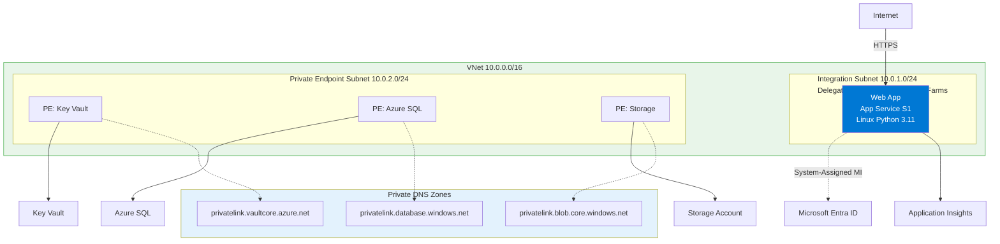
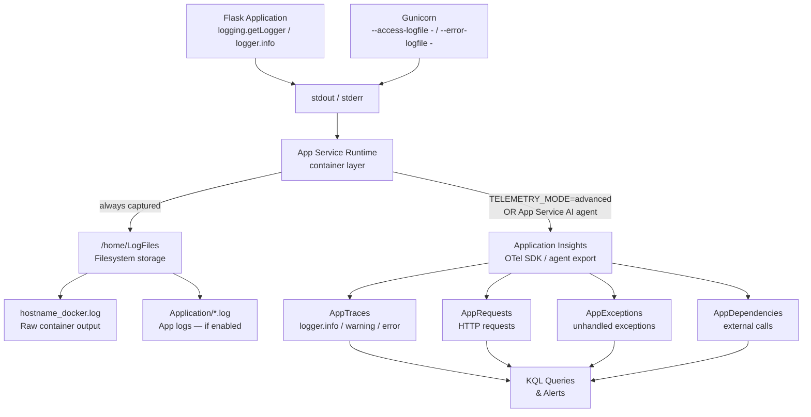
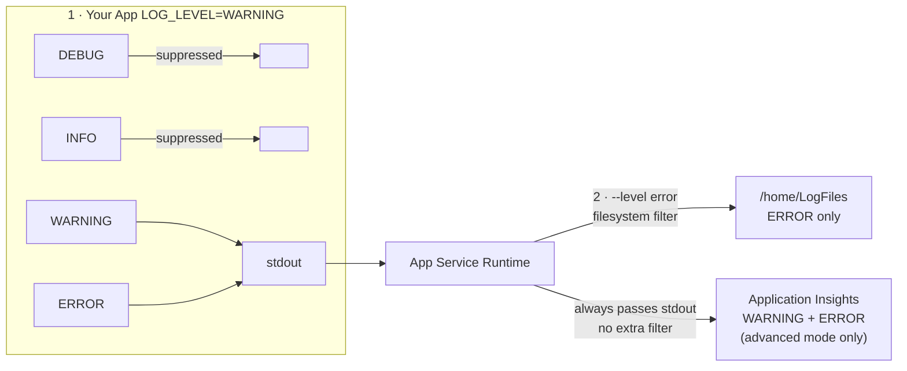
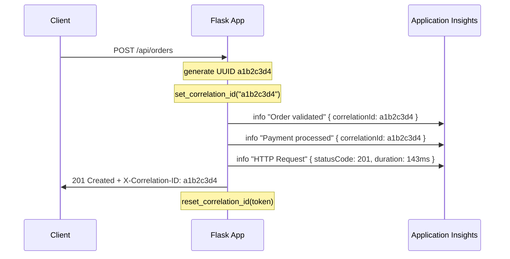
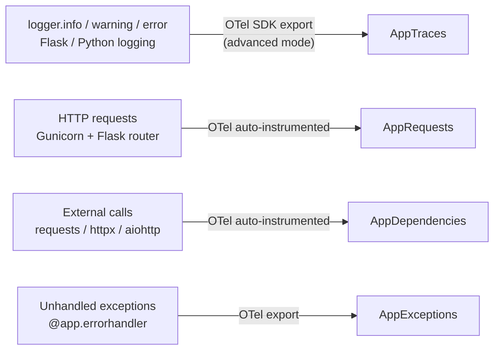

---
hide:
  - toc
content_sources:
  diagrams:
    - id: diagram-1
      type: flowchart
      source: mslearn-adapted
      mslearn_url: https://learn.microsoft.com/en-us/azure/app-service/troubleshoot-diagnostic-logs
    - id: how-logs-flow
      type: flowchart
      source: mslearn-adapted
      mslearn_url: https://learn.microsoft.com/en-us/azure/app-service/troubleshoot-diagnostic-logs
    - id: log-levels-filtering
      type: flowchart
      source: mslearn-adapted
      mslearn_url: https://learn.microsoft.com/en-us/azure/app-service/troubleshoot-diagnostic-logs
    - id: correlation-id-tracing-a-single-request
      type: flowchart
      source: mslearn-adapted
      mslearn_url: https://learn.microsoft.com/en-us/azure/app-service/troubleshoot-diagnostic-logs
    - id: what-gets-collected
      type: flowchart
      source: mslearn-adapted
      mslearn_url: https://learn.microsoft.com/en-us/azure/app-service/troubleshoot-diagnostic-logs
---

# 04. Logging & Monitoring

**Time estimate: 30 minutes**

Monitor your Flask application's health, track performance, and diagnose issues with Azure's integrated observability tools.

!!! info "Infrastructure Context"
    **Service**: App Service (Linux, Standard S1) | **Network**: VNet integrated | **VNet**: ✅

    This tutorial assumes a production-ready App Service deployment with VNet integration, private endpoints for backend services, and managed identity for authentication.

<!-- diagram-id: diagram-1 -->


## Prerequisites

- Application deployed and running on Azure ([02. Deploy Application](./02-first-deploy.md))
- Azure CLI logged in and source loaded: `source infra/.deploy-output.env`

## How Logs Flow

Understanding where your logs end up is the foundation of any debugging workflow.
Every `logger.info()` call or Gunicorn access log follows this path:

<!-- diagram-id: how-logs-flow -->


| Destination | Retention | Best For |
|---|---|---|
| `/home/LogFiles/*_docker.log` | ~35 MB rolling | Container crashes, startup errors |
| `/home/LogFiles/Application/` | Up to 100 MB / 7 days | Short-term log archive |
| Application Insights `AppTraces` | 90 days default | Long-term analysis, alerting, KQL |

## Step 1 — Choose Your Telemetry Mode

The reference app ships two modes via the `TELEMETRY_MODE` environment variable:

```
TELEMETRY_MODE=basic     # Default: JSON stdout only, zero extra dependencies
TELEMETRY_MODE=advanced  # JSON stdout + OpenTelemetry → Application Insights SDK
```

| Mode | Extra Dependencies | Sent to App Insights? | Best For |
|---|---|---|---|
| `basic` | None | Only via App Insights auto-collect | Getting started, cost-sensitive |
| `advanced` | `azure-monitor-opentelemetry` | Yes, via SDK | Production workloads |

Set the mode in App Settings:

```bash
az webapp config appsettings set \
  --resource-group $RG \
  --name $APP_NAME \
  --settings TELEMETRY_MODE=advanced
```

| Command | Purpose |
|---------|---------|
| `az webapp config appsettings set` | Creates or updates application settings for the web app. |
| `--resource-group $RG` | Targets the resource group that contains the App Service app. |
| `--name $APP_NAME` | Selects the web app whose settings you want to update. |
| `--settings TELEMETRY_MODE=advanced` | Enables the advanced telemetry mode used by the sample app. |

## Step 2 — Structured JSON Logging

`app/src/config/telemetry.py` configures a root logger that emits newline-delimited JSON to stdout,
so App Service and Application Insights can parse fields automatically — no extra plugins required.

Every `extra={"custom_dimensions": {...}}` dict is merged into the top-level JSON payload.
The `correlationId` is injected automatically by `CorrelationIdFilter` using a per-request
`ContextVar` — you never have to pass it manually.

### Pattern 1 — Normal Operational Logging

Use structured fields so KQL queries can filter and aggregate without string parsing.
See `app/src/routes/demo/requests.py` for a working example:

```python
# routes/demo/requests.py
logger = logging.getLogger(__name__)

@requests_bp.get("/log-levels")
def log_levels_demo():
    user_id = request.args.get("userId", "demo-user-123")

    logger.debug("Cache lookup", extra={"custom_dimensions": {
        "userId": user_id,
        "cacheStatus": "miss",
        "endpoint": "/api/requests/log-levels",
    }})

    logger.info("Request processed", extra={"custom_dimensions": {
        "userId": user_id,
        "action": "log-levels-demo",
    }})

    logger.warning("Rate limit approaching", extra={"custom_dimensions": {
        "userId": user_id,
        "remaining": 3,
        "recommendation": "back off requests",
    }})

    logger.error("Quota exceeded", extra={"custom_dimensions": {
        "userId": user_id,
        "errorCode": "QUOTA_EXCEEDED",
        "severity": "high",
    }})
```

| Code | Purpose |
|------|---------|
| `logger = logging.getLogger(__name__)` | Creates a module-specific logger for structured application logs. |
| `@requests_bp.get("/log-levels")` | Registers a demo HTTP GET endpoint that emits logs at multiple levels. |
| `request.args.get("userId", "demo-user-123")` | Reads `userId` from the query string and falls back to a demo value. |
| `logger.debug(..., extra={"custom_dimensions": {...}})` | Emits a debug log with structured metadata such as cache status and endpoint. |
| `logger.info(..., extra={"custom_dimensions": {...}})` | Emits an informational log for normal request processing. |
| `logger.warning(..., extra={"custom_dimensions": {...}})` | Emits a warning log that signals a potential issue. |
| `logger.error(..., extra={"custom_dimensions": {...}})` | Emits an error log with structured fields that can be queried later. |
| `extra={"custom_dimensions": {...}}` | Adds custom properties to the JSON log payload and Application Insights record. |

**stdout — one JSON line per call:**

```json
{"timestamp":"2025-01-02T10:30:34.100Z","level":"debug","message":"Cache lookup","service":"azure-appservice-python-guide","environment":"production","correlationId":"a1b2c3d4","userId":"demo-user-123","cacheStatus":"miss","endpoint":"/api/requests/log-levels"}
{"timestamp":"2025-01-02T10:30:34.101Z","level":"info","message":"Request processed","service":"azure-appservice-python-guide","environment":"production","correlationId":"a1b2c3d4","userId":"demo-user-123","action":"log-levels-demo"}
{"timestamp":"2025-01-02T10:30:34.102Z","level":"warning","message":"Rate limit approaching","service":"azure-appservice-python-guide","environment":"production","correlationId":"a1b2c3d4","userId":"demo-user-123","remaining":3}
{"timestamp":"2025-01-02T10:30:34.103Z","level":"error","message":"Quota exceeded","service":"azure-appservice-python-guide","environment":"production","correlationId":"a1b2c3d4","userId":"demo-user-123","errorCode":"QUOTA_EXCEEDED"}
```

### Pattern 2 — External Dependency Tracking

Always record the URL, status code, and elapsed time for outbound calls so you can diagnose
slow or failing dependencies in Application Insights.
See `app/src/routes/demo/dependencies.py`:

```python
# routes/demo/dependencies.py
import requests
from time import perf_counter

@dependencies_bp.get("/external")
def external_dependency_demo():
    api_url = "https://jsonplaceholder.typicode.com/posts/1"
    start = perf_counter()
    timeout = current_app.config["APP_SETTINGS"].external_api_timeout_seconds

    try:
        response = requests.get(api_url, timeout=timeout)
        duration_ms = round((perf_counter() - start) * 1000, 2)
        response.raise_for_status()

        logger.info("External API call successful", extra={"custom_dimensions": {
            "url": api_url,
            "statusCode": response.status_code,
            "duration": duration_ms,
        }})
        return jsonify({"data": response.json(), "duration": duration_ms})

    except requests.RequestException as exc:
        duration_ms = round((perf_counter() - start) * 1000, 2)
        logger.error("External API call failed", exc_info=True, extra={"custom_dimensions": {
            "url": api_url,
            "error": str(exc),
            "duration": duration_ms,
        }})
        return jsonify({"error": "Service Unavailable"}), 503
```

| Code | Purpose |
|------|---------|
| `import requests` | Imports the HTTP client library used for outbound API calls. |
| `from time import perf_counter` | Imports a high-resolution timer for request duration measurement. |
| `@dependencies_bp.get("/external")` | Registers a demo route that calls an external dependency. |
| `api_url = "https://jsonplaceholder.typicode.com/posts/1"` | Defines the external API endpoint used in the example. |
| `start = perf_counter()` | Captures the start time for latency calculation. |
| `timeout = current_app.config["APP_SETTINGS"].external_api_timeout_seconds` | Reads the configured timeout from the application settings object. |
| `response = requests.get(api_url, timeout=timeout)` | Sends the outbound HTTP request with a timeout. |
| `duration_ms = round((perf_counter() - start) * 1000, 2)` | Converts the elapsed time into milliseconds for logging. |
| `response.raise_for_status()` | Raises an exception if the external API returned an error status code. |
| `logger.info("External API call successful", extra={"custom_dimensions": {...}})` | Logs a successful dependency call with URL, status code, and duration. |
| `logger.error("External API call failed", exc_info=True, extra={"custom_dimensions": {...}})` | Logs dependency failures with stack trace and structured error details. |
| `exc_info=True` | Includes the full Python exception traceback in the emitted log record. |
| `return jsonify({"error": "Service Unavailable"}), 503` | Returns an HTTP 503 response when the dependency call fails. |

**stdout on timeout (exc_info=True appends the full stack trace):**

```json
{
  "timestamp": "2025-01-02T10:30:44.234Z",
  "level": "error",
  "message": "External API call failed",
  "service": "azure-appservice-python-guide",
  "environment": "production",
  "correlationId": "a1b2c3d4-e5f6-7890-abcd-ef1234567890",
  "url": "https://jsonplaceholder.typicode.com/posts/1",
  "error": "HTTPSConnectionPool(...): Read timed out. (read timeout=10)",
  "duration": 10043.21,
  "exception": {
    "type": "ConnectTimeout",
    "message": "HTTPSConnectionPool(...): Read timed out.",
    "stack": "Traceback (most recent call last):\n  File \"/app/routes/demo/dependencies.py\", line 31, in external_dependency_demo\n    response = requests.get(api_url, timeout=timeout)\n  ..."
  }
}
```

### Pattern 3 — Unhandled Exception Logging

Flask's global error handler in `app/src/app.py` catches all unhandled exceptions and logs
them with full context before returning an error response:

```python
# app/src/app.py
@app.errorhandler(Exception)
def handle_exception(error: Exception):
    status = getattr(error, "status", 500)

    logger.error("Unhandled error", exc_info=True, extra={"custom_dimensions": {
        "error": str(error),
        "url": request.path,
        "method": request.method,
    }})

    return jsonify({
        "error": "Internal Server Error",
        "message": "An error occurred" if settings.environment == "production" else str(error),
        "correlationId": get_correlation_id(),
    }), status
```

| Code | Purpose |
|------|---------|
| `@app.errorhandler(Exception)` | Registers a global Flask handler for uncaught exceptions. |
| `def handle_exception(error: Exception):` | Defines the function that converts unexpected errors into a response. |
| `status = getattr(error, "status", 500)` | Reuses an existing status code when present, otherwise defaults to HTTP 500. |
| `logger.error("Unhandled error", exc_info=True, extra={"custom_dimensions": {...}})` | Writes a structured error log with traceback and request context. |
| `request.path` | Captures the failing request URL path for diagnostics. |
| `request.method` | Captures the HTTP method that triggered the error. |
| `jsonify({...})` | Returns a JSON error payload to the client. |
| `"message": "An error occurred" if settings.environment == "production" else str(error)` | Hides internal details in production but exposes the real error in non-production environments. |
| `get_correlation_id()` | Returns the per-request correlation ID so the client can reference it. |

In `advanced` mode this entry lands in `AppTraces` (SeverityLevel 3). Separate exception
telemetry may also appear in `AppExceptions` when the OTel SDK captures the error object,
but the two records are not guaranteed to be identical or always co-emitted.

### Advanced Mode (OpenTelemetry)

When `TELEMETRY_MODE=advanced` and `APPLICATIONINSIGHTS_CONNECTION_STRING` is set,
`configure_azure_monitor()` is called at startup. Every `logger.*` call is then forwarded
to Application Insights automatically in addition to stdout:

```python
# app/src/config/telemetry.py
if settings.telemetry_mode == "advanced":
    if settings.applicationinsights_connection_string and configure_azure_monitor:
        configure_azure_monitor(
            connection_string=settings.applicationinsights_connection_string
        )
```

| Code | Purpose |
|------|---------|
| `if settings.telemetry_mode == "advanced":` | Enables Azure Monitor setup only when advanced telemetry mode is selected. |
| `if settings.applicationinsights_connection_string and configure_azure_monitor:` | Verifies that both the connection string and Azure Monitor helper are available. |
| `configure_azure_monitor(...)` | Initializes OpenTelemetry export to Application Insights. |
| `connection_string=settings.applicationinsights_connection_string` | Supplies the Application Insights connection string used for telemetry export. |

The `logger.info("Order created", ...)` call above lands in Application Insights as:

- **Table:** `AppTraces`
- **SeverityLevel:** `1` (Information)
- **Properties:** `{ orderId, itemCount, totalAmount, correlationId }`

## Log Levels & Filtering

There are **two independent filters** that control what you see. Confusing one for the other
is a common source of "I can't see my logs" issues.

<!-- diagram-id: log-levels-filtering -->


| Filter | Controls | Affects |
|---|---|---|
| `LOG_LEVEL` env var | What your app sends to stdout | stdout, `/home/LogFiles`, App Insights |
| `az webapp log config --level` | What App Service writes to `/home/LogFiles` | Filesystem only — **not** App Insights |

!!! warning "App Insights is not filtered by `--level`"
    Setting `--level error` on the filesystem does **not** suppress INFO logs from Application Insights.
    Only raising `LOG_LEVEL` in your app controls what reaches App Insights.

### Python Level → Application Insights Severity

| Python Level | `LOG_LEVEL` value | App Insights `severityLevel` | KQL filter |
|---|---|---|---|
| `DEBUG` | `DEBUG` | 0 — Verbose | `SeverityLevel == 0` |
| `INFO` | `INFO` (default) | 1 — Information | `SeverityLevel == 1` |
| `WARNING` | `WARNING` | 2 — Warning | `SeverityLevel == 2` |
| `ERROR` | `ERROR` | 3 — Error | `SeverityLevel == 3` |
| `CRITICAL` | `CRITICAL` | 4 — Critical | `SeverityLevel == 4` |

### Change Log Level

!!! warning "App Setting changes restart the app"
    Changing `LOG_LEVEL` via App Settings triggers an app restart — there is no hot-reload.
    The log level is read at startup.

```bash
# Production: suppress DEBUG and INFO to reduce noise and cost
az webapp config appsettings set \
  --resource-group $RG \
  --name $APP_NAME \
  --settings LOG_LEVEL=WARNING

# Incident investigation: enable DEBUG temporarily
az webapp config appsettings set \
  --resource-group $RG \
  --name $APP_NAME \
  --settings LOG_LEVEL=DEBUG
```

| Command | Purpose |
|---------|---------|
| `az webapp config appsettings set` | Updates the App Service application settings. |
| `--resource-group $RG` | Targets the web app's resource group. |
| `--name $APP_NAME` | Selects the web app whose log level should change. |
| `--settings LOG_LEVEL=WARNING` | Reduces emitted logs to warnings and errors in production. |
| `--settings LOG_LEVEL=DEBUG` | Temporarily enables verbose debug logging during investigations. |

!!! tip "Remember to revert after debugging"
    DEBUG level can emit sensitive data and significantly increase Application Insights ingestion costs.
    Set `LOG_LEVEL=INFO` or `WARNING` again once the incident is resolved.

### Correlation ID — Tracing a Single Request

`app/src/middleware/correlation.py` injects a unique `correlationId` into every request using
a `contextvars.ContextVar`, which is then picked up by `CorrelationIdFilter` and stamped onto
**every** log line emitted during that request:

<!-- diagram-id: correlation-id-tracing-a-single-request -->


When a user reports an error, ask for the `X-Correlation-ID` response header value and use it
to pull every log line for that single request from Application Insights.

## Step 3 — Configure Gunicorn to Emit Access Logs

By default, Gunicorn sends access logs to a file. Pass `-` to redirect both channels to stdout/stderr
so App Service captures them alongside your application logs:

```bash
az webapp config set \
  --resource-group $RG \
  --name $APP_NAME \
  --startup-file "gunicorn --bind=0.0.0.0:$PORT --workers 2 --timeout 120 --access-logfile - --error-logfile - src.app:app"
```

**What each flag does:**

| Flag | Effect |
|---|---|
| `--access-logfile -` | Redirect access logs to **stdout** |
| `--error-logfile -` | Redirect Gunicorn error logs to **stderr** |
| `--workers 2` | Two worker processes; tune to `2 * vCPUs + 1` |
| `--timeout 120` | Kill workers that don't respond within 120 s |

## Step 4 — Enable App Service Log Capture

Enable filesystem logging so stdout/stderr is persisted to `/home/LogFiles`:

```bash
az webapp log config \
  --resource-group $RG \
  --name $APP_NAME \
  --application-logging filesystem \
  --level verbose \
  --output json
```

| Command | Purpose |
|---------|---------|
| `az webapp log config` | Configures how App Service captures application logs. |
| `--resource-group $RG` | Targets the resource group that contains the web app. |
| `--name $APP_NAME` | Selects the App Service app to configure. |
| `--application-logging filesystem` | Persists application logs to the App Service filesystem. |
| `--level verbose` | Captures verbose-level application logs in filesystem storage. |
| `--output json` | Returns the resulting logging configuration in JSON format. |

**Example output:**

```json
{
  "applicationLogs": {
    "fileSystem": {
      "level": "Verbose"
    }
  },
  "httpLogs": {
    "fileSystem": {
      "enabled": true,
      "retentionInDays": 7,
      "retentionInMb": 100
    }
  }
}
```

## Step 5 — Real-time Log Stream

Tail live logs directly in your terminal — useful during deployments and smoke tests:

```bash
az webapp log tail \
  --resource-group $RG \
  --name $APP_NAME
```

| Command | Purpose |
|---------|---------|
| `az webapp log tail` | Streams live application and platform logs to the terminal. |
| `--resource-group $RG` | Reads logs from the target resource group. |
| `--name $APP_NAME` | Reads logs from the selected web app. |

Press `Ctrl+C` to exit. Your JSON log lines appear interleaved with Gunicorn access logs
and platform events (health probes, container restarts).

**Filter to JSON app logs only:**

```bash
az webapp log tail \
  --resource-group $RG \
  --name $APP_NAME \
  | grep --line-buffered '"level"'
```

| Command | Purpose |
|---------|---------|
| `az webapp log tail` | Streams live logs from App Service. |
| `| grep --line-buffered '"level"'` | Filters the live stream to lines that look like JSON application logs. |
| `--line-buffered` | Flushes matching lines immediately so the live stream stays responsive. |

## Step 6 — Browse Logs on the Filesystem

All stdout/stderr written by your container is stored under `/home/LogFiles` on persistent
shared storage that survives container restarts.

```
/home/LogFiles/
├── <hostname>_docker.log              ← Container stdout, always written
├── Application/
│   └── <date>_<hostname>_default_docker.log   ← App logs (filesystem logging enabled)
└── kudu/
    └── deployment/                    ← Deployment / build logs
```

**Access via Kudu (browser):**

```
https://<APP_NAME>.scm.azurewebsites.net
  → Debug Console → Bash
  → ls /home/LogFiles
  → tail -100 /home/LogFiles/Application/*.log
```

**Download all logs as a zip:**

```bash
az webapp log download \
  --resource-group $RG \
  --name $APP_NAME \
  --log-file ./logs.zip

unzip logs.zip -d ./logs
```

| Command | Purpose |
|---------|---------|
| `az webapp log download` | Downloads the App Service log archive as a zip file. |
| `--resource-group $RG` | Targets the correct resource group. |
| `--name $APP_NAME` | Downloads logs for the selected web app. |
| `--log-file ./logs.zip` | Saves the downloaded archive to `./logs.zip`. |
| `unzip logs.zip -d ./logs` | Extracts the downloaded logs into the local `./logs` directory. |
| `-d ./logs` | Writes extracted files into the specified output directory. |

**SSH and tail live:**

```bash
az webapp ssh --resource-group $RG --name $APP_NAME

# Inside the container:
tail -f /home/LogFiles/*_docker.log
```

| Command | Purpose |
|---------|---------|
| `az webapp ssh --resource-group $RG --name $APP_NAME` | Opens an interactive SSH session into the running App Service container. |
| `tail -f /home/LogFiles/*_docker.log` | Follows container log output directly from inside the app environment. |
| `-f` | Keeps the log command running and streams new entries as they arrive. |

## Step 7 — Application Insights

Application Insights collects telemetry into four queryable tables when either:

- **`TELEMETRY_MODE=advanced`** — the app calls `configure_azure_monitor()` at startup (see `app/src/config/telemetry.py`), **or**
- The **App Service Application Insights agent** is enabled in the portal (App Service → Application Insights → Turn on).

Setting `APPLICATIONINSIGHTS_CONNECTION_STRING` alone is not sufficient — telemetry only reaches Application Insights when one of the above paths is active.

!!! warning "Query location matters"
    Table names differ by where you run the query. See [KQL Queries Reference — Table Naming](../../../reference/kql-queries.md#table-naming) for details.
    
    - **Application Insights → Logs**: `traces`, `requests`, `dependencies`
    - **Log Analytics Workspace → Logs**: `AppTraces`, `AppRequests`, `AppDependencies`

### What Gets Collected

<!-- diagram-id: what-gets-collected -->


### Verify the Connection

```bash
az webapp config appsettings list \
  --resource-group $RG \
  --name $APP_NAME \
  --query "[?name=='APPLICATIONINSIGHTS_CONNECTION_STRING']"
```

| Command | Purpose |
|---------|---------|
| `az webapp config appsettings list` | Lists app settings configured on the web app. |
| `--resource-group $RG` | Targets the resource group that contains the app. |
| `--name $APP_NAME` | Selects the web app whose settings should be inspected. |
| `--query "[?name=='APPLICATIONINSIGHTS_CONNECTION_STRING']"` | Filters the settings list to only the Application Insights connection string entry. |

### Access Application Insights

1. Azure Portal → search for your Application Insights resource
2. **Logs** → paste KQL queries below
3. **Live Metrics** → real-time request rate, failure rate, and server telemetry

### KQL — Find All Logs for One Request

Use the `correlationId` from the `X-Correlation-ID` response header:

```kql
AppTraces
| where TimeGenerated > ago(24h)
| extend correlationId = tostring(Properties["correlationId"])
| where correlationId == "a1b2c3d4-e5f6-7890-abcd-ef1234567890"
| project TimeGenerated, SeverityLevel, Message, Properties
| order by TimeGenerated asc
```

### KQL — Recent Errors with Context

```kql
AppTraces
| where TimeGenerated > ago(1h)
| where SeverityLevel == 3
| extend
    correlationId = tostring(Properties["correlationId"]),
    userId        = tostring(Properties["userId"]),
    errorCode     = tostring(Properties["errorCode"])
| project TimeGenerated, Message, correlationId, userId, errorCode
| order by TimeGenerated desc
```

### KQL — Error Rate Over Time

```kql
AppRequests
| where TimeGenerated > ago(6h)
| summarize
    total  = count(),
    failed = countif(Success == false)
  by bin(TimeGenerated, 5m)
| extend errorRate = (failed * 100.0) / total
| render timechart
```

### KQL — Slowest Requests

```kql
AppRequests
| where TimeGenerated > ago(1h)
| top 10 by DurationMs desc
| project TimeGenerated, Name, DurationMs, ResultCode, Success
```

## End-to-End Debugging Scenario

A user reports an error and provides `X-Correlation-ID: a1b2c3d4`.

**1. If the issue is happening now — tail live logs:**

```bash
az webapp log tail \
  --resource-group $RG \
  --name $APP_NAME \
  | grep --line-buffered a1b2c3d4
```

| Command | Purpose |
|---------|---------|
| `az webapp log tail` | Streams live logs while reproducing the reported issue. |
| `| grep --line-buffered a1b2c3d4` | Filters the stream to log lines that contain the reported correlation ID. |
| `--line-buffered` | Ensures matching lines appear immediately in the terminal. |

**2. If the error occurred earlier — query Application Insights:**

```kql
AppTraces
| where TimeGenerated > ago(24h)
| extend correlationId = tostring(Properties["correlationId"])
| where correlationId == "a1b2c3d4"
| order by TimeGenerated asc
```

**3. Reconstruct the full request chain:**

```kql
let cid = "a1b2c3d4-e5f6-7890-abcd-ef1234567890";
// Traces for this correlation ID
let traces =
    AppTraces
    | where TimeGenerated > ago(24h)
    | extend correlationId = tostring(Properties["correlationId"])
    | where correlationId == cid
    | project TimeGenerated, Kind = "trace", Detail = Message, SeverityLevel;
// Requests whose correlationId matches
let requests =
    AppRequests
    | where TimeGenerated > ago(24h)
    | extend correlationId = tostring(Properties["correlationId"])
    | where correlationId == cid
    | project TimeGenerated, Kind = "request", Detail = Name, SeverityLevel = toint(-1);
union traces, requests
| order by TimeGenerated asc
```

## Verification Steps

1. **Generate logs at all levels** using the demo endpoint:

    ```bash
    curl https://$APP_NAME.azurewebsites.net/api/requests/log-levels
    ```

    | Command | Purpose |
    |---------|---------|
    | `curl https://$APP_NAME.azurewebsites.net/api/requests/log-levels` | Calls the demo endpoint that emits logs at multiple severity levels. |

2. **Confirm JSON lines appear** in the log stream:

    ```bash
    az webapp log tail --resource-group $RG --name $APP_NAME
    ```

    | Command | Purpose |
    |---------|---------|
    | `az webapp log tail --resource-group $RG --name $APP_NAME` | Streams logs so you can confirm the generated JSON records appear live. |

3. **Wait 2–3 minutes**, then run a KQL query to confirm data reached Application Insights:

    ```kql
    AppTraces
    | where TimeGenerated > ago(5m)
    | project TimeGenerated, SeverityLevel, Message, Properties
    | order by TimeGenerated desc
    | take 20
    ```

## Deployment Test Results

The following output was captured from a live deployment to Azure App Service (Korea Central) on 2026-04-02.

**Environment:**
```
Resource Group:   rg-python-reference
Web App:          app-pyrefa7k2-x7rsnv4pdbmlk
App Insights:     appi-pyrefa7k2
Log Analytics:    log-pyrefa7k2
Region:           koreacentral
TELEMETRY_MODE:   advanced
```

---

### Step 1 — Enable Filesystem Logging

```bash
az webapp log config \
  --resource-group $RG \
  --name $APP_NAME \
  --application-logging filesystem \
  --level verbose
```

| Command | Purpose |
|---------|---------|
| `az webapp log config` | Enables App Service filesystem log capture for the deployed app. |
| `--resource-group $RG` | Targets the resource group that contains the app. |
| `--name $APP_NAME` | Selects the web app whose logging settings should change. |
| `--application-logging filesystem` | Persists application logs to the App Service file system. |
| `--level verbose` | Captures verbose application log output. |

**Output:**
```json
{
  "applicationLogs": {
    "fileSystem": {
      "level": "Verbose"
    }
  },
  "detailedErrorMessages": { "enabled": true },
  "failedRequestsTracing": { "enabled": true },
  "httpLogs": {
    "fileSystem": { "enabled": true, "retentionInDays": 7, "retentionInMb": 100 }
  }
}
```

---

### Step 2 — Confirm JSON Logs in Filesystem

```bash
az webapp log tail --resource-group $RG --name $APP_NAME
```

| Command | Purpose |
|---------|---------|
| `az webapp log tail --resource-group $RG --name $APP_NAME` | Streams the live log output used to confirm JSON logs are reaching the filesystem. |

**Sample output from `/home/LogFiles/2026_04_02_lw1sdlwk0007R3_default_docker.log`:**
```
2026-04-02T14:14:17.4792528Z Azure Monitor OpenTelemetry SDK detected in app. Autoinstrumentation backing off in favor of manual instrumentation.
2026-04-02T14:14:17.8128300Z [2026-04-02 14:14:17 +0000] [1914] [INFO] Starting gunicorn 23.0.0
2026-04-02T14:19:24.4189120Z {"timestamp": "2026-04-02T14:19:24.410756+00:00", "level": "info", "message": "Advanced telemetry initialized", "service": "azure-appservice-python-guide", "environment": "production", "telemetryMode": "advanced", "appInsightsEnabled": true}
2026-04-02T14:21:33.2603988Z {"timestamp": "2026-04-02T14:21:33.260131+00:00", "level": "info", "message": "Info level log - normal operational message", "service": "azure-appservice-python-guide", "correlationId": "b2c3d4e5-f6a7-8901-bcde-f23456789012", "userId": "verify-py-1"}
2026-04-02T14:21:33.2611025Z {"timestamp": "2026-04-02T14:21:33.260919+00:00", "level": "warning", "message": "Warn level log - potential issue detected", "correlationId": "b2c3d4e5-f6a7-8901-bcde-f23456789012", "userId": "verify-py-1"}
2026-04-02T14:21:33.2613245Z {"timestamp": "2026-04-02T14:21:33.261255+00:00", "level": "error", "message": "Error level log - application error", "correlationId": "b2c3d4e5-f6a7-8901-bcde-f23456789012", "errorCode": "DEMO_ERROR"}
```

!!! success "What you see"
    Structured JSON logs appear in real time. Every line includes `correlationId` automatically via the request context — all log lines for one request share the same ID.

---

### Step 3 — Verify Application Insights: AppTraces

After calling `GET /api/requests/log-levels`, the four log levels appear in `AppTraces` within 2–3 minutes:

```kql
AppTraces
| where TimeGenerated > ago(10m)
| where Message !startswith "Request URL"
    and Message !startswith "Response status"
    and Message !startswith "Transmission"
| project TimeGenerated, SeverityLevel, Message, Properties
| order by TimeGenerated desc
| take 10
```

**Actual results:**
```
TimeGenerated                 SeverityLevel  Message
────────────────────────────  ─────────────  ──────────────────────────────────────────
2026-04-02T14:21:33.261607Z   1              HTTP Request
2026-04-02T14:21:33.261238Z   3              Error level log - application error
2026-04-02T14:21:33.260890Z   2              Warn level log - potential issue detected
2026-04-02T14:21:33.260173Z   1              Info level log - normal operational message
2026-04-02T14:21:34.186754Z   1              HTTP Request
2026-04-02T14:21:34.168315Z   1              External API call successful
```

`SeverityLevel` mapping: `1` = Information, `2` = Warning, `3` = Error.

!!! note "Properties structure in Python"
    In Python, the `correlation_id` is a top-level field in `Properties` (not nested). Use `tostring(Properties["correlation_id"])` in KQL queries.

---

### Step 4 — Verify Application Insights: AppRequests

HTTP requests are tracked automatically by the OTel SDK:

```kql
AppRequests
| where TimeGenerated > ago(10m)
| project TimeGenerated, Name, DurationMs, ResultCode, Success
| order by TimeGenerated desc
| take 5
```

**Actual results:**
```
TimeGenerated                 Name                              DurationMs  ResultCode  Success
────────────────────────────  ────────────────────────────────  ──────────  ──────────  ───────
2026-04-02T14:21:34.007662Z   GET /api/dependencies/external    180         200         true
2026-04-02T14:21:33.250243Z   GET /api/requests/log-levels      18          200         true
2026-04-02T14:19:59.620087Z   GET /                             26          200         true
```

---

### Step 5 — Verify correlationId Tracing

Every request gets an auto-generated `correlationId` via the `CorrelationMiddleware`. All log lines for that request share the same ID. Query by it in KQL:

```kql
AppTraces
| where TimeGenerated > ago(10m)
| extend cid = tostring(Properties["correlation_id"])
| where cid == "b2c3d4e5-f6a7-8901-bcde-f23456789012"
| project TimeGenerated, SeverityLevel, Message, cid
| order by TimeGenerated asc
```

**Actual results — all four log lines linked by one correlationId:**
```
TimeGenerated              SeverityLevel  Message                              cid
─────────────────────────  ─────────────  ───────────────────────────────────  ──────────────────────────────────────
2026-04-02T14:21:33.260Z   1              Info level log - normal operational  b2c3d4e5-f6a7-8901-bcde-f23456789012
2026-04-02T14:21:33.260Z   2              Warn level log - potential issue     b2c3d4e5-f6a7-8901-bcde-f23456789012
2026-04-02T14:21:33.261Z   3              Error level log - application error  b2c3d4e5-f6a7-8901-bcde-f23456789012
2026-04-02T14:21:33.261Z   1              HTTP Request                         b2c3d4e5-f6a7-8901-bcde-f23456789012
```

!!! success "All four log levels confirmed"
    Info, Warn, Error, and the request-level HTTP log are all linked by the same `correlationId`. The `x-correlation-id` is also returned in the response header for client-side tracking.

---

### Step 6 — AppDependencies (External Calls)

External HTTP calls are tracked as dependencies via the OTel SDK:

```kql
AppDependencies
| where TimeGenerated > ago(30m)
| project TimeGenerated, Name, Target, DurationMs, Success
| order by TimeGenerated desc
| take 5
```

**Actual results:**
```
TimeGenerated              Name         Target                              DurationMs  Success
─────────────────────────  ───────────  ──────────────────────────────────  ──────────  ───────
2026-04-02T14:21:34.007Z   GET /posts/1  jsonplaceholder.typicode.com        87          true
2026-04-02T14:19:56.746Z   GET /posts/1  jsonplaceholder.typicode.com        189         true
```

---

## Next Steps

- [Operations Guide](../../../operations/index.md) — scaling, slots, health checks
- [KQL Queries Reference](../../../reference/kql-queries.md) — full query library
- [Troubleshooting & Debugging](../../../reference/troubleshooting.md) — Kudu, SSH, common issues

---

## Advanced Topics

!!! info "Coming Soon"
    - Custom log processing with Azure Functions
    - Log-based alerting and action groups
    - Integration with external log aggregators (Elastic, Splunk, Datadog)
- [Contribute](https://github.com/yeongseon/azure-app-service-practical-guide/issues)

## See Also
- [KQL Queries Reference](../../../reference/kql-queries.md)
- [Troubleshooting & Debugging](../../../reference/troubleshooting.md)

## Sources
- [Enable diagnostics logging for apps in App Service](https://learn.microsoft.com/azure/app-service/troubleshoot-diagnostic-logs)
- [Application Insights for Python](https://learn.microsoft.com/azure/azure-monitor/app/opencensus-python)
