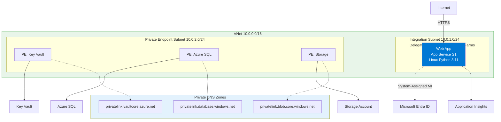
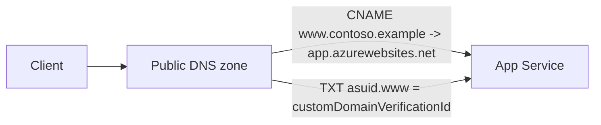
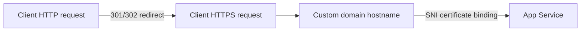

---
content_sources:
  diagrams:
    - id: 07-custom-domain-and-ssl-on-app-service
      type: flowchart
      source: mslearn-adapted
      mslearn_url: https://learn.microsoft.com/en-us/azure/app-service/app-service-web-tutorial-custom-domain
    - id: how-custom-domains-work
      type: flowchart
      source: mslearn-adapted
      mslearn_url: https://learn.microsoft.com/en-us/azure/app-service/app-service-web-tutorial-custom-domain
    - id: how-https-binding-works
      type: flowchart
      source: mslearn-adapted
      mslearn_url: https://learn.microsoft.com/en-us/azure/app-service/app-service-web-tutorial-custom-domain
---

# 07 - Custom Domain and SSL on App Service

This final tutorial binds your Flask app to a custom domain and enables HTTPS certificates. It covers DNS validation, hostname binding, and certificate verification.

!!! info "Infrastructure Context"
    **Service**: App Service (Linux, Standard S1) | **Network**: VNet integrated | **VNet**: ✅

    This tutorial assumes a production-ready App Service deployment with VNet integration, private endpoints for backend services, and managed identity for authentication.

<!-- diagram-id: 07-custom-domain-and-ssl-on-app-service -->


## How Custom Domains Work

<!-- diagram-id: how-custom-domains-work -->


App Service validates domain ownership with the `asuid` TXT record before hostname binding is finalized.

## How HTTPS Binding Works

<!-- diagram-id: how-https-binding-works -->


After certificate binding, App Service serves TLS for the custom hostname and redirects HTTP traffic to HTTPS when HTTPS-only is enabled.

## Prerequisites

- Completed [06 - CI/CD](./06-ci-cd.md)
- A domain name you can manage in DNS
- Web app deployed and reachable via `*.azurewebsites.net`
- **App Service Plan**: Custom domains require a paid App Service plan (not the Free F1 tier). App Service Managed Certificates require Basic tier or higher.

## Main Content

### Add DNS records for domain ownership

Use your DNS provider to add records for verification and routing:

- TXT record for `asuid` validation
- CNAME record for subdomain mapping (for example `www`)

Get verification ID:

```bash
az webapp show --resource-group $RG --name $APP_NAME --query customDomainVerificationId --output tsv
```

| Command | Purpose |
|---------|---------|
| `az webapp show --resource-group $RG --name $APP_NAME --query customDomainVerificationId --output tsv` | Retrieves the domain verification ID required for the `asuid` TXT record. |
| `--query customDomainVerificationId` | Extracts only the custom domain verification value from the response. |
| `--output tsv` | Returns the verification ID as plain text for easy copy/paste into DNS. |

### Bind custom hostname

```bash
CUSTOM_HOSTNAME="www.contoso.example"
az webapp config hostname add --resource-group $RG --webapp-name $APP_NAME --hostname $CUSTOM_HOSTNAME
```

| Command | Purpose |
|---------|---------|
| `CUSTOM_HOSTNAME="www.contoso.example"` | Stores the custom hostname you want to bind to the web app. |
| `az webapp config hostname add --resource-group $RG --webapp-name $APP_NAME --hostname $CUSTOM_HOSTNAME` | Adds the custom domain binding to the App Service app. |
| `--webapp-name $APP_NAME` | Selects the target web app for the hostname binding. |
| `--hostname $CUSTOM_HOSTNAME` | Specifies the exact custom domain name to add. |

### Create managed certificate and bind SSL

```bash
az webapp config ssl create --resource-group $RG --name $APP_NAME --hostname $CUSTOM_HOSTNAME

THUMBPRINT=$(az webapp config ssl list --resource-group $RG --query "[?hostNames && contains(join(',', hostNames), '$CUSTOM_HOSTNAME')].thumbprint | [0]" --output tsv)

az webapp config ssl bind --resource-group $RG --name $APP_NAME --certificate-thumbprint $THUMBPRINT --ssl-type SNI
```

| Command | Purpose |
|---------|---------|
| `az webapp config ssl create --resource-group $RG --name $APP_NAME --hostname $CUSTOM_HOSTNAME` | Requests an App Service managed certificate for the custom hostname. |
| `--hostname $CUSTOM_HOSTNAME` | Tells Azure which hostname the certificate should cover. |
| `THUMBPRINT=$(az webapp config ssl list --resource-group $RG --query "[?hostNames && contains(join(',', hostNames), '$CUSTOM_HOSTNAME')].thumbprint | [0]" --output tsv)` | Captures the certificate thumbprint for the hostname that was just created. |
| `az webapp config ssl list` | Lists SSL certificates available to the web app. |
| `--query "[?hostNames && contains(join(',', hostNames), '$CUSTOM_HOSTNAME')].thumbprint | [0]"` | Filters the certificate list to the first thumbprint matching the custom hostname. |
| `az webapp config ssl bind --resource-group $RG --name $APP_NAME --certificate-thumbprint $THUMBPRINT --ssl-type SNI` | Binds the selected certificate to the web app hostname. |
| `--certificate-thumbprint $THUMBPRINT` | Identifies which certificate to bind. |
| `--ssl-type SNI` | Uses SNI-based TLS binding for the hostname. |

### Enforce HTTPS-only traffic

```bash
az webapp update --resource-group $RG --name $APP_NAME --https-only true
```

| Command | Purpose |
|---------|---------|
| `az webapp update --resource-group $RG --name $APP_NAME --https-only true` | Forces the web app to redirect HTTP traffic to HTTPS. |
| `--https-only true` | Enables the HTTPS-only setting on App Service. |

### Validate certificate and endpoint health

```bash
curl -I https://$CUSTOM_HOSTNAME/health
```

| Command | Purpose |
|---------|---------|
| `curl -I https://$CUSTOM_HOSTNAME/health` | Sends a HEAD request to confirm the custom domain and certificate are working. |
| `-I` | Returns response headers only, which is useful for quick HTTPS validation. |

Masked certificate inventory example:

```json
[
  {
    "hostNames": [
      "www.contoso.example"
    ],
    "thumbprint": "xxxxxxxx-xxxx-xxxx-xxxx-xxxxxxxxxxxx",
    "resourceGroup": "rg-flask-tutorial"
  }
]
```

## Advanced Topics

Use Azure DNS and Traffic Manager for multi-region failover, and automate certificate lifecycle monitoring with alerts for expiration windows.

## See Also
- [Tutorial Overview](./index.md)
- [Deployment Slots](../../../operations/deployment-slots.md)

## Sources
- [Map an existing custom DNS name to App Service (Microsoft Learn)](https://learn.microsoft.com/en-us/azure/app-service/app-service-web-tutorial-custom-domain)
- [Add and manage TLS/SSL certificates (Microsoft Learn)](https://learn.microsoft.com/en-us/azure/app-service/configure-ssl-certificate)
