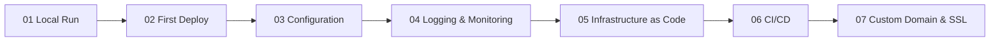

---
hide:
  - toc
content_sources:
  text:
    - type: mslearn-adapted
      url: https://learn.microsoft.com/en-us/azure/app-service/quickstart-python?tabs=flask%2Cazure-cli
  diagrams:
    - id: tutorial-path
      type: flowchart
      source: self-generated
      justification: "Overview sequence derived from the structure of this tutorial series."
      based_on:
        - https://learn.microsoft.com/en-us/azure/app-service/quickstart-python?tabs=flask%2Cazure-cli
        - https://learn.microsoft.com/en-us/azure/app-service/app-service-web-tutorial-custom-domain
---

# Python Tutorial Overview

This tutorial path walks you from a local Flask run to a production-ready App Service deployment.

**Estimated time:** ~2-3 hours total

<!-- diagram-id: tutorial-path -->

## Prerequisites

- Python 3.11 or newer
- Azure CLI installed and signed in
- Visual Studio Code
- Access to an Azure subscription and resource group

## Tutorial Steps

| Step | Description | Link |
|---|---|---|
| 01 | Run the app locally with App Service parity. | [01 - Local Run](./01-local-run.md) |
| 02 | Create the first deployment to Azure App Service. | [02 - First Deploy](./02-first-deploy.md) |
| 03 | Configure app settings, runtime settings, and environment values. | [03 - Configuration](./03-configuration.md) |
| 04 | Add logging and monitoring for operational visibility. | [04 - Logging and Monitoring](./04-logging-monitoring.md) |
| 05 | Define the same deployment with infrastructure as code. | [05 - Infrastructure as Code](./05-infrastructure-as-code.md) |
| 06 | Set up CI/CD for repeatable deployments. | [06 - CI/CD](./06-ci-cd.md) |
| 07 | Bind a custom domain and enable SSL. | [07 - Custom Domain and SSL](./07-custom-domain-ssl.md) |

## Recommended Path

Follow the steps in order. Each tutorial builds on the previous one and assumes the same Python App Service app.

## See Also

- [Python Guide](../index.md)
- [Python Runtime](../python-runtime.md)
- [Python Recipes](../recipes/index.md)
