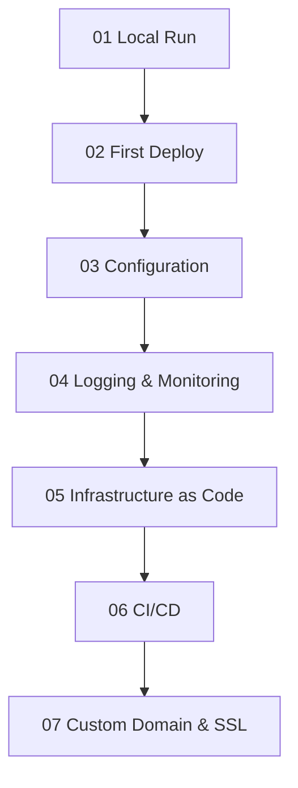

---
content_sources:
  text:
  - type: mslearn-adapted
    url: https://learn.microsoft.com/en-us/azure/app-service/quickstart-python?tabs=flask%2Cazure-cli
  diagrams:
  - id: tutorial-path
    type: flowchart
    source: self-generated
    justification: Overview sequence derived from the structure of this tutorial series.
    based_on:
    - https://learn.microsoft.com/en-us/azure/app-service/quickstart-python?tabs=flask%2Cazure-cli
    - https://learn.microsoft.com/en-us/azure/app-service/app-service-web-tutorial-custom-domain
validation:
  az_cli:
    last_tested: null
    cli_version: null
    result: not_tested
content_validation:
  status: verified
  last_reviewed: '2026-05-23'
  reviewer: agent
  core_claims:
  - claim: This page uses Microsoft Learn as the primary source basis for its Azure-specific
      guidance.
    source: https://learn.microsoft.com/en-us/azure/app-service/quickstart-python?tabs=flask%2Cazure-cli
    verified: true
---
# Python Tutorial Overview

This tutorial path walks you from a local Flask run to a production-ready App Service deployment.

**Estimated time:** ~2-3 hours total

<!-- diagram-id: tutorial-path -->

```mermaid
flowchart TD
    S01[01 Local Run] --> S02[02 First Deploy]
    S02 --> S03[03 Configuration]
    S03 --> S04[04 Logging & Monitoring]
    S04 --> S05[05 Infrastructure as Code]
    S05 --> S06[06 CI/CD]
    S06 --> S07[07 Custom Domain & SSL]
```

## Prerequisites

- Python 3.11 or newer
- Azure CLI installed and signed in
- Visual Studio Code
- Access to an Azure subscription and resource group

## Tutorial Steps

| Step | Description | Link |
|---|---|---|
| 01 | Run the app locally with App Service parity. | [01 - Local Run](./01-local-run.md) |
| 02 | Create the first deployment to Azure App Service. | [02 - First Deploy](./02-first-deploy.md) |
| 03 | Configure app settings, runtime settings, and environment values. | [03 - Configuration](./03-configuration.md) |
| 04 | Add logging and monitoring for operational visibility. | [04 - Logging and Monitoring](./04-logging-monitoring.md) |
| 05 | Define the same deployment with infrastructure as code. | [05 - Infrastructure as Code](./05-infrastructure-as-code.md) |
| 06 | Set up CI/CD for repeatable deployments. | [06 - CI/CD](./06-ci-cd.md) |
| 07 | Bind a custom domain and enable SSL. | [07 - Custom Domain and SSL](./07-custom-domain-ssl.md) |

## Recommended Path

Follow the steps in order. Each tutorial builds on the previous one and assumes the same Python App Service app.

## Run It in the Portal

#### Portal view: App Service Web App overview (tutorial destination blade)

![Azure portal Overview blade for `app-test-20251107` (Web App) with a command bar (`Browse`, `Stop`, `Swap`, `Restart`, `Delete`, `Refresh`, `Download publish profile`, `Reset publish profile`, `Share to mobile`, `Send us your feedback`) and an Essentials panel showing Resource group `rg-test-20251107`, Status `Running`, Location `Korea Central`, Subscription `Visual Studio Enterprise Subscription`, Subscription ID `00000000-0000-0000-0000-000000000000`, Default domain `app-test-20251107.azurewebsites.net`, App Service Plan `asp-test-20251107 (P0v3: 1)`, Operating System `Linux`, and Health Check `Not Configured`. The Properties tab is selected (next to Monitoring, Logs, Capabilities, Notifications (1), Recommendations) and surfaces Web app (`Publishing model: Code`, `Runtime Stack: Python - 3.11`, `Runtime status: Healthy`), Domains (`2 Domains View all`), Hosting (`Plan Type: App Service plan`, `Instance Count: 1`, `SKU and size: Premium0V3 (P0v3)` with `Scale up` link), Deployment Center (`Last deployment: Successful on Thursday, November 6, 10:58:01 PM`, `Deployment provider: None`), Application Insights (`Name: ai-test-20251107`, `Region: Korea Central`), and Networking (`Inbound IP addresses: 20.200.197.3, 2603:1040:f05:3::208`, `Private endpoint connections: 0 private endpoints`, `Virtual network integration: Not configured`). Left nav under the search box lists Overview (selected), Activity log, Access control (IAM), Tags, Diagnose and solve problems, Microsoft Defender for Cloud, Events (preview), Log stream, AI (preview), Resource visualizer, with collapsed groups Deployment, Settings, Performance, App Service plan, Development Tools, API, Monitoring, Automation, and Support + troubleshooting.](../../../assets/platform/architecture/01-app-service-overview.png)

The Web App `Overview` blade brings the main tutorial state into one visible page. The `Essentials` panel shows `Status: Running`, `Default domain`, `App Service Plan: asp-test-20251107 (P0v3: 1)`, and `Operating System: Linux`, while the selected `Properties` tab adds `Runtime Stack: Python - 3.11` and `Runtime status: Healthy` under `Web app`. The same blade also shows hosting, deployment, monitoring, and networking summaries in the `Hosting`, `Deployment Center`, `Application Insights`, and `Networking` sections. The command bar at the top exposes the visible management actions for the app, including `Browse`, `Stop`, `Swap`, `Restart`, `Delete`, and `Refresh`.

## See Also

- [Python Guide](../index.md)
- [Python Runtime](../python-runtime.md)
- [Python Recipes](../recipes/index.md)

## Sources

- [Microsoft Learn source 1](https://learn.microsoft.com/en-us/azure/app-service/quickstart-python?tabs=flask%2Cazure-cli)
- [Microsoft Learn source 2](https://learn.microsoft.com/en-us/azure/app-service/app-service-web-tutorial-custom-domain)
