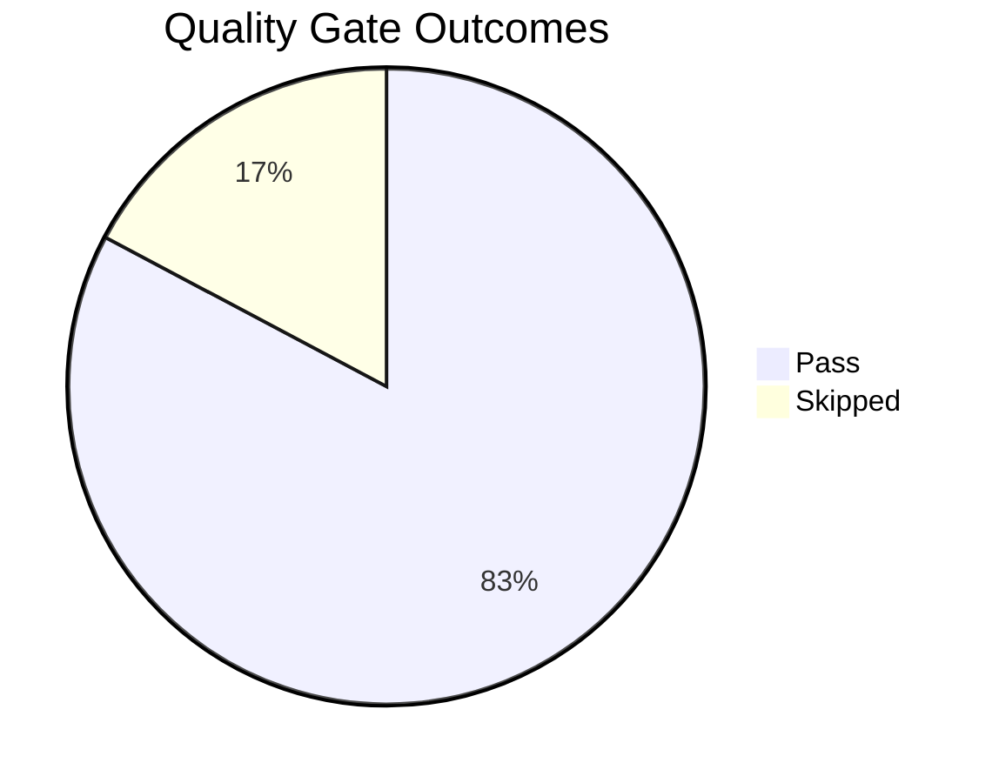

# Golden Status

Every quality gate in this repository, its most recently recorded result, and the CI job that enforces it. The page exists because the gates are spread across five workflows and report in isolation, which makes repository-wide health hard to read.

## Summary

*Snapshot of `a2bb0fa plus uncommitted working-tree changes`, generated 2026-10-03.*

| Metric | Count |
|---|---:|
| Registered gates | 29 |
| ✅ Pass | 24 |
| ❌ Fail | 0 |
| ⚠️ Warn | 0 |
| ➖ Skipped | 5 |

!!! warning "Blocking gates pass, with gaps"
    No blocking gate failed in this snapshot, but 5 gate(s) reported findings, are unwired from CI, or could not run on the machine that generated this page. See Known Gaps.

<!-- diagram-id: golden-status-gate-outcomes-pie -->


## Gate Results

These are locally executed results, not GitHub Actions statuses. **Skipped** means the machine that generated this page lacked the toolchain the gate needs. **Warn** means the gate reported findings its CI job would not fail on, either because the job is advisory or because the dashboard runs a wider scope than CI does. 17 of 29 gates are re-run and compared by the `Validate Golden Status` job, so a flip to **Fail** cannot sit here unnoticed.

<!-- golden-status:results:start -->
| Gate | Severity | Status | Detail | Time |
| --- | --- | --- | --- | --- |
| Validator doctests | Blocking | ✅ Pass | 9 modules checked, every doctest passed. | < 10s |
| Capture asset geometry | Blocking | ✅ Pass | Capture assets conform to the capture profile. | < 10s |
| Mermaid format | Blocking | ✅ Pass | Files checked: 233 · Files with errors: 0 | < 10s |
| Mermaid syntax | Blocking | ✅ Pass | Diagrams checked: 385 · Errors found: 0 | < 10s |
| Content sources | Blocking | ✅ Pass | Files with mermaid: 232 · Validation errors: 0 | < 10s |
| Content sources schema | Blocking | ✅ Pass | Files with content_sources schema drift: 0 · Parse errors: 0 | < 10s |
| Diagram ID parity | Blocking | ✅ Pass | mermaid blocks: 385 · diagram-id comments: 385 | < 10s |
| CLI explanation tables | Blocking | ✅ Pass | All Azure CLI code fences and Markdown tables are correctly terminated. | < 10s |
| Document quality | Blocking | ✅ Pass | Documentation quality gate passed for 233 file(s). | < 10s |
| Frontmatter YAML style | Blocking | ✅ Pass | Files with style drift: 0 · Parse errors: 0 | < 10s |
| Microsoft Learn locale | Blocking | ✅ Pass | Files with locale drift: 0 | < 10s |
| Microsoft Learn URL reachability | Advisory | ➖ Skipped | Network gate; re-run with --include-network. | < 10s |
| Lab artifact PII | Blocking | ✅ Pass | [scan_lab_pii] scanned=472 skipped_binary=0 skipped_decode=0 findings=0 | < 10s |
| Documentation PII | Blocking | ✅ Pass | No blocking PII patterns detected! | < 10s |
| Documentation repetition | Blocking | ✅ Pass | Scanned 233 file(s): 0 error(s), 6 warning(s). | < 10s |
| Visual content coverage | Advisory | ✅ Pass | full repo: 76/76 in-scope pages carry a visual aid (100.0%). Advisory gate — exit 0 regardless (see issue #388). | < 10s |
| Frontmatter schema | Blocking | ✅ Pass | Checked 233 files · Found 0 errors, 28 warnings: | < 10s |
| MkDocs strict build | Blocking | ✅ Pass | Site built with no strict-mode warnings. | 10-120s |
| Shell script syntax | Blocking | ✅ Pass | All shell scripts parse. | < 10s |
| ShellCheck | Blocking | ➖ Skipped | Executable `shellcheck` is not on PATH. | < 10s |
| Node.js dependency audit | Blocking | ✅ Pass | found 0 vulnerabilities | < 10s |
| Node.js app tests | Blocking | ✅ Pass | ℹ tests 3 · ℹ pass 3 · ℹ fail 0 | < 10s |
| Node.js production install | Blocking | ✅ Pass | Production tree resolved from the lockfile. | < 10s |
| Node.js container smoke | Blocking | ➖ Skipped | Network gate; re-run with --include-network. | < 10s |
| Python app compile | Blocking | ✅ Pass | All modules compiled. | < 10s |
| Python app tests | Blocking | ✅ Pass | collected 4 items | < 10s |
| .NET app build | Blocking | ➖ Skipped | Executable `dotnet` is not on PATH. | < 10s |
| Java app tests | Blocking | ➖ Skipped | Executable `mvn` is not on PATH. | < 10s |
| Bicep template build | Blocking | ✅ Pass | Bicep templates built: 38 · Bicep parameter files built: 9 | > 120s |

<!-- golden-status:results:end -->

## Gate Inventory

Generated from the `GATES` registry in `scripts/generate_golden_status.py`. CI fails if a candidate validator script matching the registry discovery rules has no entry here, so this table cannot silently fall behind.

<!-- golden-status:inventory:start -->
| Gate | Enforces | Severity | Command | Enforced by |
| --- | --- | --- | --- | --- |
| Validator doctests | Executable specs inside the validators themselves still pass. | Blocking | `python3 -m doctest scripts/lib/content_scope.py scripts/validate_content_sources.py scripts/validate_cli_explanations.py scripts/validate_pii.py scripts/detect_repetition.py scripts/validate_doc_quality.py scripts/validate_capture_assets.py scripts/validate_visual_content.py scripts/generate_golden_status.py` | `Validate Content Source Metadata` — `validate-content-sources.yml`<br>`Validate CLI Explanation Tables` — `validate-content-sources.yml`<br>`Validate PII` — `validate-content-sources.yml`<br>`Validate Documentation Repetition` — `validate-repetition.yml`<br>`Validate Visual Content (advisory)` — `validate-visual-content.yml`<br>`Validate Golden Status` — `validate-golden-status.yml` |
| Capture asset geometry | Committed Portal screenshots match the portal-desktop-v1 profile or are frozen historical exceptions; changed ones carry provenance; docs reference images only through the manifest or the frozen legacy registry, with captions on changed references. | Blocking | `python3 scripts/validate_capture_assets.py` | `Validate Content Source Metadata` — `validate-content-sources.yml` |
| Mermaid format | Mermaid fences are unindented and correctly delimited. | Blocking | `python3 scripts/validate_mermaid_format.py` | `Validate Content Source Metadata` — `validate-content-sources.yml` |
| Mermaid syntax | Every diagram parses as valid Mermaid. | Blocking | `python3 scripts/validate_mermaid_syntax.py` | `Validate Content Source Metadata` — `validate-content-sources.yml` |
| Content sources | Pages with Mermaid carry content_sources metadata with a valid source type. | Blocking | `python3 scripts/validate_content_sources.py` | `Validate Content Source Metadata` — `validate-content-sources.yml` |
| Content sources schema | content_sources blocks use the canonical mapping shape, not the legacy list form. | Blocking | `python3 scripts/normalize_content_sources_schema.py --check` | `Validate Content Source Metadata` — `validate-content-sources.yml` |
| Diagram ID parity | Mermaid fence count equals diagram-id comment count across docs/. | Blocking | `python3 scripts/generate_golden_status.py --gate diagram-id-parity` | `Validate Content Source Metadata` — `validate-content-sources.yml` |
| CLI explanation tables | Every az CLI fence has an explanation table, and Markdown tables in docs/ and repository-root contracts end with a blank line. | Blocking | `python3 scripts/validate_cli_explanations.py` | `Validate CLI Explanation Tables` — `validate-content-sources.yml` |
| Document quality | Canonical section templates, tail sections, long CLI flags, and masked identifiers. | Blocking | `python3 scripts/validate_doc_quality.py --all` | `Validate Content Source Metadata` — `validate-content-sources.yml` |
| Frontmatter YAML style | Frontmatter matches the canonical ruamel.yaml serialization. | Blocking | `python3 scripts/normalize_yaml_frontmatter.py --check` | `Validate Content Source Metadata` — `validate-content-sources.yml` |
| Microsoft Learn locale | Every learn.microsoft.com URL carries the en-us locale prefix. | Blocking | `python3 scripts/normalize_mslearn_locale.py --check` | `Validate Content Source Metadata` — `validate-content-sources.yml` |
| Microsoft Learn URL reachability | Cited Microsoft Learn URLs still resolve and have not been redirected away. | Advisory | `python3 scripts/validate_mslearn_urls.py` | `Validate MSLearn URLs` — `validate-content-sources.yml` |
| Lab artifact PII | Lab scripts and templates carry no real UUIDs, emails, hostnames, or public IPs. | Blocking | `python3 scripts/scan_lab_pii.py` | `Validate Content Source Metadata` — `validate-content-sources.yml` |
| Documentation PII | No leaked subscription, tenant, or object IDs and no real email addresses in docs/. | Blocking | `python3 scripts/validate_pii.py` | `Validate PII` — `validate-content-sources.yml` |
| Documentation repetition | No known scaffold marker is repeated within a single page. | Blocking | `python3 scripts/detect_repetition.py docs` | `Validate Documentation Repetition` — `validate-repetition.yml` |
| Visual content coverage | Factual-claim pages carry at least one diagram, screenshot, or image. | Advisory | `python3 scripts/validate_visual_content.py --all` | `Validate Visual Content (advisory)` — `validate-visual-content.yml` |
| Frontmatter schema | Valid doc_type and section values, unique slugs, resolvable relationships, content_validation placement. | Blocking | `python3 tools/validate_frontmatter.py` | `Validate Content Source Metadata` — `validate-content-sources.yml` |
| MkDocs strict build | The site builds with no broken internal links and no navigation warnings. | Blocking | `mkdocs build --strict` | `Build Documentation` — `validate-content-sources.yml` |
| Shell script syntax | Every tracked .sh file under apps/, labs/, and scripts/ parses. | Blocking | `bash -c "find apps labs scripts -type f -name '*.sh' -print0 | xargs -0 -r bash -n"` | `Shell Scripts` — `app-infra-ci.yml` |
| ShellCheck | Shell scripts pass ShellCheck static analysis. | Blocking | `bash -c "find apps labs scripts -type f -name '*.sh' -print0 | xargs -0 -r shellcheck"` | `Shell Scripts` — `app-infra-ci.yml` |
| Node.js dependency audit | The Express reference app has no moderate-or-worse production advisories. | Blocking | `cd apps/nodejs && npm audit --package-lock-only --omit=dev --audit-level=moderate` | `Node.js App` — `app-infra-ci.yml` |
| Node.js app tests | The Express reference app test suite passes. | Blocking | `cd apps/nodejs && npm test` | `Node.js App` — `app-infra-ci.yml` |
| Node.js production install | The Express reference app's production dependency tree resolves from its lockfile. | Blocking | `cd apps/nodejs && npm ci --omit=dev --dry-run` | `Node.js App` — `app-infra-ci.yml` |
| Node.js container smoke | The Node.js reference image builds, serves /health, and keeps sshd running. | Blocking | `bash apps/nodejs/smoke-container.sh` | `Node.js Container Smoke` — `app-infra-ci.yml` |
| Python app compile | The Flask reference app and its tests compile. | Blocking | `python3 -m compileall -q apps/python-flask/src apps/python-flask/tests` | `Python Flask App` — `app-infra-ci.yml` |
| Python app tests | The Flask reference app pytest suite passes. | Blocking | `python3 -m pytest apps/python-flask/tests` | `Python Flask App` — `app-infra-ci.yml` |
| .NET app build | The ASP.NET Core reference project builds. | Blocking | `dotnet build apps/dotnet-aspnetcore/GuideApi/GuideApi.csproj` | `ASP.NET Core App` — `app-infra-ci.yml` |
| Java app tests | The Spring Boot reference app Maven test phase passes. | Blocking | `mvn -q -f apps/java-springboot/pom.xml test` | `Java Spring Boot App` — `app-infra-ci.yml` |
| Bicep template build | Every .bicep template and .bicepparam profile under apps/ and labs/ compiles. | Blocking | `az bicep build and build-params over apps/ and labs/` | `Bicep Templates` — `app-infra-ci.yml` |

<!-- golden-status:inventory:end -->

### Invocation notes

| Gate | Note |
| --- | --- |
| Validator doctests | CI runs these doctests one module per job; the dashboard runs them as one batch. |
| Capture asset geometry | Known historical violations are listed in scripts/capture/dimension-exceptions.yaml, which may only shrink. |
| Diagram ID parity | An inline shell step with no standalone script, so the dashboard re-runs the same comparison through its own --gate entry point. |
| Document quality | CI blocks on changed files only. The dashboard runs --all, so findings here may include historical debt and cannot be mapped onto the changed-only CI scope. |
| Microsoft Learn URL reachability | Network gate. CI runs it on push to main with continue-on-error to avoid rate limits. |
| Documentation PII | CI blocks on changed Markdown only. The dashboard scans the full documentation tree, so findings here may include historical debt that CI does not fail on. |
| Documentation repetition | Marker hits are errors; other repeated prose is reported as a non-blocking warning. |
| Visual content coverage | Advisory by design; it always exits 0 and reports coverage as a tracked metric. |
| Frontmatter schema | Unresolved relationship slugs are warnings, so only hard schema errors fail the job. |
| MkDocs strict build | Builds into a temporary directory so a local `mkdocs serve` is left alone. Needs the full docs toolchain, so the Validate Golden Status job does not re-verify it. |
| Node.js dependency audit | --package-lock-only audits the lockfile, so the result cannot be skewed by a stale node_modules. CI audits the tree it just installed, which is equivalent. |
| Node.js app tests | Needs `npm ci` in apps/nodejs first; the dashboard never installs dependencies. |
| Node.js production install | Dry run, so it resolves from the lockfile without writing node_modules. |
| Node.js container smoke | Pulls the base image and runs npm ci during the build, so it is a network gate. |
| Python app tests | Needs apps/python-flask/requirements-dev.txt installed into the running interpreter. |
| Bicep template build | Both this gate and the workflow step redirect stdin per template; without that, `az` consumes the file list and the loop stops after the first file. |

## Known Gaps

- **Microsoft Learn URL reachability** did not run here: Network gate; re-run with --include-network.
- **ShellCheck** did not run here: Executable `shellcheck` is not on PATH.
- **Node.js container smoke** did not run here: Network gate; re-run with --include-network.
- **.NET app build** did not run here: Executable `dotnet` is not on PATH.
- **Java app tests** did not run here: Executable `mvn` is not on PATH.

## How to Regenerate

```bash
python3 scripts/generate_golden_status.py
python3 scripts/generate_golden_status.py --include-network
python3 scripts/generate_golden_status.py --strict
python3 scripts/generate_golden_status.py --check
python3 scripts/generate_golden_status.py --gate mermaid-syntax
```

| Invocation | Purpose |
| --- | --- |
| *(no flags)* | Run every gate this machine can run and rewrite this page. |
| `--include-network` | Also run gates that make outbound HTTP requests. |
| `--strict` | Exit non-zero when a blocking gate fails. |
| `--check` | Registry completeness, inventory freshness, and status freshness. This is what CI runs. |
| `--gate KEY` | Run one gate, stream its raw output, and exit with its code. |

## See Also

- [Documentation Taxonomy](taxonomy.md)
- [Content Validation Status](../reference/content-validation-status.md)
- [Tutorial Validation Status](../reference/validation-status.md)
- [Contributing Guide](../contributing/index.md)

## Sources

- [AGENTS.md — Quality Gates & Verification](https://github.com/yeongseon/azure-app-service-practical-guide/blob/main/AGENTS.md)
- [Series epic: documentation repetition gate](https://github.com/yeongseon/azure-container-apps-practical-guide/issues/376)
- [Series epic: PII detection gate](https://github.com/yeongseon/azure-container-apps-practical-guide/issues/384)
- [Series epic: visual content gate](https://github.com/yeongseon/azure-container-apps-practical-guide/issues/391)
