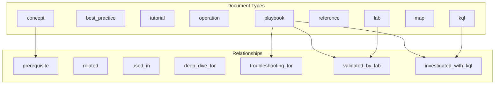

---
hide:
  - toc
title: Documentation Taxonomy
slug: taxonomy
doc_type: reference
section: meta
topics:
  - documentation
  - standards
  - metadata
products:
  - azure-app-service
summary: Standard taxonomy for document types, relationship fields, and frontmatter schema.
status: stable
last_reviewed: 2026-04-08
content_sources:
  diagrams:
    - id: meta-taxonomy-diagram-1
      type: flowchart
      source: self-generated
      justification: "Self-generated navigation diagram synthesized from official Azure App Service overview documentation for this guide."
      based_on:
        - https://learn.microsoft.com/en-us/azure/app-service/overview
---
# Documentation Taxonomy

This document defines the standard taxonomy used across the Azure App Service Practical Guide for document classification, relationships, and frontmatter metadata.

<!-- diagram-id: meta-taxonomy-diagram-1 -->


## Document Types (`doc_type`)

| Type | Description | Examples |
|------|-------------|----------|
| `concept` | Platform concepts, architecture, how things work | How App Service Works, Request Lifecycle |
| `best_practice` | Operational guidance, recommendations | Production Baseline, Security Best Practices |
| `tutorial` | Step-by-step learning guides | Language guide chapters (01-local-run, etc.) |
| `operation` | Operational procedures, day-2 tasks | Scaling, Deployment Slots, Backup/Restore |
| `playbook` | Troubleshooting procedures for specific issues | Intermittent 5xx, Memory Pressure |
| `reference` | Quick reference, cheatsheets, limits | CLI Cheatsheet, Platform Limits |
| `lab` | Hands-on reproducible experiments | Lab: Intermittent 5xx, Lab: Memory Pressure |
| `map` | Navigation aids, decision trees, visual guides | Decision Tree, Evidence Map, Mental Model |
| `kql` | KQL query patterns and templates | 5xx Trend Over Time, Latency vs Errors |

## Sections

| Section | Description |
|---------|-------------|
| `platform` | Core platform concepts and architecture |
| `best-practices` | Operational best practices and guidelines |
| `language-guides` | Language-specific tutorials (Python, Node.js, Java, .NET) |
| `operations` | Day-2 operational procedures |
| `troubleshooting` | Problem diagnosis and resolution |
| `reference` | Quick reference materials |
| `visualization` | Interactive knowledge graphs and maps |
| `meta` | Documentation standards and taxonomy |
| `start-here` | Onboarding and orientation |

## Relationship Fields

### `prerequisites`

Documents that must be understood before this one. Creates edges pointing **to** the current document.

```yaml
prerequisites:
  - how-app-service-works
  - request-lifecycle
```

### `related`

Conceptually connected documents. Creates bidirectional semantic relationships.

```yaml
related:
  - intermittent-5xx-under-load
  - slow-response-but-low-cpu
```

### `used_in`

Documents where this content is referenced or used.

```yaml
used_in:
  - first-10-minutes-performance
  - production-baseline
```

### `deep_dive_for`

This document provides detailed coverage of another topic.

```yaml
deep_dive_for:
  - scaling
```

### `troubleshooting_for`

This playbook addresses issues related to a concept.

```yaml
troubleshooting_for:
  - networking
  - scaling
```

### `validated_by_lab`

Labs that validate this playbook's hypothesis.

```yaml
validated_by_lab:
  - lab-intermittent-5xx
  - lab-memory-pressure
```

### `investigated_with_kql`

KQL queries used to gather evidence for this playbook.

```yaml
investigated_with_kql:
  - 5xx-trend-over-time
  - latency-vs-errors
```

## Frontmatter Schema

### Required Fields

```yaml
---
title: Human-readable document title
slug: unique-document-identifier
doc_type: concept | best_practice | tutorial | operation | playbook | reference | lab | map | kql
---
```

### Recommended Fields

```yaml
---
section: platform | best-practices | troubleshooting | ...
topics:
  - performance
  - memory
  - networking
products:
  - azure-app-service
summary: One-sentence description of the document.
status: draft | stable | deprecated
last_reviewed: 2026-04-08
---
```

### Relationship Fields

```yaml
---
related:
  - slug-of-related-doc
prerequisites:
  - slug-of-prerequisite
used_in:
  - slug-where-this-is-used
deep_dive_for:
  - slug-this-expands-on
troubleshooting_for:
  - slug-of-concept
validated_by_lab:
  - lab-slug
investigated_with_kql:
  - kql-slug
---
```

### Evidence Field (Playbooks)

```yaml
---
evidence:
  - kql
  - detector
  - lab
  - metrics
---
```

## Slug Conventions

Slugs must be globally unique across all documents.

| File Pattern | Slug Convention | Example |
|--------------|-----------------|---------|
| `topic.md` | `topic` | `scaling` |
| `topic/index.md` | `topic-index` or descriptive | `troubleshooting-index` |
| `category/topic.md` | `topic` (if unique) or `category-topic` | `intermittent-5xx-under-load` |
| `kql/category/query.md` | `kql-category-query` or `query-name` | `5xx-trend-over-time` |

### Avoiding Collisions

Multiple `index.md` files exist across sections. Use descriptive slugs:

- `docs/visualization/index.md` → `visualization-index`
- `docs/troubleshooting/index.md` → `troubleshooting-index`
- `docs/platform/index.md` → `platform-index`

## Validation

Run the frontmatter validator before committing:

```bash
python3 tools/validate_frontmatter.py
```

For strict validation (warnings as errors):

```bash
python3 tools/validate_frontmatter.py --strict
```

## Graph Generation

After updating frontmatter, regenerate graph data:

```bash
python3 tools/build_doc_graph.py
```

This produces:
- `docs/assets/graph/core-knowledge.json`
- `docs/assets/graph/troubleshooting-map.json`
