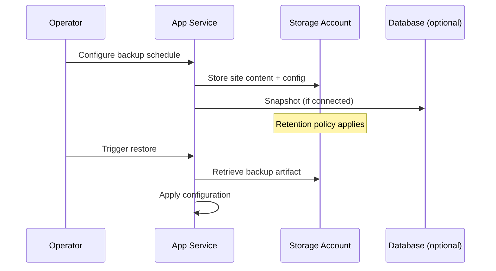

---
hide:
  - toc
content_sources:
  diagrams:
    - id: backup-restore-sequence
      type: sequenceDiagram
      source: mslearn-adapted
      mslearn_url: https://learn.microsoft.com/en-us/azure/app-service/manage-backup
content_validation:
  status: verified
  last_reviewed: "2026-04-12"
  reviewer: ai-agent
  core_claims:
    - claim: "App Service supports both scheduled backups and on-demand backups."
      source: "https://learn.microsoft.com/azure/app-service/manage-backup"
      verified: true
    - claim: "App Service backup can include site content, app configuration, and optional connected database backups when supported."
      source: "https://learn.microsoft.com/azure/app-service/manage-backup"
      verified: true
    - claim: "App Service backups are not a replacement for database-native point-in-time restore."
      source: "https://learn.microsoft.com/azure/app-service/manage-backup"
      verified: true
---

# Backup and Restore Operations

Protect production workloads with scheduled backups, restore drills, and disaster recovery procedures. This guide covers App Service backup capabilities and complementary operational patterns.

<!-- diagram-id: backup-restore-sequence -->


## Prerequisites

- App Service Plan tier **Standard or higher**
- Storage account and blob container for backup artifacts
- Permissions to manage storage and web app configuration
- Variables set:
    - `RG`
    - `APP_NAME`
    - `LOCATION`
    - `STORAGE_ACCOUNT_NAME`

## When to Use

## Procedure

### Understand Backup Scope and Limits

App Service backup can include:

- site content
- app configuration
- optional connected database backups (when supported)

Operational notes:

- Backups are not a replacement for database-native point-in-time restore
- Validate maximum backup size and retention policy for your tier
- Keep backups in resilient storage settings aligned with your RPO

### Create Storage Account and Backup Container

```bash
az storage account create \
  --resource-group $RG \
  --name $STORAGE_ACCOUNT_NAME \
  --location $LOCATION \
  --sku Standard_LRS \
  --kind StorageV2 \
  --output json

az storage container create \
  --name appservice-backups \
  --account-name $STORAGE_ACCOUNT_NAME \
  --auth-mode login \
  --output json
```

### Generate Time-Bound SAS and Build Backup URL

```bash
SAS_TOKEN=$(az storage container generate-sas \
  --name appservice-backups \
  --account-name $STORAGE_ACCOUNT_NAME \
  --permissions rwl \
  --expiry 2027-01-01T00:00:00Z \
  --auth-mode login \
  --output tsv)

BACKUP_URL="https://${STORAGE_ACCOUNT_NAME}.blob.core.windows.net/appservice-backups?${SAS_TOKEN}"
```

!!! warning "Protect backup URLs"
    Container SAS URLs grant access to backup artifacts. Do not commit them to source control or chat logs. Rotate regularly.

### Configure Scheduled Backups

```bash
az webapp config backup update \
  --resource-group $RG \
  --webapp-name $APP_NAME \
  --container-url "$BACKUP_URL" \
  --frequency 1d \
  --retention 30 \
  --retain-one true \
  --output json
```

Check schedule configuration:

```bash
az webapp config backup show \
  --resource-group $RG \
  --webapp-name $APP_NAME \
  --query "{enabled:enabled,schedule:backupSchedule,lastExecutionTime:lastExecutionTime,retentionPeriodInDays:retentionPeriodInDays}" \
  --output json
```

### Trigger On-Demand Backup Before High-Risk Changes

```bash
az webapp config backup create \
  --resource-group $RG \
  --webapp-name $APP_NAME \
  --container-url "$BACKUP_URL" \
  --output json
```

### List and Inspect Backups

```bash
az webapp config backup list \
  --resource-group $RG \
  --webapp-name $APP_NAME \
  --query "[].{id:id,name:name,created:created,status:status,sizeInBytes:sizeInBytes}" \
  --output table
```

Example output (PII-masked):

```text
Id      Name                        Created                  Status      SizeInBytes
------  --------------------------  -----------------------  ----------  -----------
115     backup_20260401_000000.zip  2026-04-01T00:00:21Z     Succeeded   18432000
116     backup_20260402_000000.zip  2026-04-02T00:00:19Z     Succeeded   18564096
```

### Restore from a Backup

Restore to non-production target first whenever possible.

```bash
az webapp config backup restore \
  --resource-group $RG \
  --webapp-name $APP_NAME \
  --backup-id 116 \
  --container-url "$BACKUP_URL" \
  --overwrite true \
  --output json
```

Sample response (PII-masked):

```json
{
  "id": "/subscriptions/<subscription-id>/resourceGroups/rg-shared/providers/Microsoft.Web/sites/app-shared/backup",
  "status": "InProgress",
  "storageAccountUrl": "https://stsharedbackup.blob.core.windows.net/appservice-backups"
}
```

## Verification

1. Confirm app state is `Running`
2. Validate `/health` endpoint
3. Run smoke tests for critical user journeys
4. Confirm app settings and identity bindings
5. Validate connectivity to backing services

Commands:

```bash
az webapp show \
  --resource-group $RG \
  --name $APP_NAME \
  --query "{state:state,host:defaultHostName}" \
  --output json

curl --silent --show-error --fail \
  "https://$APP_NAME.azurewebsites.net/health"
```

### Recovery Runbook Pattern

Recommended incident sequence:

1. Declare incident and freeze deployments
2. Capture forensic timeline and latest good backup ID
3. Restore to staging/validation environment
4. Validate functional and security controls
5. Promote restored version to production
6. Monitor for stabilization window
7. Document lessons learned and adjust backup policy

### Cross-Region Recovery Strategy

Strengthen disaster recovery posture:

- store backups in GRS/RA-GRS where policy allows
- maintain IaC templates for rapid environment recreation
- pair app backups with database-native backup strategy
- rehearse failover and failback quarterly

## Rollback / Troubleshooting

#### Backup job fails

- Verify storage URL and SAS validity
- Confirm storage firewall settings allow access
- Confirm app tier supports backups

#### Restore fails or stalls

- Confirm backup artifact exists and is complete
- Retry with latest known-good backup
- Check activity logs for operation-level errors

#### Restored app is unhealthy

- Validate app settings and slot-specific configuration
- Confirm dependent services are reachable
- Check startup logs for runtime initialization issues

## Advanced Topics

### RPO/RTO Planning

- **RPO:** maximum acceptable data loss window
- **RTO:** maximum acceptable recovery time

Map backup frequency and restore practice cadence to business targets.

### Backup Policy by Environment

Example model:

- dev: daily backups, short retention
- test: daily backups, medium retention
- production: hourly or daily backups plus strict restore drills

### Security and Compliance Controls

- encrypt storage at rest (default)
- restrict storage network access where feasible
- rotate SAS tokens on schedule
- log backup/restore operations for audit

!!! info "Enterprise Considerations"
    Treat backup success alone as insufficient. Include recurring restore drills with measured recovery times and explicit sign-off from service owners.

## Language-Specific Details

For language-specific operational guidance, see:
- [Node.js Guide](../language-guides/nodejs/index.md)
- [Python Guide](../language-guides/python/index.md)
- [Java Guide](../language-guides/java/index.md)
- [.NET Guide](../language-guides/dotnet/index.md)

## See Also

- [Operations Index](./index.md)
- [Deployment Slots](./deployment-slots.md)
- [Health and Recovery](./health-recovery.md)
- [Back up and restore App Service apps (Microsoft Learn)](https://learn.microsoft.com/azure/app-service/manage-backup)
- [Disaster recovery guidance (Microsoft Learn)](https://learn.microsoft.com/azure/app-service/manage-disaster-recovery)

## Sources

- [Back up and restore App Service apps (Microsoft Learn)](https://learn.microsoft.com/azure/app-service/manage-backup)
- [Disaster recovery guidance (Microsoft Learn)](https://learn.microsoft.com/azure/app-service/manage-disaster-recovery)
