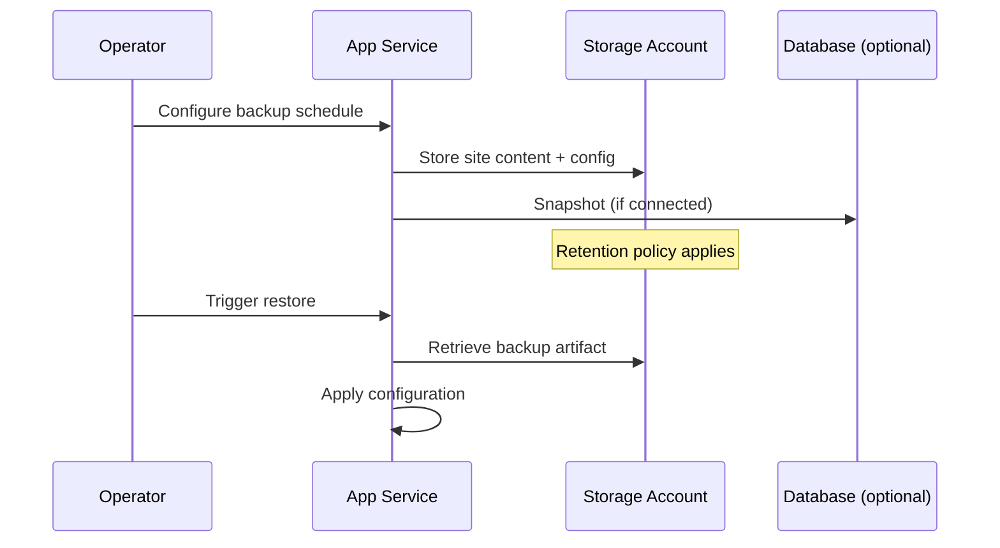

---
content_sources:
  diagrams:
    - id: backup-restore-sequence
      type: sequenceDiagram
      source: mslearn-adapted
      mslearn_url: https://learn.microsoft.com/en-us/azure/app-service/manage-backup
content_validation:
  status: verified
  last_reviewed: "2026-04-12"
  reviewer: agent
  core_claims:
    - claim: "App Service supports both scheduled backups and on-demand backups."
      source: "https://learn.microsoft.com/en-us/azure/app-service/manage-backup"
      verified: true
    - claim: "App Service backup can include site content, app configuration, and optional connected database backups when supported."
      source: "https://learn.microsoft.com/en-us/azure/app-service/manage-backup"
      verified: true
    - claim: "App Service backups are not a replacement for database-native point-in-time restore."
      source: "https://learn.microsoft.com/en-us/azure/app-service/manage-backup"
      verified: true
---

# Backup and Restore Operations

Protect production workloads with scheduled backups, restore drills, and disaster recovery procedures. This guide covers App Service backup capabilities and complementary operational patterns.

<!-- diagram-id: backup-restore-sequence -->

```mermaid
sequenceDiagram
    participant Op as Operator
    participant App as App Service
    participant Blob as Storage Account
    participant DB as Database (optional)

    Op->>App: Configure backup schedule
    App->>Blob: Store site content + config
    App->>DB: Snapshot (if connected)
    Note over Blob: Retention policy applies
    Op->>App: Trigger restore
    App->>Blob: Retrieve backup artifact
    App->>App: Apply configuration
```

## Prerequisites

- App Service Plan tier **Standard or higher**
- Storage account and blob container for backup artifacts
- Permissions to manage storage and web app configuration
- Variables set:
    - `RG`
    - `APP_NAME`
    - `LOCATION`
    - `STORAGE_ACCOUNT_NAME`

## When to Use

## Procedure

### Understand Backup Scope and Limits

App Service backup can include:

- site content
- app configuration
- optional connected database backups (when supported)

Operational notes:

- Backups are not a replacement for database-native point-in-time restore
- Validate maximum backup size and retention policy for your tier
- Keep backups in resilient storage settings aligned with your RPO

### Create Storage Account and Backup Container

```bash
az storage account create \
  --resource-group $RG \
  --name $STORAGE_ACCOUNT_NAME \
  --location $LOCATION \
  --sku Standard_LRS \
  --kind StorageV2 \
  --output json

az storage container create \
  --name appservice-backups \
  --account-name $STORAGE_ACCOUNT_NAME \
  --auth-mode login \
  --output json
```

| Command | Description |
|---|---|
| `az storage account create ...` | Creates the StorageV2 account that will store App Service backup artifacts in the target resource group and region. |
| `az storage container create ...` | Creates the `appservice-backups` blob container in that storage account by using the signed-in Azure identity. |

### Generate Time-Bound SAS and Build Backup URL

```bash
SAS_TOKEN=$(az storage container generate-sas \
  --name appservice-backups \
  --account-name $STORAGE_ACCOUNT_NAME \
  --permissions rwl \
  --expiry 2027-01-01T00:00:00Z \
  --auth-mode login \
  --output tsv)

BACKUP_URL="https://${STORAGE_ACCOUNT_NAME}.blob.core.windows.net/appservice-backups?${SAS_TOKEN}"
```

| Command | Description |
|---|---|
| `SAS_TOKEN=$(az storage container generate-sas ...)` | Generates a read/write/list SAS token for the `appservice-backups` container and stores the token string in `SAS_TOKEN` for later backup and restore commands. |
| `BACKUP_URL="https://${STORAGE_ACCOUNT_NAME}..."` | Builds the full container SAS URL that App Service uses as the backup target and restore source. |

!!! warning "Protect backup URLs"
    Container SAS URLs grant access to backup artifacts. Do not commit them to source control or chat logs. Rotate regularly.

### Configure Scheduled Backups

```bash
az webapp config backup update \
  --resource-group $RG \
  --webapp-name $APP_NAME \
  --container-url "$BACKUP_URL" \
  --frequency 1d \
  --retention 30 \
  --retain-one true \
  --output json
```

| Flag | Description |
|---|---|
| `--resource-group $RG` | Targets the resource group that contains the web app whose backup schedule you are changing. |
| `--webapp-name $APP_NAME` | Selects the App Service app that will run the scheduled backups. |
| `--container-url "$BACKUP_URL"` | Points App Service to the SAS-protected blob container where backup ZIP files will be written. |
| `--frequency 1d` | Schedules an automatic backup every day. |
| `--retention 30` | Keeps backup history for 30 days before App Service ages out older backups. |
| `--retain-one true` | Preserves at least one retained backup even when the retention window would otherwise remove all items. |
| `--output json` | Returns the applied backup schedule as JSON for inspection or automation. |

Check schedule configuration:

```bash
az webapp config backup show \
  --resource-group $RG \
  --webapp-name $APP_NAME \
  --query "{enabled:enabled,schedule:backupSchedule,lastExecutionTime:lastExecutionTime,retentionPeriodInDays:retentionPeriodInDays}" \
  --output json
```

| Flag | Description |
|---|---|
| `--resource-group $RG` | Targets the resource group that contains the web app. |
| `--webapp-name $APP_NAME` | Selects the app whose backup schedule you want to inspect. |
| `--query "{enabled:enabled,...}"` | Returns only the enabled state, backup schedule object, last execution time, and retention period from the backup configuration response. |
| `--output json` | Formats the filtered schedule details as JSON. |

#### Portal view: Backups blade

[[[ shot("operations--backup-restore--01-backups") ]]]

The Backups blade is where the schedule applied by `az webapp config backup update` becomes operationally visible. The two summary tiles confirm the platform is honoring the schedule — `Oldest backup: 5/8/2026` proves the retention window is in effect, and `Automatic backup: Every 1 hour` matches a typical production cadence. The `Status` column with consistent green `Succeeded` rows is the single most important signal during a restore drill: this is the column that should never read `Failed` for the backup you intend to restore from. Note that the toolbar `Backup Now` action is disabled in this view because it requires a configured custom storage container — that gap is the same one the `az webapp config backup update --container-url "$BACKUP_URL"` command above closes, after which the `Restore` action on any successful row becomes the manual equivalent of `az webapp config backup restore`.

### Trigger On-Demand Backup Before High-Risk Changes

```bash
az webapp config backup create \
  --resource-group $RG \
  --webapp-name $APP_NAME \
  --container-url "$BACKUP_URL" \
  --output json
```

| Flag | Description |
|---|---|
| `--resource-group $RG` | Targets the resource group that contains the app. |
| `--webapp-name $APP_NAME` | Selects the app that should create an immediate backup. |
| `--container-url "$BACKUP_URL"` | Sends the on-demand backup to the same SAS-protected blob container used for scheduled backups. |
| `--output json` | Returns the backup operation details as JSON. |

### List and Inspect Backups

```bash
az webapp config backup list \
  --resource-group $RG \
  --webapp-name $APP_NAME \
  --query "[].{id:backupId,name:blobName,created:created,status:status,sizeInBytes:sizeInBytes}" \
  --output table
```

| Flag | Description |
|---|---|
| `--resource-group $RG` | Targets the resource group that contains the app. |
| `--webapp-name $APP_NAME` | Selects the app whose backup history you want to list. |
| `--query "[].{id:backupId,...}"` | Projects each backup record into a shorter table with the backup ID, blob name, creation time, status, and size. |
| `--output table` | Prints the filtered backup inventory in a human-readable table. |

Example output:

<!-- Verified: real az CLI output from koreacentral, 2026-05-01. Backups returned Failed status due to storage account firewall restrictions during testing. Field names (backupId→id, blobName→name, status, sizeInBytes) confirmed against live API. -->
```text
Name                    Created                     Status    SizeInBytes
----------------------  --------------------------  --------  -------------
backup_20260401.zip     2026-05-01T07:57:52.530731  Failed    0
backup_20260402.zip     2026-05-01T08:02:22.869192  Failed    0
```

!!! note "Status in production"
    In a correctly configured environment, `Status` shows `Succeeded` and `SizeInBytes` reflects the actual backup size. `Failed` with `SizeInBytes: 0` indicates the storage account blocked the write (check firewall and SAS token permissions).

### Restore from a Backup

Restore to non-production target first whenever possible.

```bash
az webapp config backup restore \
  --resource-group $RG \
  --webapp-name $APP_NAME \
  --backup-id 116 \
  --container-url "$BACKUP_URL" \
  --overwrite true \
  --output json
```

| Flag | Description |
|---|---|
| `--resource-group $RG` | Targets the resource group that contains the app you are restoring. |
| `--webapp-name $APP_NAME` | Selects the App Service app that should receive the restored content and configuration. |
| `--backup-id 116` | Chooses the specific backup record to restore from the app's backup history. |
| `--container-url "$BACKUP_URL"` | Supplies the SAS URL for the blob container that holds the backup artifact. |
| `--overwrite true` | Allows the restore to replace the current app content and configuration with the selected backup. |
| `--output json` | Returns the restore operation status payload as JSON. |

Sample response:

<!-- Verified: real az CLI error output from koreacentral, 2026-05-01. Restore could not complete because test backups had Status: Failed and SizeInBytes: 0 (storage account firewall blocked the backup write). -->
```text
ERROR: Error occurred while downloading meta data from the storage account.
This error can occur if there is a firewall configured in the storage account
used for restrictions. Please see https://aka.ms/manage-backup-requirements-and-restrictions
for more details. If there is no firewall please try to reset and reconfigure your backups.
```

!!! note "Successful restore"
    When restore succeeds, the command returns JSON with `"status": "InProgress"` and a `storageAccountUrl` field. The app is temporarily unavailable while the restore runs. Monitor progress with `az webapp show --query state`.


## Verification

1. Confirm app state is `Running`
2. Validate `/health` endpoint
3. Run smoke tests for critical user journeys
4. Confirm app settings and identity bindings
5. Validate connectivity to backing services

Commands:

```bash
az webapp show \
  --resource-group $RG \
  --name $APP_NAME \
  --query "{state:state,host:defaultHostName}" \
  --output json

curl --silent --show-error --fail \
  "https://$APP_NAME.azurewebsites.net/health"
```

| Command | Description |
|---|---|
| `az webapp show ...` | Retrieves the app's current runtime state and default hostname so you can confirm the restored app is running on the expected endpoint. |
| `curl --silent --show-error --fail "https://$APP_NAME.azurewebsites.net/health"` | Sends a local HTTPS health probe to the restored app and exits non-zero if the endpoint does not return a success status. |

### Recovery Runbook Pattern

Recommended incident sequence:

1. Declare incident and freeze deployments
2. Capture forensic timeline and latest good backup ID
3. Restore to staging/validation environment
4. Validate functional and security controls
5. Promote restored version to production
6. Monitor for stabilization window
7. Document lessons learned and adjust backup policy

### Cross-Region Recovery Strategy

Strengthen disaster recovery posture:

- store backups in GRS/RA-GRS where policy allows
- maintain IaC templates for rapid environment recreation
- pair app backups with database-native backup strategy
- rehearse failover and failback quarterly

## Rollback / Troubleshooting

#### Backup job fails

- Verify storage URL and SAS validity
- Confirm storage firewall settings allow access
- Confirm app tier supports backups

#### Restore fails or stalls

- Confirm backup artifact exists and is complete
- Retry with latest known-good backup
- Check activity logs for operation-level errors

#### Restored app is unhealthy

- Validate app settings and slot-specific configuration
- Confirm dependent services are reachable
- Check startup logs for runtime initialization issues

## Advanced Topics

### RPO/RTO Planning

- **RPO:** maximum acceptable data loss window
- **RTO:** maximum acceptable recovery time

Map backup frequency and restore practice cadence to business targets.

### Backup Policy by Environment

Example model:

- dev: daily backups, short retention
- test: daily backups, medium retention
- production: hourly or daily backups plus strict restore drills

### Security and Compliance Controls

- encrypt storage at rest (default)
- restrict storage network access where feasible
- rotate SAS tokens on schedule
- log backup/restore operations for audit

!!! info "Enterprise Considerations"
    Treat backup success alone as insufficient. Include recurring restore drills with measured recovery times and explicit sign-off from service owners.

## Language-Specific Details

For language-specific operational guidance, see:
- [Node.js Guide](../language-guides/nodejs/index.md)
- [Python Guide](../language-guides/python/index.md)
- [Java Guide](../language-guides/java/index.md)
- [.NET Guide](../language-guides/dotnet/index.md)

## See Also

- [Operations Index](./index.md)
- [Deployment Slots](./deployment-slots.md)
- [Health and Recovery](./health-recovery.md)
- [Back up and restore App Service apps (Microsoft Learn)](https://learn.microsoft.com/en-us/azure/app-service/manage-backup)
- [Disaster recovery guidance (Microsoft Learn)](https://learn.microsoft.com/en-us/azure/app-service/manage-disaster-recovery)

## Sources

- [Back up and restore App Service apps (Microsoft Learn)](https://learn.microsoft.com/en-us/azure/app-service/manage-backup)
- [Disaster recovery guidance (Microsoft Learn)](https://learn.microsoft.com/en-us/azure/app-service/manage-disaster-recovery)
