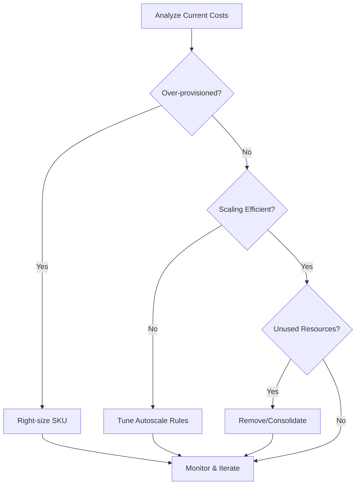

---
content_sources:
  diagrams:
    - id: cost-optimization-decision-flow
      type: flowchart
      source: mslearn-adapted
      mslearn_url: https://learn.microsoft.com/en-us/azure/app-service/overview-manage-costs
content_validation:
  status: verified
  last_reviewed: "2026-04-12"
  reviewer: agent
  core_claims:
    - claim: "App Service costs are driven by plan SKU selection and the number of worker instances."
      source: "https://learn.microsoft.com/en-us/azure/app-service/overview-manage-costs"
      verified: true
    - claim: "Autoscale on the App Service plan can adjust worker instance count to match demand."
      source: "https://learn.microsoft.com/en-us/azure/app-service/manage-scale-up"
      verified: true
    - claim: "Schedule-based scaling can be used for predictable traffic windows."
      source: "https://learn.microsoft.com/en-us/azure/app-service/manage-scale-up"
      verified: true
---

# Cost Optimization Operations

Control App Service spend without sacrificing reliability by right-sizing plans, tuning scaling behavior, and removing operational waste. This guide focuses on practical, language-agnostic cost controls.

<!-- diagram-id: cost-optimization-decision-flow -->


## Prerequisites

- Existing App Service Plan and Web App
- Baseline metrics (CPU, memory, latency, request volume)
- Cost Management access for budget and trend analysis
- Variables set:
    - `RG`
    - `APP_NAME`
    - `PLAN_NAME`

## When to Use

## Procedure

### Establish Cost and Performance Baseline

Capture current plan characteristics:

```bash
az appservice plan show \
  --resource-group $RG \
  --name $PLAN_NAME \
  --query "{sku:sku.name,tier:sku.tier,workers:numberOfWorkers,capacity:sku.capacity}" \
  --output json
```

| Flag | Description |
|---|---|
| `--resource-group $RG` | Targets the resource group that contains the App Service plan. |
| `--name $PLAN_NAME` | Selects the App Service plan whose current size and worker count you want to baseline. |
| `--query "{sku:sku.name,...}"` | Returns only the SKU name, pricing tier, active worker count, and configured capacity from the plan response. |
| `--output json` | Formats the filtered plan baseline as JSON. |

Capture platform metrics:

```bash
PLAN_ID=$(az appservice plan show \
  --resource-group $RG \
  --name $PLAN_NAME \
  --query id \
  --output tsv)

az monitor metrics list \
  --resource $PLAN_ID \
  --metric CpuPercentage MemoryPercentage \
  --interval PT1H \
  --output table
```

| Command | Description |
|---|---|
| `PLAN_ID=$(az appservice plan show ...)` | Reads the App Service plan's Azure resource ID and stores it in `PLAN_ID` so metric queries target the plan resource directly. |
| `az monitor metrics list ...` | Lists hourly CPU and memory metrics for that App Service plan so you can compare current utilization against its cost. |

#### Portal view: Cost analysis blade

[[[ shot("operations--cost-optimization--01-cost-analysis") ]]]

The Cost analysis blade is the canonical baseline view this section's CLI commands feed into. The three KPI tiles map directly to the cost-management loop in the decision flowchart above: `ACTUAL COST (USD)` is the measurement you optimize against, `FORECAST` is the projection that triggers a right-sizing review, and `BUDGET: NONE` is the visible gap that the "Set Budgets and Alerts" step further down closes. The Resource donut at the bottom shows the App Service plan (`asp-test-20251107`, $16.37) dominates the bill at roughly 99% of total spend — typical for App Service workloads and exactly why the plan SKU and worker count are the first levers to tune. Use the `Scope`, `View`, and date controls to switch between subscription, RG, and time windows, but anchor every optimization decision against this view so right-sizing changes can be measured against a real before-and-after rather than assumed.

### Right-Size Plan Tier and Instance Count

General operating model:

- start from measured utilization, not assumptions
- tune for sustained workload, not rare spikes
- avoid overprovisioning in non-production environments

Scale up/down SKU when needed:

```bash
az appservice plan update \
  --resource-group $RG \
  --name $PLAN_NAME \
  --sku S1 \
  --output json
```

| Flag | Description |
|---|---|
| `--resource-group $RG` | Targets the resource group that contains the plan. |
| `--name $PLAN_NAME` | Selects the App Service plan to resize. |
| `--sku S1` | Changes the plan to the `S1` SKU so compute and billing move to that tier. |
| `--output json` | Returns the updated plan definition as JSON. |

Adjust worker count:

```bash
az appservice plan update \
  --resource-group $RG \
  --name $PLAN_NAME \
  --number-of-workers 2 \
  --output json
```

| Flag | Description |
|---|---|
| `--resource-group $RG` | Targets the resource group that contains the plan. |
| `--name $PLAN_NAME` | Selects the App Service plan whose instance count you want to change. |
| `--number-of-workers 2` | Sets the plan to run on two worker instances, increasing or reducing recurring compute cost accordingly. |
| `--output json` | Returns the updated worker-count configuration as JSON. |

### Implement Autoscale to Match Demand

Create autoscale profile:

```bash
az monitor autoscale create \
  --resource-group $RG \
  --resource $PLAN_ID \
  --resource-type Microsoft.Web/serverfarms \
  --name "autoscale-$PLAN_NAME" \
  --min-count 1 \
  --max-count 5 \
  --count 2 \
  --output json
```

| Flag | Description |
|---|---|
| `--resource-group $RG` | Places the autoscale setting in the same resource group as the plan. |
| `--resource $PLAN_ID` | Attaches the autoscale setting to the specific App Service plan resource ID stored in `PLAN_ID`. |
| `--resource-type Microsoft.Web/serverfarms` | Declares that the autoscale target is an App Service plan resource. |
| `--name "autoscale-$PLAN_NAME"` | Names the autoscale setting so later rules and lookups can reference it. |
| `--min-count 1` | Prevents autoscale from shrinking below one worker instance. |
| `--max-count 5` | Caps autoscale at five workers to contain spend. |
| `--count 2` | Sets the default worker count that autoscale uses when no rule is actively changing capacity. |
| `--output json` | Returns the created autoscale setting as JSON. |

Add scale-out rule:

```bash
az monitor autoscale rule create \
  --resource-group $RG \
  --autoscale-name "autoscale-$PLAN_NAME" \
  --condition "Percentage CPU > 70 avg 10m" \
  --scale out 1 \
  --cooldown 10 \
  --output json
```

| Flag | Description |
|---|---|
| `--resource-group $RG` | Targets the resource group that contains the autoscale setting. |
| `--autoscale-name "autoscale-$PLAN_NAME"` | Adds the rule to the named autoscale profile for this App Service plan. |
| `--condition "Percentage CPU > 70 avg 10m"` | Triggers the rule when average CPU stays above 70 percent over a 10-minute window. |
| `--scale out 1` | Increases the worker count by one instance when the condition is met. |
| `--cooldown 10` | Waits 10 minutes after the scale-out action before evaluating another change from this rule. |
| `--output json` | Returns the created rule definition as JSON. |

Add scale-in rule:

```bash
az monitor autoscale rule create \
  --resource-group $RG \
  --autoscale-name "autoscale-$PLAN_NAME" \
  --condition "Percentage CPU < 30 avg 20m" \
  --scale in 1 \
  --cooldown 20 \
  --output json
```

| Flag | Description |
|---|---|
| `--resource-group $RG` | Targets the resource group that contains the autoscale setting. |
| `--autoscale-name "autoscale-$PLAN_NAME"` | Adds the rule to the named autoscale configuration for the plan. |
| `--condition "Percentage CPU < 30 avg 20m"` | Triggers the rule when average CPU stays below 30 percent for 20 minutes, indicating excess capacity. |
| `--scale in 1` | Reduces the worker count by one instance when the condition is met. |
| `--cooldown 20` | Waits 20 minutes after a scale-in action before this rule can change capacity again. |
| `--output json` | Returns the created scale-in rule as JSON. |

!!! warning "Avoid under-scaling for savings"
    Cost reductions that cause repeated incidents are not true savings. Align autoscale policies with SLOs before lowering baseline capacity.

### Use Schedule-Based Profiles for Predictable Traffic

```bash
az monitor autoscale profile create \
  --resource-group $RG \
  --autoscale-name "autoscale-$PLAN_NAME" \
  --name "off-hours" \
  --min-count 1 \
  --max-count 2 \
  --count 1 \
  --recurrence "timezone=UTC days=Monday Tuesday Wednesday Thursday Friday hours=20 minutes=00" \
  --output json
```

| Flag | Description |
|---|---|
| `--resource-group $RG` | Targets the resource group that contains the autoscale setting. |
| `--autoscale-name "autoscale-$PLAN_NAME"` | Adds a new scheduled profile to the existing autoscale setting for this plan. |
| `--name "off-hours"` | Names the schedule profile that will govern predictable low-traffic periods. |
| `--min-count 1` | Keeps at least one worker online during off-hours. |
| `--max-count 2` | Limits off-hours scale-out to two workers to constrain overnight spend. |
| `--count 1` | Uses one worker as the default capacity when the off-hours profile is active. |
| `--recurrence "timezone=UTC ..."` | Activates the profile at 20:00 UTC on weekdays, creating a scheduled low-capacity window. |
| `--output json` | Returns the created autoscale profile as JSON. |

### Control Environment Sprawl

High-cost anti-patterns:

- unused deployment slots
- abandoned test plans
- oversized always-on environments
- duplicate monitoring resources without ownership

Audit web apps and plans:

```bash
az webapp list \
  --query "[].{name:name,resourceGroup:resourceGroup,state:state,plan:serverFarmId}" \
  --output table

az appservice plan list \
  --query "[].{name:name,resourceGroup:resourceGroup,sku:sku.name,workers:numberOfWorkers}" \
  --output table
```

| Command | Description |
|---|---|
| `az webapp list ...` | Lists every web app with its resource group, runtime state, and backing App Service plan so you can find abandoned or duplicated apps. |
| `az appservice plan list ...` | Lists every App Service plan with its SKU and worker count so you can spot oversized or unused plans. |

### Apply Reservations for Steady Production Capacity

When workloads are stable, evaluate App Service reservations (1-year or 3-year) for predictable baseline capacity savings.

Operational guidance:

- reserve steady baseline only
- leave burst capacity to autoscale
- review commitment annually against utilization trends

### Set Budgets and Alerts

Use Cost Management budgets per environment or service group.

Recommended alert thresholds:

- 50% monthly budget (early awareness)
- 80% monthly budget (investigation)
- 100% monthly budget (incident level)

## Verification

Check autoscale configuration:

```bash
az monitor autoscale show \
  --resource-group $RG \
  --name "autoscale-$PLAN_NAME" \
  --query "{enabled:enabled,profiles:profiles[].name}" \
  --output json
```

| Flag | Description |
|---|---|
| `--resource-group $RG` | Targets the resource group that contains the autoscale setting. |
| `--name "autoscale-$PLAN_NAME"` | Selects the autoscale configuration you want to verify. |
| `--query "{enabled:enabled,profiles:profiles[].name}"` | Returns only whether autoscale is enabled and the names of the configured profiles. |
| `--output json` | Formats the filtered autoscale summary as JSON. |

Check recent usage values:

```bash
az consumption usage list \
  --start-date 2026-04-01 \
  --end-date 2026-04-30 \
  --query "[].{instanceName:instanceName,cost:pretaxCost,currency:currency}" \
  --output table
```

| Flag | Description |
|---|---|
| `--start-date 2026-04-01` | Starts the usage query at the beginning of the reporting window. |
| `--end-date 2026-04-30` | Ends the usage query at the close of the reporting window. |
| `--query "[].{instanceName:instanceName,...}"` | Projects each usage line item into the billed instance name, pretax cost, and currency. |
| `--output table` | Prints the filtered cost records in a table for quick review. |

Sample output (PII-masked):

```text
InstanceName                Cost    Currency
------------------------  ------  --------
appservice-plan-shared    84.12   USD
monitoring-shared         11.44   USD
```

## Rollback / Troubleshooting

#### Bill is higher than expected

- verify instance counts did scale down
- identify orphan resources and stale slots
- check if high-cost premium tiers are still required

#### Autoscale exists but no cost reduction

- min-count may be too high
- schedule profiles may be missing
- scale-in threshold may be too conservative

#### Latency increased after downsizing

- revert one step and reassess
- optimize slow endpoints and dependency usage
- split noisy and critical workloads into separate plans

## Advanced Topics

### Cost per Transaction Lens

Track unit economics:

- cost per 1,000 requests
- cost per successful transaction
- cost per environment

This gives better optimization signals than total monthly cost alone.

### Shared vs Dedicated Plan Strategy

- shared plans improve utilization for compatible workloads
- dedicated plans isolate critical workloads from noisy neighbors
- choose based on reliability and governance requirements

### FinOps Operating Rhythm

Adopt recurring review cadence:

- weekly anomaly review
- monthly right-sizing recommendations
- quarterly reservation and architecture review

!!! info "Enterprise Considerations"
    Cost optimization is most effective when platform, application, and finance stakeholders review the same telemetry and targets. Couple spend dashboards with reliability indicators to avoid false savings.

## Language-Specific Details

For language-specific operational guidance, see:
- [Node.js Guide](../language-guides/nodejs/index.md)
- [Python Guide](../language-guides/python/index.md)
- [Java Guide](../language-guides/java/index.md)
- [.NET Guide](../language-guides/dotnet/index.md)

## See Also

- [Operations Index](./index.md)
- [Scaling Operations](./scaling.md)
- [Security](./security.md)
- [Manage costs for App Service (Microsoft Learn)](https://learn.microsoft.com/en-us/azure/app-service/overview-manage-costs)
- [Cost management best practices (Microsoft Learn)](https://learn.microsoft.com/en-us/azure/cost-management-billing/costs/cost-mgt-best-practices)

## Sources

- [Manage costs for App Service (Microsoft Learn)](https://learn.microsoft.com/en-us/azure/app-service/overview-manage-costs)
- [Cost management best practices (Microsoft Learn)](https://learn.microsoft.com/en-us/azure/cost-management-billing/costs/cost-mgt-best-practices)
