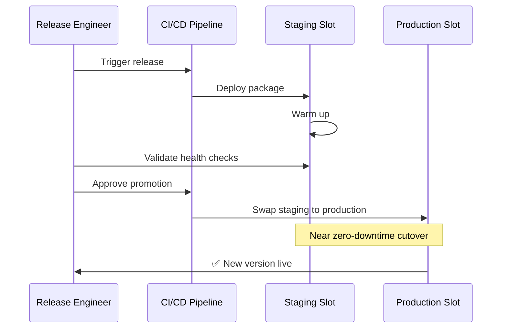

# Deployment Slots Operations

Use deployment slots to deliver releases with minimal risk, perform validation before production exposure, and roll back quickly when needed. This guide covers slot lifecycle, swap patterns, and operational safeguards.



## Prerequisites

- App Service Plan tier **Standard or higher**
- Existing Web App and production slot
- Health endpoint for smoke checks (for example `/health`)
- Variables set:
    - `RG`
    - `APP_NAME`
    - `PLAN_NAME`

## Main Content

### Verify Tier Supports Slots

```bash
az appservice plan show \
  --resource-group $RG \
  --name $PLAN_NAME \
  --query "{sku:sku.name,tier:sku.tier}" \
  --output json
```

If needed, upgrade plan tier:

```bash
az appservice plan update \
  --resource-group $RG \
  --name $PLAN_NAME \
  --sku S1 \
  --output json
```

### Create a Staging Slot

Clone configuration from production to reduce drift:

```bash
az webapp deployment slot create \
  --resource-group $RG \
  --name $APP_NAME \
  --slot staging \
  --configuration-source $APP_NAME \
  --output json
```

List slots:

```bash
az webapp deployment slot list \
  --resource-group $RG \
  --name $APP_NAME \
  --query "[].{name:name,state:state,host:defaultHostName}" \
  --output table
```

### Configure Slot-Specific Settings

Use sticky settings for environment-specific values.

```bash
az webapp config appsettings set \
  --resource-group $RG \
  --name $APP_NAME \
  --slot staging \
  --slot-settings \
    APP_ENVIRONMENT=staging \
    FEATURE_FLAG_NEW_CHECKOUT=true \
  --output json
```

!!! warning "Keep critical secrets slot-sticky"
    Connection strings, external endpoint URLs, and diagnostic keys should be configured as slot settings when values differ between environments.

### Deploy to Staging and Validate

Example deployment with ZIP package:

```bash
az webapp deploy \
  --resource-group $RG \
  --name $APP_NAME \
  --slot staging \
  --src-path ./artifacts/release.zip \
  --type zip \
  --restart true \
  --output json
```

Run health check and smoke test:

```bash
curl --silent --show-error --fail \
  "https://$APP_NAME-staging.azurewebsites.net/health"
```

### Perform Standard Swap

```bash
az webapp deployment slot swap \
  --resource-group $RG \
  --name $APP_NAME \
  --slot staging \
  --target-slot production \
  --output json
```

### Perform Swap with Preview

Use preview when additional verification is required before final cutover.

```bash
az webapp deployment slot swap \
  --resource-group $RG \
  --name $APP_NAME \
  --slot staging \
  --target-slot production \
  --action preview \
  --output json
```

If validation succeeds:

```bash
az webapp deployment slot swap \
  --resource-group $RG \
  --name $APP_NAME \
  --slot staging \
  --target-slot production \
  --action swap \
  --output json
```

If validation fails:

```bash
az webapp deployment slot swap \
  --resource-group $RG \
  --name $APP_NAME \
  --slot staging \
  --target-slot production \
  --action reset \
  --output json
```

### Roll Back Quickly

Rollback is usually a reverse swap.

```bash
az webapp deployment slot swap \
  --resource-group $RG \
  --name $APP_NAME \
  --slot staging \
  --target-slot production \
  --output json
```

### Use Traffic Routing for Canary Testing

Route a small percentage of production traffic to staging.

```bash
az webapp traffic-routing set \
  --resource-group $RG \
  --name $APP_NAME \
  --distribution staging=10 \
  --output json
```

Disable route split:

```bash
az webapp traffic-routing set \
  --resource-group $RG \
  --name $APP_NAME \
  --distribution staging=0 \
  --output json
```

### Automate Slot Creation with Bicep

```bicep
param location string
param webAppName string

resource webApp 'Microsoft.Web/sites@2022-09-01' existing = {
  name: webAppName
}

resource stagingSlot 'Microsoft.Web/sites/slots@2022-09-01' = {
  name: 'staging'
  parent: webApp
  location: location
  properties: {
    siteConfig: {
      appSettings: [
        {
          name: 'SLOT_NAME'
          value: 'staging'
        }
      ]
    }
  }
}
```

### Inspect Current Swap and Routing State

```bash
az webapp show \
  --resource-group $RG \
  --name $APP_NAME \
  --query "{host:defaultHostName,rampUpRules:experiments.rampUpRules,slotSwapStatus:slotSwapStatus}" \
  --output json
```

Sample output (PII-masked):

```json
{
  "host": "app-shared-platform.azurewebsites.net",
  "rampUpRules": [
    {
      "actionHostName": "app-shared-platform-staging.azurewebsites.net",
      "reroutePercentage": 10
    }
  ],
  "slotSwapStatus": null
}
```

### Operational Checklist

Before swap:

1. Staging deployment completed successfully
2. Health endpoint returns success
3. Critical dependencies reachable
4. Sticky settings validated
5. Rollback owner and command prepared

After swap:

1. Production health checks pass
2. Error rate and latency are within thresholds
3. Route split reset if canary test was used
4. Incident channel observes no regression window alerts

### Troubleshooting

#### Slot not available

- Confirm plan is Standard/Premium tier
- Confirm slot count limit not exceeded

#### Swap fails due to unhealthy target

- Validate both slots are running
- Check health endpoint and startup logs
- Verify access restrictions do not block platform probes

#### Sticky setting not retained

- Ensure setting exists on both slots
- Reapply with `--slot-settings`

#### Canary behavior seems inconsistent

- Browser may be pinned by `x-ms-routing-name` cookie
- Test using private browsing or clear cookies

## Advanced Topics

### Release Strategies

- **Blue/green:** full swap from staging to production
- **Canary:** partial traffic routing to staging first
- **Ring-based:** multiple slot environments with sequential promotion

### Safe Deployment Gates

Use automated and manual gates before production swap:

- synthetic checks
- dependency checks
- performance regression threshold checks
- approver gate in CI/CD environment

### Slot Design at Scale

- Standardize slot names (`staging`, `preprod`, `hotfix`)
- Keep slot configuration under IaC
- Periodically compare slot settings to detect drift

!!! info "Enterprise Considerations"
    For critical workloads, require swap-with-preview plus automated smoke tests and a manual approval gate. Keep a documented rollback objective (for example, within 5 minutes).

## Language-Specific Details

For language-specific operational guidance, see:
- [Node.js Guide](../language-guides/nodejs/index.md)
- [Python Guide](../language-guides/python/index.md)
- [Java Guide](../language-guides/java/index.md)
- [.NET Guide](../language-guides/dotnet/index.md)

## See Also

- [Operations Index](./index.md)
- [Health and Recovery](./health-recovery.md)
- [Security](./security.md)
- [Deployment slots (Microsoft Learn)](https://learn.microsoft.com/azure/app-service/deploy-staging-slots)
