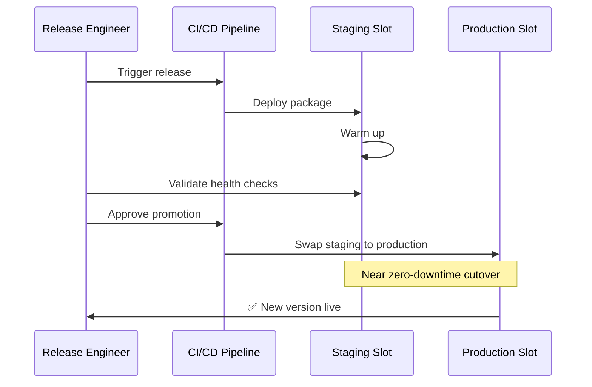

---
content_sources:
  diagrams:
    - id: deployment-slot-release-sequence
      type: sequenceDiagram
      source: mslearn-adapted
      mslearn_url: https://learn.microsoft.com/en-us/azure/app-service/deploy-staging-slots
      based_on:
        - https://learn.microsoft.com/en-us/azure/app-service/deploy-best-practices
content_validation:
  status: verified
  last_reviewed: "2026-06-08"
  reviewer: agent
  core_claims:
    - claim: "Deployment slots require an App Service Plan tier Standard or higher."
      source: "https://learn.microsoft.com/azure/app-service/deploy-staging-slots"
      verified: true
    - claim: "A deployment slot is a live app with its own hostname."
      source: "https://learn.microsoft.com/azure/app-service/deploy-staging-slots"
      verified: true
    - claim: "Connection strings, external endpoint URLs, and other environment-specific values can be configured as slot settings so they stay with the slot during swap."
      source: "https://learn.microsoft.com/azure/app-service/deploy-staging-slots"
      verified: true
    - claim: "App Service supports swap with preview so target-slot settings can be applied before final cutover."
      source: "https://learn.microsoft.com/azure/app-service/deploy-staging-slots"
      verified: true
    - claim: "On Windows, applicationInitialization in web.config declares URLs the platform pings on the target slot before completing a swap."
      source: "https://learn.microsoft.com/azure/app-service/deploy-staging-slots"
      verified: true
    - claim: "On Linux, slot-swap warm-up is controlled by WEBSITE_SWAP_WARMUP_PING_PATH (path to ping) and WEBSITE_SWAP_WARMUP_PING_STATUSES (acceptable response codes; by default all responses are valid)."
      source: "https://learn.microsoft.com/azure/app-service/deploy-staging-slots"
      verified: true
---

# Deployment Slots Operations

Use deployment slots to deliver releases with minimal risk, perform validation before production exposure, and roll back quickly when needed. This guide covers slot lifecycle, swap patterns, and operational safeguards.

<!-- diagram-id: deployment-slot-release-sequence -->

```mermaid
sequenceDiagram
    participant Dev as Release Engineer
    participant CI as CI/CD Pipeline
    participant Staging as Staging Slot
    participant Prod as Production Slot

    Dev->>CI: Trigger release
    CI->>Staging: Deploy package
    Staging->>Staging: Warm up
    Dev->>Staging: Validate health checks
    Dev->>CI: Approve promotion
    CI->>Prod: Swap staging to production
    Note over Staging,Prod: Near zero-downtime cutover
    Prod->>Dev: ✅ New version live
```

## Prerequisites

- App Service Plan tier **Standard or higher**
- Existing Web App and production slot
- Health endpoint for smoke checks (for example `/health`)
- Variables set:
    - `RG`
    - `APP_NAME`
    - `PLAN_NAME`

## When to Use

## Procedure

### Verify Tier Supports Slots

```bash
az appservice plan show \
  --resource-group $RG \
  --name $PLAN_NAME \
  --query "{sku:sku.name,tier:sku.tier}" \
  --output json
```

If needed, upgrade plan tier:

```bash
az appservice plan update \
  --resource-group $RG \
  --name $PLAN_NAME \
  --sku S1 \
  --output json
```

### Create a Staging Slot

Clone configuration from production to reduce drift:

```bash
az webapp deployment slot create \
  --resource-group $RG \
  --name $APP_NAME \
  --slot staging \
  --configuration-source $APP_NAME \
  --output json
```

List slots:

```bash
az webapp deployment slot list \
  --resource-group $RG \
  --name $APP_NAME \
  --query "[].{name:name,state:state,host:defaultHostName}" \
  --output table
```

#### Portal view: Deployment slots blade

![Deployment slots blade for the Web App with the command bar offering Save (disabled), Discard (disabled), Add, Swap, Logs, Refresh, and Send us your feedback actions. An info banner reads "Deployment slots are live apps with their own hostnames. App content and configurations elements can be swapped between two deployment slots, including the production slot." A table with columns Name, Status, App service plan, and Traffic % shows two rows: the first is "app-test-20251107" with a green PRODUCTION badge, Status "Running", App service plan "asp-test-20251107", and Traffic % "70" (read-only); the second is "app-test-20251107-staging" with Status "Running", App service plan "asp-test-20251107", and Traffic % "30" (editable). The Deployment group in the left navigation is highlighted.](../assets/operations/deployment-slots/01-deployment-slots.png)

The Deployment slots blade confirms that the `az webapp deployment slot create` command produced the expected topology. Both rows share the same `App service plan` (`asp-test-20251107`) because slots run on the parent plan and consume its worker capacity — sizing the plan for production load alone will starve the staging slot during pre-swap validation. The green `PRODUCTION` badge on the parent slot is the platform's anchor for the swap target, and the editable `Traffic %` column (`70` / `30`) is the canary-routing surface used later in this guide. The toolbar `Swap` action is the manual equivalent of `az webapp deployment slot swap`, and `Logs` is where to look first if a swap fails the post-warm-up health probe.

### Configure Slot-Specific Settings

**For app settings and connection strings, nothing is slot-specific by default.** They follow the code during a swap unless you explicitly mark them with the `--slot-settings` flag (or check the **Deployment slot setting** box in the Portal). A setting created on staging will move to production on swap, which can contaminate production with staging configuration.

Some other categories are already non-swapped by default on the platform side (for example, publishing endpoints, scaling settings, IP restrictions, Always On, and managed identities). Microsoft Learn maintains the authoritative list of which settings swap and which do not — consult it whenever the behavior is ambiguous for a given setting category.

Use sticky settings for any app-setting or connection-string value that must remain pinned to a specific slot (environment name, feature flags, downstream endpoint URLs, diagnostic keys):

```bash
az webapp config appsettings set \
  --resource-group $RG \
  --name $APP_NAME \
  --slot staging \
  --slot-settings \
    APP_ENVIRONMENT=staging \
    FEATURE_FLAG_NEW_CHECKOUT=true \
  --output json
```

Commonly slot-pinned categories:

- Environment identifiers (`APP_ENVIRONMENT`, `DEPLOYMENT_TIER`)
- Feature flags scoped to a specific environment
- External endpoint URLs that differ between staging and production
- Diagnostic and telemetry keys (Application Insights connection strings per environment)
- Connection strings to environment-specific data stores

!!! warning "Keep critical secrets slot-sticky"
    Connection strings, external endpoint URLs, and diagnostic keys should be configured as slot settings when values differ between environments. Forgetting to mark them as sticky is one of the most common causes of post-swap production incidents.

### Configure Slot Warm-Up Before Swap

Slot swap is not instantaneous. Before the platform routes the new slot as production, it sends warm-up requests so the runtime can JIT, hydrate caches, open connection pools, and pass startup health checks. Configure the warm-up surface explicitly — relying on the default site root often misses critical initialization paths.

**Windows: `applicationInitialization` in `web.config`**

Ship a `web.config` in your deployment package that declares the URLs IIS should hit before completing a swap:

```xml
<configuration>
  <system.webServer>
    <applicationInitialization doAppInitAfterRestart="true">
      <add initializationPage="/health" />
      <add initializationPage="/api/warmup" />
    </applicationInitialization>
  </system.webServer>
</configuration>
```

Each `initializationPage` is hit on the target slot during swap, and the swap blocks until each warm-up request returns or times out. Use a lightweight readiness URL plus any expensive paths you want primed (cache load, lookup table hydration, DI container build).

**Linux: `WEBSITE_SWAP_WARMUP_PING_PATH` app setting**

Linux App Service does not honor `web.config`. Use the slot-swap-specific warm-up app settings on the slot being swapped so the platform pings the configured path before completing the swap:

```bash
az webapp config appsettings set \
  --resource-group $RG \
  --name $APP_NAME \
  --slot staging \
  --settings \
    WEBSITE_SWAP_WARMUP_PING_PATH=/health \
    WEBSITE_SWAP_WARMUP_PING_STATUSES=200,202 \
  --output json
```

- `WEBSITE_SWAP_WARMUP_PING_PATH` — path the platform pings on the target slot before completing the swap. Without it, the platform falls back to probing the site root (`/`), which may not exercise the code paths you want primed.
- `WEBSITE_SWAP_WARMUP_PING_STATUSES` — comma-separated list of HTTP status codes that count as a successful warm-up. **By default, every response code (including 5xx) is treated as valid**, so if you want a failing endpoint to actually block the swap, set this explicitly to the codes you accept.

!!! warning "Make warm-up actually gate the swap"
    Because the default `WEBSITE_SWAP_WARMUP_PING_STATUSES` accepts every response code, a warm-up endpoint that returns 5xx will still pass the swap unless you restrict the acceptable codes via the setting above. Set `WEBSITE_SWAP_WARMUP_PING_STATUSES` so that real failures hold the swap. Also keep warm-up paths cheap, idempotent, and independent of swap-time configuration changes — for example, do not call downstream services that are themselves being swapped.

    `WEBSITE_WARMUP_PATH` exists separately and applies to site **restarts** (not specifically to slot swap), so use the `WEBSITE_SWAP_WARMUP_PING_*` settings above to gate the swap itself.

### Deploy to Staging and Validate

Example deployment with ZIP package:

```bash
az webapp deploy \
  --resource-group $RG \
  --name $APP_NAME \
  --slot staging \
  --src-path ./artifacts/release.zip \
  --type zip \
  --restart true \
  --output json
```

Run health check and smoke test:

```bash
curl --silent --show-error --fail \
  "https://$APP_NAME-staging.azurewebsites.net/health"
```

### Perform Standard Swap

```bash
az webapp deployment slot swap \
  --resource-group $RG \
  --name $APP_NAME \
  --slot staging \
  --target-slot production \
  --output json
```

### Perform Swap with Preview

Use preview when additional verification is required before final cutover.

!!! warning "Authentication Limitation"
    Swap with preview cannot be used when App Service authentication (Easy Auth) is enabled on either slot. Disable authentication or use standard swap instead.

```bash
az webapp deployment slot swap \
  --resource-group $RG \
  --name $APP_NAME \
  --slot staging \
  --target-slot production \
  --action preview \
  --output json
```

If validation succeeds:

```bash
az webapp deployment slot swap \
  --resource-group $RG \
  --name $APP_NAME \
  --slot staging \
  --target-slot production \
  --action swap \
  --output json
```

If validation fails:

```bash
az webapp deployment slot swap \
  --resource-group $RG \
  --name $APP_NAME \
  --slot staging \
  --target-slot production \
  --action reset \
  --output json
```

### Roll Back Quickly

Rollback is usually a reverse swap.

```bash
az webapp deployment slot swap \
  --resource-group $RG \
  --name $APP_NAME \
  --slot staging \
  --target-slot production \
  --output json
```

### Use Traffic Routing for Canary Testing

Route a small percentage of production traffic to staging.

```bash
az webapp traffic-routing set \
  --resource-group $RG \
  --name $APP_NAME \
  --distribution staging=10 \
  --output json
```

Disable route split:

```bash
az webapp traffic-routing set \
  --resource-group $RG \
  --name $APP_NAME \
  --distribution staging=0 \
  --output json
```

### Automate Slot Creation with Bicep

```bicep
param location string
param webAppName string

resource webApp 'Microsoft.Web/sites@2022-09-01' existing = {
  name: webAppName
}

resource stagingSlot 'Microsoft.Web/sites/slots@2022-09-01' = {
  name: 'staging'
  parent: webApp
  location: location
  properties: {
    siteConfig: {
      appSettings: [
        {
          name: 'SLOT_NAME'
          value: 'staging'
        }
      ]
    }
  }
}
```

## Verification

```bash
az webapp show \
  --resource-group $RG \
  --name $APP_NAME \
  --query "{host:defaultHostName,rampUpRules:experiments.rampUpRules,slotSwapStatus:slotSwapStatus}" \
  --output json
```

Sample output (PII-masked):

```json
{
  "host": "app-shared-platform.azurewebsites.net",
  "rampUpRules": [
    {
      "actionHostName": "app-shared-platform-staging.azurewebsites.net",
      "reroutePercentage": 10
    }
  ],
  "slotSwapStatus": null
}
```

### Operational Checklist

Before swap:

1. Staging deployment completed successfully
2. Health endpoint returns success
3. Critical dependencies reachable
4. Sticky settings validated
5. Rollback owner and command prepared

After swap:

1. Production health checks pass
2. Error rate and latency are within thresholds
3. Route split reset if canary test was used
4. Incident channel observes no regression window alerts

## Rollback / Troubleshooting

#### Slot not available

- Confirm plan is Standard/Premium tier
- Confirm slot count limit not exceeded

#### Swap fails due to unhealthy target

- Validate both slots are running
- Check health endpoint and startup logs
- Verify access restrictions do not block platform probes

#### Sticky setting not retained

- Ensure setting exists on both slots
- Reapply with `--slot-settings`

#### Canary behavior seems inconsistent

- Browser may be pinned by `x-ms-routing-name` cookie
- Test using private browsing or clear cookies

## Advanced Topics

### Release Strategies

- **Blue/green:** full swap from staging to production
- **Canary:** partial traffic routing to staging first
- **Ring-based:** multiple slot environments with sequential promotion

### Safe Deployment Gates

Use automated and manual gates before production swap:

- synthetic checks
- dependency checks
- performance regression threshold checks
- approver gate in CI/CD environment

### Slot Design at Scale

- Standardize slot names (`staging`, `preprod`, `hotfix`)
- Keep slot configuration under IaC
- Periodically compare slot settings to detect drift

!!! info "Enterprise Considerations"
    For critical workloads, require swap-with-preview plus automated smoke tests and a manual approval gate. Keep a documented rollback objective (for example, within 5 minutes).

## Language-Specific Details

For language-specific operational guidance, see:
- [Node.js Guide](../language-guides/nodejs/index.md)
- [Python Guide](../language-guides/python/index.md)
- [Java Guide](../language-guides/java/index.md)
- [.NET Guide](../language-guides/dotnet/index.md)

## See Also

- [Operations Index](./index.md)
- [Health and Recovery](./health-recovery.md)
- [Security](./security.md)
- [Deployment slots (Microsoft Learn)](https://learn.microsoft.com/azure/app-service/deploy-staging-slots)

## Sources

- [Deployment slots (Microsoft Learn)](https://learn.microsoft.com/azure/app-service/deploy-staging-slots)
