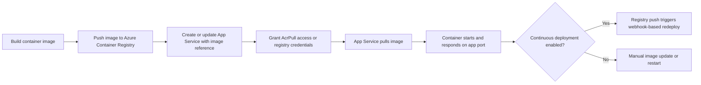

---
hide:
  - toc
content_sources:
  diagrams:
    - id: acr-to-app-service-container-flow
      type: flowchart
      source: self-generated
      justification: "Synthesized from Microsoft Learn guidance for custom containers, managed identity image pulls, and container CI/CD to App Service."
      based_on:
        - https://learn.microsoft.com/en-us/azure/app-service/configure-custom-container
        - https://learn.microsoft.com/en-us/azure/app-service/deploy-ci-cd-custom-container
---

# Container Deploy from Azure Container Registry

Use container deployment when you want App Service to run a custom Linux container image instead of a built-in runtime stack. The deployment unit becomes the container image, so your release process should manage registry access, image versioning, and health validation.

## Main Content

### Container Deployment Flow

<!-- diagram-id: acr-to-app-service-container-flow -->


### Prepare Azure Container Registry

```bash
az acr create \
  --resource-group $RG \
  --name $ACR_NAME \
  --sku Basic \
  --admin-enabled false \
  --output json

az acr build \
  --registry $ACR_NAME \
  --image sample-app:v1 \
  .
```

| Command/Parameter | Purpose |
|---|---|
| `az acr create` | Creates an Azure Container Registry. |
| `--resource-group $RG` | Places the registry in the selected resource group. |
| `--name $ACR_NAME` | Sets the registry name. |
| `--sku Basic` | Chooses the Basic pricing tier for the registry. |
| `--admin-enabled false` | Disables admin username/password access in favor of stronger identity-based access. |
| `--output json` | Returns structured output after registry creation. |
| `az acr build` | Builds the container image in ACR. |
| `--registry $ACR_NAME` | Chooses which registry performs the cloud build. |
| `--image sample-app:v1` | Tags the built image as `sample-app:v1`. |
| `.` | Uses the current directory as the Docker build context. |

### Create a Web App with a Container Image

```bash
az webapp create \
  --resource-group $RG \
  --plan $PLAN_NAME \
  --name $APP_NAME \
  --deployment-container-image-name "$ACR_NAME.azurecr.io/sample-app:v1" \
  --output json
```

| Command/Parameter | Purpose |
|---|---|
| `az webapp create` | Creates the App Service web app. |
| `--resource-group $RG` | Places the app in the selected resource group. |
| `--plan $PLAN_NAME` | Places the app in the specified App Service Plan. |
| `--name $APP_NAME` | Sets the web app name. |
| `--deployment-container-image-name "$ACR_NAME.azurecr.io/sample-app:v1"` | Configures the app to pull and run the specified container image. |
| `--output json` | Returns structured output after app creation. |

### Configure Managed Identity Pull from ACR

```bash
PRINCIPAL_ID=$(az webapp identity assign \
  --resource-group $RG \
  --name $APP_NAME \
  --query principalId \
  --output tsv)

ACR_RESOURCE_ID=$(az acr show \
  --resource-group $RG \
  --name $ACR_NAME \
  --query id \
  --output tsv)

az role assignment create \
  --assignee $PRINCIPAL_ID \
  --scope $ACR_RESOURCE_ID \
  --role AcrPull \
  --output json

az webapp config set \
  --resource-group $RG \
  --name $APP_NAME \
  --generic-configurations '{"acrUseManagedIdentityCreds": true}' \
  --output json
```

| Command/Parameter | Purpose |
|---|---|
| `PRINCIPAL_ID=$(...)` | Captures the web app managed identity principal ID into a shell variable. |
| `az webapp identity assign` | Enables a managed identity on the web app. |
| `--resource-group $RG` | Targets the resource group that contains the app. |
| `--name $APP_NAME` | Selects the web app that needs an identity. |
| `--query principalId` | Returns only the managed identity principal ID. |
| `--output tsv` | Formats the query result for shell variable assignment. |
| `ACR_RESOURCE_ID=$(...)` | Captures the ACR resource ID into a shell variable. |
| `az acr show` | Retrieves metadata about the registry. |
| `--resource-group $RG` | Targets the resource group that contains the registry. |
| `--name $ACR_NAME` | Selects the registry to inspect. |
| `--query id` | Returns only the registry resource ID. |
| `--output tsv` | Formats the query result for shell variable assignment. |
| `az role assignment create` | Creates an RBAC role assignment. |
| `--assignee $PRINCIPAL_ID` | Grants the role to the web app managed identity. |
| `--scope $ACR_RESOURCE_ID` | Applies the role assignment at the registry scope. |
| `--role AcrPull` | Grants image pull permissions on the registry. |
| `--output json` | Returns structured output for the role assignment and final configuration commands. |
| `az webapp config set` | Updates general web app configuration values. |
| `--resource-group $RG` | Targets the resource group that contains the app. |
| `--name $APP_NAME` | Selects the web app whose container pull settings are being updated. |
| `--generic-configurations '{"acrUseManagedIdentityCreds": true}'` | Tells App Service to use managed identity credentials for ACR pulls. |

!!! tip "Prefer managed identity"
    Managed identity is the preferred production approach because it removes long-lived registry passwords from the deployment path.

### Enable Continuous Deployment from ACR

```bash
CI_CD_URL=$(az webapp deployment container config \
  --resource-group $RG \
  --name $APP_NAME \
  --enable-cd true \
  --query CI_CD_URL \
  --output tsv)

az acr webhook create \
  --resource-group $RG \
  --registry $ACR_NAME \
  --name appservice-cd \
  --actions push \
  --uri $CI_CD_URL \
  --scope 'sample-app:v1' \
  --output json
```

| Command/Parameter | Purpose |
|---|---|
| `CI_CD_URL=$(...)` | Captures the App Service webhook URL into a shell variable. |
| `az webapp deployment container config` | Reads or updates App Service container deployment settings. |
| `--resource-group $RG` | Targets the resource group that contains the app. |
| `--name $APP_NAME` | Selects the web app to configure. |
| `--enable-cd true` | Enables continuous deployment for container image updates. |
| `--query CI_CD_URL` | Returns only the webhook URL that App Service exposes. |
| `--output tsv` | Formats the URL for shell variable assignment. |
| `az acr webhook create` | Creates a webhook in ACR. |
| `--resource-group $RG` | Targets the resource group that contains the registry. |
| `--registry $ACR_NAME` | Selects the registry that will emit webhook events. |
| `--name appservice-cd` | Names the webhook resource. |
| `--actions push` | Triggers the webhook when an image is pushed. |
| `--uri $CI_CD_URL` | Sends webhook events to the App Service continuous deployment endpoint. |
| `--scope 'sample-app:v1'` | Limits the webhook to pushes for `sample-app:v1`, so later immutable tags such as `v2` require a scope update or a stable deployment tag strategy. |
| `--output json` | Returns structured webhook creation output. |

!!! warning "Webhook dependency"
    App Service continuous deployment for containers depends on the webhook path remaining valid. Treat webhook configuration as part of the application release infrastructure, not as a one-time portal setting.

### Update the Image on an Existing App

```bash
az webapp config container set \
  --resource-group $RG \
  --name $APP_NAME \
  --docker-custom-image-name "$ACR_NAME.azurecr.io/sample-app:v2" \
  --docker-registry-server-url "https://$ACR_NAME.azurecr.io" \
  --output json
```

| Command/Parameter | Purpose |
|---|---|
| `az webapp config container set` | Updates container settings for an existing web app. |
| `--resource-group $RG` | Targets the resource group that contains the app. |
| `--name $APP_NAME` | Selects the web app to update. |
| `--docker-custom-image-name "$ACR_NAME.azurecr.io/sample-app:v2"` | Points the app to the newer `v2` image tag. |
| `--docker-registry-server-url "https://$ACR_NAME.azurecr.io"` | Declares the registry endpoint where the image is hosted. |
| `--output json` | Returns structured output after the configuration update. |

### Multi-Container Note

App Service supports Docker Compose for multi-container scenarios, but Microsoft Learn currently positions sidecar containers as the long-term direction and notes Docker Compose retirement on **March 31, 2027**.

```bash
az webapp config container set \
  --resource-group $RG \
  --name $APP_NAME \
  --multicontainer-config-file ./docker-compose.yml \
  --output json
```

| Command/Parameter | Purpose |
|---|---|
| `az webapp config container set` | Updates the app to use a multi-container configuration. |
| `--resource-group $RG` | Targets the resource group that contains the app. |
| `--name $APP_NAME` | Selects the web app to update. |
| `--multicontainer-config-file ./docker-compose.yml` | Supplies the Docker Compose file that defines the multi-container app. |
| `--output json` | Returns structured output after the configuration update. |

!!! note "Plan for sidecar migration"
    If you are starting a new design, prefer App Service sidecar container patterns over Docker Compose. Use Docker Compose only when you are maintaining an existing multi-container deployment model.

## Advanced Topics

### Runtime Settings to Remember

- Set `WEBSITES_PORT` if the container listens on a port other than 80.
- Use `WEBSITES_ENABLE_APP_SERVICE_STORAGE=true` only when the app requires persistent `/home` storage.
- For private endpoint registries, route image pulls through virtual network integration where required.

### Verification Commands

```bash
az webapp config container show \
  --resource-group $RG \
  --name $APP_NAME \
  --output json

az webapp log tail \
  --resource-group $RG \
  --name $APP_NAME
```

| Command/Parameter | Purpose |
|---|---|
| `az webapp config container show` | Displays the current container configuration for the app. |
| `--resource-group $RG` | Targets the resource group that contains the app. |
| `--name $APP_NAME` | Selects the web app to inspect. |
| `--output json` | Returns the container configuration in JSON format. |
| `az webapp log tail` | Streams live application and container logs. |
| `--resource-group $RG` | Targets the resource group that contains the app. |
| `--name $APP_NAME` | Selects the web app whose logs should be tailed. |

## See Also

- [Deployment Methods](./index.md)
- [Slots and Swap](./slots-and-swap.md)
- [Deployment Slots Operations](../deployment-slots.md)

## Sources

- [Configure a Custom Container for Azure App Service (Microsoft Learn)](https://learn.microsoft.com/en-us/azure/app-service/configure-custom-container)
- [Configure CI/CD to Custom Containers in Azure App Service (Microsoft Learn)](https://learn.microsoft.com/en-us/azure/app-service/deploy-ci-cd-custom-container)
