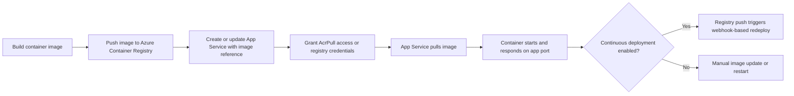

---
hide:
  - toc
content_sources:
  diagrams:
    - id: acr-to-app-service-container-flow
      type: flowchart
      source: self-generated
      justification: "Synthesized from Microsoft Learn guidance for custom containers, managed identity image pulls, and container CI/CD to App Service."
      based_on:
        - https://learn.microsoft.com/en-us/azure/app-service/configure-custom-container
        - https://learn.microsoft.com/en-us/azure/app-service/deploy-ci-cd-custom-container
---

# Container Deploy from Azure Container Registry

Use container deployment when you want App Service to run a custom Linux container image instead of a built-in runtime stack. The deployment unit becomes the container image, so your release process should manage registry access, image versioning, and health validation.

## Main Content

### Container Deployment Flow

<!-- diagram-id: acr-to-app-service-container-flow -->


### Prepare Azure Container Registry

```bash
az acr create \
  --resource-group $RG \
  --name $ACR_NAME \
  --sku Basic \
  --admin-enabled false \
  --output json

az acr build \
  --registry $ACR_NAME \
  --image sample-app:v1 \
  .
```

| Command Part | Explanation |
|---|---|
| `az acr create` | Creates an Azure Container Registry for storing private images. |
| `--admin-enabled false` | Keeps the registry on the more secure path of identity-based access. |
| `az acr build` | Builds the image in Azure Container Registry and tags it as `sample-app:v1`. |

### Create a Web App with a Container Image

```bash
az webapp create \
  --resource-group $RG \
  --plan $PLAN_NAME \
  --name $APP_NAME \
  --deployment-container-image-name "$ACR_NAME.azurecr.io/sample-app:v1" \
  --output json
```

| Command Part | Explanation |
|---|---|
| `az webapp create` | Creates the App Service app. |
| `--plan $PLAN_NAME` | Places the app in the selected App Service Plan. |
| `--deployment-container-image-name ...` | Tells App Service which container image to pull and run. |

### Configure Managed Identity Pull from ACR

```bash
PRINCIPAL_ID=$(az webapp identity assign \
  --resource-group $RG \
  --name $APP_NAME \
  --query principalId \
  --output tsv)

ACR_RESOURCE_ID=$(az acr show \
  --resource-group $RG \
  --name $ACR_NAME \
  --query id \
  --output tsv)

az role assignment create \
  --assignee $PRINCIPAL_ID \
  --scope $ACR_RESOURCE_ID \
  --role AcrPull \
  --output json

az webapp config set \
  --resource-group $RG \
  --name $APP_NAME \
  --generic-configurations '{"acrUseManagedIdentityCreds": true}' \
  --output json
```

| Command Part | Explanation |
|---|---|
| `az webapp identity assign` | Enables a managed identity on the web app and returns its principal ID. |
| `az acr show` | Retrieves the registry resource ID needed for RBAC scope. |
| `az role assignment create --role AcrPull` | Grants the web app permission to pull images from ACR. |
| `az webapp config set --generic-configurations '{"acrUseManagedIdentityCreds": true}'` | Tells App Service to use managed identity instead of registry username and password. |

!!! tip "Prefer managed identity"
    Managed identity is the preferred production approach because it removes long-lived registry passwords from the deployment path.

### Enable Continuous Deployment from ACR

```bash
CI_CD_URL=$(az webapp deployment container config \
  --resource-group $RG \
  --name $APP_NAME \
  --enable-cd true \
  --query CI_CD_URL \
  --output tsv)

az acr webhook create \
  --resource-group $RG \
  --registry $ACR_NAME \
  --name appservice-cd \
  --actions push \
  --uri $CI_CD_URL \
  --scope 'sample-app:v1' \
  --output json
```

| Command Part | Explanation |
|---|---|
| `az webapp deployment container config --enable-cd true` | Enables App Service container CD and returns the webhook URL. |
| `--query CI_CD_URL --output tsv` | Extracts the webhook endpoint so it can be reused in the next command. |
| `az acr webhook create` | Creates an ACR webhook that notifies App Service when a matching image tag is pushed. |
| `--scope 'sample-app:v1'` | Limits notifications to pushes for the specified repository and tag pattern. |

!!! warning "Webhook dependency"
    App Service continuous deployment for containers depends on the webhook path remaining valid. Treat webhook configuration as part of the application release infrastructure, not as a one-time portal setting.

### Update the Image on an Existing App

```bash
az webapp config container set \
  --resource-group $RG \
  --name $APP_NAME \
  --docker-custom-image-name "$ACR_NAME.azurecr.io/sample-app:v2" \
  --docker-registry-server-url "https://$ACR_NAME.azurecr.io" \
  --output json
```

| Command Part | Explanation |
|---|---|
| `az webapp config container set` | Updates the container configuration for an existing app. |
| `--docker-custom-image-name ...:v2` | Points the app at a newer image tag. |
| `--docker-registry-server-url` | Declares the registry endpoint where the image is hosted. |

### Multi-Container Note

App Service supports Docker Compose for multi-container scenarios, but Microsoft Learn currently positions sidecar containers as the long-term direction and notes Docker Compose retirement on **March 31, 2027**.

```bash
az webapp config container set \
  --resource-group $RG \
  --name $APP_NAME \
  --multicontainer-config-file ./docker-compose.yml \
  --output json
```

| Command Part | Explanation |
|---|---|
| `--multicontainer-config-file ./docker-compose.yml` | Applies a Docker Compose definition for a multi-container app. |
| `--output json` | Returns the applied configuration result for validation or scripting. |

!!! note "Plan for sidecar migration"
    If you are starting a new design, prefer App Service sidecar container patterns over Docker Compose. Use Docker Compose only when you are maintaining an existing multi-container deployment model.

## Advanced Topics

### Runtime Settings to Remember

- Set `WEBSITES_PORT` if the container listens on a port other than 80.
- Use `WEBSITES_ENABLE_APP_SERVICE_STORAGE=true` only when the app requires persistent `/home` storage.
- For private endpoint registries, route image pulls through virtual network integration where required.

### Verification Commands

```bash
az webapp config container show \
  --resource-group $RG \
  --name $APP_NAME \
  --output json

az webapp log tail \
  --resource-group $RG \
  --name $APP_NAME
```

| Command | Purpose |
|---|---|
| `az webapp config container show ...` | Confirms the active image and container registry configuration. |
| `az webapp log tail ...` | Streams startup and container logs to validate image pull and app readiness. |

## See Also

- [Deployment Methods](./index.md)
- [Slots and Swap](./slots-and-swap.md)
- [Deployment Slots Operations](../deployment-slots.md)

## Sources

- [Configure a Custom Container for Azure App Service (Microsoft Learn)](https://learn.microsoft.com/en-us/azure/app-service/configure-custom-container)
- [Configure CI/CD to Custom Containers in Azure App Service (Microsoft Learn)](https://learn.microsoft.com/en-us/azure/app-service/deploy-ci-cd-custom-container)
