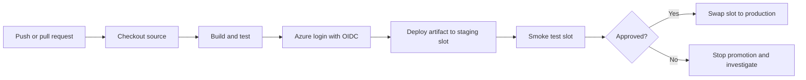

---
hide:
  - toc
content_sources:
  diagrams:
    - id: github-actions-app-service-release-flow
      type: flowchart
      source: mslearn-adapted
      mslearn_url: https://learn.microsoft.com/en-us/azure/app-service/deploy-github-actions
      based_on:
        - https://learn.microsoft.com/en-us/azure/developer/github/connect-from-azure
---

# GitHub Actions CI/CD

Use GitHub Actions when your source code already lives in GitHub and you want one workflow to build, test, authenticate to Azure, and deploy to App Service. This is the most flexible deployment method for teams that need repeatability and gated releases.

## Main Content

### GitHub Actions Release Flow

<!-- diagram-id: github-actions-app-service-release-flow -->


### Authentication and Secrets

Microsoft Learn recommends OpenID Connect (OIDC) for GitHub Actions because it avoids long-lived secrets. For an App Service deployment workflow, the usual repository secrets are:

| Secret | Purpose |
|---|---|
| `AZURE_CLIENT_ID` | Microsoft Entra application or managed identity client ID used by `azure/login`. |
| `AZURE_TENANT_ID` | Tenant ID for the Azure directory. |
| `AZURE_SUBSCRIPTION_ID` | Subscription that contains the App Service app. |

!!! tip "Prefer OIDC over publish profiles"
    Publish profiles work, but OIDC is the better long-term choice because GitHub exchanges a short-lived token at runtime instead of storing a reusable deployment credential.

### Workflow Template

```yaml
name: deploy-app-service

on:
  push:
    branches:
      - main

permissions:
  id-token: write
  contents: read

env:
  AZURE_WEBAPP_NAME: my-app-service
  PACKAGE_PATH: ./dist

jobs:
  build-and-deploy:
    runs-on: ubuntu-latest

    steps:
      - name: Checkout repository
        uses: actions/checkout@v4

      - name: Build application
        run: |
          npm ci
          npm run build
          npm test

      - name: Sign in to Azure
        uses: azure/login@v2
        with:
          client-id: ${{ secrets.AZURE_CLIENT_ID }}
          tenant-id: ${{ secrets.AZURE_TENANT_ID }}
          subscription-id: ${{ secrets.AZURE_SUBSCRIPTION_ID }}

      - name: Deploy to production app
        uses: azure/webapps-deploy@v3
        with:
          app-name: ${{ env.AZURE_WEBAPP_NAME }}
          package: ${{ env.PACKAGE_PATH }}
```

| YAML Section | Explanation |
|---|---|
| `on.push.branches` | Runs the workflow for commits merged into `main`. |
| `permissions.id-token: write` | Allows GitHub to mint an OIDC token for Azure login. |
| `actions/checkout@v4` | Downloads repository contents to the runner. |
| `Build application` | Restores dependencies, builds the app, and runs tests before deployment. |
| `azure/login@v2` | Authenticates the workflow to Azure using repository secrets. |
| `azure/webapps-deploy@v3` | Pushes the prepared package or folder to Azure App Service. |

### Deploy to a Staging Slot

```yaml
      - name: Deploy to staging slot
        uses: azure/webapps-deploy@v3
        with:
          app-name: ${{ env.AZURE_WEBAPP_NAME }}
          slot-name: staging
          package: ${{ env.PACKAGE_PATH }}
```

| YAML Key | Explanation |
|---|---|
| `slot-name: staging` | Targets the staging deployment slot instead of production. |
| `package` | Deploys the already built output rather than rebuilding during release. |

### Complete Example with Slot Deployment and Swap

```yaml
name: build-validate-promote

on:
  push:
    branches:
      - main

permissions:
  id-token: write
  contents: read

env:
  AZURE_WEBAPP_NAME: my-app-service
  RESOURCE_GROUP: rg-app-service-prod
  PACKAGE_PATH: ./dist
  SLOT_NAME: staging

jobs:
  deploy:
    runs-on: ubuntu-latest

    steps:
      - name: Checkout repository
        uses: actions/checkout@v4

      - name: Set up Node.js
        uses: actions/setup-node@v4
        with:
          node-version: '20'

      - name: Install, build, and test
        run: |
          npm ci
          npm run build
          npm test

      - name: Sign in to Azure
        uses: azure/login@v2
        with:
          client-id: ${{ secrets.AZURE_CLIENT_ID }}
          tenant-id: ${{ secrets.AZURE_TENANT_ID }}
          subscription-id: ${{ secrets.AZURE_SUBSCRIPTION_ID }}

      - name: Deploy package to staging slot
        uses: azure/webapps-deploy@v3
        with:
          app-name: ${{ env.AZURE_WEBAPP_NAME }}
          slot-name: ${{ env.SLOT_NAME }}
          package: ${{ env.PACKAGE_PATH }}

      - name: Smoke test staging slot
        run: |
          curl --silent --show-error --fail "https://${{ env.AZURE_WEBAPP_NAME }}-${{ env.SLOT_NAME }}.azurewebsites.net/health"

      - name: Swap staging into production
        run: |
          az webapp deployment slot swap \
            --resource-group $RESOURCE_GROUP \
            --name $AZURE_WEBAPP_NAME \
            --slot $SLOT_NAME \
            --target-slot production \
            --output json
```

| Workflow Segment | Explanation |
|---|---|
| `actions/setup-node@v4` | Prepares the runtime used to build the application. |
| `Deploy package to staging slot` | Sends the validated build output to the nonproduction slot first. |
| `Smoke test staging slot` | Verifies the deployed version before promotion. |
| `az webapp deployment slot swap` | Promotes the staging slot to production after validation passes. |

!!! note "Manual approval option"
    For stricter release control, split deployment and swap into separate jobs and protect the production environment with GitHub environment approvals.

## Advanced Topics

### Secret and Credential Guidance

- Limit the Azure role assignment scope to the specific App Service resource when possible.
- Keep build secrets separate from deployment identity secrets.
- Avoid mixing publish-profile deployments and OIDC-based deployments in the same workflow unless migration is intentional.

### Build Strategy Guidance

- Build the application in GitHub Actions, then deploy the built output.
- For compiled stacks such as TypeScript, Java, or .NET, avoid deploying raw source unless App Service build automation is explicitly required.
- Pair Actions with slots for rollback-friendly production releases.

## See Also

- [Deployment Methods](./index.md)
- [ZIP Deploy](./zip-deploy.md)
- [Slots and Swap](./slots-and-swap.md)

## Sources

- [Deploy to Azure App Service by Using GitHub Actions (Microsoft Learn)](https://learn.microsoft.com/en-us/azure/app-service/deploy-github-actions)
- [Connect GitHub Actions to Azure (Microsoft Learn)](https://learn.microsoft.com/en-us/azure/developer/github/connect-from-azure)
