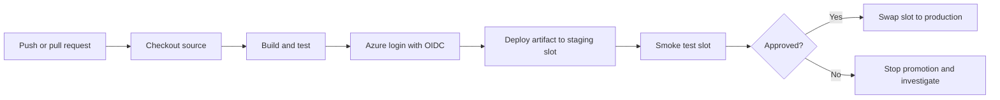

---
content_sources:
  diagrams:
    - id: github-actions-app-service-release-flow
      type: flowchart
      source: mslearn-adapted
      mslearn_url: https://learn.microsoft.com/en-us/azure/app-service/deploy-github-actions
      based_on:
        - https://learn.microsoft.com/en-us/azure/developer/github/connect-from-azure
content_validation:
  status: verified
  last_reviewed: "2026-04-12"
  reviewer: ai-agent
  core_claims:
    - claim: "Microsoft Learn recommends OpenID Connect for GitHub Actions authentication to Azure because it avoids long-lived secrets."
      source: "https://learn.microsoft.com/azure/app-service/deploy-github-actions"
      verified: true
    - claim: "An App Service deployment workflow in GitHub Actions commonly uses azure/login to authenticate and azure/webapps-deploy to deploy."
      source: "https://learn.microsoft.com/azure/app-service/deploy-github-actions"
      verified: true
    - claim: "The azure/webapps-deploy action supports deployment to an App Service deployment slot."
      source: "https://learn.microsoft.com/azure/app-service/deploy-github-actions"
      verified: true
---

# GitHub Actions CI/CD

Use GitHub Actions when your source code already lives in GitHub and you want one workflow to build, test, authenticate to Azure, and deploy to App Service. This is the most flexible deployment method for teams that need repeatability and gated releases.

## Main Content

### GitHub Actions Release Flow

<!-- diagram-id: github-actions-app-service-release-flow -->


### Authentication and Secrets

Microsoft Learn recommends OpenID Connect (OIDC) for GitHub Actions because it avoids long-lived secrets. For an App Service deployment workflow, the usual repository secrets are:

| Secret | Purpose |
|---|---|
| `AZURE_CLIENT_ID` | Microsoft Entra application or managed identity client ID used by `azure/login`. |
| `AZURE_TENANT_ID` | Tenant ID for the Azure directory. |
| `AZURE_SUBSCRIPTION_ID` | Subscription that contains the App Service app. |

!!! tip "Prefer OIDC over publish profiles"
    Publish profiles work, but OIDC is the better long-term choice because GitHub exchanges a short-lived token at runtime instead of storing a reusable deployment credential.

### Workflow Template

```yaml
name: deploy-app-service

on:
  push:
    branches:
      - main

permissions:
  id-token: write
  contents: read

env:
  AZURE_WEBAPP_NAME: my-app-service
  PACKAGE_PATH: ./dist

jobs:
  build-and-deploy:
    runs-on: ubuntu-latest

    steps:
      - name: Checkout repository
        uses: actions/checkout@v4

      - name: Build application
        run: |
          npm ci
          npm run build
          npm test

      - name: Sign in to Azure
        uses: azure/login@v2
        with:
          client-id: ${{ secrets.AZURE_CLIENT_ID }}
          tenant-id: ${{ secrets.AZURE_TENANT_ID }}
          subscription-id: ${{ secrets.AZURE_SUBSCRIPTION_ID }}

      - name: Deploy to production app
        uses: azure/webapps-deploy@v3
        with:
          app-name: ${{ env.AZURE_WEBAPP_NAME }}
          package: ${{ env.PACKAGE_PATH }}
```

| Command/Parameter | Purpose |
|---|---|
| `name: deploy-app-service` | Gives the workflow a readable name in GitHub Actions. |
| `on:` | Declares the events that trigger the workflow. |
| `push:` | Runs the workflow when code is pushed. |
| `branches:` | Starts the branch filter list for the push trigger. |
| `- main` | Limits the push trigger to the `main` branch. |
| `permissions:` | Defines the GitHub token permissions available to the job. |
| `id-token: write` | Allows the workflow to request an OIDC token for Azure authentication. |
| `contents: read` | Allows the job to read repository contents. |
| `env:` | Defines reusable environment variables for later steps. |
| `AZURE_WEBAPP_NAME: my-app-service` | Stores the target App Service name. |
| `PACKAGE_PATH: ./dist` | Stores the path to the built deployment artifact or folder. |
| `jobs:` | Starts the workflow job definitions. |
| `build-and-deploy:` | Names the job that builds and deploys the application. |
| `runs-on: ubuntu-latest` | Chooses the GitHub-hosted runner image. |
| `steps:` | Lists the ordered actions the runner executes. |
| `name: Checkout repository` | Labels the source checkout step in the Actions log. |
| `uses: actions/checkout@v4` | Checks out the repository onto the runner. |
| `name: Build application` | Labels the build and test step in the Actions log. |
| `run: |` | Starts a multiline shell script step. |
| `npm ci` | Installs dependencies from the lockfile for a reproducible build. |
| `npm run build` | Builds the application before deployment. |
| `npm test` | Runs automated tests before release. |
| `name: Sign in to Azure` | Labels the Azure authentication step in the Actions log. |
| `uses: azure/login@v2` | Signs in to Azure from GitHub Actions. |
| `with:` | Supplies input parameters to the Azure login action. |
| `client-id: ${{ secrets.AZURE_CLIENT_ID }}` | Passes the Microsoft Entra application or managed identity client ID from the `AZURE_CLIENT_ID` repository secret. |
| `tenant-id: ${{ secrets.AZURE_TENANT_ID }}` | Passes the Azure tenant ID from the `AZURE_TENANT_ID` repository secret. |
| `subscription-id: ${{ secrets.AZURE_SUBSCRIPTION_ID }}` | Passes the Azure subscription ID from the `AZURE_SUBSCRIPTION_ID` repository secret. |
| `name: Deploy to production app` | Labels the production deployment step in the Actions log. |
| `uses: azure/webapps-deploy@v3` | Deploys the package or folder to Azure App Service. |
| `with:` | Supplies input parameters to the App Service deployment action. |
| `app-name: ${{ env.AZURE_WEBAPP_NAME }}` | Identifies which App Service app receives the deployment by reusing the workflow environment variable. |
| `package: ${{ env.PACKAGE_PATH }}` | Points the deploy action to the prepared build output by reusing the workflow environment variable. |

### Deploy to a Staging Slot

```yaml
      - name: Deploy to staging slot
        uses: azure/webapps-deploy@v3
        with:
          app-name: ${{ env.AZURE_WEBAPP_NAME }}
          slot-name: staging
          package: ${{ env.PACKAGE_PATH }}
```

| Command/Parameter | Purpose |
|---|---|
| `name: Deploy to staging slot` | Labels the deployment step in the workflow log. |
| `uses: azure/webapps-deploy@v3` | Uses the App Service deployment action. |
| `with:` | Supplies inputs to the deployment action. |
| `app-name: ${{ env.AZURE_WEBAPP_NAME }}` | Selects the target App Service app by reusing the workflow environment variable. |
| `slot-name: staging` | Directs the deployment to the `staging` slot. |
| `package: ${{ env.PACKAGE_PATH }}` | Reuses the build output path from the workflow environment variable. |

### Complete Example with Slot Deployment and Swap

```yaml
name: build-validate-promote

on:
  push:
    branches:
      - main

permissions:
  id-token: write
  contents: read

env:
  AZURE_WEBAPP_NAME: my-app-service
  RESOURCE_GROUP: rg-app-service-prod
  PACKAGE_PATH: ./dist
  SLOT_NAME: staging

jobs:
  deploy:
    runs-on: ubuntu-latest

    steps:
      - name: Checkout repository
        uses: actions/checkout@v4

      - name: Set up Node.js
        uses: actions/setup-node@v4
        with:
          node-version: '20'

      - name: Install, build, and test
        run: |
          npm ci
          npm run build
          npm test

      - name: Sign in to Azure
        uses: azure/login@v2
        with:
          client-id: ${{ secrets.AZURE_CLIENT_ID }}
          tenant-id: ${{ secrets.AZURE_TENANT_ID }}
          subscription-id: ${{ secrets.AZURE_SUBSCRIPTION_ID }}

      - name: Deploy package to staging slot
        uses: azure/webapps-deploy@v3
        with:
          app-name: ${{ env.AZURE_WEBAPP_NAME }}
          slot-name: ${{ env.SLOT_NAME }}
          package: ${{ env.PACKAGE_PATH }}

      - name: Smoke test staging slot
        run: |
          curl --silent --show-error --fail "https://${{ env.AZURE_WEBAPP_NAME }}-${{ env.SLOT_NAME }}.azurewebsites.net/health"

      - name: Swap staging into production
        run: |
          az webapp deployment slot swap \
            --resource-group $RESOURCE_GROUP \
            --name $AZURE_WEBAPP_NAME \
            --slot $SLOT_NAME \
            --target-slot production \
            --output json
```

| Command/Parameter | Purpose |
|---|---|
| `name: build-validate-promote` | Gives the end-to-end release workflow a readable name. |
| `on:` | Declares the events that start the workflow. |
| `push:` | Triggers the workflow on pushes. |
| `branches:` | Starts the branch filter list for the push trigger. |
| `- main` | Restricts the trigger to the `main` branch. |
| `permissions:` | Defines GitHub token permissions for the workflow. |
| `id-token: write` | Allows OIDC authentication to Azure. |
| `contents: read` | Allows repository checkout. |
| `env:` | Centralizes values reused across multiple steps. |
| `AZURE_WEBAPP_NAME: my-app-service` | Stores the production app name. |
| `RESOURCE_GROUP: rg-app-service-prod` | Stores the resource group name used by Azure CLI commands. |
| `PACKAGE_PATH: ./dist` | Stores the path to the built artifact. |
| `SLOT_NAME: staging` | Stores the deployment slot name used during promotion. |
| `jobs:` | Starts the job definitions. |
| `deploy:` | Names the job that performs deployment and promotion. |
| `runs-on: ubuntu-latest` | Chooses the Linux runner image. |
| `steps:` | Lists the ordered workflow steps. |
| `name: Checkout repository` | Labels the checkout step in the workflow log. |
| `uses: actions/checkout@v4` | Downloads the repository contents. |
| `name: Set up Node.js` | Labels the Node.js setup step in the workflow log. |
| `uses: actions/setup-node@v4` | Installs the requested Node.js runtime on the runner. |
| `with:` | Supplies input parameters to the Node.js setup action. |
| `node-version: '20'` | Pins the Node.js major version for the build. |
| `name: Install, build, and test` | Labels the build validation step in the workflow log. |
| `run: |` | Starts a multiline shell script step. |
| `npm ci` | Installs dependencies from the lockfile. |
| `npm run build` | Builds the application. |
| `npm test` | Runs the test suite before deployment. |
| `name: Sign in to Azure` | Labels the Azure authentication step in the workflow log. |
| `uses: azure/login@v2` | Authenticates the runner to Azure. |
| `with:` | Supplies input parameters to the Azure login action. |
| `client-id: ${{ secrets.AZURE_CLIENT_ID }}` | Passes the client ID for OIDC login from the `AZURE_CLIENT_ID` repository secret. |
| `tenant-id: ${{ secrets.AZURE_TENANT_ID }}` | Passes the tenant ID for OIDC login from the `AZURE_TENANT_ID` repository secret. |
| `subscription-id: ${{ secrets.AZURE_SUBSCRIPTION_ID }}` | Passes the subscription ID for OIDC login from the `AZURE_SUBSCRIPTION_ID` repository secret. |
| `name: Deploy package to staging slot` | Labels the staged deployment step in the workflow log. |
| `uses: azure/webapps-deploy@v3` | Deploys the package to App Service. |
| `with:` | Supplies input parameters to the App Service deployment action. |
| `app-name: ${{ env.AZURE_WEBAPP_NAME }}` | Identifies the destination App Service app by reusing the workflow environment variable. |
| `slot-name: ${{ env.SLOT_NAME }}` | Identifies the destination slot for the staged deployment by reusing the workflow environment variable. |
| `package: ${{ env.PACKAGE_PATH }}` | Points the deploy action to the build artifact by reusing the workflow environment variable. |
| `name: Smoke test staging slot` | Labels the post-deployment health check step in the workflow log. |
| `run: |` | Starts the multiline shell command that verifies the staging slot health endpoint. |
| `curl --silent --show-error --fail "https://${{ env.AZURE_WEBAPP_NAME }}-${{ env.SLOT_NAME }}.azurewebsites.net/health"` | Calls the staging slot health endpoint after deployment. |
| `name: Swap staging into production` | Labels the production promotion step in the workflow log. |
| `run: |` | Starts the multiline shell command that swaps the staging slot into production. |
| `az webapp deployment slot swap` | Promotes the staged release into production. |
| `--resource-group $RESOURCE_GROUP` | Selects the resource group that contains the app. |
| `--name $AZURE_WEBAPP_NAME` | Selects the App Service app to swap. |
| `--slot $SLOT_NAME` | Chooses the source slot that holds the candidate release. |
| `--target-slot production` | Chooses production as the destination slot. |
| `--output json` | Returns structured CLI output for logging or troubleshooting. |

!!! note "Manual approval option"
    For stricter release control, split deployment and swap into separate jobs and protect the production environment with GitHub environment approvals.

## Advanced Topics

### Secret and Credential Guidance

- Limit the Azure role assignment scope to the specific App Service resource when possible.
- Keep build secrets separate from deployment identity secrets.
- Avoid mixing publish-profile deployments and OIDC-based deployments in the same workflow unless migration is intentional.

### Build Strategy Guidance

- Build the application in GitHub Actions, then deploy the built output.
- For compiled stacks such as TypeScript, Java, or .NET, avoid deploying raw source unless App Service build automation is explicitly required.
- Pair Actions with slots for rollback-friendly production releases.

## See Also

- [Deployment Methods](./index.md)
- [ZIP Deploy](./zip-deploy.md)
- [Slots and Swap](./slots-and-swap.md)

## Sources

- [Deploy to Azure App Service by Using GitHub Actions (Microsoft Learn)](https://learn.microsoft.com/en-us/azure/app-service/deploy-github-actions)
- [Connect GitHub Actions to Azure (Microsoft Learn)](https://learn.microsoft.com/en-us/azure/developer/github/connect-from-azure)
