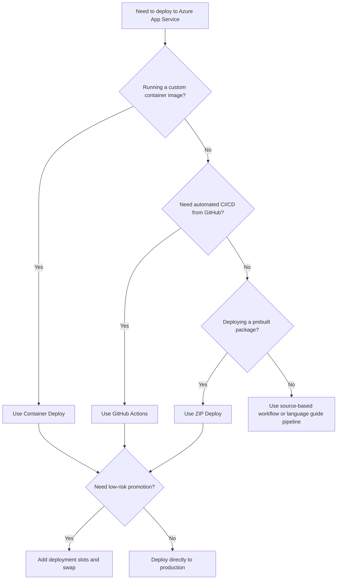

---
content_sources:
  diagrams:
    - id: deployment-method-selection-flow
      type: flowchart
      source: self-generated
      justification: "Synthesized deployment decision flow from Microsoft Learn guidance for ZIP deploy, GitHub Actions, deployment slots, and custom containers."
      based_on:
        - https://learn.microsoft.com/en-us/azure/app-service/deploy-zip
        - https://learn.microsoft.com/en-us/azure/app-service/deploy-github-actions
        - https://learn.microsoft.com/en-us/azure/app-service/deploy-staging-slots
        - https://learn.microsoft.com/en-us/azure/app-service/configure-custom-container
---

# Deployment Methods

Azure App Service supports multiple deployment paths, but they are not interchangeable. The right choice depends on whether you are deploying prebuilt artifacts, source-controlled application code, staged releases, or custom container images.

## Main Content

### Deployment Method Comparison

| Method | Use Case | Pros | Cons |
|---|---|---|---|
| [ZIP Deploy](./zip-deploy.md) | Deploy a prebuilt artifact directly from a local package or remote package URL | Simple CLI workflow, deterministic artifact delivery, works well with `WEBSITE_RUN_FROM_PACKAGE` | No built-in approval flow, weaker release governance than full CI/CD |
| [GitHub Actions](./github-actions.md) | Build, test, and deploy from a GitHub repository | Native CI/CD, quality gates, reusable workflows, good fit for team automation | Requires identity and secret management, more moving parts than direct deploy |
| [Slots and Swap](./slots-and-swap.md) | Release to staging, validate, then promote with near zero downtime | Safer promotion path, fast rollback, blue-green and canary patterns | Requires Standard tier or higher and careful slot setting hygiene |
| [Container Deploy](./container-deploy.md) | Run a custom Linux container image from Azure Container Registry | Runtime consistency, container portability, image-based promotion | More operational complexity, image lifecycle and registry access must be managed |

### Deployment Decision Flow

<!-- diagram-id: deployment-method-selection-flow -->

### How to Choose

1. Start with the artifact format: ZIP package, repository workflow, or container image.
2. Decide whether release promotion needs staging validation before production exposure.
3. Prefer immutable artifacts or immutable images for production deployments.
4. Externalize mutable state such as uploaded files, sessions, and secrets.

!!! tip "Common production baseline"
    A common production pattern is **GitHub Actions for build/test**, **staging slot for validation**, and **slot swap for promotion**. Use ZIP Deploy when you already have a prebuilt artifact and want a simpler delivery path.

### Detailed Guides

| Guide | Focus |
|---|---|
| [ZIP Deploy](./zip-deploy.md) | `az webapp deploy --type zip`, artifact packaging, and `WEBSITE_RUN_FROM_PACKAGE` |
| [GitHub Actions](./github-actions.md) | GitHub workflow templates, Azure authentication, slot deployment, and promotion |
| [Slots and Swap](./slots-and-swap.md) | Slot creation, sticky settings, manual swap, auto-swap, and blue-green rollout |
| [Container Deploy](./container-deploy.md) | Azure Container Registry integration, custom container creation, and webhook-based CD |

### Recommended Pairings

| Delivery Mechanism | Promotion Mechanism | Typical Fit |
|---|---|---|
| ZIP Deploy | Direct production deployment | Small teams, emergency fix, prebuilt artifact push |
| ZIP Deploy | Staging slot + swap | Controlled artifact release with rollback |
| GitHub Actions | Direct production deployment | Lower-risk internal apps with full CI coverage |
| GitHub Actions | Staging slot + swap | Team-based production release workflow |
| Container Deploy | Staging slot + swap | Platform teams standardizing on container images |

!!! note "Existing slot operations guide"
    For broader operational guidance on slot lifecycle, validation, rollback, and canary routing, also see [Deployment Slots Operations](../deployment-slots.md). This deployment section focuses on deployment-method selection and execution patterns rather than duplicating that page.

## Advanced Topics

- Prefer **build once, deploy many** so every environment receives the same artifact or image.
- Use slot-specific settings for environment-dependent values such as connection strings or downstream endpoints.
- For high-change environments, standardize on one primary release path to reduce operational drift.

## See Also

- [Operations](../index.md)
- [Deployment Best Practices](../../best-practices/deployment.md)
- [Deployment Slots Operations](../deployment-slots.md)

## Sources

- [Deploy Files to Azure App Service (Microsoft Learn)](https://learn.microsoft.com/en-us/azure/app-service/deploy-zip)
- [Deploy to Azure App Service by Using GitHub Actions (Microsoft Learn)](https://learn.microsoft.com/en-us/azure/app-service/deploy-github-actions)
- [Set Up Staging Environments in Azure App Service (Microsoft Learn)](https://learn.microsoft.com/en-us/azure/app-service/deploy-staging-slots)
- [Configure a Custom Container for Azure App Service (Microsoft Learn)](https://learn.microsoft.com/en-us/azure/app-service/configure-custom-container)
