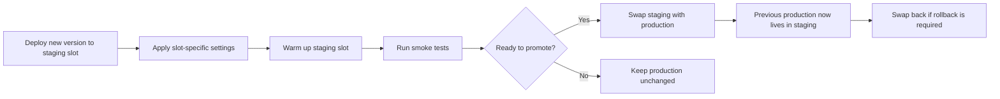

---
hide:
  - toc
content_sources:
  diagrams:
    - id: slot-swap-blue-green-flow
      type: flowchart
      source: mslearn-adapted
      mslearn_url: https://learn.microsoft.com/en-us/azure/app-service/deploy-staging-slots
      based_on:
        - https://learn.microsoft.com/en-us/azure/app-service/deploy-best-practices
---

# Slots and Swap

Deployment slots reduce release risk by letting you deploy to a live nonproduction endpoint, validate it, and promote it into production with a swap. This page focuses on slot creation and promotion mechanics and links to the broader operational slot guide where appropriate.

## Main Content

### Slot Promotion Flow

<!-- diagram-id: slot-swap-blue-green-flow -->


### Create a Deployment Slot

```bash
az webapp deployment slot create \
  --resource-group $RG \
  --name $APP_NAME \
  --slot staging \
  --configuration-source $APP_NAME \
  --output json

az webapp deployment slot list \
  --resource-group $RG \
  --name $APP_NAME \
  --query "[].{name:name,state:state,host:defaultHostName}" \
  --output table
```

| Command Part | Explanation |
|---|---|
| `az webapp deployment slot create` | Creates a new slot for the existing web app. |
| `--slot staging` | Names the slot `staging`. |
| `--configuration-source $APP_NAME` | Copies the current production configuration to reduce initial drift. |
| `az webapp deployment slot list` | Lists current slots for quick verification. |

!!! note "Tier requirement"
    Deployment slots require an App Service Plan tier that supports slots, such as Standard, Premium, or Isolated.

### Configure Slot-Specific Settings

Some values must stay with the slot instead of moving during a swap. Typical examples include environment names, test endpoints, and nonproduction secrets.

```bash
az webapp config appsettings set \
  --resource-group $RG \
  --name $APP_NAME \
  --slot staging \
  --settings APP_ENVIRONMENT=staging API_BASE_URL=https://api-staging.contoso.example \
  --slot-settings APP_ENVIRONMENT API_BASE_URL \
  --output json
```

| Command Part | Explanation |
|---|---|
| `--slot staging` | Applies the setting to the staging slot only. |
| `--settings ...` | Defines the values that should exist in the slot. |
| `--slot-settings APP_ENVIRONMENT API_BASE_URL` | Marks those settings as sticky so they stay with the slot during swap. |

!!! warning "Do not forget sticky settings"
    If environment-dependent values are not marked as slot settings, they can move during the swap and cause production to point to the wrong backend or use the wrong secrets.

### Manual Swap

```bash
az webapp deployment slot swap \
  --resource-group $RG \
  --name $APP_NAME \
  --slot staging \
  --target-slot production \
  --output json
```

| Command Part | Explanation |
|---|---|
| `az webapp deployment slot swap` | Exchanges routing between the source slot and target slot. |
| `--slot staging` | Uses staging as the source slot containing the new version. |
| `--target-slot production` | Promotes the staging release into production. |

### Swap with Preview

```bash
az webapp deployment slot swap \
  --resource-group $RG \
  --name $APP_NAME \
  --slot staging \
  --target-slot production \
  --action preview \
  --output json

az webapp deployment slot swap \
  --resource-group $RG \
  --name $APP_NAME \
  --slot staging \
  --target-slot production \
  --action swap \
  --output json
```

| Command Part | Explanation |
|---|---|
| `--action preview` | Applies target-slot configuration to staging and pauses before final cutover. |
| `--action swap` | Completes the pending swap after validation succeeds. |

If validation fails, cancel the pending swap:

```bash
az webapp deployment slot swap \
  --resource-group $RG \
  --name $APP_NAME \
  --slot staging \
  --target-slot production \
  --action reset \
  --output json
```

| Command Part | Explanation |
|---|---|
| `--action reset` | Cancels the preview phase and restores the pre-swap state. |

### Auto-Swap

Auto-swap can shorten release flow for lower-risk workloads, but it is better suited to deterministic startup behavior and automated validation.

```bash
az webapp deployment slot auto-swap \
  --resource-group $RG \
  --name $APP_NAME \
  --slot staging
```

| Command Part | Explanation |
|---|---|
| `az webapp deployment slot auto-swap` | Enables automatic promotion from the specified source slot after warm-up. |
| `--slot staging` | Makes `staging` the source slot that auto-swaps into production. |

!!! warning "Linux limitation"
    Microsoft Learn notes that auto-swap is not supported for web apps on Linux and Web App for Containers. Use manual slot swap for those scenarios.

### Blue-Green Pattern with App Service Slots

In App Service, the **blue** environment is usually the current production slot and the **green** environment is the staging slot holding the candidate release.

1. Deploy the new build to `staging`.
2. Warm the slot and validate health checks.
3. Swap `staging` into `production`.
4. If regression appears, swap again to restore the previous version.

This pattern gives a fast rollback path without rebuilding or repackaging during the incident.

!!! tip "Do not duplicate operational runbooks"
    For deeper operational guidance such as traffic routing, rollback drills, and slot lifecycle management, use [Deployment Slots Operations](../deployment-slots.md). This page stays focused on deployment execution patterns.

## Advanced Topics

### Verification Commands

```bash
az webapp show \
  --resource-group $RG \
  --name $APP_NAME \
  --query "{host:defaultHostName,state:state,slotSwapStatus:slotSwapStatus}" \
  --output json

curl --silent --show-error --fail \
  "https://$APP_NAME-staging.azurewebsites.net/health"
```

| Command | Purpose |
|---|---|
| `az webapp show ...` | Checks platform state and any in-progress slot swap status. |
| `curl ...staging.../health` | Validates the staging slot before promotion. |

## See Also

- [Deployment Methods](./index.md)
- [GitHub Actions](./github-actions.md)
- [Deployment Slots Operations](../deployment-slots.md)

## Sources

- [Set Up Staging Environments in Azure App Service (Microsoft Learn)](https://learn.microsoft.com/en-us/azure/app-service/deploy-staging-slots)
- [Deployment Best Practices for Azure App Service (Microsoft Learn)](https://learn.microsoft.com/en-us/azure/app-service/deploy-best-practices)
