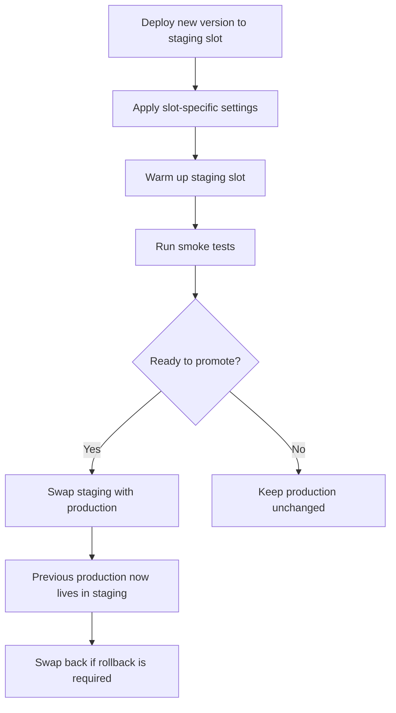

---
content_sources:
  diagrams:
    - id: slot-swap-blue-green-flow
      type: flowchart
      source: mslearn-adapted
      mslearn_url: https://learn.microsoft.com/en-us/azure/app-service/deploy-staging-slots
      based_on:
        - https://learn.microsoft.com/en-us/azure/app-service/deploy-best-practices
content_validation:
  status: verified
  last_reviewed: "2026-04-12"
  reviewer: ai-agent
  core_claims:
    - claim: "Deployment slots require an App Service Plan tier that supports slots, such as Standard, Premium, or Isolated."
      source: "https://learn.microsoft.com/azure/app-service/deploy-staging-slots"
      verified: true
    - claim: "Slot settings stay with the slot and do not swap into production."
      source: "https://learn.microsoft.com/azure/app-service/deploy-staging-slots"
      verified: true
    - claim: "App Service supports swap with preview before final cutover."
      source: "https://learn.microsoft.com/azure/app-service/deploy-staging-slots"
      verified: true
    - claim: "Auto-swap is not supported for web apps on Linux and Web App for Containers."
      source: "https://learn.microsoft.com/azure/app-service/deploy-staging-slots"
      verified: true
---

# Slots and Swap

Deployment slots reduce release risk by letting you deploy to a live nonproduction endpoint, validate it, and promote it into production with a swap. This page focuses on slot creation and promotion mechanics and links to the broader operational slot guide where appropriate.

## Main Content

### Slot Promotion Flow

<!-- diagram-id: slot-swap-blue-green-flow -->


### Create a Deployment Slot

```bash
az webapp deployment slot create \
  --resource-group $RG \
  --name $APP_NAME \
  --slot staging \
  --configuration-source $APP_NAME \
  --output json

az webapp deployment slot list \
  --resource-group $RG \
  --name $APP_NAME \
  --query "[].{name:name,state:state,host:defaultHostName}" \
  --output table
```

| Command/Parameter | Purpose |
|---|---|
| `az webapp deployment slot create` | Creates a new deployment slot for the existing app. |
| `--resource-group $RG` | Targets the resource group that contains the app. |
| `--name $APP_NAME` | Selects the parent web app. |
| `--slot staging` | Creates a slot named `staging`. |
| `--configuration-source $APP_NAME` | Copies the production slot configuration into the new slot. |
| `--output json` | Returns structured output for verification or scripting. |
| `az webapp deployment slot list` | Lists existing slots on the app. |
| `--query "[].{name:name,state:state,host:defaultHostName}"` | Limits the output to slot name, state, and hostname. |
| `--output table` | Formats the slot list in a readable table. |

!!! note "Tier requirement"
    Deployment slots require an App Service Plan tier that supports slots, such as Standard, Premium, or Isolated.

### Configure Slot-Specific Settings

Some values must stay with the slot instead of moving during a swap. Typical examples include environment names, test endpoints, and nonproduction secrets.

```bash
az webapp config appsettings set \
  --resource-group $RG \
  --name $APP_NAME \
  --slot staging \
  --settings APP_ENVIRONMENT=staging API_BASE_URL=https://api-staging.contoso.example \
  --slot-settings APP_ENVIRONMENT API_BASE_URL \
  --output json
```

| Command/Parameter | Purpose |
|---|---|
| `az webapp config appsettings set` | Writes application settings to the selected slot. |
| `--resource-group $RG` | Targets the resource group that contains the app. |
| `--name $APP_NAME` | Selects the web app to configure. |
| `--slot staging` | Applies the settings to the `staging` slot. |
| `--settings` | Supplies app setting key-value pairs to update. |
| `APP_ENVIRONMENT=staging` | Marks the slot as a staging environment. |
| `API_BASE_URL=https://api-staging.contoso.example` | Points the slot at the staging API endpoint. |
| `--slot-settings APP_ENVIRONMENT API_BASE_URL` | Makes those settings sticky so they do not swap into production. |
| `--output json` | Returns structured output after the update. |

!!! warning "Do not forget sticky settings"
    If environment-dependent values are not marked as slot settings, they can move during the swap and cause production to point to the wrong backend or use the wrong secrets.

### Manual Swap

```bash
az webapp deployment slot swap \
  --resource-group $RG \
  --name $APP_NAME \
  --slot staging \
  --target-slot production \
  --output json
```

| Command/Parameter | Purpose |
|---|---|
| `az webapp deployment slot swap` | Swaps the source slot and target slot. |
| `--resource-group $RG` | Targets the resource group that contains the app. |
| `--name $APP_NAME` | Selects the web app whose slots will be swapped. |
| `--slot staging` | Chooses `staging` as the source slot. |
| `--target-slot production` | Chooses `production` as the destination slot. |
| `--output json` | Returns structured swap results. |

### Swap with Preview

```bash
az webapp deployment slot swap \
  --resource-group $RG \
  --name $APP_NAME \
  --slot staging \
  --target-slot production \
  --action preview \
  --output json

az webapp deployment slot swap \
  --resource-group $RG \
  --name $APP_NAME \
  --slot staging \
  --target-slot production \
  --action swap \
  --output json
```

| Command/Parameter | Purpose |
|---|---|
| `az webapp deployment slot swap` | Starts or completes a slot swap operation. |
| `--resource-group $RG` | Targets the resource group that contains the app. |
| `--name $APP_NAME` | Selects the web app whose slots are being swapped. |
| `--slot staging` | Uses `staging` as the source slot. |
| `--target-slot production` | Uses `production` as the destination slot. |
| `--action preview` | Applies target-slot settings to staging and pauses before cutover. |
| `--action swap` | Completes the pending preview swap after validation. |
| `--output json` | Returns structured output for each swap stage. |

If validation fails, cancel the pending swap:

```bash
az webapp deployment slot swap \
  --resource-group $RG \
  --name $APP_NAME \
  --slot staging \
  --target-slot production \
  --action reset \
  --output json
```

| Command/Parameter | Purpose |
|---|---|
| `az webapp deployment slot swap` | Manages a staged slot swap operation. |
| `--resource-group $RG` | Targets the resource group that contains the app. |
| `--name $APP_NAME` | Selects the web app whose swap is being canceled. |
| `--slot staging` | Identifies the source slot that entered preview mode. |
| `--target-slot production` | Identifies the destination slot for the canceled swap. |
| `--action reset` | Cancels the preview swap and restores the original state. |
| `--output json` | Returns structured output confirming the reset result. |

### Auto-Swap

Auto-swap can shorten release flow for lower-risk workloads, but it is better suited to deterministic startup behavior and automated validation.

```bash
az webapp deployment slot auto-swap \
  --resource-group $RG \
  --name $APP_NAME \
  --slot staging
```

| Command/Parameter | Purpose |
|---|---|
| `az webapp deployment slot auto-swap` | Enables automatic slot promotion after warm-up. |
| `--resource-group $RG` | Targets the resource group that contains the app. |
| `--name $APP_NAME` | Selects the web app to configure. |
| `--slot staging` | Configures `staging` as the source slot that auto-swaps into production. |

!!! warning "Linux limitation"
    Microsoft Learn notes that auto-swap is not supported for web apps on Linux and Web App for Containers. Use manual slot swap for those scenarios.

### Blue-Green Pattern with App Service Slots

In App Service, the **blue** environment is usually the current production slot and the **green** environment is the staging slot holding the candidate release.

1. Deploy the new build to `staging`.
2. Warm the slot and validate health checks.
3. Swap `staging` into `production`.
4. If regression appears, swap again to restore the previous version.

This pattern gives a fast rollback path without rebuilding or repackaging during the incident.

!!! tip "Do not duplicate operational runbooks"
    For deeper operational guidance such as traffic routing, rollback drills, and slot lifecycle management, use [Deployment Slots Operations](../deployment-slots.md). This page stays focused on deployment execution patterns.

## Advanced Topics

### Verification Commands

```bash
az webapp show \
  --resource-group $RG \
  --name $APP_NAME \
  --query "{host:defaultHostName,state:state,slotSwapStatus:slotSwapStatus}" \
  --output json

curl --silent --show-error --fail \
  "https://$APP_NAME-staging.azurewebsites.net/health"
```

| Command/Parameter | Purpose |
|---|---|
| `az webapp show` | Retrieves status details for the web app. |
| `--resource-group $RG` | Targets the resource group that contains the app. |
| `--name $APP_NAME` | Selects the web app to inspect. |
| `--query "{host:defaultHostName,state:state,slotSwapStatus:slotSwapStatus}"` | Limits the output to hostname, state, and swap status. |
| `--output json` | Returns the status in JSON format. |
| `curl` | Sends an HTTP request to the staging slot health endpoint. |
| `--silent` | Suppresses normal progress output. |
| `--show-error` | Prints an error message when the request fails. |
| `--fail` | Makes the command exit nonzero on HTTP error responses. |
| `"https://$APP_NAME-staging.azurewebsites.net/health"` | Targets the staging slot health check endpoint. |

## See Also

- [Deployment Methods](./index.md)
- [GitHub Actions](./github-actions.md)
- [Deployment Slots Operations](../deployment-slots.md)

## Sources

- [Set Up Staging Environments in Azure App Service (Microsoft Learn)](https://learn.microsoft.com/en-us/azure/app-service/deploy-staging-slots)
- [Deployment Best Practices for Azure App Service (Microsoft Learn)](https://learn.microsoft.com/en-us/azure/app-service/deploy-best-practices)
