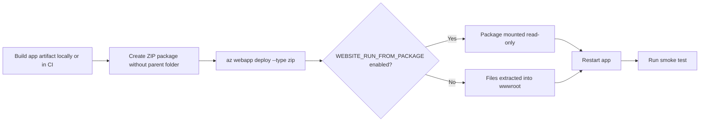

---
hide:
  - toc
content_sources:
  diagrams:
    - id: zip-deploy-release-flow
      type: flowchart
      source: mslearn-adapted
      mslearn_url: https://learn.microsoft.com/en-us/azure/app-service/deploy-zip
      based_on:
        - https://learn.microsoft.com/en-us/azure/app-service/deploy-run-package
content_validation:
  status: verified
  last_reviewed: "2026-04-12"
  reviewer: ai-agent
  core_claims:
    - claim: "ZIP Deploy is used to push a prepared ZIP package directly to App Service."
      source: "https://learn.microsoft.com/azure/app-service/deploy-zip"
      verified: true
    - claim: "The ZIP file must contain the application files at the archive root."
      source: "https://learn.microsoft.com/azure/app-service/deploy-zip"
      verified: true
    - claim: "WEBSITE_RUN_FROM_PACKAGE=1 tells App Service to run from a mounted package instead of mutable file copies in wwwroot."
      source: "https://learn.microsoft.com/azure/app-service/deploy-run-package"
      verified: true
    - claim: "When App Service runs from package, the package is mounted read-only."
      source: "https://learn.microsoft.com/azure/app-service/deploy-run-package"
      verified: true
---

# ZIP Deploy and Run From Package

Use ZIP Deploy when you already have a prepared deployment artifact and want to push it directly to App Service without introducing a full CI/CD system. For production workloads, pair ZIP Deploy with immutable packages and explicit validation.

## Main Content

### ZIP Deploy Flow

<!-- diagram-id: zip-deploy-release-flow -->


### When ZIP Deploy Fits Best

- You already have a tested ZIP artifact from another pipeline.
- You want a direct CLI-driven deployment method.
- You need deterministic package promotion without rebuilding in App Service.
- You want to combine artifact deployment with deployment slots.

!!! warning "Package layout matters"
    The ZIP file must contain the application files at the archive root. Do not wrap everything in an extra top-level directory, or App Service can fail to detect and run the app correctly.

### ZIP Deploy vs `az webapp up`

| Command | Best For | What It Does | Trade-Off |
|---|---|---|---|
| `az webapp deploy --type zip` | Existing app and prebuilt artifact | Pushes a prepared ZIP package to the app by using the publish API | You manage packaging, app creation, and runtime settings yourself |
| `az webapp up` | Quick starts and prototypes | Creates resources and deploys source code in one workflow | Less explicit, less repeatable for mature production release pipelines |

Use `az webapp up` for first-time experimentation or tutorials. Use ZIP Deploy when the app already exists and you want explicit control over the artifact, restart timing, and release flow.

### Enable `WEBSITE_RUN_FROM_PACKAGE`

`WEBSITE_RUN_FROM_PACKAGE=1` tells App Service to run from a mounted package instead of relying on mutable file copies in `wwwroot`. This improves consistency and reduces partial-copy or file-lock issues during deployment.

```bash
az webapp config appsettings set \
  --resource-group $RG \
  --name $APP_NAME \
  --settings WEBSITE_RUN_FROM_PACKAGE=1 SCM_DO_BUILD_DURING_DEPLOYMENT=false \
  --output json
```

| Command/Parameter | Purpose |
|---|---|
| `az webapp config appsettings set` | Updates App Service application settings on the target app. |
| `--resource-group $RG` | Selects the resource group that contains the web app. |
| `--name $APP_NAME` | Selects the web app to configure. |
| `--settings` | Supplies one or more app settings to write in the same operation. |
| `WEBSITE_RUN_FROM_PACKAGE=1` | Tells App Service to mount the deployed ZIP package as read-only site content. |
| `SCM_DO_BUILD_DURING_DEPLOYMENT=false` | Disables Kudu build automation because the artifact is already built. |
| `--output json` | Returns JSON output that is easy to inspect or reuse in scripts. |

!!! note "Read-only content root"
    When you run from package, application code should not try to write into the deployment directory. Store uploads, generated files, caches, and session state in external services or persistent storage instead.

### Complete ZIP Deploy Example

```bash
zip -r ./artifacts/webapp.zip .

az webapp deploy \
  --resource-group $RG \
  --name $APP_NAME \
  --src-path ./artifacts/webapp.zip \
  --type zip \
  --clean true \
  --restart true \
  --output json

curl --silent --show-error --fail \
  "https://$APP_NAME.azurewebsites.net/health"
```

| Command/Parameter | Purpose |
|---|---|
| `zip` | Creates a ZIP archive that can be uploaded to App Service. |
| `-r` | Recursively includes files and directories in the archive. |
| `./artifacts/webapp.zip` | Sets the output ZIP file path for the deployment artifact. |
| `.` | Uses the current directory as the archive source. |
| `az webapp deploy` | Uploads the ZIP package to the App Service deployment endpoint. |
| `--resource-group $RG` | Targets the resource group that owns the app. |
| `--name $APP_NAME` | Targets the specific web app to deploy. |
| `--src-path ./artifacts/webapp.zip` | Points the deployment command to the local ZIP artifact. |
| `--type zip` | Declares that the uploaded artifact format is ZIP. |
| `--clean true` | Removes existing deployed files before applying the new package. |
| `--restart true` | Restarts the app so the new deployment is loaded immediately. |
| `--output json` | Returns structured deployment output for validation or automation. |
| `curl` | Sends an HTTP request to verify the deployed app responds successfully. |
| `--silent` | Hides normal progress output. |
| `--show-error` | Prints an error message if the request fails. |
| `--fail` | Makes the command exit nonzero on HTTP error responses. |
| `"https://$APP_NAME.azurewebsites.net/health"` | Calls the health endpoint on the production site. |

### Deploy to a Slot Instead of Production

```bash
az webapp deploy \
  --resource-group $RG \
  --name $APP_NAME \
  --slot staging \
  --src-path ./artifacts/webapp.zip \
  --type zip \
  --restart true \
  --output json
```

| Command/Parameter | Purpose |
|---|---|
| `az webapp deploy` | Uploads the ZIP package to App Service. |
| `--resource-group $RG` | Targets the resource group that contains the app. |
| `--name $APP_NAME` | Selects the parent web app. |
| `--slot staging` | Deploys to the `staging` slot instead of production. |
| `--src-path ./artifacts/webapp.zip` | Uses the prepared ZIP artifact as the deployment source. |
| `--type zip` | Declares the artifact type as ZIP. |
| `--restart true` | Restarts the slot after deployment. |
| `--output json` | Returns structured command output for verification. |

!!! tip "Preferred production pattern"
    ZIP Deploy becomes much safer when you deploy to a staging slot first, validate health and smoke tests, and then promote by swap. See [Slots and Swap](./slots-and-swap.md).

## Advanced Topics

### ZIP Deploy Design Guidance

- Prefer prebuilt artifacts from CI over ad hoc local builds.
- Use `WEBSITE_RUN_FROM_PACKAGE` for more predictable production behavior.
- Keep the package small and remove build-only files where possible.
- If the app requires build automation, document why `SCM_DO_BUILD_DURING_DEPLOYMENT=true` is acceptable.

### Verification Commands

```bash
az webapp show \
  --resource-group $RG \
  --name $APP_NAME \
  --query "{state:state,host:defaultHostName}" \
  --output json

az webapp config appsettings list \
  --resource-group $RG \
  --name $APP_NAME \
  --query "[?name=='WEBSITE_RUN_FROM_PACKAGE' || name=='SCM_DO_BUILD_DURING_DEPLOYMENT']" \
  --output table
```

| Command/Parameter | Purpose |
|---|---|
| `az webapp show` | Retrieves core metadata about the web app. |
| `--resource-group $RG` | Targets the resource group that owns the app. |
| `--name $APP_NAME` | Selects the web app to inspect. |
| `--query "{state:state,host:defaultHostName}"` | Narrows the output to app state and default hostname. |
| `--output json` | Formats the result as JSON. |
| `az webapp config appsettings list` | Lists current app settings for the web app. |
| `--query "[?name=='WEBSITE_RUN_FROM_PACKAGE' || name=='SCM_DO_BUILD_DURING_DEPLOYMENT']"` | Filters the settings list to the deployment-related keys only. |
| `--output table` | Formats the filtered settings in a readable table. |

## See Also

- [Deployment Methods](./index.md)
- [GitHub Actions](./github-actions.md)
- [Slots and Swap](./slots-and-swap.md)

## Sources

- [Deploy Files to Azure App Service (Microsoft Learn)](https://learn.microsoft.com/en-us/azure/app-service/deploy-zip)
- [Run Your App in Azure App Service Directly from a ZIP Package (Microsoft Learn)](https://learn.microsoft.com/en-us/azure/app-service/deploy-run-package)
