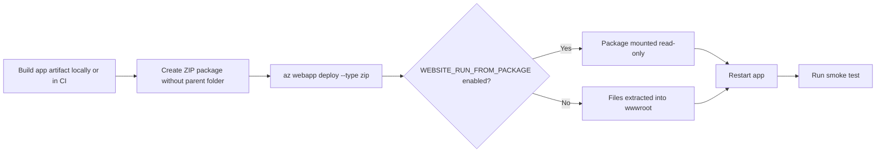

---
hide:
  - toc
content_sources:
  diagrams:
    - id: zip-deploy-release-flow
      type: flowchart
      source: mslearn-adapted
      mslearn_url: https://learn.microsoft.com/en-us/azure/app-service/deploy-zip
      based_on:
        - https://learn.microsoft.com/en-us/azure/app-service/deploy-run-package
---

# ZIP Deploy and Run From Package

Use ZIP Deploy when you already have a prepared deployment artifact and want to push it directly to App Service without introducing a full CI/CD system. For production workloads, pair ZIP Deploy with immutable packages and explicit validation.

## Main Content

### ZIP Deploy Flow

<!-- diagram-id: zip-deploy-release-flow -->


### When ZIP Deploy Fits Best

- You already have a tested ZIP artifact from another pipeline.
- You want a direct CLI-driven deployment method.
- You need deterministic package promotion without rebuilding in App Service.
- You want to combine artifact deployment with deployment slots.

!!! warning "Package layout matters"
    The ZIP file must contain the application files at the archive root. Do not wrap everything in an extra top-level directory, or App Service can fail to detect and run the app correctly.

### ZIP Deploy vs `az webapp up`

| Command | Best For | What It Does | Trade-Off |
|---|---|---|---|
| `az webapp deploy --type zip` | Existing app and prebuilt artifact | Pushes a prepared ZIP package to the app by using the publish API | You manage packaging, app creation, and runtime settings yourself |
| `az webapp up` | Quick starts and prototypes | Creates resources and deploys source code in one workflow | Less explicit, less repeatable for mature production release pipelines |

Use `az webapp up` for first-time experimentation or tutorials. Use ZIP Deploy when the app already exists and you want explicit control over the artifact, restart timing, and release flow.

### Enable `WEBSITE_RUN_FROM_PACKAGE`

`WEBSITE_RUN_FROM_PACKAGE=1` tells App Service to run from a mounted package instead of relying on mutable file copies in `wwwroot`. This improves consistency and reduces partial-copy or file-lock issues during deployment.

```bash
az webapp config appsettings set \
  --resource-group $RG \
  --name $APP_NAME \
  --settings WEBSITE_RUN_FROM_PACKAGE=1 SCM_DO_BUILD_DURING_DEPLOYMENT=false \
  --output json
```

| Command Part | Explanation |
|---|---|
| `az webapp config appsettings set` | Updates application settings for the target App Service app. |
| `--resource-group $RG` | Targets the resource group that contains the web app. |
| `--name $APP_NAME` | Selects the web app to configure. |
| `WEBSITE_RUN_FROM_PACKAGE=1` | Mounts the deployed ZIP package as the app content source. |
| `SCM_DO_BUILD_DURING_DEPLOYMENT=false` | Prevents App Service from rebuilding an already prepared artifact. |
| `--output json` | Returns machine-readable output for verification or scripting. |

!!! note "Read-only content root"
    When you run from package, application code should not try to write into the deployment directory. Store uploads, generated files, caches, and session state in external services or persistent storage instead.

### Complete ZIP Deploy Example

```bash
zip -r ./artifacts/webapp.zip .

az webapp deploy \
  --resource-group $RG \
  --name $APP_NAME \
  --src-path ./artifacts/webapp.zip \
  --type zip \
  --clean true \
  --restart true \
  --output json

curl --silent --show-error --fail \
  "https://$APP_NAME.azurewebsites.net/health"
```

| Command Part | Explanation |
|---|---|
| `zip -r ./artifacts/webapp.zip .` | Builds a deployment archive from the current directory contents. |
| `az webapp deploy` | Publishes the ZIP package through the App Service deployment endpoint. |
| `--src-path ./artifacts/webapp.zip` | Points App Service to the local ZIP artifact to upload. |
| `--type zip` | Declares that the artifact is a ZIP package. |
| `--clean true` | Cleans the target deployment location before the package is applied. |
| `--restart true` | Restarts the app after deployment so the new package is loaded. |
| `curl --silent --show-error --fail` | Verifies the health endpoint and fails the shell command on HTTP errors. |

### Deploy to a Slot Instead of Production

```bash
az webapp deploy \
  --resource-group $RG \
  --name $APP_NAME \
  --slot staging \
  --src-path ./artifacts/webapp.zip \
  --type zip \
  --restart true \
  --output json
```

| Command Part | Explanation |
|---|---|
| `--slot staging` | Sends the package to the staging slot instead of the production slot. |
| Remaining parameters | Behave the same as a production ZIP deployment, but isolate the release for validation first. |

!!! tip "Preferred production pattern"
    ZIP Deploy becomes much safer when you deploy to a staging slot first, validate health and smoke tests, and then promote by swap. See [Slots and Swap](./slots-and-swap.md).

## Advanced Topics

### ZIP Deploy Design Guidance

- Prefer prebuilt artifacts from CI over ad hoc local builds.
- Use `WEBSITE_RUN_FROM_PACKAGE` for more predictable production behavior.
- Keep the package small and remove build-only files where possible.
- If the app requires build automation, document why `SCM_DO_BUILD_DURING_DEPLOYMENT=true` is acceptable.

### Verification Commands

```bash
az webapp show \
  --resource-group $RG \
  --name $APP_NAME \
  --query "{state:state,host:defaultHostName}" \
  --output json

az webapp config appsettings list \
  --resource-group $RG \
  --name $APP_NAME \
  --query "[?name=='WEBSITE_RUN_FROM_PACKAGE' || name=='SCM_DO_BUILD_DURING_DEPLOYMENT']" \
  --output table
```

| Command | Purpose |
|---|---|
| `az webapp show ...` | Confirms the app is running and returns the production host name. |
| `az webapp config appsettings list ...` | Verifies that package and build settings match the intended deployment model. |

## See Also

- [Deployment Methods](./index.md)
- [GitHub Actions](./github-actions.md)
- [Slots and Swap](./slots-and-swap.md)

## Sources

- [Deploy Files to Azure App Service (Microsoft Learn)](https://learn.microsoft.com/en-us/azure/app-service/deploy-zip)
- [Run Your App in Azure App Service Directly from a ZIP Package (Microsoft Learn)](https://learn.microsoft.com/en-us/azure/app-service/deploy-run-package)
