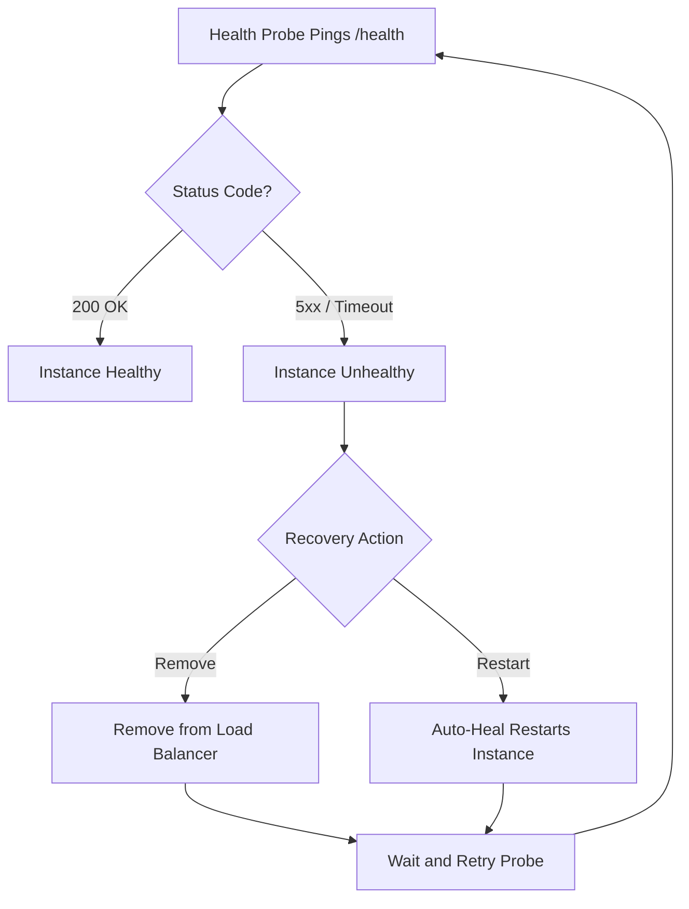

# Health and Recovery Operations

Maintain availability by combining health checks, automatic remediation, and diagnostics. This guide focuses on platform-native recovery controls for Azure App Service.



## Prerequisites

- Existing App Service app with at least one active instance
- A lightweight health endpoint (for example `/health`)
- Azure Monitor access for metrics and activity logs
- Variables set:
  - `RG`
  - `APP_NAME`

## Main Content

### Define a Reliable Health Endpoint Contract

Your health endpoint should:

- return HTTP 200 for healthy state
- avoid expensive dependency checks by default
- respond quickly (typically under 1 second)
- include optional deep checks behind a separate path when needed

!!! warning "Do not over-couple health checks"
    If your liveness probe requires every downstream dependency to be healthy, transient external failures can trigger unnecessary instance removal.

### Enable App Service Health Check

```bash
az webapp config set \
  --resource-group $RG \
  --name $APP_NAME \
  --health-check-path "/health" \
  --output json
```

Verify setting:

```bash
az webapp config show \
  --resource-group $RG \
  --name $APP_NAME \
  --query "{healthCheckPath:healthCheckPath,minimumTls:minTlsVersion,alwaysOn:alwaysOn}" \
  --output json
```

### Configure Auto-Heal for Memory Pressure

```bash
az webapp config auto-heal update \
  --resource-group $RG \
  --name $APP_NAME \
  --auto-heal-enabled true \
  --auto-heal-action Restart \
  --auto-heal-memory-private-set-kb 1500000 \
  --auto-heal-memory-private-set-duration "00:05:00" \
  --output json
```

### Configure Auto-Heal for Slow Requests

```bash
az webapp config auto-heal update \
  --resource-group $RG \
  --name $APP_NAME \
  --auto-heal-enabled true \
  --auto-heal-action Restart \
  --auto-heal-slow-requests-count 50 \
  --auto-heal-slow-requests-interval "00:05:00" \
  --auto-heal-slow-requests-time "00:00:10" \
  --output json
```

Inspect effective rules:

```bash
az webapp config auto-heal show \
  --resource-group $RG \
  --name $APP_NAME \
  --output json
```

### Capture Recovery Signals

Tail live platform logs:

```bash
az webapp log tail \
  --resource-group $RG \
  --name $APP_NAME
```

List relevant activity events:

```bash
az monitor activity-log list \
  --resource-group $RG \
  --offset 1d \
  --max-events 50 \
  --query "[?contains(operationName.value, 'Microsoft.Web/sites/restart') || contains(operationName.value, 'AutoHeal')].{time:eventTimestamp,status:status.value,operation:operationName.localizedValue}" \
  --output table
```

### Build an Operational Recovery Runbook

Recommended sequence when incidents occur:

1. Confirm symptom scope (single instance vs whole app)
2. Check health check status and endpoint latency
3. Review auto-heal trigger frequency
4. Restart app only if automatic recovery is insufficient
5. Scale out temporarily if saturation persists
6. Capture logs, metrics, and timelines for post-incident review

Manual restart command:

```bash
az webapp restart \
  --resource-group $RG \
  --name $APP_NAME \
  --output json
```

### Validate Recovery Controls End-to-End

Control plane validation:

```bash
az webapp config show \
  --resource-group $RG \
  --name $APP_NAME \
  --query "{healthCheckPath:healthCheckPath}" \
  --output json

az webapp config auto-heal show \
  --resource-group $RG \
  --name $APP_NAME \
  --query "{enabled:autoHealEnabled,action:autoHealRules.actions.actionType}" \
  --output json
```

Data plane validation:

```bash
curl --silent --show-error --include \
  "https://$APP_NAME.azurewebsites.net/health"
```

Expected result: HTTP success response and stable latency.

### Example Incident Timeline (PII-masked)

```text
2026-04-03T09:12:20Z  alert   MemoryPercentage > 90 for 5m
2026-04-03T09:13:10Z  action  Auto-Heal restart triggered
2026-04-03T09:14:02Z  probe   /health returned 200
2026-04-03T09:16:00Z  metric  Error rate back to baseline
```

### Troubleshooting

#### Health check keeps failing

- Confirm endpoint path is correct
- Ensure endpoint does not require authentication
- Ensure dependencies used by health endpoint are reachable

#### Frequent auto-heal restarts

- Increase thresholds to reduce false positives
- Investigate memory leaks or long-running requests
- Correlate restart times with traffic spikes

#### Single instance remains unhealthy

- Verify there is enough capacity to rotate instances
- Check startup latency and warm-up behavior
- Review deployment slot and recent release changes

## Advanced Topics

### Liveness, Readiness, and Deep Health Patterns

- **Liveness:** quick process check (`/health`)
- **Readiness:** dependency readiness (`/ready`)
- **Deep diagnostics:** detailed component checks (`/health/deep`)

Route platform probes to liveness, and use readiness/deep checks in pipelines and synthetic monitors.

### Recovery-Oriented Alerting Strategy

Design alerts by stage:

1. Early warning: rising latency or queue depth
2. Trigger warning: repeated 5xx bursts
3. Recovery failure: repeated auto-heal loops

This helps detect when automatic recovery is not sufficient.

### Chaos and Resilience Testing

Periodically test:

- deliberate dependency timeout
- temporary DNS failure scenarios
- controlled memory stress

Capture observed recovery time and compare with target RTO.

!!! info "Enterprise Considerations"
    Maintain a shared incident playbook with predefined ownership, communication channels, and rollback criteria. Treat repeated auto-heal events as reliability debt, not as normal steady state.

## Language-Specific Details

For language-specific operational guidance, see:
- [Node.js Guide](https://yeongseon.github.io/azure-appservice-nodejs-guide/)
- [Python Guide](https://yeongseon.github.io/azure-appservice-python-guide/)
- [Java Guide](https://yeongseon.github.io/azure-appservice-java-guide/)
- [.NET Guide](https://yeongseon.github.io/azure-appservice-dotnet-guide/)

## See Also

- [Operations Index](./index.md)
- [Scaling Operations](./scaling.md)
- [Backup and Restore](./backup-restore.md)
- [Health check in App Service (Microsoft Learn)](https://learn.microsoft.com/azure/app-service/monitor-instances-health-check)
- [Diagnostics and auto-heal (Microsoft Learn)](https://learn.microsoft.com/azure/app-service/overview-diagnostics)
