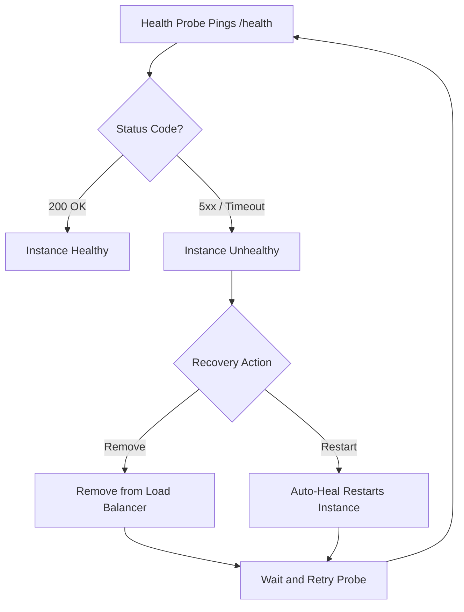

---
content_sources:
  diagrams:
    - id: health-check-recovery-flow
      type: flowchart
      source: mslearn-adapted
      mslearn_url: https://learn.microsoft.com/en-us/azure/app-service/monitor-instances-health-check
      based_on:
        - https://learn.microsoft.com/en-us/azure/app-service/overview-diagnostics
content_validation:
  status: verified
  last_reviewed: "2026-04-12"
  reviewer: agent
  core_claims:
    - claim: "App Service Health Check sends HTTP requests to a configured path such as /health."
      source: "https://learn.microsoft.com/azure/app-service/monitor-instances-health-check"
      verified: true
    - claim: "When an instance becomes unhealthy, Health Check removes it from the load balancer."
      source: "https://learn.microsoft.com/azure/app-service/monitor-instances-health-check"
      verified: true
    - claim: "Auto-Heal can restart an app automatically based on conditions such as memory pressure or slow requests."
      source: "https://learn.microsoft.com/azure/app-service/overview-diagnostics"
      verified: true
---

# Health and Recovery Operations

Maintain availability by combining health checks, automatic remediation, and diagnostics. This guide focuses on platform-native recovery controls for Azure App Service.

<!-- diagram-id: health-check-recovery-flow -->

```mermaid
flowchart TD
    Probe[Health Probe Pings /health] --> Status{Status Code?}
    Status -- 200 OK --> Healthy[Instance Healthy]
    Status -- 5xx / Timeout --> Unhealthy[Instance Unhealthy]

    Unhealthy --> Action{Recovery Action}
    Action -- Remove --> LB[Remove from Load Balancer]
    Action -- Restart --> AutoHeal[Auto-Heal Restarts Instance]

    LB --> Retry[Wait and Retry Probe]
    AutoHeal --> Retry
    Retry --> Probe
```

## Prerequisites

- Existing App Service app with at least one active instance
- A lightweight health endpoint (for example `/health`)
- Azure Monitor access for metrics and activity logs
- Variables set:
    - `RG`
    - `APP_NAME`

## When to Use

## Procedure

### Define a Reliable Health Endpoint Contract

Your health endpoint should:

- return HTTP 200 for healthy state
- avoid expensive dependency checks by default
- respond quickly (typically under 1 second)
- include optional deep checks behind a separate path when needed

!!! warning "Do not over-couple health checks"
    If your liveness probe requires every downstream dependency to be healthy, transient external failures can trigger unnecessary instance removal.

### Enable App Service Health Check

```bash
az webapp config set \
  --resource-group $RG \
  --name $APP_NAME \
  --health-check-path "/health" \
  --output json
```

Verify setting:

```bash
az webapp config show \
  --resource-group $RG \
  --name $APP_NAME \
  --query "{healthCheckPath:healthCheckPath,minimumTls:minTlsVersion,alwaysOn:alwaysOn}" \
  --output json
```

### Configure Auto-Heal for Memory Pressure

```bash
az webapp config auto-heal update \
  --resource-group $RG \
  --name $APP_NAME \
  --auto-heal-enabled true \
  --auto-heal-action Restart \
  --auto-heal-memory-private-set-kb 1500000 \
  --auto-heal-memory-private-set-duration "00:05:00" \
  --output json
```

### Configure Auto-Heal for Slow Requests

```bash
az webapp config auto-heal update \
  --resource-group $RG \
  --name $APP_NAME \
  --auto-heal-enabled true \
  --auto-heal-action Restart \
  --auto-heal-slow-requests-count 50 \
  --auto-heal-slow-requests-interval "00:05:00" \
  --auto-heal-slow-requests-time "00:00:10" \
  --output json
```

Inspect effective rules:

```bash
az webapp config auto-heal show \
  --resource-group $RG \
  --name $APP_NAME \
  --output json
```

### Capture Recovery Signals

Tail live platform logs:

```bash
az webapp log tail \
  --resource-group $RG \
  --name $APP_NAME
```

List relevant activity events:

```bash
az monitor activity-log list \
  --resource-group $RG \
  --offset 1d \
  --max-events 50 \
  --query "[?contains(operationName.value, 'Microsoft.Web/sites/restart') || contains(operationName.value, 'AutoHeal')].{time:eventTimestamp,status:status.value,operation:operationName.localizedValue}" \
  --output table
```

#### Portal view: Availability and Performance diagnostic

![Availability and Performance diagnostic blade reached from Diagnose and solve problems for the Web App, with a left navigation listing Overview (highlighted) and a long catalog of diagnostic tools (App Down Workflow, Web App Down, Application Logs, Web App Slow, CPU Usage, Memory Usage, Web App Restarted, Web App Troubleshooter, Application Changes, Container Issues, Health Check feature, Http 4xx errors, Linux - Host Disk Space Usage, Linux - Number of Running C..., Linux CPU Drill Down, Linux Memory Drill Down, Linux Swap Space Low, Process Full List, Process List, SNAT Failed Connection Endp..., SNAT Port Exhaustion, Site Status History). The main pane has a "Search for common problems or tools" search box and a command bar with AI-powered Diagnostics (preview), Refresh, Feedback, and Get Resiliency Score report actions. A header reads "Availability and Performance - Check your app's health and discover app or platform issues." with a Time Range (UTC) "Last 24 Hours" filter chip. Two KPI tiles read Failed Requests "0 %" (green check, subtitle "Failed Requests") and App Performance "63 ms" (green check, subtitle "90th Percentile"). A Graph dropdown is set to "Requests and Errors" with a None label on the right. An area chart with x-axis spanning 06-06 12:00 to 06-07 10:00 UTC and y-axis 0.00 to 32.00 Request Count shows three prominent spikes around 06-06 14:00, 06-06 20:00, and 2026-06-07 00:00, with green Http2xx and orange Http4xx contributions; a legend at the bottom maps green to Http2xx, yellow to Http3xx, orange to Http4xx, and red to Http5xx.](../assets/operations/health-recovery/01-availability-performance.png)

The Availability and Performance diagnostic is the Portal equivalent of the recovery-signals queries above and the entry point for nearly every incident triage flow this guide describes. The two KPI tiles map directly to the SLO checks elsewhere in this document: `Failed Requests: 0%` is the error-budget signal, and `App Performance: 63 ms (90th Percentile)` is the latency signal that drives the early-warning alerts described in the advanced topics. The left-nav catalog (Web App Down, CPU Usage, Memory Usage, Web App Restarted, Health Check feature, SNAT Port Exhaustion, Process List, ...) is the menu of specialized diagnostics — when `az monitor activity-log list` from the snippet above shows repeated `Auto-Heal` events, the right tile to drill into is `Web App Restarted`; when 4xx spikes appear in the chart like the three visible here, drill into `Http 4xx errors`. Use this blade as the first stop during an incident before reaching for `az webapp restart`, because manual restart erases the in-memory context the AI-powered Diagnostics preview and the Linux drill-downs need to identify a root cause.

### Build an Operational Recovery Runbook

Recommended sequence when incidents occur:

1. Confirm symptom scope (single instance vs whole app)
2. Check health check status and endpoint latency
3. Review auto-heal trigger frequency
4. Restart app only if automatic recovery is insufficient
5. Scale out temporarily if saturation persists
6. Capture logs, metrics, and timelines for post-incident review

Manual restart command:

```bash
az webapp restart \
  --resource-group $RG \
  --name $APP_NAME \
  --output json
```

## Verification

Control plane validation:

```bash
az webapp config show \
  --resource-group $RG \
  --name $APP_NAME \
  --query "{healthCheckPath:healthCheckPath}" \
  --output json

az webapp config auto-heal show \
  --resource-group $RG \
  --name $APP_NAME \
  --query "{enabled:autoHealEnabled,action:autoHealRules.actions.actionType}" \
  --output json
```

Data plane validation:

```bash
curl --silent --show-error --include \
  "https://$APP_NAME.azurewebsites.net/health"
```

Expected result: HTTP success response and stable latency.

### Example Incident Timeline (PII-masked)

```text
2026-04-03T09:12:20Z  alert   MemoryPercentage > 90 for 5m
2026-04-03T09:13:10Z  action  Auto-Heal restart triggered
2026-04-03T09:14:02Z  probe   /health returned 200
2026-04-03T09:16:00Z  metric  Error rate back to baseline
```

## Rollback / Troubleshooting

#### Health check keeps failing

- Confirm endpoint path is correct
- Ensure endpoint does not require authentication
- Ensure dependencies used by health endpoint are reachable

#### Frequent auto-heal restarts

- Increase thresholds to reduce false positives
- Investigate memory leaks or long-running requests
- Correlate restart times with traffic spikes

#### Single instance remains unhealthy

- Verify there is enough capacity to rotate instances
- Check startup latency and warm-up behavior
- Review deployment slot and recent release changes

## Advanced Topics

### Liveness, Readiness, and Deep Health Patterns

- **Liveness:** quick process check (`/health`)
- **Readiness:** dependency readiness (`/ready`)
- **Deep diagnostics:** detailed component checks (`/health/deep`)

Route platform probes to liveness, and use readiness/deep checks in pipelines and synthetic monitors.

### Recovery-Oriented Alerting Strategy

Design alerts by stage:

1. Early warning: rising latency or queue depth
2. Trigger warning: repeated 5xx bursts
3. Recovery failure: repeated auto-heal loops

This helps detect when automatic recovery is not sufficient.

### Chaos and Resilience Testing

Periodically test:

- deliberate dependency timeout
- temporary DNS failure scenarios
- controlled memory stress

Capture observed recovery time and compare with target RTO.

!!! info "Enterprise Considerations"
    Maintain a shared incident playbook with predefined ownership, communication channels, and rollback criteria. Treat repeated auto-heal events as reliability debt, not as normal steady state.

## Language-Specific Details

For language-specific operational guidance, see:
- [Node.js Guide](../language-guides/nodejs/index.md)
- [Python Guide](../language-guides/python/index.md)
- [Java Guide](../language-guides/java/index.md)
- [.NET Guide](../language-guides/dotnet/index.md)

## See Also

- [Operations Index](./index.md)
- [Scaling Operations](./scaling.md)
- [Backup and Restore](./backup-restore.md)
- [Health check in App Service (Microsoft Learn)](https://learn.microsoft.com/azure/app-service/monitor-instances-health-check)
- [Diagnostics and auto-heal (Microsoft Learn)](https://learn.microsoft.com/azure/app-service/overview-diagnostics)

## Sources

- [Health check in App Service (Microsoft Learn)](https://learn.microsoft.com/azure/app-service/monitor-instances-health-check)
- [Diagnostics and auto-heal (Microsoft Learn)](https://learn.microsoft.com/azure/app-service/overview-diagnostics)
