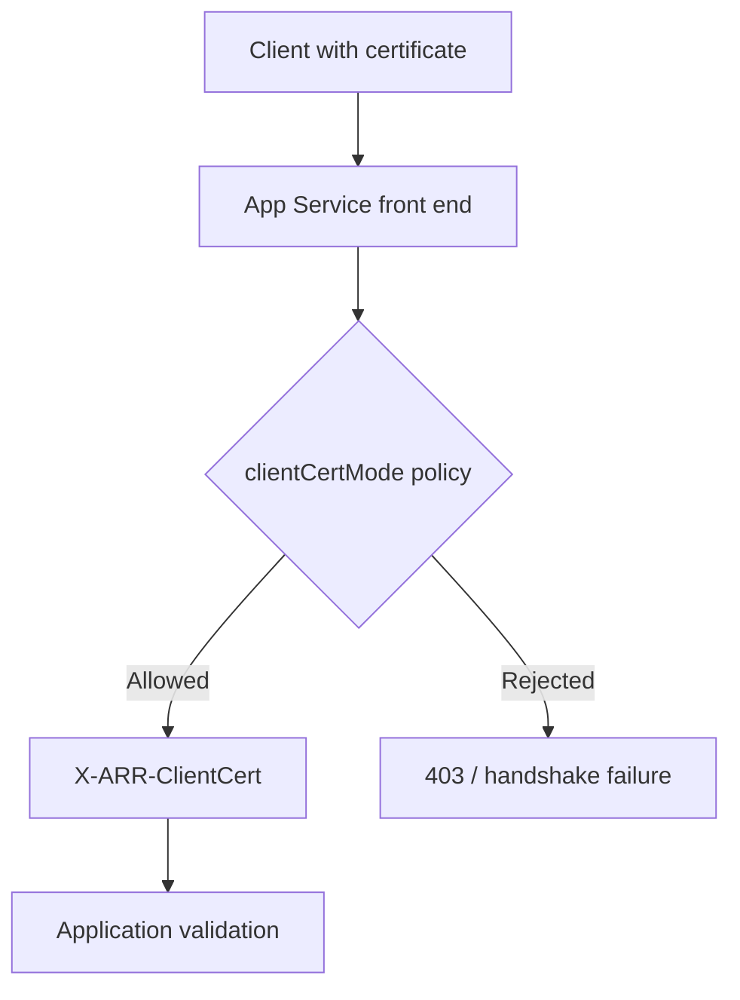

---
content_sources:
  diagrams:
    - id: incoming-client-certificates-flow
      type: flowchart
      source: mslearn-adapted
      mslearn_url: https://learn.microsoft.com/en-us/azure/app-service/app-service-web-configure-tls-mutual-auth
content_validation:
  status: verified
  last_reviewed: "2026-04-25"
  reviewer: ai-agent
  core_claims:
    - claim: "App Service mutual TLS for inbound requests requires the App Service plan to be Basic, Standard, Premium, or Isolated."
      source: "https://learn.microsoft.com/en-us/azure/app-service/app-service-web-configure-tls-mutual-auth"
      verified: true
    - claim: "When App Service forwards a request with inbound client certificate support enabled, it injects the X-ARR-ClientCert request header."
      source: "https://learn.microsoft.com/en-us/azure/app-service/app-service-web-configure-tls-mutual-auth"
      verified: true
    - claim: "The header value is base64-encoded certificate content and sample code reconstructs PEM by adding certificate markers."
      source: "https://learn.microsoft.com/en-us/azure/app-service/app-service-web-configure-tls-mutual-auth"
      verified: true
    - claim: "App Service does not validate the inbound client certificate and app code must validate it."
      source: "https://learn.microsoft.com/en-us/azure/app-service/app-service-web-configure-tls-mutual-auth"
      verified: true
---

# Incoming Client Certificates

Use this runbook to enable inbound mutual TLS on Azure App Service, forward the client certificate to your application, and verify the platform-to-app handoff before you add application-level authorization logic.

## Prerequisites

- App Service plan in **Basic**, **Standard**, **Premium**, or **Isolated** tier
- HTTPS-only enabled on the web app
- A client certificate and private key available for testing
- Permission to update the App Service site configuration
- Variables set:
    - `$RG`
    - `$APP_NAME`

## When to Use

Use inbound client certificates when:

- API callers must present a client certificate before the request reaches your app logic
- Partner integrations require certificate-based caller identity
- You want App Service to terminate TLS and forward the client certificate in a normalized header
- You need route-specific exceptions such as `/health` or webhook endpoints

## Procedure

<!-- diagram-id: incoming-client-certificates-flow -->


### 1) Enable HTTPS-only first

```bash
az webapp update \
  --resource-group $RG \
  --name $APP_NAME \
  --https-only true \
  --output json
```

Verify:

```bash
az webapp show \
  --resource-group $RG \
  --name $APP_NAME \
  --query "{httpsOnly:httpsOnly,hostNames:hostNames}" \
  --output json
```

### 2) Enable client certificate mode

Use Azure CLI:

```bash
az webapp update \
  --resource-group $RG \
  --name $APP_NAME \
  --set clientCertEnabled=true clientCertMode=Required \
  --output json
```

Common values:

- `Required`
- `Optional`
- `OptionalInteractiveUser`

Portal path:

1. Open **App Service** in Azure Portal.
2. Go to **Settings** → **Configuration** → **General settings**.
3. Set **Client certificate mode**.
4. Save and restart if required by your rollout policy.

### 3) Add exclusion paths when needed

Use exclusion paths only for endpoints that cannot present a client certificate.

```bash
az webapp update \
  --resource-group $RG \
  --name $APP_NAME \
  --set clientCertExclusionPaths="/health;/webhooks/github" \
  --output json
```

!!! warning "Exclusions weaken your trust boundary"
    Keep excluded paths narrow and explicit. Do not exclude broad prefixes such as `/api` unless you are intentionally disabling certificate enforcement for that whole surface.

!!! warning "Exclusions and interactive mode use TLS renegotiation"
    Microsoft Learn notes that `clientCertExclusionPaths` and `OptionalInteractiveUser` rely on TLS renegotiation. TLS 1.3 and HTTP/2 do not support renegotiation, and uploads larger than 100 KB can fail when renegotiation is required. Test these cases before using exclusions in production.

### 4) Use Bicep for declarative configuration

```bicep
resource webApp 'Microsoft.Web/sites@2023-12-01' = {
  name: appName
  location: location
  kind: 'app,linux'
  properties: {
    serverFarmId: plan.id
    httpsOnly: true
    clientCertEnabled: true
    clientCertMode: 'Required'
    clientCertExclusionPaths: '/health;/webhooks/github'
    siteConfig: {
      linuxFxVersion: 'PYTHON|3.11'
    }
  }
}
```

### 5) Understand what reaches the app

When App Service forwards the request to your application, it adds:

- Header name: `X-ARR-ClientCert`
- Header content: base64-encoded certificate content
- Parsing implication: add PEM markers in code before using libraries that expect PEM format

Example reconstruction pattern:

```text
-----BEGIN CERTIFICATE-----
<value from X-ARR-ClientCert>
-----END CERTIFICATE-----
```

!!! warning "Do not assume platform trust validation"
    Microsoft Learn states that App Service does not validate the forwarded client certificate. Your application must validate thumbprint, issuer, chain, expiry, and route authorization policy.

## Verification

### Check effective site settings

```bash
az webapp show \
  --resource-group $RG \
  --name $APP_NAME \
  --query "{clientCertEnabled:clientCertEnabled,clientCertMode:clientCertMode,clientCertExclusionPaths:clientCertExclusionPaths}" \
  --output json
```

### Test with curl

```bash
curl --include \
  --cert ./client.pem \
  --key ./client.key \
  "https://$APP_NAME.azurewebsites.net/cert-info"
```

Expected results:

- `Required` mode + valid test certificate: request reaches the app
- `Required` mode + no client certificate: request fails before normal app handling
- Excluded path such as `/health`: request succeeds without a client certificate if explicitly excluded

### Inspect app-level header handling

Add a temporary diagnostics endpoint or application log entry that confirms:

- `X-ARR-ClientCert` exists
- The header can be converted into PEM format
- Certificate parsing succeeds in your framework

## Rollback / Troubleshooting

Disable inbound client certificate enforcement:

```bash
az webapp update \
  --resource-group $RG \
  --name $APP_NAME \
  --set clientCertEnabled=false clientCertExclusionPaths= \
  --output json
```

Common issues:

- `X-ARR-ClientCert` missing:
    - `clientCertEnabled` is false
    - the request matched an excluded path
    - the client did not use HTTPS
- Front-end rejection with `Required` mode:
    - caller did not present a certificate
    - TLS negotiation failed before the app received the request
- App code cannot parse the certificate:
    - code treated the header as full PEM instead of base64 content
    - certificate markers were not added before parsing

## See Also

- [Mutual TLS Architecture](../platform/mtls.md)
- [mTLS Best Practices](../best-practices/mtls.md)
- [mTLS Failures](../troubleshooting/playbooks/mtls-failures.md)
- [Python mTLS Client Certificates Recipe](../language-guides/python/recipes/mtls-client-certificates.md)

## Sources

- [Set up TLS mutual authentication for Azure App Service (Microsoft Learn)](https://learn.microsoft.com/en-us/azure/app-service/app-service-web-configure-tls-mutual-auth)
