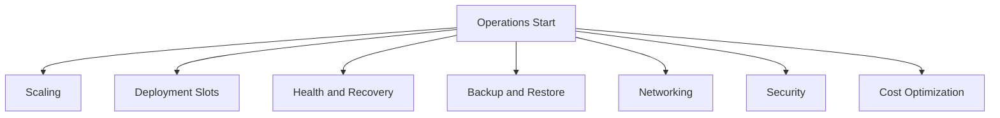

---
content_sources:
  diagrams:
    - id: operations-navigation-overview
      type: flowchart
      source: mslearn-adapted
      mslearn_url: https://learn.microsoft.com/en-us/azure/app-service/app-service-best-practices
---

# Operations

Production operations and day-2 practices for Azure App Service. This section is language-agnostic and focuses on platform behavior, reliability, security, and cost control.

## Main Content

### Operations Navigation Overview

<!-- diagram-id: operations-navigation-overview -->


### Operations Documents

| Document | Description |
|---|---|
| [Scaling](./scaling.md) | Scale up, scale out, autoscale profiles, and operational verification |
| [Deployment Methods](./deployment/index.md) | ZIP deploy, GitHub Actions, container delivery, and slot-based promotion choices |
| [Deployment Slots](./deployment-slots.md) | Staging slots, swap workflows, canary routing, and rollback patterns |
| [Health and Recovery](./health-recovery.md) | Health checks, auto-heal, runbooks, and incident recovery controls |
| [Backup and Restore](./backup-restore.md) | Scheduled backup configuration, restore drills, and DR planning |
| [Networking](./networking.md) | Access restrictions, private endpoints, VNet integration, and DNS diagnostics |
| [Security](./security.md) | Identity, authentication, TLS hardening, secrets handling, and governance |
| [Cost Optimization](./cost-optimization.md) | Right-sizing, autoscale economics, environment cleanup, and FinOps cadence |

### Quick Operational Commands

```bash
az webapp show --resource-group $RG --name $APP_NAME --output json
az webapp restart --resource-group $RG --name $APP_NAME --output json
az appservice plan show --resource-group $RG --name $PLAN_NAME --output json
az monitor autoscale show --resource-group $RG --name "autoscale-$PLAN_NAME" --output json
```

## Advanced Topics

- Build an SLO-based operating model that maps each control (scale, slots, recovery, security) to measurable service outcomes.
- Keep runbooks and IaC synchronized so recovery steps are deterministic during incidents.
- Validate production controls regularly through game days and restore exercises.

## Language-Specific Details

For language-specific operational guidance, see:
- [Node.js Guide](../language-guides/nodejs/index.md)
- [Python Guide](../language-guides/python/index.md)
- [Java Guide](../language-guides/java/index.md)
- [.NET Guide](../language-guides/dotnet/index.md)

## See Also

- [Concepts](../platform/index.md)
- [Best Practices](../best-practices/index.md)
- [Reference](../reference/index.md)

## Sources

- [Azure App Service documentation (Microsoft Learn)](https://learn.microsoft.com/azure/app-service/)
