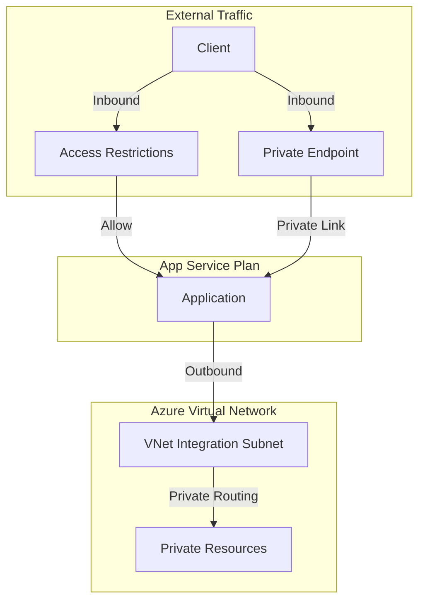
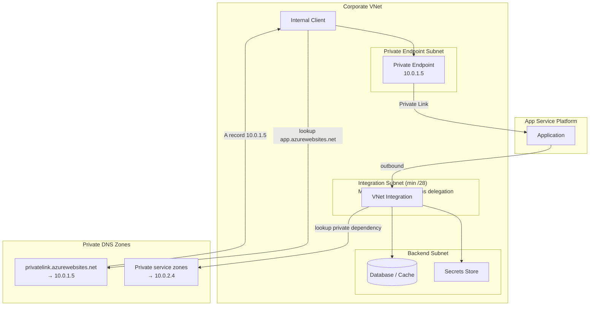
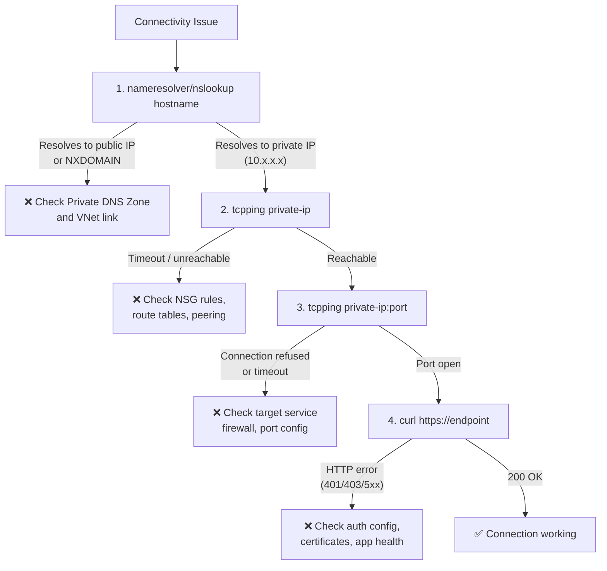

---
hide:
  - toc
content_sources:
  diagrams:
    - id: networking-inbound-outbound-paths
      type: graph
      source: mslearn-adapted
      mslearn_url: https://learn.microsoft.com/en-us/azure/app-service/networking-features
    - id: private-inbound-private-outbound-architecture
      type: graph
      source: mslearn-adapted
      mslearn_url: https://learn.microsoft.com/en-us/azure/app-service/networking-features
    - id: networking-debugging-checklist
      type: flowchart
      source: mslearn-adapted
      mslearn_url: https://learn.microsoft.com/en-us/azure/app-service/networking-features
---

# Networking Operations

Secure traffic paths by controlling inbound access, private inbound endpoints, and outbound connectivity to private resources. This guide provides operational patterns for App Service networking in production.

<!-- diagram-id: networking-inbound-outbound-paths -->


### Combined Architecture (Private Inbound + Private Outbound)

<!-- diagram-id: private-inbound-private-outbound-architecture -->


## Prerequisites

- Existing Web App and App Service Plan
- Existing VNet and subnets for:
    - private endpoint
    - VNet integration
- Required RBAC permissions for Web, Network, and DNS resources
- Variables set:
    - `RG`
    - `APP_NAME`
    - `VNET_NAME`
    - `INTEGRATION_SUBNET_NAME`
    - `PRIVATE_ENDPOINT_SUBNET_NAME`

## When to Use

## Procedure

### Configure Inbound Access Restrictions

Allow only known source ranges:

```bash
az webapp config access-restriction add \
  --resource-group $RG \
  --name $APP_NAME \
  --rule-name AllowCorp \
  --action Allow \
  --ip-address 203.0.113.0/24 \
  --priority 100 \
  --output json
```

Add explicit deny-all fallback:

```bash
az webapp config access-restriction add \
  --resource-group $RG \
  --name $APP_NAME \
  --rule-name DenyAll \
  --action Deny \
  --ip-address 0.0.0.0/0 \
  --priority 2147483647 \
  --output json
```

Review configured rules:

```bash
az webapp config access-restriction show \
  --resource-group $RG \
  --name $APP_NAME \
  --query "ipSecurityRestrictions[].{name:name,action:action,ip:ipAddress,priority:priority}" \
  --output table
```

### Enable VNet Integration for Outbound Traffic

```bash
az webapp vnet-integration add \
  --resource-group $RG \
  --name $APP_NAME \
  --vnet $VNET_NAME \
  --subnet $INTEGRATION_SUBNET_NAME \
  --output json
```

Route all outbound traffic into VNet path:

```bash
az webapp config appsettings set \
  --resource-group $RG \
  --name $APP_NAME \
  --settings WEBSITE_VNET_ROUTE_ALL=1 \
  --output json
```

Inspect integration state:

```bash
az webapp vnet-integration list \
  --resource-group $RG \
  --name $APP_NAME \
  --output table
```

### Create Private Endpoint for Inbound Private Access

```bash
APP_ID=$(az webapp show \
  --resource-group $RG \
  --name $APP_NAME \
  --query id \
  --output tsv)

az network private-endpoint create \
  --resource-group $RG \
  --name "pe-$APP_NAME" \
  --vnet-name $VNET_NAME \
  --subnet $PRIVATE_ENDPOINT_SUBNET_NAME \
  --private-connection-resource-id $APP_ID \
  --group-id sites \
  --connection-name "pec-$APP_NAME" \
  --output json
```

Check private endpoint status:

```bash
az network private-endpoint show \
  --resource-group $RG \
  --name "pe-$APP_NAME" \
  --query "{state:provisioningState,privateIp:customDnsConfigs[0].ipAddresses[0]}" \
  --output json
```

### Configure Private DNS Resolution

Create and link private DNS zone:

```bash
az network private-dns zone create \
  --resource-group $RG \
  --name privatelink.azurewebsites.net \
  --output json

az network private-dns link vnet create \
  --resource-group $RG \
  --zone-name privatelink.azurewebsites.net \
  --name "link-$VNET_NAME" \
  --virtual-network $VNET_NAME \
  --registration-enabled false \
  --output json
```

!!! warning "DNS is often the root cause"
    Private endpoint networking is correct only when hostname resolution returns private IPs from your VNet context.

### Outbound IP and NAT Considerations

App Service outbound IP lists are potential addresses. Validate real egress path when NAT is used.

```bash
az webapp show \
  --resource-group $RG \
  --name $APP_NAME \
  --query "{outbound:outboundIpAddresses,possible:possibleOutboundIpAddresses}" \
  --output json
```

If integration subnet uses NAT Gateway, validate NAT association:

```bash
az network vnet subnet show \
  --resource-group $RG \
  --vnet-name $VNET_NAME \
  --name $INTEGRATION_SUBNET_NAME \
  --query "natGateway.id" \
  --output tsv
```

## Verification

### Access Restrictions

```bash
curl --silent --output /dev/null --write-out "%{http_code}" \
  "https://$APP_NAME.azurewebsites.net/health"
```

Expected:

- allowed source: `200`
- blocked source: `403`

### Testing from VNet (VM/Bastion Required)

!!! warning "VNet Access Required"
    After enabling private endpoint and disabling public access, the app is **only reachable from within the VNet**. You need one of:
    
    - Jump box VM in the VNet + Azure Bastion
    - VPN/ExpressRoute connection
    - Azure Cloud Shell with VNet integration

#### Option A: Deploy Jump Box VM with Bastion

```bash
# Create Bastion subnet (required: /26 or larger)
az network vnet subnet create \
  --resource-group $RG \
  --vnet-name $VNET_NAME \
  --name "AzureBastionSubnet" \
  --address-prefixes "10.0.3.0/26"

# Create public IP for Bastion
az network public-ip create \
  --resource-group $RG \
  --name "pip-bastion" \
  --sku "Standard" \
  --location $LOCATION

# Create Bastion host (takes 5-10 minutes)
az network bastion create \
  --resource-group $RG \
  --name "bastion-$APP_NAME" \
  --vnet-name $VNET_NAME \
  --public-ip-address "pip-bastion" \
  --location $LOCATION \
  --sku "Basic"

# Create jump box VM (no public IP - accessed via Bastion)
az vm create \
  --resource-group $RG \
  --name "vm-jumpbox" \
  --image "Ubuntu2404" \
  --size "Standard_B1s" \
  --vnet-name $VNET_NAME \
  --subnet $PRIVATE_ENDPOINT_SUBNET_NAME \
  --admin-username "azureuser" \
  --generate-ssh-keys \
  --public-ip-address ""
```

| Command/Parameter | Purpose |
|-------------------|---------|
| `AzureBastionSubnet` | Required subnet name for Bastion (must be exactly this name) |
| `--address-prefixes "10.0.3.0/26"` | Minimum /26 CIDR for Bastion subnet |
| `--sku "Basic"` | Basic Bastion SKU (~$0.19/hour) |
| `--public-ip-address ""` | VM has no public IP - only accessible via Bastion |

#### Connect to VM via Bastion

```bash
# Connect via Azure Portal: VM > Connect > Bastion
# Or use Azure CLI:
az network bastion ssh \
  --resource-group $RG \
  --name "bastion-$APP_NAME" \
  --target-resource-id $(az vm show --resource-group $RG --name "vm-jumpbox" --query "id" --output tsv) \
  --auth-type "ssh-key" \
  --username "azureuser" \
  --ssh-key "~/.ssh/id_rsa"
```

#### Test from Jump Box

Once connected to the VM:

```bash
# Test DNS resolution - should return private IP (10.x.x.x)
nslookup $APP_NAME.azurewebsites.net
```

Expected output:
```
Server:         127.0.0.53
Address:        127.0.0.53#53

Non-authoritative answer:
myapp.azurewebsites.net  canonical name = myapp.privatelink.azurewebsites.net.
Name:   myapp.privatelink.azurewebsites.net
Address: 10.0.1.5
```

```bash
# Test app endpoint
curl --silent --output /dev/null --write-out "%{http_code}" \
  "https://$APP_NAME.azurewebsites.net/health"
```

Expected: `200`

#### Option B: Minimal Test VM (No Bastion)

For quick testing, create a VM with public IP and SSH directly:

```bash
az vm create \
  --resource-group $RG \
  --name "vm-test" \
  --image "Ubuntu2404" \
  --size "Standard_B1s" \
  --vnet-name $VNET_NAME \
  --subnet $PRIVATE_ENDPOINT_SUBNET_NAME \
  --admin-username "azureuser" \
  --generate-ssh-keys

# SSH to VM (use the public IP from output)
ssh azureuser@<public-ip>

# Test from inside VM
nslookup $APP_NAME.azurewebsites.net
curl https://$APP_NAME.azurewebsites.net/health
```

!!! tip "Cost Optimization"
    Delete test resources after verification:
    ```bash
    az vm delete --resource-group $RG --name "vm-jumpbox" --yes
    az network bastion delete --resource-group $RG --name "bastion-$APP_NAME"
    az network public-ip delete --resource-group $RG --name "pip-bastion"
    ```
    
    - VM (B1s): ~$0.01/hour
    - Bastion (Basic): ~$0.19/hour

### Private Endpoint Name Resolution

From a VM/resource inside linked VNet:

```bash
nslookup "$APP_NAME.azurewebsites.net"
```

Expected: private IP (`10.x.x.x` or similar), not public internet address.

#### Outbound Private Dependency Reachability

From Kudu/SSH diagnostics console:

```bash
nameresolver your-private-resource.contoso.local
tcpping 10.0.2.4 443
```

### Network Debugging Checklist

<!-- diagram-id: networking-debugging-checklist -->


Layered checks:

1. DNS resolution
2. IP reachability
3. Port connectivity
4. Application response

### Common Failures and Fixes

| Symptom | Likely Cause | Fix |
|---|---|---|
| `NXDOMAIN` | Private DNS zone not linked | Link VNet to zone |
| Resolves to public IP | Wrong DNS record path | Configure private zone record |
| IP reachable, port closed | Service firewall/ACL | Update target service network rules |
| HTTP 403 | Access restriction or auth policy | Validate allow rules and auth configuration |
| Intermittent egress failures | SNAT/NAT path assumptions | Validate actual egress through NAT design |

## Rollback / Troubleshooting

## Advanced Topics

### Zero Public Ingress Pattern

Combine these controls:

- Private Endpoint for inbound
- Access restrictions denying public traffic
- Internal DNS resolution only
- VNet-integrated outbound for private dependencies

### Hub-and-Spoke Network Governance

For large environments:

- central firewall and DNS in hub
- workload VNets as spokes
- private DNS zone linking strategy documented and automated

### Change Management for Networking

- stage DNS and NSG changes with validation windows
- keep subnet delegation and address space inventory current
- run synthetic checks after each network change

!!! info "Enterprise Considerations"
    Operational reliability improves when DNS, NSG, and route ownership are explicit across teams. Most App Service networking incidents are cross-team configuration drift issues.

## Language-Specific Details

For language-specific operational guidance, see:
- [Node.js Guide](../language-guides/nodejs/index.md)
- [Python Guide](../language-guides/python/index.md)
- [Java Guide](../language-guides/java/index.md)
- [.NET Guide](../language-guides/dotnet/index.md)

## See Also

- [Operations Index](./index.md)
- [Security](./security.md)
- [Health and Recovery](./health-recovery.md)
- [App Service networking features (Microsoft Learn)](https://learn.microsoft.com/azure/app-service/networking-features)
- [VNet integration (Microsoft Learn)](https://learn.microsoft.com/azure/app-service/overview-vnet-integration)

## Sources

- [App Service networking features (Microsoft Learn)](https://learn.microsoft.com/azure/app-service/networking-features)
- [VNet integration (Microsoft Learn)](https://learn.microsoft.com/azure/app-service/overview-vnet-integration)
