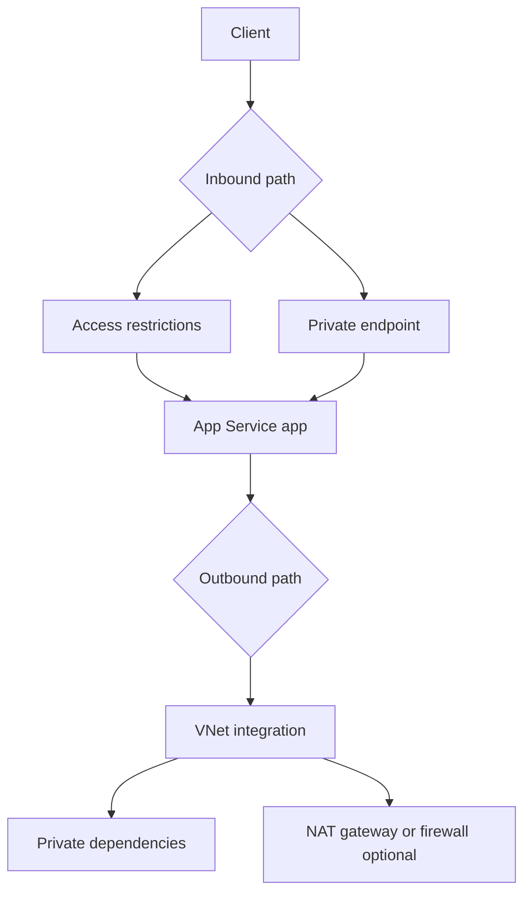
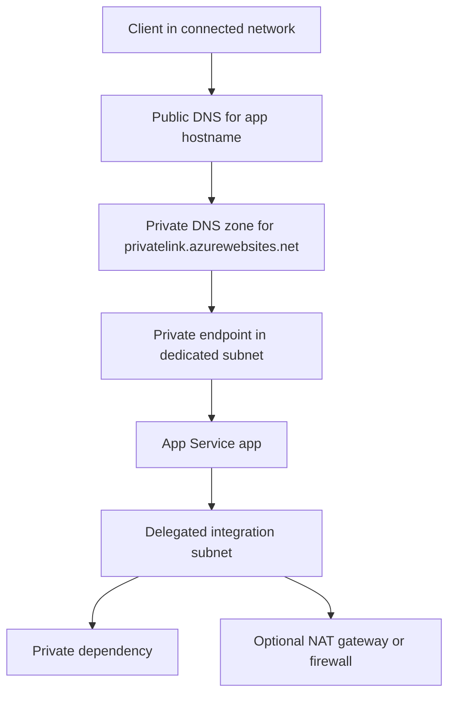
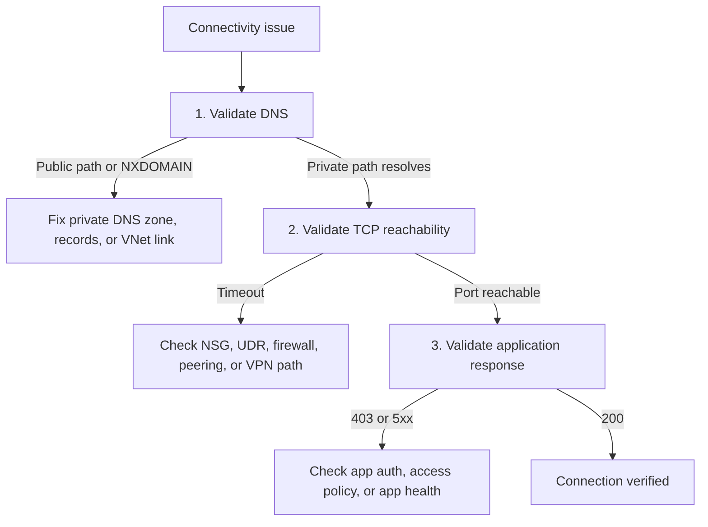

---
content_sources:
  diagrams:
    - id: networking-inbound-outbound-paths
      type: flowchart
      source: mslearn-adapted
      mslearn_url: https://learn.microsoft.com/en-us/azure/app-service/networking-features
      based_on:
        - https://learn.microsoft.com/en-us/azure/app-service/overview-private-endpoint
        - https://learn.microsoft.com/en-us/azure/app-service/overview-vnet-integration
    - id: private-inbound-private-outbound-architecture
      type: flowchart
      source: mslearn-adapted
      mslearn_url: https://learn.microsoft.com/en-us/azure/app-service/overview-private-endpoint
      based_on:
        - https://learn.microsoft.com/en-us/azure/app-service/overview-vnet-integration
    - id: networking-debugging-checklist
      type: flowchart
      source: self-generated
      justification: "Synthesized operational decision flow from Microsoft Learn networking, private endpoint, and VNet integration guidance."
      based_on:
        - https://learn.microsoft.com/en-us/azure/app-service/networking-features
        - https://learn.microsoft.com/en-us/azure/app-service/overview-private-endpoint
        - https://learn.microsoft.com/en-us/azure/app-service/overview-vnet-integration
content_validation:
  status: verified
  last_reviewed: "2026-04-12"
  reviewer: ai-agent
  core_claims:
    - claim: "Access restrictions control inbound traffic to an App Service app."
      source: "https://learn.microsoft.com/azure/app-service/networking-features"
      verified: true
    - claim: "VNet integration is used for outbound access from App Service to private resources."
      source: "https://learn.microsoft.com/azure/app-service/overview-vnet-integration"
      verified: true
    - claim: "Private endpoint handles inbound traffic only and does not replace VNet integration for outbound traffic."
      source: "https://learn.microsoft.com/azure/app-service/overview-private-endpoint"
      verified: true
    - claim: "Access restriction rules are not evaluated for traffic that arrives through the private endpoint."
      source: "https://learn.microsoft.com/azure/app-service/overview-private-endpoint"
      verified: true
    - claim: "For App Service private endpoints, clients resolve app-name.azurewebsites.net through the privatelink.azurewebsites.net private DNS zone."
      source: "https://learn.microsoft.com/azure/app-service/overview-private-endpoint"
      verified: true
---

# Networking Operations

Operate Azure App Service networking by treating inbound and outbound paths separately: use access restrictions or private endpoints for inbound reachability, and use virtual network integration for outbound access to private dependencies.

## Prerequisites

- Existing Web App and App Service Plan in a supported dedicated tier
- Existing virtual network with separate subnets for:
    - private endpoint
    - VNet integration
    - client test host (recommended)
- RBAC permissions for App Service, Virtual Network, Private Endpoint, and Private DNS resources
- Variables set:
    - `RG`
    - `APP_NAME`
    - `VNET_NAME`
    - `INTEGRATION_SUBNET_NAME`
    - `PRIVATE_ENDPOINT_SUBNET_NAME`
    - `CLIENT_SUBNET_NAME`
    - `LOCATION`

## When to Use

Use this guide when you need one or more of these patterns:

1. Restrict public inbound traffic to specific source ranges.
2. Expose the app privately over Azure Private Link.
3. Let the app reach private resources through a delegated integration subnet.
4. Validate DNS, routing, and reachability after networking changes.

## Procedure

<!-- diagram-id: networking-inbound-outbound-paths -->


### Combined Architecture (Private Inbound + Private Outbound)

<!-- diagram-id: private-inbound-private-outbound-architecture -->


### 1. Configure Inbound Access Restrictions

Allow approved public sources first, then add a deny fallback.

```bash
az webapp config access-restriction add \
  --resource-group "$RG" \
  --name "$APP_NAME" \
  --rule-name "AllowCorp" \
  --action Allow \
  --ip-address "203.0.113.0/24" \
  --priority 100 \
  --output json

az webapp config access-restriction add \
  --resource-group "$RG" \
  --name "$APP_NAME" \
  --rule-name "DenyAll" \
  --action Deny \
  --ip-address "0.0.0.0/0" \
  --priority 2147483647 \
  --output json

az webapp config access-restriction show \
  --resource-group "$RG" \
  --name "$APP_NAME" \
  --query "ipSecurityRestrictions[].{name:name,action:action,ip:ipAddress,priority:priority}" \
  --output table
```

| Command/Parameter | Purpose |
|---|---|
| `az webapp config access-restriction add` | Adds ordered allow or deny rules on the App Service front end. |
| `--ip-address "203.0.113.0/24"` | Uses a documentation-only example CIDR for allowed corporate ingress. |
| `--priority 2147483647` | Places the deny rule at the lowest precedence so explicit allows are evaluated first. |
| `az webapp config access-restriction show` | Verifies effective rule order and rule values. |

### 2. Enable VNet Integration for Outbound Traffic

Use a dedicated delegated subnet for outbound connectivity. Private endpoint and VNet integration must use different subnets.

```bash
az webapp vnet-integration add \
  --resource-group "$RG" \
  --name "$APP_NAME" \
  --vnet "$VNET_NAME" \
  --subnet "$INTEGRATION_SUBNET_NAME" \
  --output json

az webapp config appsettings set \
  --resource-group "$RG" \
  --name "$APP_NAME" \
  --settings "WEBSITE_VNET_ROUTE_ALL=1" \
  --output json

az webapp vnet-integration list \
  --resource-group "$RG" \
  --name "$APP_NAME" \
  --output table
```

| Command/Parameter | Purpose |
|---|---|
| `az webapp vnet-integration add` | Connects the app to the delegated subnet for outbound private connectivity. |
| `--subnet "$INTEGRATION_SUBNET_NAME"` | Uses the integration subnet only; do not reuse the private endpoint subnet. |
| `WEBSITE_VNET_ROUTE_ALL=1` | Forces all outbound app traffic into the VNet integration path. |
| `az webapp vnet-integration list` | Confirms the app is attached to the expected VNet and subnet. |

!!! note "Subnet sizing"
    Microsoft Learn recommends planning enough IP space for scale operations and platform upgrades. For a single multitenant App Service plan, `/26` gives the safest headroom; `/28` is the minimum supported size when the subnet already exists.

### 3. Create a Private Endpoint for Inbound Private Access

The private endpoint handles inbound traffic only. It doesn't replace VNet integration for outbound traffic.

```bash
APP_ID="$(az webapp show \
  --resource-group "$RG" \
  --name "$APP_NAME" \
  --query id \
  --output tsv)"

az network private-endpoint create \
  --resource-group "$RG" \
  --name "pe-$APP_NAME" \
  --vnet-name "$VNET_NAME" \
  --subnet "$PRIVATE_ENDPOINT_SUBNET_NAME" \
  --private-connection-resource-id "$APP_ID" \
  --group-id "sites" \
  --connection-name "pec-$APP_NAME" \
  --output json

az network private-endpoint show \
  --resource-group "$RG" \
  --name "pe-$APP_NAME" \
  --query "{state:provisioningState,connections:privateLinkServiceConnections[].privateLinkServiceConnectionState.status}" \
  --output json
```

| Command/Parameter | Purpose |
|---|---|
| `az webapp show --query id` | Retrieves the App Service resource ID required by the private endpoint create command. |
| `az network private-endpoint create` | Creates the App Service private endpoint in the selected subnet. |
| `--group-id "sites"` | Uses the correct App Service subresource for the production slot. |
| `az network private-endpoint show` | Verifies provisioning state and private link connection approval status. |

!!! warning "Private endpoint scope"
    Access restriction rules are **not** evaluated for traffic that arrives through the private endpoint. If you want a true private-only pattern, disable public network access separately and validate private DNS resolution.

### 4. Configure Private DNS Resolution

For App Service private endpoints, clients should resolve `app-name.azurewebsites.net` through the `privatelink.azurewebsites.net` private DNS zone. Use a private DNS zone group so the required records are created automatically.

```bash
az network private-dns zone create \
  --resource-group "$RG" \
  --name "privatelink.azurewebsites.net" \
  --output json

az network private-dns link vnet create \
  --resource-group "$RG" \
  --zone-name "privatelink.azurewebsites.net" \
  --name "link-$VNET_NAME" \
  --virtual-network "$VNET_NAME" \
  --registration-enabled false \
  --output json

az network private-endpoint dns-zone-group create \
  --resource-group "$RG" \
  --endpoint-name "pe-$APP_NAME" \
  --name "default" \
  --private-dns-zone "privatelink.azurewebsites.net" \
  --zone-name "privatelink.azurewebsites.net" \
  --output json
```

| Command/Parameter | Purpose |
|---|---|
| `az network private-dns zone create` | Creates the App Service private DNS zone. |
| `az network private-dns link vnet create` | Links the zone to the client VNet so clients can resolve the private endpoint path. |
| `az network private-endpoint dns-zone-group create` | Automatically creates the app and SCM DNS records for the private endpoint. |
| `--registration-enabled false` | Prevents VM autoregistration, which isn't needed for this zone. |

!!! warning "DNS is the usual failure point"
    A private endpoint deployment isn't operational until clients in the linked network resolve the app hostname to the private endpoint address path instead of the public internet path.

### 5. Review Outbound Egress Expectations

App Service outbound IP lists are potential addresses. When you use route-all with a NAT gateway or firewall, validate the actual egress path from the integrated subnet.

```bash
az webapp show \
  --resource-group "$RG" \
  --name "$APP_NAME" \
  --query "{outbound:outboundIpAddresses,possible:possibleOutboundIpAddresses}" \
  --output json

az network vnet subnet show \
  --resource-group "$RG" \
  --vnet-name "$VNET_NAME" \
  --name "$INTEGRATION_SUBNET_NAME" \
  --query "natGateway.id" \
  --output tsv
```

| Command/Parameter | Purpose |
|---|---|
| `az webapp show` | Displays documented outbound and possible outbound IP sets for the app. |
| `az network vnet subnet show` | Confirms whether the integration subnet is attached to a NAT gateway. |
| `natGateway.id` | Returns the NAT gateway resource ID when deterministic outbound egress is configured. |

## Verification

### Verify Public Access Restriction Behavior

Run from an allowed and then a blocked public source.

```bash
curl --silent --output /dev/null --write-out "%{http_code}" \
  "https://$APP_NAME.azurewebsites.net/health"
```

| Command/Parameter | Purpose |
|---|---|
| `curl --write-out "%{http_code}"` | Confirms whether the app returns the expected status code without printing the full body. |
| `https://$APP_NAME.azurewebsites.net/health` | Uses a simple health endpoint for reachability validation. |

Expected results:

- allowed public source: `200`
- blocked public source: `403`

### Verify Private Endpoint Reachability from a Connected Network

You need a client **inside the linked VNet or a connected network**. A VM is the most common test client. Azure Bastion is only an access method to that VM; it doesn't replace the VM or other in-network client.

Supported client patterns:

- VM in the VNet, accessed through Azure Bastion
- VM in the VNet, accessed through VPN or ExpressRoute
- Existing workstation in a connected network with DNS forwarding to Azure private DNS

#### Option A: Create a Temporary Test VM and Access It with Bastion

Use a **client subnet**, not the private endpoint subnet, for the VM. If you need to create `AzureBastionSubnet`, choose an unused `/26` or larger prefix from the existing VNet address space.

```bash
az network vnet subnet create \
  --resource-group "$RG" \
  --vnet-name "$VNET_NAME" \
  --name "AzureBastionSubnet" \
  --address-prefixes "<unused-vnet-prefix-for-bastion-subnet>"

az network public-ip create \
  --resource-group "$RG" \
  --name "pip-bastion" \
  --sku "Standard" \
  --location "$LOCATION"

az network bastion create \
  --resource-group "$RG" \
  --name "bastion-$APP_NAME" \
  --vnet-name "$VNET_NAME" \
  --public-ip-address "pip-bastion" \
  --location "$LOCATION" \
  --sku "Standard"

az vm create \
  --resource-group "$RG" \
  --name "vm-jumpbox" \
  --image "Ubuntu2404" \
  --size "Standard_B1s" \
  --vnet-name "$VNET_NAME" \
  --subnet "$CLIENT_SUBNET_NAME" \
  --admin-username "azureuser" \
  --generate-ssh-keys \
  --public-ip-address ""
```

| Command/Parameter | Purpose |
|---|---|
| `AzureBastionSubnet` | Required subnet name for Azure Bastion. |
| `--address-prefixes "<unused-vnet-prefix-for-bastion-subnet>"` | Placeholder for an unused `/26` or larger prefix from the existing VNet address space. |
| `az network bastion create` | Provisions Bastion so you can reach the test VM without giving it a public IP. |
| `--sku "Standard"` | Uses the SKU required for native-client SSH with `az network bastion ssh`. |
| `--subnet "$CLIENT_SUBNET_NAME"` | Places the VM in a dedicated client subnet instead of the private endpoint subnet. |
| `--public-ip-address ""` | Creates the VM without a public IP. |

Connect to the VM:

```bash
az network bastion ssh \
  --resource-group "$RG" \
  --name "bastion-$APP_NAME" \
  --target-resource-id "$(az vm show --resource-group "$RG" --name "vm-jumpbox" --query id --output tsv)" \
  --auth-type "ssh-key" \
  --username "azureuser" \
  --ssh-key "$HOME/.ssh/id_rsa"
```

| Command/Parameter | Purpose |
|---|---|
| `az network bastion ssh` | Opens an SSH session to the VM through Bastion. |
| `--target-resource-id` | Resolves the VM resource ID inline so the session targets the correct VM. |
| `--ssh-key "$HOME/.ssh/id_rsa"` | Uses an explicit home-directory path so shell expansion is unambiguous. |

Once connected to the VM, validate DNS and HTTP reachability:

```bash
nslookup "$APP_NAME.azurewebsites.net"
curl --silent --output /dev/null --write-out "%{http_code}" \
  "https://$APP_NAME.azurewebsites.net/health"
```

| Command/Parameter | Purpose |
|---|---|
| `nslookup "$APP_NAME.azurewebsites.net"` | Confirms the hostname resolves through the private endpoint DNS chain from the client network. |
| `curl --write-out "%{http_code}"` | Confirms the private endpoint can serve the app successfully. |

Expected results:

- DNS answer includes the `privatelink.azurewebsites.net` path.
- HTTP response is `200` from the in-network client.

#### Option B: Use an Existing Connected Client Instead of Creating a VM

If you already have a client in the linked VNet, a peered VNet, or an on-premises network connected through VPN or ExpressRoute, run the same `nslookup` and `curl` checks there. This is often preferable to creating temporary infrastructure.

!!! tip "Cleanup temporary test resources"
    Delete short-lived validation resources after testing.

    ```bash
    az vm delete --resource-group "$RG" --name "vm-jumpbox" --yes
    az network bastion delete --resource-group "$RG" --name "bastion-$APP_NAME"
    az network public-ip delete --resource-group "$RG" --name "pip-bastion"
    ```

    | Command/Parameter | Purpose |
    |---|---|
    | `az vm delete` | Removes the temporary test VM. |
    | `az network bastion delete` | Removes the Bastion host when you no longer need private access testing. |
    | `az network public-ip delete` | Removes the public IP reserved for Bastion. |

### Verify Outbound Private Dependency Reachability

From the Kudu or SSH console of the app, validate DNS and port reachability to the private dependency.

```bash
nameresolver "your-private-resource.contoso.local"
tcpping "your-private-resource.contoso.local" 443
```

| Command/Parameter | Purpose |
|---|---|
| `nameresolver` | Resolves the dependency hostname from the App Service worker context. |
| `tcpping` | Tests TCP connectivity from the app worker to the dependency endpoint and port. |

### Network Debugging Checklist

<!-- diagram-id: networking-debugging-checklist -->


Layered checks:

1. DNS resolution path
2. TCP reachability
3. Application response

### Common Failures and Fixes

| Symptom | Likely Cause | Fix |
|---|---|---|
| `NXDOMAIN` or public resolution path | Private DNS zone missing, unlinked, or not forwarded | Link the VNet to `privatelink.azurewebsites.net` and validate DNS forwarding. |
| `403` from a public client after private endpoint rollout | Public network access still enabled but caller isn't allowed by access restrictions | Decide whether the app should stay public, then update restriction rules or disable public access. |
| Private endpoint works but app can't reach backend | VNet integration missing or routed incorrectly | Validate integration subnet, route-all setting, and NSG or UDR behavior. |
| Intermittent outbound failures | NAT/SNAT assumptions don't match actual egress path | Validate NAT gateway or firewall path on the integration subnet. |
| Kudu or SCM hostname doesn't resolve privately | DNS zone group or SCM record missing | Recreate or validate the private endpoint DNS zone group. |

## Rollback / Troubleshooting

To remove private inbound access:

```bash
az network private-endpoint delete \
  --resource-group "$RG" \
  --name "pe-$APP_NAME"
```

| Command/Parameter | Purpose |
|---|---|
| `az network private-endpoint delete` | Removes the App Service private endpoint resource. |

To remove outbound VNet integration:

```bash
az webapp vnet-integration remove \
  --resource-group "$RG" \
  --name "$APP_NAME" \
  --vnet "$VNET_NAME"
```

| Command/Parameter | Purpose |
|---|---|
| `az webapp vnet-integration remove` | Disconnects the app from the virtual network integration path. |

## Advanced Topics

### Zero Public Ingress Pattern

Use this combination for private-only access:

- Private endpoint for inbound traffic
- Public network access disabled after validation
- Private DNS for app and SCM hostnames
- VNet integration for outbound private dependencies

### Hub-and-Spoke Governance

For larger estates:

- centralize DNS forwarding and private DNS ownership
- document which team owns NSGs, UDRs, and firewall policy
- standardize subnet sizing for integration and private endpoint patterns

### Change Management

- validate DNS before changing traffic policy
- stage NSG and route updates separately from app changes
- keep a repeatable in-network test path for post-change verification

!!! info "Operational reality"
    Most App Service networking incidents are caused by DNS, route ownership, or subnet design drift rather than by the App Service resource itself.

## Language-Specific Details

For language-specific operational guidance, see:

- [Node.js Guide](../language-guides/nodejs/index.md)
- [Python Guide](../language-guides/python/index.md)
- [Java Guide](../language-guides/java/index.md)
- [.NET Guide](../language-guides/dotnet/index.md)

## See Also

- [Operations Index](./index.md)
- [Security](./security.md)
- [Health and Recovery](./health-recovery.md)
- [App Service networking features (Microsoft Learn)](https://learn.microsoft.com/azure/app-service/networking-features)
- [Use private endpoints for apps (Microsoft Learn)](https://learn.microsoft.com/azure/app-service/overview-private-endpoint)
- [Integrate your app with an Azure virtual network (Microsoft Learn)](https://learn.microsoft.com/azure/app-service/overview-vnet-integration)
- [Configure Bastion for native client connections (Microsoft Learn)](https://learn.microsoft.com/azure/bastion/native-client)
- [About Azure Bastion configuration settings (Microsoft Learn)](https://learn.microsoft.com/azure/bastion/configuration-settings)

## Sources

- [App Service networking features (Microsoft Learn)](https://learn.microsoft.com/azure/app-service/networking-features)
- [Use private endpoints for apps (Microsoft Learn)](https://learn.microsoft.com/azure/app-service/overview-private-endpoint)
- [Integrate your app with an Azure virtual network (Microsoft Learn)](https://learn.microsoft.com/azure/app-service/overview-vnet-integration)
